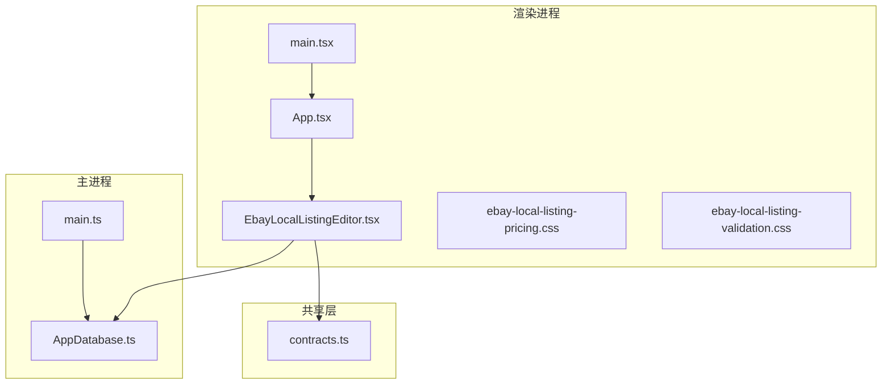
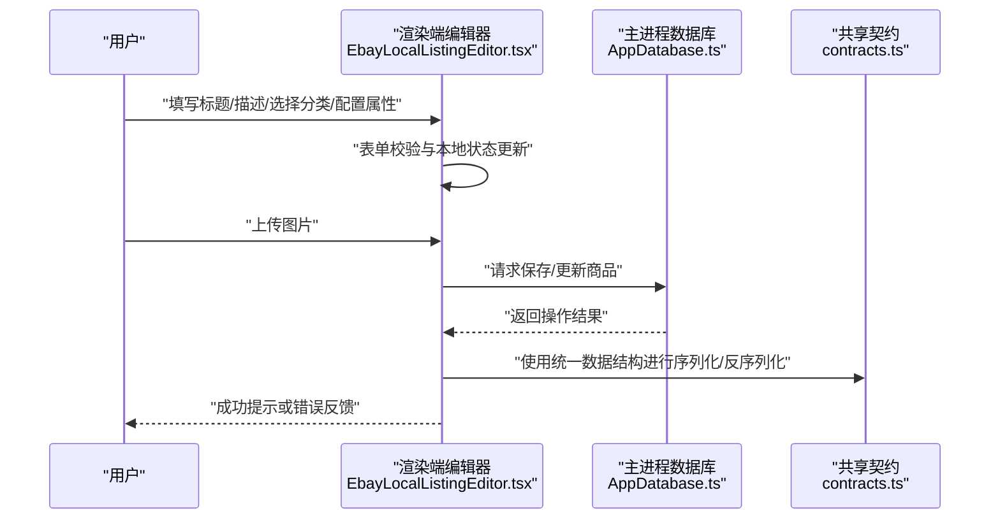
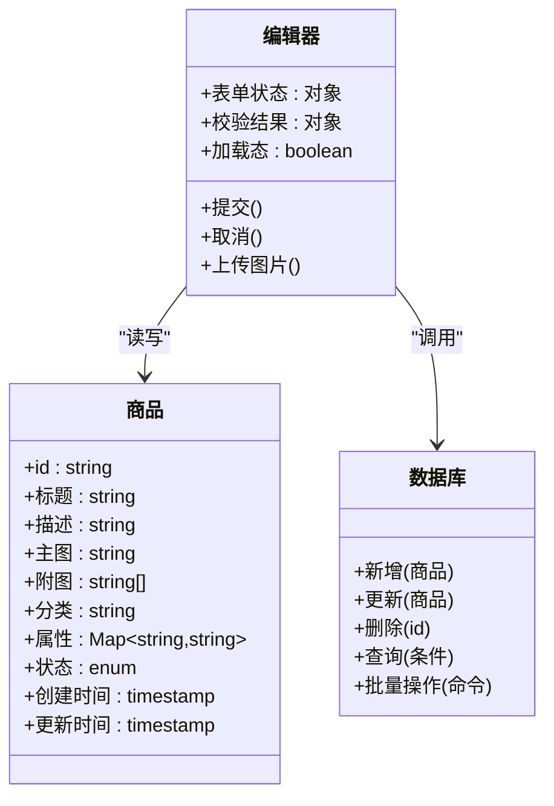
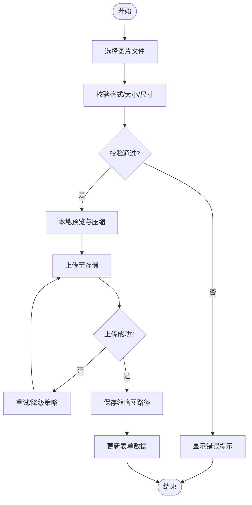
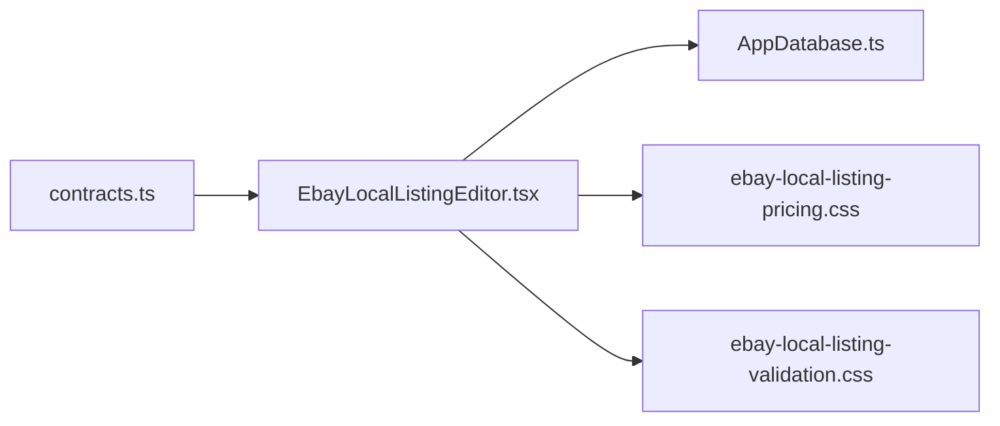

# 商品信息管理

<cite>
**本文引用的文件**   
- [package.json](file://package.json)
- [tsconfig.json](file://tsconfig.json)
- [vite.config.ts](file://vite.config.ts)
- [src/main/main.ts](file://src/main/main.ts)
- [src/main/database/AppDatabase.ts](file://src/main/database/AppDatabase.ts)
- [src/renderer/App.tsx](file://src/renderer/App.tsx)
- [src/renderer/main.tsx](file://src/renderer/main.tsx)
- [src/renderer/EbayLocalListingEditor.tsx](file://src/renderer/EbayLocalListingEditor.tsx)
- [src/renderer/ebay-local-listing-pricing.css](file://src/renderer/ebay-local-listing-pricing.css)
- [src/renderer/ebay-local-listing-validation.css](file://src/renderer/ebay-local-listing-validation.css)
- [src/shared/contracts.ts](file://src/shared/contracts.ts)
</cite>

## 目录
1. [简介](#简介)
2. [项目结构](#项目结构)
3. [核心组件](#核心组件)
4. [架构总览](#架构总览)
5. [详细组件分析](#详细组件分析)
6. [依赖关系分析](#依赖关系分析)
7. [性能考量](#性能考量)
8. [故障排查指南](#故障排查指南)
9. [结论](#结论)
10. [附录](#附录)

## 简介
本文件面向“商品信息”管理模块，围绕商品的增删改查（CRUD）、数据模型设计、状态管理机制展开，覆盖标题与描述编辑、图片上传、分类选择、属性配置等关键能力。同时给出表单验证规则、错误处理与用户反馈机制的设计建议，并提供数据导入导出与批量操作的最佳实践，帮助开发者快速落地并优化电商场景下的商品信息管理体验。

## 项目结构
本项目采用 Electron + React 的前后端一体化架构：
- 主进程负责数据库与系统级能力；渲染进程承载 UI 与交互逻辑；共享层定义跨进程契约与类型。
- 前端通过 Vite 构建，样式与页面分离，便于维护与扩展。

图表来源
- [src/renderer/main.tsx](file://src/renderer/main.tsx)
- [src/renderer/App.tsx](file://src/renderer/App.tsx)
- [src/renderer/EbayLocalListingEditor.tsx](file://src/renderer/EbayLocalListingEditor.tsx)
- [src/main/main.ts](file://src/main/main.ts)
- [src/main/database/AppDatabase.ts](file://src/main/database/AppDatabase.ts)
- [src/shared/contracts.ts](file://src/shared/contracts.ts)

章节来源
- [package.json](file://package.json)
- [tsconfig.json](file://tsconfig.json)
- [vite.config.ts](file://vite.config.ts)
- [src/main/main.ts](file://src/main/main.ts)
- [src/main/database/AppDatabase.ts](file://src/main/database/AppDatabase.ts)
- [src/renderer/App.tsx](file://src/renderer/App.tsx)
- [src/renderer/main.tsx](file://src/renderer/main.tsx)
- [src/renderer/EbayLocalListingEditor.tsx](file://src/renderer/EbayLocalListingEditor.tsx)
- [src/shared/contracts.ts](file://src/shared/contracts.ts)

## 核心组件
- 渲染端编辑器：提供商品标题、描述、图片、分类、属性的编辑界面与交互流程。
- 主进程数据库：封装商品数据的持久化与查询接口，供渲染端调用。
- 共享契约：统一定义商品实体、表单字段、校验结果、API 响应等数据结构。

章节来源
- [src/renderer/EbayLocalListingEditor.tsx](file://src/renderer/EbayLocalListingEditor.tsx)
- [src/main/database/AppDatabase.ts](file://src/main/database/AppDatabase.ts)
- [src/shared/contracts.ts](file://src/shared/contracts.ts)

## 架构总览
下图展示从用户操作到数据落库的完整链路，包括表单校验、图片上传、分类与属性配置、以及最终的数据持久化。

图表来源
- [src/renderer/EbayLocalListingEditor.tsx](file://src/renderer/EbayLocalListingEditor.tsx)
- [src/main/database/AppDatabase.ts](file://src/main/database/AppDatabase.ts)
- [src/shared/contracts.ts](file://src/shared/contracts.ts)

## 详细组件分析

### 数据模型与状态管理
- 商品实体字段建议包含：标识、标题、描述、主图与附图、分类、属性键值对、状态（草稿/已发布/下架）、时间戳等。
- 状态管理建议采用局部状态与全局状态结合：
  - 局部状态：当前编辑项、校验错误、加载态。
  - 全局状态：商品列表、分页、筛选条件、批量选中项。
- 数据流遵循单向数据流，避免直接修改共享数据，确保可预测性与可回溯性。

章节来源
- [src/shared/contracts.ts](file://src/shared/contracts.ts)
- [src/renderer/EbayLocalListingEditor.tsx](file://src/renderer/EbayLocalListingEditor.tsx)

### 商品标题与描述编辑
- 输入限制：长度上限、敏感词过滤、多语言支持（如需）。
- 实时预览：标题摘要、描述片段预览，提升编辑效率。
- 自动补全与模板：基于历史数据或类目模板生成建议内容。

章节来源
- [src/renderer/EbayLocalListingEditor.tsx](file://src/renderer/EbayLocalListingEditor.tsx)

### 图片上传与合规检查
- 上传流程：选择文件 -> 本地预览 -> 压缩/转码 -> 上传至服务端或本地存储 -> 回写缩略图路径。
- 合规检查：尺寸、格式、文件大小、白底要求、文字占比等。
- 失败重试与断点续传：网络异常时自动重试，大文件分片上传。

章节来源
- [src/renderer/EbayLocalListingEditor.tsx](file://src/renderer/EbayLocalListingEditor.tsx)

### 分类选择与属性配置
- 分类树：按平台类目层级展示，支持搜索与最近选择记忆。
- 属性映射：不同类目对应不同属性集，动态渲染表单控件（文本、下拉、多选、数值等）。
- 必填校验：根据类目规则标记必填项，未满足时阻止提交。

章节来源
- [src/renderer/EbayLocalListingEditor.tsx](file://src/renderer/EbayLocalListingEditor.tsx)

### 表单验证规则与错误处理
- 客户端校验：即时反馈，减少无效提交。
- 服务端校验：二次校验，保证数据一致性。
- 错误分类：输入错误、业务规则错误、系统错误，分别给出友好提示与引导。

章节来源
- [src/renderer/EbayLocalListingEditor.tsx](file://src/renderer/EbayLocalListingEditor.tsx)
- [src/renderer/ebay-local-listing-validation.css](file://src/renderer/ebay-local-listing-validation.css)

### 数据导入导出与批量操作
- 导入：支持 CSV/Excel，字段映射、模板下载、错误行定位与修正。
- 导出：按筛选条件导出，分页拉取，异步任务进度提示。
- 批量操作：批量启用/禁用、批量修改属性、批量替换图片，提供撤销与审计日志。

章节来源
- [src/renderer/EbayLocalListingEditor.tsx](file://src/renderer/EbayLocalListingEditor.tsx)

### 状态管理与生命周期
- 创建流程：初始化表单 -> 填充默认值 -> 监听变更 -> 提交前校验 -> 调用保存接口 -> 成功后刷新列表。
- 编辑流程：加载详情 -> 回填表单 -> 增量更新 -> 冲突检测（并发）-> 合并策略。
- 删除流程：软删除优先 -> 回收站恢复 -> 硬删除需二次确认。

章节来源
- [src/renderer/EbayLocalListingEditor.tsx](file://src/renderer/EbayLocalListingEditor.tsx)

### 类图（数据模型与组件关系）

图表来源
- [src/renderer/EbayLocalListingEditor.tsx](file://src/renderer/EbayLocalListingEditor.tsx)
- [src/main/database/AppDatabase.ts](file://src/main/database/AppDatabase.ts)
- [src/shared/contracts.ts](file://src/shared/contracts.ts)

### 流程图（图片上传与校验）

图表来源
- [src/renderer/EbayLocalListingEditor.tsx](file://src/renderer/EbayLocalListingEditor.tsx)

## 依赖关系分析
- 渲染端依赖共享契约以统一数据结构，降低前后端不一致风险。
- 渲染端通过 IPC 或直接调用主进程数据库接口完成数据持久化。
- 样式文件与组件解耦，便于主题切换与模块化维护。

图表来源
- [src/shared/contracts.ts](file://src/shared/contracts.ts)
- [src/renderer/EbayLocalListingEditor.tsx](file://src/renderer/EbayLocalListingEditor.tsx)
- [src/main/database/AppDatabase.ts](file://src/main/database/AppDatabase.ts)
- [src/renderer/ebay-local-listing-pricing.css](file://src/renderer/ebay-local-listing-pricing.css)
- [src/renderer/ebay-local-listing-validation.css](file://src/renderer/ebay-local-listing-validation.css)

章节来源
- [src/shared/contracts.ts](file://src/shared/contracts.ts)
- [src/renderer/EbayLocalListingEditor.tsx](file://src/renderer/EbayLocalListingEditor.tsx)
- [src/main/database/AppDatabase.ts](file://src/main/database/AppDatabase.ts)
- [src/renderer/ebay-local-listing-pricing.css](file://src/renderer/ebay-local-listing-pricing.css)
- [src/renderer/ebay-local-listing-validation.css](file://src/renderer/ebay-local-listing-validation.css)

## 性能考量
- 图片处理：前端压缩与懒加载，减少带宽与内存占用。
- 列表渲染：虚拟滚动与分页加载，避免一次性渲染大量数据。
- 缓存策略：分类与属性字典缓存，减少重复请求。
- 事务与批处理：批量导入/导出使用分批写入，避免锁竞争。

## 故障排查指南
- 常见问题：
  - 图片上传失败：检查网络、权限、文件大小与格式限制。
  - 表单校验不生效：确认校验规则是否绑定正确，字段名是否一致。
  - 数据未持久化：核对数据库接口返回值与错误码，查看日志。
- 调试建议：
  - 打开控制台日志，捕获异常堆栈。
  - 使用浏览器开发者工具检查网络请求与响应。
  - 在关键节点添加埋点，追踪状态变化。

章节来源
- [src/renderer/ebay-local-listing-validation.css](file://src/renderer/ebay-local-listing-validation.css)
- [src/renderer/EbayLocalListingEditor.tsx](file://src/renderer/EbayLocalListingEditor.tsx)

## 结论
通过清晰的架构分层、统一的契约定义与完善的表单校验与错误处理机制，商品信息管理模块能够稳定支撑标题、描述、图片、分类与属性的全流程编辑。配合导入导出与批量操作能力，可满足跨境电商场景下高效、可靠的商品数据管理需求。

## 附录
- 最佳实践清单：
  - 始终在前端做基础校验，在后端做严格校验。
  - 图片上传务必进行压缩与格式转换，保障兼容性与性能。
  - 分类与属性采用模板化管理，便于扩展与维护。
  - 批量操作提供进度与撤销能力，提升用户体验。
  - 所有错误信息对用户友好，并提供可操作的修复建议。