# 定价系统

<cite>
**本文引用的文件**   
- [src/main/services/EbayService.ts](file://src/main/services/EbayService.ts)
- [src/renderer/ebay-local-listing-pricing.css](file://src/renderer/ebay-local-listing-pricing.css)
- [src/renderer/EbayLocalListingEditor.tsx](file://src/renderer/EbayLocalListingEditor.tsx)
- [src/shared/contracts.ts](file://src/shared/contracts.ts)
- [src/main/database/AppDatabase.ts](file://src/main/database/AppDatabase.ts)
- [package.json](file://package.json)
</cite>

## 目录
1. [简介](#简介)
2. [项目结构](#项目结构)
3. [核心组件](#核心组件)
4. [架构总览](#架构总览)
5. [详细组件分析](#详细组件分析)
6. [依赖分析](#依赖分析)
7. [性能考虑](#性能考虑)
8. [故障排查指南](#故障排查指南)
9. [结论](#结论)
10. [附录](#附录)

## 简介
本文件面向“定价系统”的文档目标，围绕动态定价算法、价格策略配置与成本计算逻辑展开，涵盖促销价格设置、折扣规则、价格比较功能、价格历史追踪、自动调价机制与监控告警，以及定价模板管理与批量价格更新操作。由于当前仓库未包含完整的定价实现代码，本文以现有前端与后端服务为线索，给出可落地的架构设计与实现建议，并标注相关文件的引用位置，便于后续扩展与对接。

## 项目结构
从仓库结构看，定价相关的前端交互位于渲染进程（renderer），后端服务与数据库访问位于主进程（main）。关键文件包括：
- 渲染层：EbayLocalListingEditor.tsx 提供本地刊登编辑界面；ebay-local-listing-pricing.css 定义定价相关的样式。
- 主进程：EbayService.ts 封装 eBay 相关服务；AppDatabase.ts 提供数据库访问能力。
- 共享契约：contracts.ts 定义跨进程通信的数据契约。
- 工程配置：package.json 描述依赖与脚本。

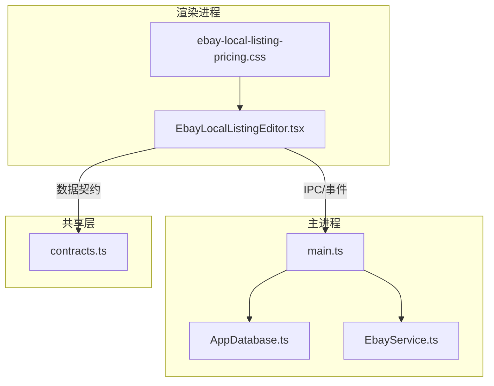

图表来源
- [src/renderer/EbayLocalListingEditor.tsx](file://src/renderer/EbayLocalListingEditor.tsx)
- [src/renderer/ebay-local-listing-pricing.css](file://src/renderer/ebay-local-listing-pricing.css)
- [src/main/database/AppDatabase.ts](file://src/main/database/AppDatabase.ts)
- [src/main/services/EbayService.ts](file://src/main/services/EbayService.ts)
- [src/shared/contracts.ts](file://src/shared/contracts.ts)

章节来源
- [src/renderer/EbayLocalListingEditor.tsx](file://src/renderer/EbayLocalListingEditor.tsx)
- [src/renderer/ebay-local-listing-pricing.css](file://src/renderer/ebay-local-listing-pricing.css)
- [src/main/services/EbayService.ts](file://src/main/services/EbayService.ts)
- [src/main/database/AppDatabase.ts](file://src/main/database/AppDatabase.ts)
- [src/shared/contracts.ts](file://src/shared/contracts.ts)
- [package.json](file://package.json)

## 核心组件
- 动态定价引擎（建议）：基于市场基准价、成本、利润目标与促销策略，输出建议售价与促销价。
- 价格策略配置中心：管理折扣规则、促销周期、渠道差异化策略与模板。
- 成本计算模块：聚合采购成本、物流、平台费用、税费等，计算综合成本与毛利。
- 价格历史与审计：记录价格变更轨迹，支持回溯与合规审计。
- 自动调价与监控：定时任务触发调价，阈值告警与异常检测。
- 模板与批量更新：模板化定价策略，支持批量导入与一键应用。

章节来源
- [src/shared/contracts.ts](file://src/shared/contracts.ts)
- [src/main/services/EbayService.ts](file://src/main/services/EbayService.ts)
- [src/main/database/AppDatabase.ts](file://src/main/database/AppDatabase.ts)

## 架构总览
下图展示定价系统的整体架构与数据流：前端编辑器负责用户交互与策略配置，主进程协调数据库与服务调用，外部 eBay 服务用于获取市场数据与同步刊登信息。

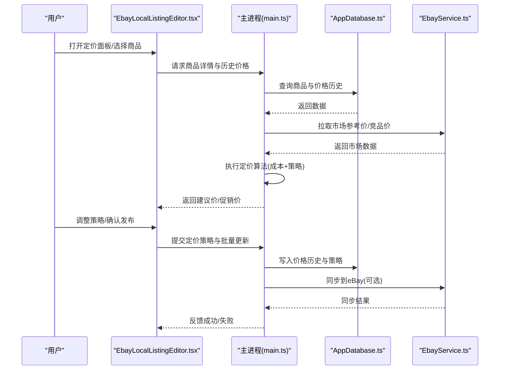

图表来源
- [src/renderer/EbayLocalListingEditor.tsx](file://src/renderer/EbayLocalListingEditor.tsx)
- [src/main/database/AppDatabase.ts](file://src/main/database/AppDatabase.ts)
- [src/main/services/EbayService.ts](file://src/main/services/EbayService.ts)

## 详细组件分析

### 动态定价算法
- 输入：商品基础信息、成本明细、市场参考价、竞品价、库存与销量预测、促销计划。
- 处理：
  - 成本核算：汇总直接成本与间接费用，得到单位总成本。
  - 基准定价：基于目标毛利率或固定加价率生成基准价。
  - 市场校准：对比竞品与平台均价，进行上下限约束与弹性调整。
  - 促销叠加：按优先级合并折扣、满减、限时活动，确保不跌破底价。
- 输出：建议零售价、促销价、折扣组合、生效时间窗。

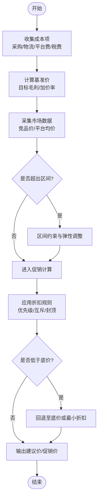

章节来源
- [src/shared/contracts.ts](file://src/shared/contracts.ts)
- [src/main/services/EbayService.ts](file://src/main/services/EbayService.ts)

### 价格策略配置
- 策略维度：渠道（eBay）、类目、区域、币种、会员等级、库存水位、季节性。
- 规则类型：百分比折扣、固定金额减免、阶梯折扣、买赠、限时活动。
- 冲突处理：规则优先级、互斥组、生效窗口、覆盖策略。
- 模板管理：预置模板（如“新品推广”、“清仓”、“旺季保价”），支持复制与版本化。

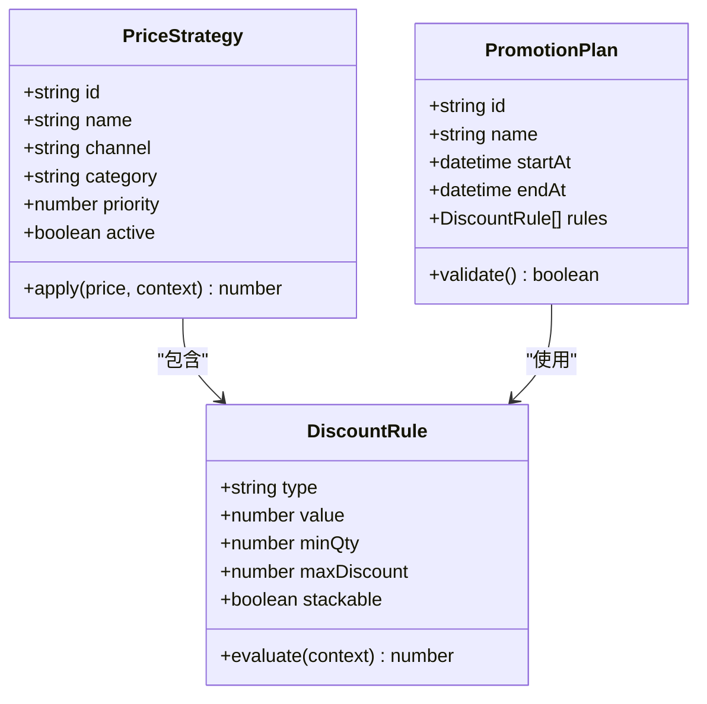

图表来源
- [src/shared/contracts.ts](file://src/shared/contracts.ts)

章节来源
- [src/shared/contracts.ts](file://src/shared/contracts.ts)

### 成本计算逻辑
- 成本构成：采购成本、头程/尾程物流、包装、仓储、平台佣金、支付手续费、关税与增值税、退货损耗。
- 分摊策略：按件/按重量/按体积分摊固定费用；促销期间额外补贴计入成本。
- 汇率与币种：统一折算为主币种，保留小数精度与舍入规则。
- 校验与审计：成本异常波动预警，差异对账与溯源。

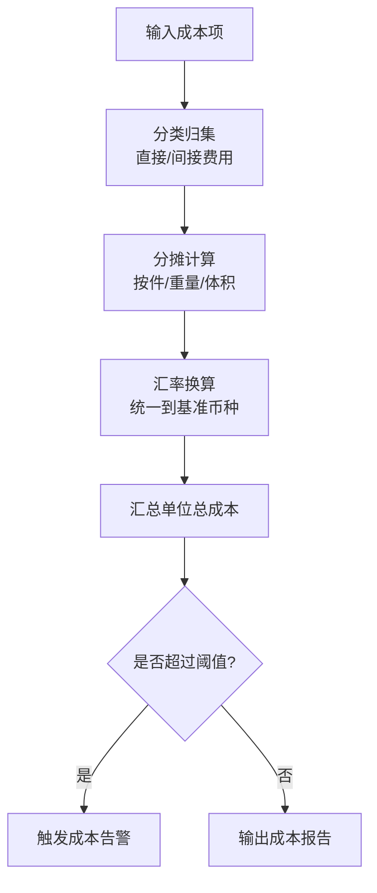

章节来源
- [src/main/database/AppDatabase.ts](file://src/main/database/AppDatabase.ts)

### 促销价格设置与折扣规则
- 促销类型：直降、满减、第二件半价、限时秒杀、会员专享。
- 规则引擎：解析表达式、计算最终折扣、处理互斥与叠加顺序。
- 安全边界：最低售价保护、利润底线、库存限制、重复购买限制。
- 预览与验证：离线模拟促销效果，输出影响范围与收益预估。

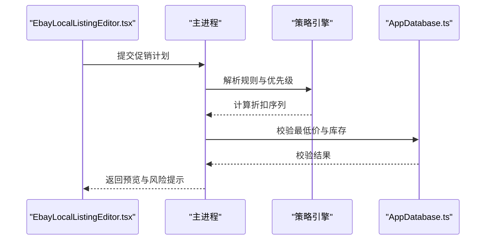

图表来源
- [src/renderer/EbayLocalListingEditor.tsx](file://src/renderer/EbayLocalListingEditor.tsx)
- [src/main/database/AppDatabase.ts](file://src/main/database/AppDatabase.ts)

章节来源
- [src/renderer/EbayLocalListingEditor.tsx](file://src/renderer/EbayLocalListingEditor.tsx)
- [src/shared/contracts.ts](file://src/shared/contracts.ts)

### 价格比较功能
- 数据来源：eBay 在售价格、历史成交价、竞品抓取、平台指导价。
- 比较维度：同 SKU、同类目、同区域、同渠道。
- 可视化：价差分布、趋势图、热力图，支持导出报表。
- 决策建议：高于均值时提示降价空间，低于均值时提醒利润风险。

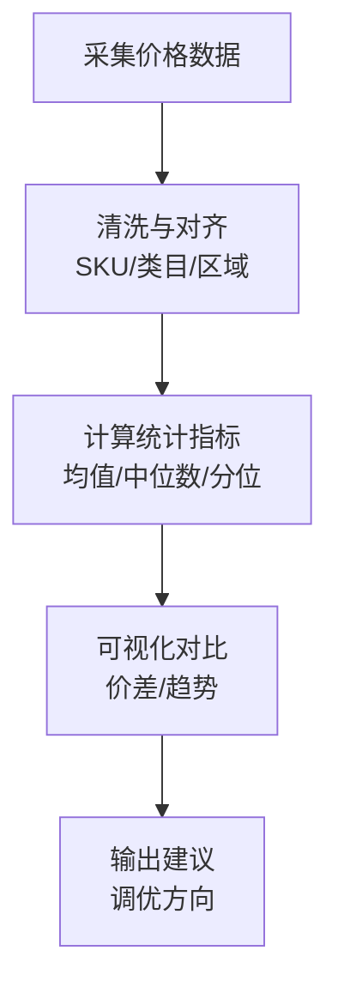

章节来源
- [src/main/services/EbayService.ts](file://src/main/services/EbayService.ts)
- [src/shared/contracts.ts](file://src/shared/contracts.ts)

### 价格历史追踪与自动调价
- 历史记录：每次价格变更写入快照，包含原因、策略ID、审批人、生效时间。
- 自动调价：定时任务扫描市场变化与库存水位，触发重新定价。
- 回滚机制：支持一键回滚到上一稳定价格，避免频繁震荡。
- 审计日志：不可篡改记录，满足合规要求。

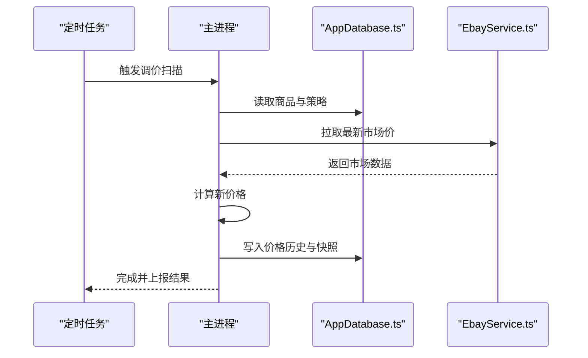

图表来源
- [src/main/database/AppDatabase.ts](file://src/main/database/AppDatabase.ts)
- [src/main/services/EbayService.ts](file://src/main/services/EbayService.ts)

章节来源
- [src/main/database/AppDatabase.ts](file://src/main/database/AppDatabase.ts)
- [src/main/services/EbayService.ts](file://src/main/services/EbayService.ts)

### 价格监控告警
- 监控指标：价格偏离度、利润率、销量突变、库存异常、竞品大幅降价。
- 告警通道：站内消息、邮件、飞书机器人（FeishuBotService）。
- 阈值策略：静态阈值与动态基线结合，减少误报。
- 处置闭环：告警→诊断→建议→执行→复核。

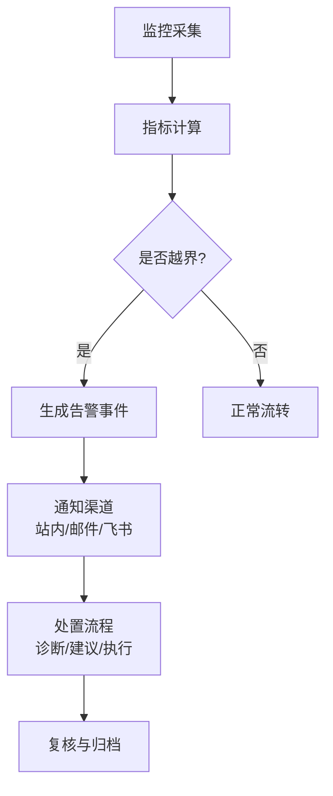

章节来源
- [src/main/services/FeishuBotService.ts](file://src/main/services/FeishuBotService.ts)
- [src/main/database/AppDatabase.ts](file://src/main/database/AppDatabase.ts)

### 定价模板管理与批量价格更新
- 模板库：按类目/渠道/季节维护模板，支持版本控制与灰度发布。
- 批量更新：导入 CSV/Excel，映射字段，校验后批量应用策略。
- 幂等与回滚：重复提交去重，失败重试，批量回滚保障一致性。
- 权限与审批：敏感策略需审批流，留痕可追溯。

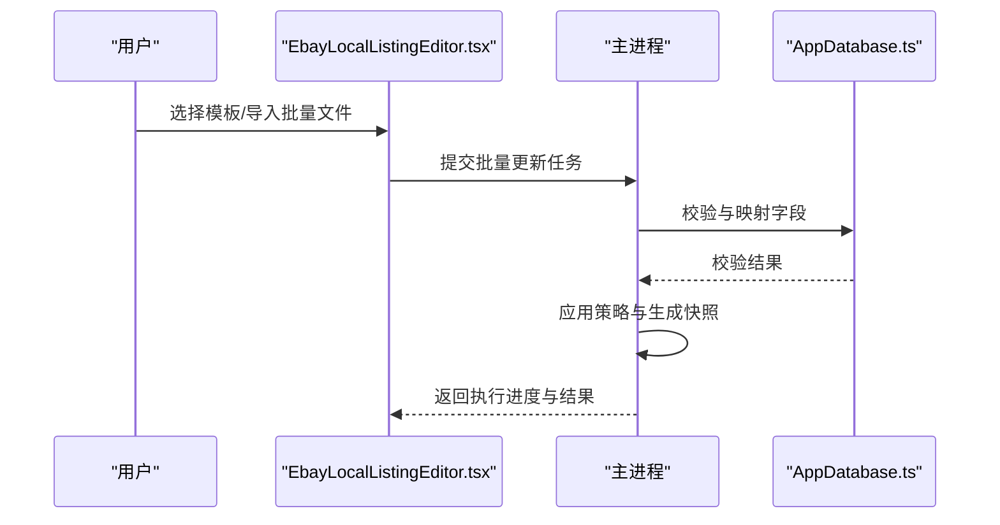

图表来源
- [src/renderer/EbayLocalListingEditor.tsx](file://src/renderer/EbayLocalListingEditor.tsx)
- [src/main/database/AppDatabase.ts](file://src/main/database/AppDatabase.ts)

章节来源
- [src/renderer/EbayLocalListingEditor.tsx](file://src/renderer/EbayLocalListingEditor.tsx)
- [src/shared/contracts.ts](file://src/shared/contracts.ts)

## 依赖分析
- 前端依赖：React 组件与样式，负责用户交互与策略配置。
- 主进程依赖：数据库访问与 eBay 服务集成，承担数据持久化与外部 API 调用。
- 共享契约：定义 IPC 数据结构，保证前后端一致。
- 第三方服务：eBay API、飞书机器人、可能的图像/翻译/视频服务（与本定价系统解耦）。

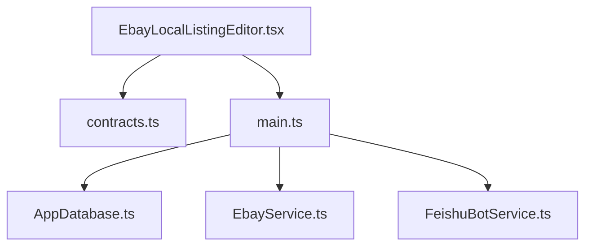

图表来源
- [src/renderer/EbayLocalListingEditor.tsx](file://src/renderer/EbayLocalListingEditor.tsx)
- [src/shared/contracts.ts](file://src/shared/contracts.ts)
- [src/main/database/AppDatabase.ts](file://src/main/database/AppDatabase.ts)
- [src/main/services/EbayService.ts](file://src/main/services/EbayService.ts)
- [src/main/services/FeishuBotService.ts](file://src/main/services/FeishuBotService.ts)

章节来源
- [package.json](file://package.json)
- [src/shared/contracts.ts](file://src/shared/contracts.ts)

## 性能考虑
- 缓存策略：市场参考价与竞品价短期缓存，降低 API 调用频率。
- 异步处理：批量更新与调价任务采用队列与分片，避免阻塞。
- 增量计算：仅对受影响商品重新计算，减少全量刷新。
- 索引优化：价格历史表按商品与时间分区，提升查询效率。
- 资源限制：并发上限与超时控制，防止雪崩。

## 故障排查指南
- 常见问题：
  - 价格未生效：检查策略生效时间与优先级，确认模板版本。
  - 促销冲突：查看规则互斥与叠加顺序，核对最低价保护。
  - 市场数据异常：核对 eBay 接口状态与限频策略。
  - 成本异常：核查汇率与费用分摊逻辑。
- 定位步骤：
  - 查看价格历史快照与审计日志。
  - 检查监控告警与错误堆栈。
  - 复现场景并隔离问题模块。
- 恢复措施：
  - 回滚到上一稳定价格。
  - 修正策略配置并灰度发布。
  - 补充缺失数据源或修复接口。

章节来源
- [src/main/database/AppDatabase.ts](file://src/main/database/AppDatabase.ts)
- [src/main/services/EbayService.ts](file://src/main/services/EbayService.ts)
- [src/main/services/FeishuBotService.ts](file://src/main/services/FeishuBotService.ts)

## 结论
本定价系统以“策略驱动、数据支撑、自动化执行”为核心思想，通过动态定价算法、灵活的价格策略配置与完善的成本计算，实现对促销、折扣与价格比较的全链路管理。借助价格历史追踪、自动调价与监控告警，系统在稳定性与可审计性方面具备良好基础。后续应重点完善策略引擎与数据源集成，强化模板管理与批量处理能力，持续提升定价效率与准确性。

## 附录
- 术语表：
  - 基准价：不考虑促销时的建议售价。
  - 促销价：在基准价基础上应用折扣后的最终售价。
  - 底价：不可低于的最低售价，通常由成本与合规决定。
  - 策略模板：可复用的定价规则集合。
- 最佳实践：
  - 小步快跑：先灰度再全量，观察效果后再扩大范围。
  - 数据先行：确保市场数据与成本数据的准确性与时效性。
  - 风控优先：设置最低价与利润底线，避免恶性竞争。
  - 审计完备：所有变更留痕，便于复盘与合规检查。