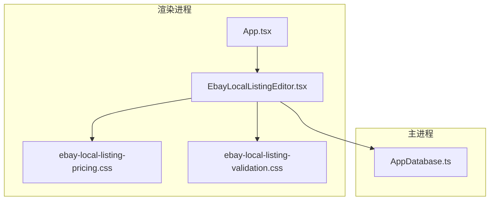
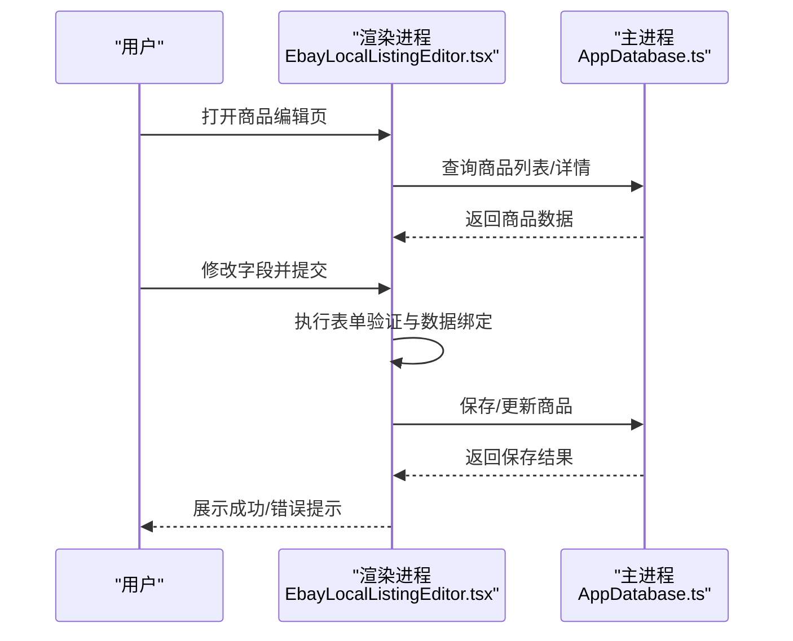
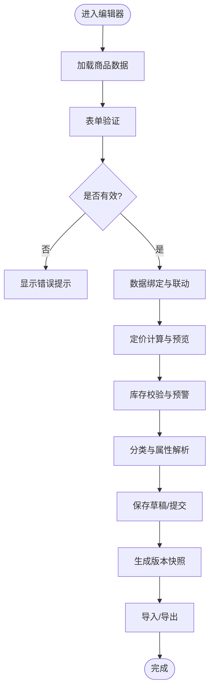
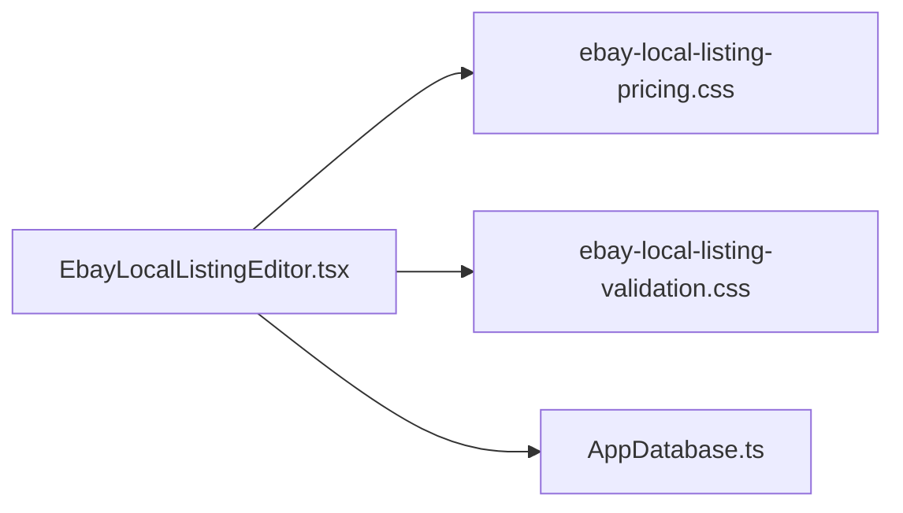

# 本地商品编辑器

<cite>
**本文引用的文件**   
- [src/renderer/App.tsx](file://src/renderer/App.tsx)
- [src/renderer/EbayLocalListingEditor.tsx](file://src/renderer/EbayLocalListingEditor.tsx)
- [src/renderer/ebay-local-listing-pricing.css](file://src/renderer/ebay-local-listing-pricing.css)
- [src/renderer/ebay-local-listing-validation.css](file://src/renderer/ebay-local-listing-validation.css)
- [src/main/database/AppDatabase.ts](file://src/main/database/AppDatabase.ts)
- [package.json](file://package.json)
</cite>

## 目录
1. [简介](#简介)
2. [项目结构](#项目结构)
3. [核心组件](#核心组件)
4. [架构总览](#架构总览)
5. [详细组件分析](#详细组件分析)
6. [依赖关系分析](#依赖关系分析)
7. [性能考量](#性能考量)
8. [故障排查指南](#故障排查指南)
9. [结论](#结论)
10. [附录](#附录)

## 简介
本文件为“本地商品编辑器”的完整技术文档，聚焦于商品信息CRUD、表单验证与数据绑定、定价管理、库存控制、分类选择与属性配置、批量操作、数据导入导出以及版本管理等能力。文档面向开发者与产品使用者，既提供高层架构说明，也给出代码级实现要点与可视化图示，帮助快速理解并扩展功能。

## 项目结构
本项目采用 Electron 多进程架构：
- 渲染进程（renderer）负责 UI 与交互逻辑，包含商品编辑主界面、样式与资源。
- 主进程（main）负责数据库访问与系统级能力封装。
- 共享层（shared）存放跨进程契约与通用逻辑。

图表来源
- [src/renderer/App.tsx](file://src/renderer/App.tsx)
- [src/renderer/EbayLocalListingEditor.tsx](file://src/renderer/EbayLocalListingEditor.tsx)
- [src/renderer/ebay-local-listing-pricing.css](file://src/renderer/ebay-local-listing-pricing.css)
- [src/renderer/ebay-local-listing-validation.css](file://src/renderer/ebay-local-listing-validation.css)
- [src/main/database/AppDatabase.ts](file://src/main/database/AppDatabase.ts)

章节来源
- [src/renderer/App.tsx](file://src/renderer/App.tsx)
- [src/renderer/EbayLocalListingEditor.tsx](file://src/renderer/EbayLocalListingEditor.tsx)
- [src/main/database/AppDatabase.ts](file://src/main/database/AppDatabase.ts)
- [package.json](file://package.json)

## 核心组件
- 应用入口与路由挂载：负责初始化渲染页面、挂载根组件与全局状态容器。
- 商品编辑器：承载商品信息的增删改查、表单校验、数据绑定、定价与库存、分类与属性、批量操作、导入导出与版本管理。
- 数据库服务：提供本地持久化能力，供编辑器读写商品数据。

章节来源
- [src/renderer/App.tsx](file://src/renderer/App.tsx)
- [src/renderer/EbayLocalListingEditor.tsx](file://src/renderer/EbayLocalListingEditor.tsx)
- [src/main/database/AppDatabase.ts](file://src/main/database/AppDatabase.ts)

## 架构总览
渲染进程通过 React 组件组织商品编辑流程；主进程通过数据库模块提供数据存取。编辑器与数据库之间通过 IPC 或桥接方法调用，确保 UI 与数据解耦。

图表来源
- [src/renderer/EbayLocalListingEditor.tsx](file://src/renderer/EbayLocalListingEditor.tsx)
- [src/main/database/AppDatabase.ts](file://src/main/database/AppDatabase.ts)

## 详细组件分析

### 商品编辑器（EbayLocalListingEditor.tsx）
该组件是本地商品编辑器的核心，承担以下职责：
- 商品信息的 CRUD：新建、查看、编辑、删除商品条目。
- 表单验证：对必填项、格式、范围等进行校验，并提供即时反馈。
- 数据绑定：将表单输入与商品模型双向绑定，支持联动与派生字段计算。
- 定价管理：基础售价、折扣、税费、运费等策略配置与实时预览。
- 库存控制：初始库存、安全库存、入库/出库记录与库存预警。
- 分类选择：类目树选择、默认类目回退、类目属性继承。
- 属性配置：SKU、条码、材质、尺寸、颜色等多维属性键值对管理。
- 批量操作：多选、批量更新字段、批量导入模板填充。
- 数据导入导出：CSV/JSON 导入导出，含字段映射与错误报告。
- 版本管理：保存历史快照、对比差异、回滚到指定版本。

图表来源
- [src/renderer/EbayLocalListingEditor.tsx](file://src/renderer/EbayLocalListingEditor.tsx)

章节来源
- [src/renderer/EbayLocalListingEditor.tsx](file://src/renderer/EbayLocalListingEditor.tsx)

### 定价管理（ebay-local-listing-pricing.css）
样式文件定义了价格区域布局、折扣标签、税费与运费区块、价格预览面板等视觉规范。编辑器在定价模块中：
- 支持多种计价模式（固定价、阶梯价、促销价）。
- 自动计算含税价、到手价与利润预估。
- 根据库存与成本阈值提示调价建议。

章节来源
- [src/renderer/ebay-local-listing-pricing.css](file://src/renderer/ebay-local-listing-pricing.css)

### 表单验证（ebay-local-listing-validation.css）
样式文件定义校验状态（成功、警告、错误）、错误信息提示框、必填标记与输入高亮规则。编辑器在验证阶段：
- 对关键字段进行非空、长度、格式、数值范围校验。
- 提供自定义验证规则扩展点（如正则表达式、异步校验）。
- 将校验结果映射到 UI 状态，驱动禁用/启用提交按钮。

章节来源
- [src/renderer/ebay-local-listing-validation.css](file://src/renderer/ebay-local-listing-validation.css)

### 数据库服务（AppDatabase.ts）
主进程的数据库模块提供商品数据的持久化能力，包括：
- 商品表结构与索引设计（ID、标题、类目、价格、库存、时间戳等）。
- 事务性写入与并发控制，保证数据一致性。
- 版本快照存储与差异比较接口。
- 批量导入导出的流式处理与错误回滚。

章节来源
- [src/main/database/AppDatabase.ts](file://src/main/database/AppDatabase.ts)

## 依赖关系分析
- 渲染进程依赖 React 生态与样式文件，构建商品编辑 UI。
- 编辑器组件依赖数据库服务进行数据读写。
- 样式文件仅作为视觉表现，不耦合业务逻辑。

图表来源
- [src/renderer/EbayLocalListingEditor.tsx](file://src/renderer/EbayLocalListingEditor.tsx)
- [src/renderer/ebay-local-listing-pricing.css](file://src/renderer/ebay-local-listing-pricing.css)
- [src/renderer/ebay-local-listing-validation.css](file://src/renderer/ebay-local-listing-validation.css)
- [src/main/database/AppDatabase.ts](file://src/main/database/AppDatabase.ts)

章节来源
- [src/renderer/EbayLocalListingEditor.tsx](file://src/renderer/EbayLocalListingEditor.tsx)
- [src/main/database/AppDatabase.ts](file://src/main/database/AppDatabase.ts)

## 性能考量
- 大表单分片渲染：按模块懒加载定价、库存、属性等区块，减少首屏渲染压力。
- 增量校验：仅在字段变更时触发相关校验，避免全量重算。
- 批量操作优化：使用事务批量写入，合并重复更新，降低 I/O 次数。
- 导入导出流式处理：边读边写，限制内存占用，提升大数据集处理能力。
- 版本快照压缩：对差异数据进行压缩存储，节省空间并加速对比。

[本节为通用指导，无需特定文件引用]

## 故障排查指南
- 表单验证失败
  - 检查必填项与格式约束是否正确配置。
  - 查看校验错误提示定位具体字段。
  - 确认自定义验证规则未抛出异常。
- 数据保存失败
  - 检查数据库连接与权限。
  - 查看事务日志与回滚原因。
  - 确认字段类型与长度符合约束。
- 导入导出异常
  - 核对模板字段映射与数据类型。
  - 查看错误报告中的行号与列名。
  - 尝试分批导入以定位问题数据。

章节来源
- [src/renderer/ebay-local-listing-validation.css](file://src/renderer/ebay-local-listing-validation.css)
- [src/main/database/AppDatabase.ts](file://src/main/database/AppDatabase.ts)

## 结论
本地商品编辑器通过清晰的渲染/主进程分层与模块化设计，实现了完整的商品信息管理闭环。定价、库存、分类与属性的交互流程完善，批量操作与导入导出提升了效率，版本管理保障了数据安全与可追溯。建议在后续迭代中继续优化性能与用户体验，并扩展更多平台适配能力。

[本节为总结性内容，无需特定文件引用]

## 附录
- 样式定制指南
  - 调整定价区块布局与配色，保持可读性与一致性。
  - 统一校验状态的视觉语言，便于用户识别。
  - 遵循响应式规范，适配不同屏幕尺寸。
- 自定义验证规则实现方法
  - 在编辑器中注册新的验证器函数，支持同步与异步校验。
  - 将规则与字段绑定，并在错误时提供友好提示。
  - 对复杂规则进行单元测试，确保稳定性。

[本节为补充说明，无需特定文件引用]