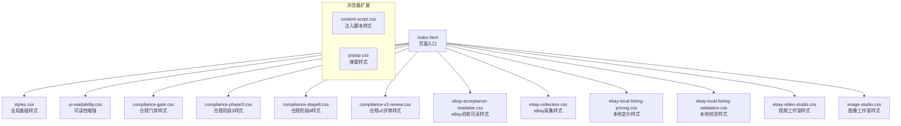
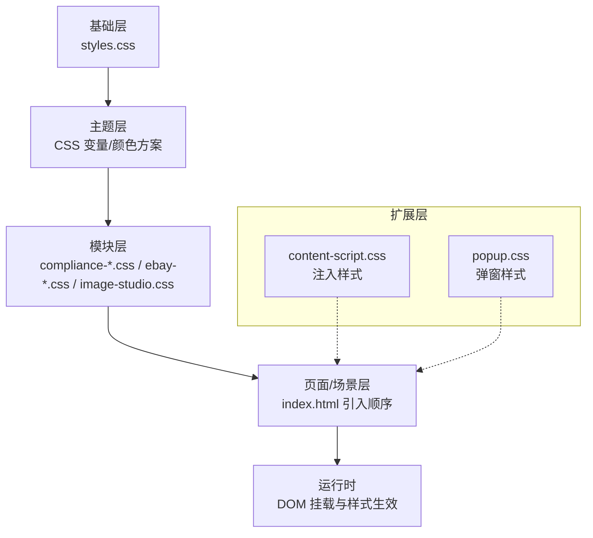
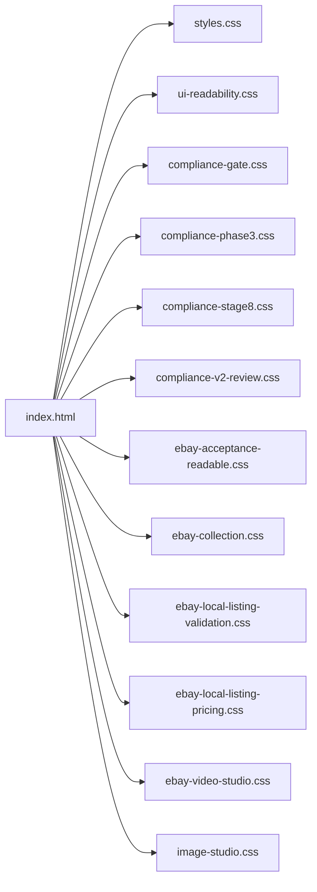

# 界面定制

<cite>
**本文引用的文件**   
- [src/renderer/styles.css](file://src/renderer/styles.css)
- [src/renderer/compliance-gate.css](file://src/renderer/compliance-gate.css)
- [src/renderer/compliance-phase3.css](file://src/renderer/compliance-phase3.css)
- [src/renderer/compliance-stage8.css](file://src/renderer/compliance-stage8.css)
- [src/renderer/compliance-v2-review.css](file://src/renderer/compliance-v2-review.css)
- [src/renderer/ebay-acceptance-readable.css](file://src/renderer/ebay-acceptance-readable.css)
- [src/renderer/ebay-collection.css](file://src/renderer/ebay-collection.css)
- [src/renderer/ebay-local-listing-pricing.css](file://src/renderer/ebay-local-listing-pricing.css)
- [src/renderer/ebay-local-listing-validation.css](file://src/renderer/ebay-local-listing-validation.css)
- [src/renderer/ebay-video-studio.css](file://src/renderer/ebay-video-studio.css)
- [src/renderer/image-studio.css](file://src/renderer/image-studio.css)
- [src/renderer/ui-readability.css](file://src/renderer/ui-readability.css)
- [src/renderer/index.html](file://src/renderer/index.html)
- [browser-extension/content-script.css](file://browser-extension/content-script.css)
- [browser-extension/popup.css](file://browser-extension/popup.css)
</cite>

## 目录
1. [简介](#简介)
2. [项目结构](#项目结构)
3. [核心组件](#核心组件)
4. [架构总览](#架构总览)
5. [详细组件分析](#详细组件分析)
6. [依赖分析](#依赖分析)
7. [性能考虑](#性能考虑)
8. [故障排查指南](#故障排查指南)
9. [结论](#结论)
10. [附录](#附录)

## 简介
本文件面向需要对该项目的界面进行深度定制的开发者与设计师，系统性阐述样式架构、主题系统与组件样式定制方法。内容涵盖：
- CSS 样式组织与分层策略
- 主题系统（颜色方案、变量管理）
- 响应式设计与移动端适配
- 跨浏览器兼容性处理
- 布局调整与交互效果优化
- 组件库扩展与自定义主题开发指南

目标是帮助读者在不破坏既有功能的前提下，快速定位样式入口、理解样式职责边界、安全地扩展或覆盖样式，并保证多端一致体验。

## 项目结构
本项目的前端渲染层位于 src/renderer，包含多个按业务模块划分的 CSS 文件；浏览器扩展的 UI 样式位于 browser-extension。整体采用“模块化样式 + 页面级入口”的组织方式，便于按功能域独立维护与按需加载。

图表来源
- [src/renderer/index.html](file://src/renderer/index.html)
- [src/renderer/styles.css](file://src/renderer/styles.css)
- [src/renderer/ui-readability.css](file://src/renderer/ui-readability.css)
- [src/renderer/compliance-gate.css](file://src/renderer/compliance-gate.css)
- [src/renderer/compliance-phase3.css](file://src/renderer/compliance-phase3.css)
- [src/renderer/compliance-stage8.css](file://src/renderer/compliance-stage8.css)
- [src/renderer/compliance-v2-review.css](file://src/renderer/compliance-v2-review.css)
- [src/renderer/ebay-acceptance-readable.css](file://src/renderer/ebay-acceptance-readable.css)
- [src/renderer/ebay-collection.css](file://src/renderer/ebay-collection.css)
- [src/renderer/ebay-local-listing-pricing.css](file://src/renderer/ebay-local-listing-pricing.css)
- [src/renderer/ebay-local-listing-validation.css](file://src/renderer/ebay-local-listing-validation.css)
- [src/renderer/ebay-video-studio.css](file://src/renderer/ebay-video-studio.css)
- [src/renderer/image-studio.css](file://src/renderer/image-studio.css)
- [browser-extension/content-script.css](file://browser-extension/content-script.css)
- [browser-extension/popup.css](file://browser-extension/popup.css)

章节来源
- [src/renderer/index.html](file://src/renderer/index.html)

## 核心组件
- 全局基础样式（styles.css）
  - 作用：定义全局排版、重置、基础色板、字体、间距、断点等，是主题系统的根基。
  - 建议：将可复用变量集中于此，避免在各模块重复定义。
- 可读性与无障碍（ui-readability.css）
  - 作用：提升文本对比度、行高、字号层级，改善阅读体验与可访问性。
- 合规相关样式（compliance-*.css）
  - 作用：为不同合规阶段与评审流程提供独立的视觉与交互样式，确保流程状态清晰可见。
- eBay 系列样式（ebay-*.css）
  - 作用：针对 eBay 业务场景（采集、本地定价、校验、视频工作室等）提供专用布局与交互样式。
- 图像工作室（image-studio.css）
  - 作用：图像处理工作区的布局、工具栏、画布与预览区样式。
- 浏览器扩展样式（content-script.css、popup.css）
  - 作用：注入页面的增强样式与弹窗界面样式，需关注隔离与优先级。

章节来源
- [src/renderer/styles.css](file://src/renderer/styles.css)
- [src/renderer/ui-readability.css](file://src/renderer/ui-readability.css)
- [src/renderer/compliance-gate.css](file://src/renderer/compliance-gate.css)
- [src/renderer/compliance-phase3.css](file://src/renderer/compliance-phase3.css)
- [src/renderer/compliance-stage8.css](file://src/renderer/compliance-stage8.css)
- [src/renderer/compliance-v2-review.css](file://src/renderer/compliance-v2-review.css)
- [src/renderer/ebay-acceptance-readable.css](file://src/renderer/ebay-acceptance-readable.css)
- [src/renderer/ebay-collection.css](file://src/renderer/ebay-collection.css)
- [src/renderer/ebay-local-listing-pricing.css](file://src/renderer/ebay-local-listing-pricing.css)
- [src/renderer/ebay-local-listing-validation.css](file://src/renderer/ebay-local-listing-validation.css)
- [src/renderer/ebay-video-studio.css](file://src/renderer/ebay-video-studio.css)
- [src/renderer/image-studio.css](file://src/renderer/image-studio.css)
- [browser-extension/content-script.css](file://browser-extension/content-script.css)
- [browser-extension/popup.css](file://browser-extension/popup.css)

## 架构总览
样式架构遵循“基础层 → 主题层 → 模块层 → 页面/场景层”的分层原则，通过变量与命名约定实现主题切换与组件扩展。

图表来源
- [src/renderer/styles.css](file://src/renderer/styles.css)
- [src/renderer/index.html](file://src/renderer/index.html)
- [browser-extension/content-script.css](file://browser-extension/content-script.css)
- [browser-extension/popup.css](file://browser-extension/popup.css)

## 详细组件分析

### 全局基础样式（styles.css）
- 职责
  - 定义全局 CSS 变量（颜色、字体、间距、圆角、阴影、断点等）
  - 统一基础元素样式（按钮、输入框、卡片、列表等）
  - 提供响应式断点与通用布局类
- 定制要点
  - 在变量层集中管理主题色、中性色、语义色（成功、警告、错误等）
  - 使用统一的间距与字号阶梯，确保一致性
  - 通过媒体查询定义断点，支撑响应式布局
- 扩展建议
  - 新增组件时优先复用基础变量与类名
  - 若需覆盖默认样式，建议在模块层以更高特异性覆盖，避免直接修改基础层

章节来源
- [src/renderer/styles.css](file://src/renderer/styles.css)

### 可读性与无障碍（ui-readability.css）
- 职责
  - 提升文本可读性（行高、字重、对比度）
  - 强化焦点状态与键盘导航体验
- 定制要点
  - 保持 WCAG 对比度要求
  - 为屏幕阅读器提供必要的隐藏/提示文本
- 扩展建议
  - 新增页面应继承该文件的可读性规范

章节来源
- [src/renderer/ui-readability.css](file://src/renderer/ui-readability.css)

### 合规相关样式（compliance-gate.css / compliance-phase3.css / compliance-stage8.css / compliance-v2-review.css）
- 职责
  - 为合规流程的不同阶段提供状态化样式（门禁、阶段、评审）
  - 明确各阶段的视觉反馈与交互约束
- 定制要点
  - 使用语义化类名标识阶段与状态
  - 通过变量控制阶段主色与强调色，便于主题切换
- 扩展建议
  - 新增阶段时，复制现有阶段样式结构，仅替换变量值与文案

章节来源
- [src/renderer/compliance-gate.css](file://src/renderer/compliance-gate.css)
- [src/renderer/compliance-phase3.css](file://src/renderer/compliance-phase3.css)
- [src/renderer/compliance-stage8.css](file://src/renderer/compliance-stage8.css)
- [src/renderer/compliance-v2-review.css](file://src/renderer/compliance-v2-review.css)

### eBay 系列样式（ebay-acceptance-readable.css / ebay-collection.css / ebay-local-listing-pricing.css / ebay-local-listing-validation.css / ebay-video-studio.css）
- 职责
  - 针对 eBay 业务场景提供专用布局与交互样式
  - 区分采集、定价、校验、视频工作室等不同子模块
- 定制要点
  - 保持模块内命名空间一致，避免冲突
  - 使用变量控制品牌色与业务强调色
- 扩展建议
  - 新增 eBay 子模块时，新建独立 CSS 文件并按 index.html 引入顺序加载

章节来源
- [src/renderer/ebay-acceptance-readable.css](file://src/renderer/ebay-acceptance-readable.css)
- [src/renderer/ebay-collection.css](file://src/renderer/ebay-collection.css)
- [src/renderer/ebay-local-listing-pricing.css](file://src/renderer/ebay-local-listing-pricing.css)
- [src/renderer/ebay-local-listing-validation.css](file://src/renderer/ebay-local-listing-validation.css)
- [src/renderer/ebay-video-studio.css](file://src/renderer/ebay-video-studio.css)

### 图像工作室（image-studio.css）
- 职责
  - 定义图像编辑工作区的布局（工具栏、画布、预览、属性面板）
  - 处理拖拽、缩放、裁剪等交互的视觉反馈
- 定制要点
  - 使用 CSS Grid/Flexbox 构建自适应布局
  - 通过变量控制工具栏尺寸、画布背景与边框
- 扩展建议
  - 新增工具或面板时，遵循现有网格与间距规范

章节来源
- [src/renderer/image-studio.css](file://src/renderer/image-studio.css)

### 浏览器扩展样式（content-script.css / popup.css）
- 职责
  - content-script.css：注入到目标页面，增强或覆盖部分样式
  - popup.css：扩展弹窗界面的样式与布局
- 定制要点
  - 注意样式隔离与优先级，避免污染宿主页面
  - 弹窗样式需适配小屏与不同分辨率
- 扩展建议
  - 新增注入样式时，尽量限定选择器范围，减少副作用

章节来源
- [browser-extension/content-script.css](file://browser-extension/content-script.css)
- [browser-extension/popup.css](file://browser-extension/popup.css)

## 依赖分析
- 引入关系
  - index.html 作为页面入口，按顺序引入各 CSS 文件，形成样式加载链
  - styles.css 作为基础层被后续模块依赖
  - ui-readability.css 与合规/eBay 模块并行加载，互不依赖
- 潜在风险
  - 加载顺序不当可能导致覆盖失效或闪烁
  - 模块间选择器冲突需通过命名空间或变量隔离

图表来源
- [src/renderer/index.html](file://src/renderer/index.html)

章节来源
- [src/renderer/index.html](file://src/renderer/index.html)

## 性能考虑
- 样式体积
  - 拆分模块按需加载，避免单文件过大
  - 清理未使用的选择器与重复变量
- 渲染性能
  - 减少复杂选择器与深层嵌套
  - 合理使用 transform/opacity 动画，避免触发重排
- 可维护性
  - 统一变量命名与断点策略
  - 建立样式审查清单，防止回归

[本节为通用指导，无需引用具体文件]

## 故障排查指南
- 样式未生效
  - 检查 index.html 引入顺序与路径是否正确
  - 确认选择器特异性是否被覆盖
- 主题不一致
  - 核对 CSS 变量定义与使用位置
  - 检查是否存在硬编码颜色值
- 移动端异常
  - 检查媒体查询断点与单位使用
  - 验证视口设置与缩放行为
- 扩展样式冲突
  - 缩小 content-script.css 的选择器范围
  - 使用 shadow DOM 或命名空间隔离

章节来源
- [src/renderer/index.html](file://src/renderer/index.html)
- [browser-extension/content-script.css](file://browser-extension/content-script.css)
- [browser-extension/popup.css](file://browser-extension/popup.css)

## 结论
通过分层清晰的样式架构与变量驱动的主题系统，本项目实现了良好的可定制性与可扩展性。建议在实际定制中：
- 优先在基础层与主题层完成变量与断点管理
- 在模块层进行组件样式扩展与覆盖
- 严格遵循加载顺序与命名规范，确保稳定性与可维护性

[本节为总结性内容，无需引用具体文件]

## 附录
- 主题开发最佳实践
  - 集中管理颜色、字体、间距、圆角、阴影等变量
  - 使用语义化变量名（如 --color-primary、--spacing-md）
  - 提供明暗主题切换能力
- 响应式设计建议
  - 基于容器与流式布局，减少固定宽度
  - 使用现代布局（Grid/Flex）与相对单位（rem/em/vw）
- 跨浏览器兼容
  - 关注 CSS 特性支持矩阵，必要时添加前缀或降级方案
  - 测试主流浏览器与移动设备

[本节为通用指导，无需引用具体文件]