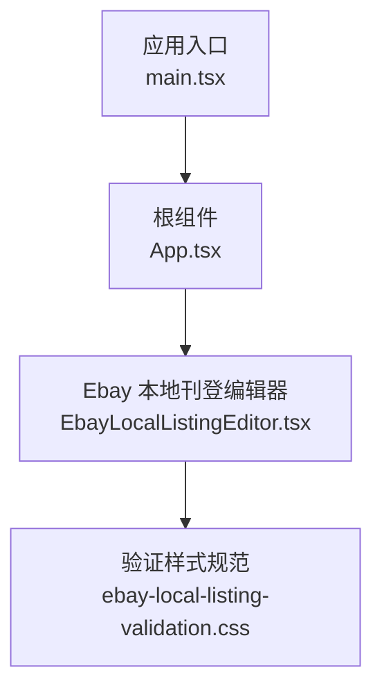
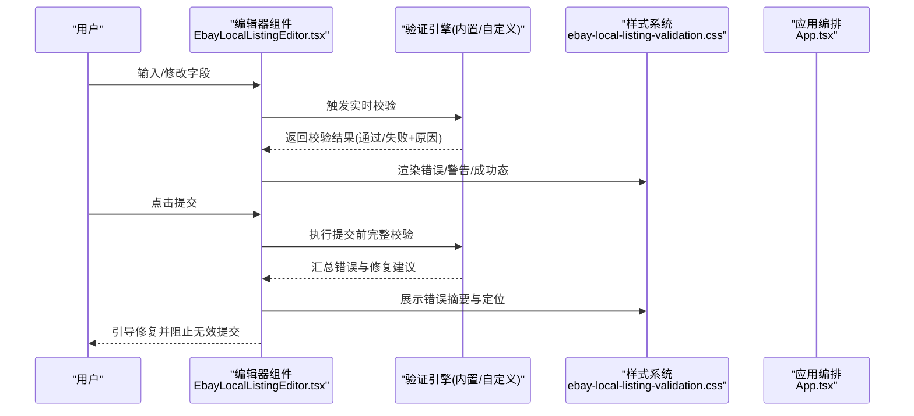
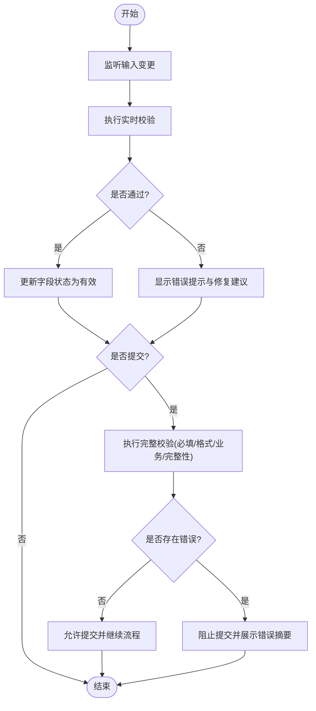
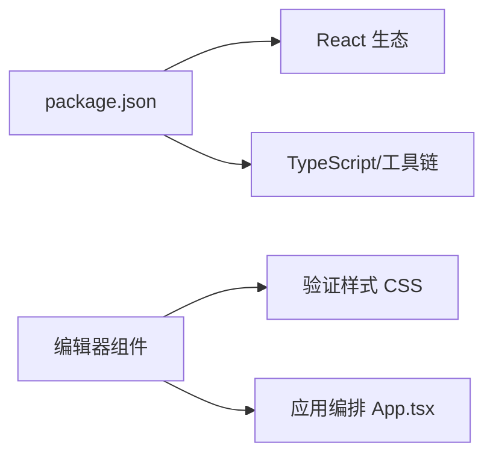

# 验证规则

<cite>
**本文引用的文件**   
- [src/renderer/EbayLocalListingEditor.tsx](file://src/renderer/EbayLocalListingEditor.tsx)
- [src/renderer/ebay-local-listing-validation.css](file://src/renderer/ebay-local-listing-validation.css)
- [src/renderer/App.tsx](file://src/renderer/App.tsx)
- [src/renderer/main.tsx](file://src/renderer/main.tsx)
- [package.json](file://package.json)
</cite>

## 目录
1. [简介](#简介)
2. [项目结构](#项目结构)
3. [核心组件](#核心组件)
4. [架构总览](#架构总览)
5. [详细组件分析](#详细组件分析)
6. [依赖分析](#依赖分析)
7. [性能考虑](#性能考虑)
8. [故障排查指南](#故障排查指南)
9. [结论](#结论)
10. [附录](#附录)

## 简介
本文件围绕表单验证框架、自定义验证规则与实时校验机制，系统化梳理本项目在 eBay 本地刊登编辑场景中的验证能力。内容覆盖必填字段验证、格式验证、业务规则验证与数据完整性检查；同时给出错误提示、用户引导与修复建议的实现思路与扩展方法，并包含第三方验证集成指南。文档力求以循序渐进的方式帮助读者快速理解与落地。

## 项目结构
本项目采用 Electron + React 的前端渲染层组织方式，验证相关逻辑主要集中在渲染器（renderer）目录的页面组件与样式文件中：
- 页面组件负责收集表单输入、触发校验、展示错误与引导信息
- 样式文件提供统一的错误提示视觉规范
- 应用入口与路由管理协调各模块加载与状态流转

图表来源
- [src/renderer/main.tsx](file://src/renderer/main.tsx)
- [src/renderer/App.tsx](file://src/renderer/App.tsx)
- [src/renderer/EbayLocalListingEditor.tsx](file://src/renderer/EbayLocalListingEditor.tsx)
- [src/renderer/ebay-local-listing-validation.css](file://src/renderer/ebay-local-listing-validation.css)

章节来源
- [src/renderer/main.tsx](file://src/renderer/main.tsx)
- [src/renderer/App.tsx](file://src/renderer/App.tsx)
- [src/renderer/EbayLocalListingEditor.tsx](file://src/renderer/EbayLocalListingEditor.tsx)
- [src/renderer/ebay-local-listing-validation.css](file://src/renderer/ebay-local-listing-validation.css)

## 核心组件
- 表单编辑器组件：承载字段收集、校验触发与结果渲染
- 验证样式规范：统一错误态、警告态与成功态的视觉表达
- 应用编排：负责组件挂载与生命周期管理

章节来源
- [src/renderer/EbayLocalListingEditor.tsx](file://src/renderer/EbayLocalListingEditor.tsx)
- [src/renderer/ebay-local-listing-validation.css](file://src/renderer/ebay-local-listing-validation.css)
- [src/renderer/App.tsx](file://src/renderer/App.tsx)

## 架构总览
下图展示了从用户输入到验证结果展示的端到端流程，包括实时校验、提交前校验、错误提示与修复建议的呈现路径。

图表来源
- [src/renderer/EbayLocalListingEditor.tsx](file://src/renderer/EbayLocalListingEditor.tsx)
- [src/renderer/ebay-local-listing-validation.css](file://src/renderer/ebay-local-listing-validation.css)
- [src/renderer/App.tsx](file://src/renderer/App.tsx)

## 详细组件分析

### 编辑器组件与验证流程
- 字段收集与状态管理：组件维护各字段的值与校验状态，支持按字段或整体触发校验
- 实时校验：在输入变更时进行轻量级校验，减少用户等待时间
- 提交前校验：对必填项、格式与业务规则进行全面检查，生成错误摘要与修复建议
- 错误展示：结合样式规范，将错误高亮、提示文案与定位链接一并呈现

章节来源
- [src/renderer/EbayLocalListingEditor.tsx](file://src/renderer/EbayLocalListingEditor.tsx)

### 验证样式规范
- 错误态：红色边框、错误图标与提示文案
- 警告态：黄色边框与提示信息
- 成功态：绿色边框与成功标识
- 可访问性：确保颜色对比度与键盘导航友好

章节来源
- [src/renderer/ebay-local-listing-validation.css](file://src/renderer/ebay-local-listing-validation.css)

### 应用编排与组件集成
- 应用入口负责挂载根组件与全局样式
- 根组件协调页面模块加载与状态共享
- 编辑器组件作为功能模块之一接入应用生命周期

章节来源
- [src/renderer/main.tsx](file://src/renderer/main.tsx)
- [src/renderer/App.tsx](file://src/renderer/App.tsx)

## 依赖分析
- 运行时依赖：React 生态用于构建交互界面与状态管理
- 样式依赖：CSS 文件定义统一的验证反馈样式
- 包管理：通过 package.json 声明依赖版本与脚本命令

图表来源
- [package.json](file://package.json)
- [src/renderer/EbayLocalListingEditor.tsx](file://src/renderer/EbayLocalListingEditor.tsx)
- [src/renderer/ebay-local-listing-validation.css](file://src/renderer/ebay-local-listing-validation.css)
- [src/renderer/App.tsx](file://src/renderer/App.tsx)

章节来源
- [package.json](file://package.json)

## 性能考虑
- 实时校验节流：对高频输入事件进行节流或防抖，避免频繁计算
- 增量校验：仅对变更字段执行校验，降低整体开销
- 异步校验缓存：对耗时校验（如远程规则）引入缓存策略
- 渲染优化：仅在状态变化时更新 DOM，避免不必要的重绘

[本节为通用指导，不直接分析具体文件]

## 故障排查指南
- 常见错误类型
  - 必填字段缺失：检查字段绑定与默认值初始化
  - 格式不符：确认正则表达式与输入范围
  - 业务规则冲突：核对规则优先级与条件分支
  - 数据完整性：检查关联字段一致性
- 调试建议
  - 打开控制台查看校验日志与错误堆栈
  - 使用浏览器开发者工具检查样式类名是否正确应用
  - 逐步禁用自定义规则定位问题来源
- 修复建议
  - 优先修复必填与格式错误，再处理业务规则
  - 对用户可见的错误提供明确的修复步骤与示例
  - 对复杂规则增加单元测试与边界用例

章节来源
- [src/renderer/EbayLocalListingEditor.tsx](file://src/renderer/EbayLocalListingEditor.tsx)
- [src/renderer/ebay-local-listing-validation.css](file://src/renderer/ebay-local-listing-validation.css)

## 结论
本项目的验证体系以编辑器组件为核心，结合统一的样式规范与应用编排，实现了从实时校验到提交前校验的完整闭环。通过清晰的错误提示与修复建议，提升用户体验与数据质量。后续可扩展更多自定义规则与第三方验证服务，以满足更复杂的业务需求。

[本节为总结性内容，不直接分析具体文件]

## 附录

### 验证规则分类与实现要点
- 必填字段验证
  - 目标：确保关键字段不为空且符合最小长度要求
  - 实现要点：在实时与提交前两个阶段均进行检查
- 格式验证
  - 目标：校验邮箱、电话、URL、数值范围等格式
  - 实现要点：使用正则或专用解析器，提供清晰错误文案
- 业务规则验证
  - 目标：确保字段间关系与业务约束一致（如价格区间、类目匹配）
  - 实现要点：集中式规则引擎，支持组合与优先级
- 数据完整性检查
  - 目标：保证关联数据一致性与完整性（如主从表字段对应）
  - 实现要点：跨字段校验与批量校验，输出结构化错误摘要

[本节为概念性说明，不直接分析具体文件]

### 错误提示与用户引导
- 错误提示
  - 位置：字段附近与顶部摘要区
  - 内容：错误原因、影响范围与修复步骤
- 用户引导
  - 自动聚焦首个错误字段
  - 提供“一键修复”或“示例值”按钮
  - 分步引导复杂规则的填写

[本节为概念性说明，不直接分析具体文件]

### 验证规则扩展方法
- 新增规则
  - 定义规则函数：接收字段值与上下文，返回通过/失败及消息
  - 注册规则：在规则引擎中注册名称与描述
  - 绑定字段：在字段配置中引用规则名称与参数
- 组合规则
  - 支持 AND/OR 组合，便于复杂条件表达
  - 优先级控制：明确规则执行顺序与短路行为

[本节为概念性说明，不直接分析具体文件]

### 第三方验证集成指南
- 选择服务：根据规则复杂度与延迟要求选择本地或远程服务
- 接口设计：定义请求/响应契约，包含字段、规则ID与结果
- 错误映射：将第三方错误码映射为统一错误模型
- 降级策略：网络异常时回退到本地基础校验

[本节为概念性说明，不直接分析具体文件]