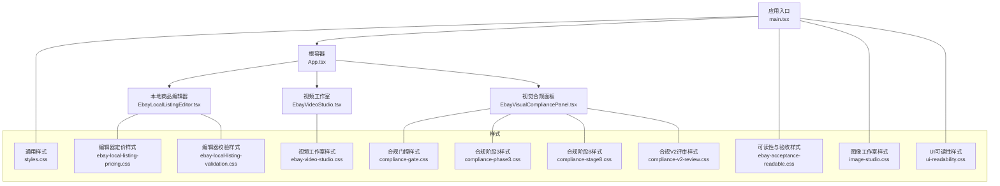
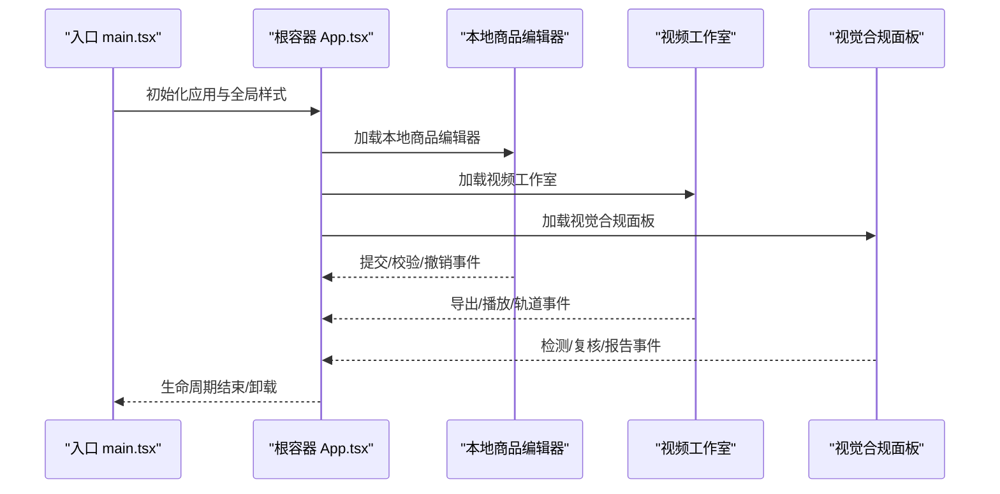
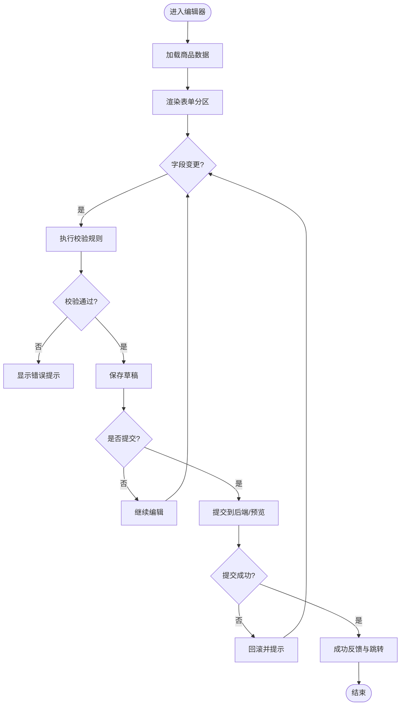
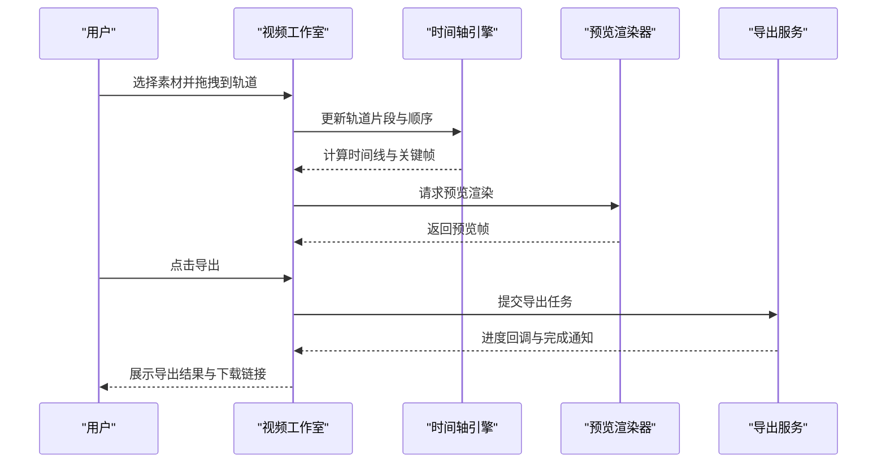
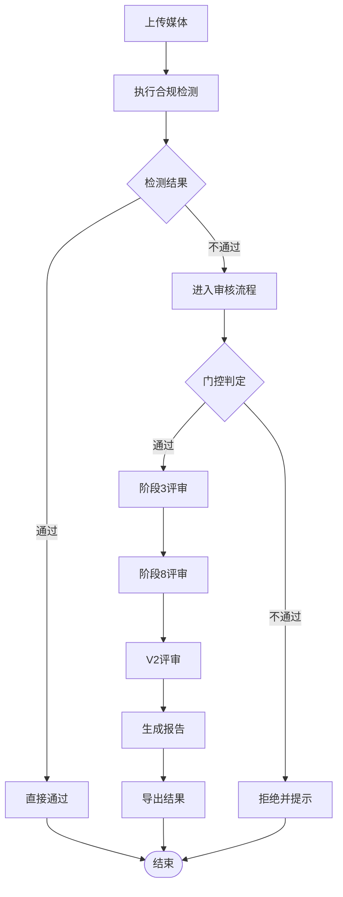
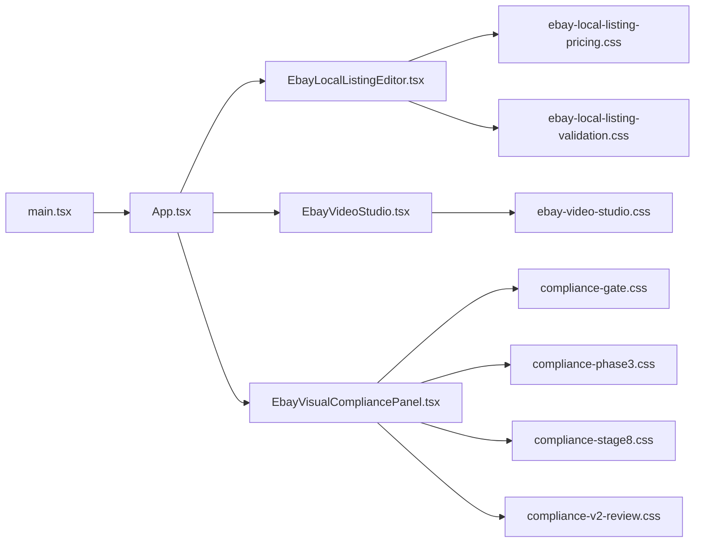

# 用户界面组件

<cite>
**本文档引用的文件**   
- [App.tsx](file://src/renderer/App.tsx)
- [EbayLocalListingEditor.tsx](file://src/renderer/EbayLocalListingEditor.tsx)
- [EbayVideoStudio.tsx](file://src/renderer/EbayVideoStudio.tsx)
- [EbayVisualCompliancePanel.tsx](file://src/renderer/EbayVisualCompliancePanel.tsx)
- [main.tsx](file://src/renderer/main.tsx)
- [styles.css](file://src/renderer/styles.css)
- [ebay-local-listing-pricing.css](file://src/renderer/ebay-local-listing-pricing.css)
- [ebay-local-listing-validation.css](file://src/renderer/ebay-local-listing-validation.css)
- [ebay-video-studio.css](file://src/renderer/ebay-video-studio.css)
- [compliance-gate.css](file://src/renderer/compliance-gate.css)
- [compliance-phase3.css](file://src/renderer/compliance-phase3.css)
- [compliance-stage8.css](file://src/renderer/compliance-stage8.css)
- [compliance-v2-review.css](file://src/renderer/compliance-v2-review.css)
- [ebay-acceptance-readable.css](file://src/renderer/ebay-acceptance-readable.css)
- [image-studio.css](file://src/renderer/image-studio.css)
- [ui-readability.css](file://src/renderer/ui-readability.css)
</cite>

## 目录
1. [简介](#简介)
2. [项目结构](#项目结构)
3. [核心组件](#核心组件)
4. [架构总览](#架构总览)
5. [详细组件分析](#详细组件分析)
6. [依赖分析](#依赖分析)
7. [性能考虑](#性能考虑)
8. [故障排查指南](#故障排查指南)
9. [结论](#结论)
10. [附录](#附录)

## 简介
本文件面向砚都跨境项目的用户界面组件，聚焦于 React 渲染层（renderer）中的三大核心界面：本地商品编辑器、视频工作室与视觉合规面板。文档从系统架构、组件关系、数据流、交互逻辑、样式定制、响应式设计与可访问性支持等维度进行系统化说明，并提供使用示例、自定义方法与最佳实践，帮助开发者快速上手并高效扩展。

## 项目结构
渲染层位于 src/renderer，包含应用入口、核心页面组件与多套样式文件。整体组织遵循“按功能划分”的模块化方式：每个主要界面由独立的 TSX 组件与对应 CSS 组成，便于维护与主题化。

图表来源
- [main.tsx:1-200](file://src/renderer/main.tsx#L1-L200)
- [App.tsx:1-200](file://src/renderer/App.tsx#L1-L200)

章节来源
- [main.tsx:1-200](file://src/renderer/main.tsx#L1-L200)
- [App.tsx:1-200](file://src/renderer/App.tsx#L1-L200)

## 核心组件
- 本地商品编辑器（EbayLocalListingEditor）
  - 职责：编辑 eBay 本地商品信息，包括标题、描述、属性、价格、SKU、库存等；提供字段校验与实时预览；支持批量导入导出与草稿保存。
  - 关键属性：商品数据模型、校验规则集、提交回调、错误回调、国际化文案、主题配置。
  - 事件处理：字段变更、校验失败提示、提交成功/失败、撤销/重做、批量操作确认。
  - 样式定制：通过独立 CSS 覆盖定价与校验相关 UI；支持暗色模式与高对比度主题。
  - 响应式：栅格布局适配桌面/平板/手机；表单控件在窄屏自动堆叠。
  - 可访问性：语义化标签、键盘导航、ARIA 属性、焦点管理、屏幕阅读器友好。

- 视频工作室（EbayVideoStudio）
  - 职责：创建与编辑 eBay 商品视频，支持片段裁剪、转场、字幕、封面图生成与导出。
  - 关键属性：媒体源列表、时间轴配置、导出参数、渲染队列、进度回调。
  - 事件处理：轨道编辑、播放控制、导出任务状态、错误重试。
  - 样式定制：播放器与控制栏样式、时间轴刻度与轨道样式。
  - 响应式：时间轴与预览区自适应缩放，移动端简化控制面板。
  - 可访问性：播放控件键盘可达、字幕文本替代、色彩对比度达标。

- 视觉合规面板（EbayVisualCompliancePanel）
  - 职责：对商品图片/视频进行合规检测，展示检测结果、风险等级与建议修正方案。
  - 关键属性：检测策略、阈值配置、结果映射表、报告模板、审计日志开关。
  - 事件处理：上传触发检测、结果刷新、人工复核、批量复检。
  - 样式定制：门控、阶段化评审、V2评审视图的多套样式。
  - 响应式：结果卡片与详情面板自适应布局。
  - 可访问性：结果高亮与语音播报、快捷键切换审核状态。

章节来源
- [EbayLocalListingEditor.tsx:1-200](file://src/renderer/EbayLocalListingEditor.tsx#L1-L200)
- [EbayVideoStudio.tsx:1-200](file://src/renderer/EbayVideoStudio.tsx#L1-L200)
- [EbayVisualCompliancePanel.tsx:1-200](file://src/renderer/EbayVisualCompliancePanel.tsx#L1-L200)

## 架构总览
渲染层采用“入口 -> 根容器 -> 业务组件”的分层结构。入口负责初始化与全局样式注入；根容器管理路由或视图切换；业务组件各自封装领域逻辑与交互。

图表来源
- [main.tsx:1-200](file://src/renderer/main.tsx#L1-L200)
- [App.tsx:1-200](file://src/renderer/App.tsx#L1-L200)

## 详细组件分析

### 本地商品编辑器（EbayLocalListingEditor）
- 结构与职责
  - 表单分区：基础信息、定价与库存、属性与类目、媒体与描述。
  - 校验引擎：内置规则与可扩展规则集，支持异步校验。
  - 数据绑定：受控与非受控输入并存，支持增量更新与批量同步。
- 交互流程
  - 字段变更触发校验，错误即时反馈。
  - 提交前二次确认，失败时回滚至上一版本。
  - 草稿自动保存，支持恢复历史版本。
- 样式与主题
  - 定价与校验样式通过独立 CSS 覆盖，避免污染全局。
  - 支持主题变量（颜色、间距、圆角）与暗色模式。
- 响应式与可访问性
  - 栅格布局在小屏自动折叠为单列。
  - 表单控件具备 label、aria-invalid、aria-describedby。
  - 键盘导航支持 Tab/Shift+Tab、Enter 提交、Esc 取消。

图表来源
- [EbayLocalListingEditor.tsx:1-200](file://src/renderer/EbayLocalListingEditor.tsx#L1-L200)
- [ebay-local-listing-pricing.css:1-200](file://src/renderer/ebay-local-listing-pricing.css#L1-L200)
- [ebay-local-listing-validation.css:1-200](file://src/renderer/ebay-local-listing-validation.css#L1-L200)

章节来源
- [EbayLocalListingEditor.tsx:1-200](file://src/renderer/EbayLocalListingEditor.tsx#L1-L200)
- [ebay-local-listing-pricing.css:1-200](file://src/renderer/ebay-local-listing-pricing.css#L1-L200)
- [ebay-local-listing-validation.css:1-200](file://src/renderer/ebay-local-listing-validation.css#L1-L200)

### 视频工作室（EbayVideoStudio）
- 结构与职责
  - 媒体库：图片/视频素材管理与拖拽排序。
  - 时间轴：多轨道编辑、片段裁剪、转场与特效。
  - 预览与导出：实时预览、封面生成、导出格式与码率设置。
- 交互流程
  - 拖拽素材到轨道，自动对齐与吸附。
  - 播放控制：播放/暂停、跳帧、循环、静音。
  - 导出任务：队列管理、进度回调、失败重试。
- 样式与主题
  - 播放器与控制栏样式、时间轴刻度与轨道样式。
  - 支持缩放与全屏预览。
- 响应式与可访问性
  - 时间轴横向滚动，预览区自适应宽高比。
  - 播放控件键盘可达，字幕文本替代音频内容。

图表来源
- [EbayVideoStudio.tsx:1-200](file://src/renderer/EbayVideoStudio.tsx#L1-L200)
- [ebay-video-studio.css:1-200](file://src/renderer/ebay-video-studio.css#L1-L200)

章节来源
- [EbayVideoStudio.tsx:1-200](file://src/renderer/EbayVideoStudio.tsx#L1-L200)
- [ebay-video-studio.css:1-200](file://src/renderer/ebay-video-studio.css#L1-L200)

### 视觉合规面板（EbayVisualCompliancePanel）
- 结构与职责
  - 检测策略：基于规则与模型的组合检测，支持阈值与权重配置。
  - 结果展示：风险等级、问题定位、建议修正与一键修复。
  - 审核流程：初审/复审/终审，记录审计日志。
- 交互流程
  - 上传媒体触发检测，展示进度与中间结果。
  - 人工复核修改结果，支持批量操作。
  - 生成报告并导出 PDF/CSV。
- 样式与主题
  - 门控、阶段化评审、V2评审视图的多套样式。
  - 结果高亮与对比度优化。
- 响应式与可访问性
  - 结果卡片与详情面板自适应布局。
  - 键盘导航与屏幕阅读器支持。

图表来源
- [EbayVisualCompliancePanel.tsx:1-200](file://src/renderer/EbayVisualCompliancePanel.tsx#L1-L200)
- [compliance-gate.css:1-200](file://src/renderer/compliance-gate.css#L1-L200)
- [compliance-phase3.css:1-200](file://src/renderer/compliance-phase3.css#L1-L200)
- [compliance-stage8.css:1-200](file://src/renderer/compliance-stage8.css#L1-L200)
- [compliance-v2-review.css:1-200](file://src/renderer/compliance-v2-review.css#L1-L200)

章节来源
- [EbayVisualCompliancePanel.tsx:1-200](file://src/renderer/EbayVisualCompliancePanel.tsx#L1-L200)
- [compliance-gate.css:1-200](file://src/renderer/compliance-gate.css#L1-L200)
- [compliance-phase3.css:1-200](file://src/renderer/compliance-phase3.css#L1-L200)
- [compliance-stage8.css:1-200](file://src/renderer/compliance-stage8.css#L1-L200)
- [compliance-v2-review.css:1-200](file://src/renderer/compliance-v2-review.css#L1-L200)

## 依赖分析
- 组件耦合
  - 根容器 App.tsx 作为视图调度中心，低耦合地引入各业务组件。
  - 样式文件按功能拆分，避免全局污染，提升可维护性。
- 外部依赖
  - 渲染层依赖浏览器 API（如 File API、Canvas、MediaRecorder）。
  - 可选依赖第三方库（如富文本编辑器、视频编解码），按需引入。
- 潜在循环依赖
  - 组件间通过 props 与事件通信，避免直接相互引用。
  - 工具函数与类型定义放在共享模块，降低耦合。

图表来源
- [main.tsx:1-200](file://src/renderer/main.tsx#L1-L200)
- [App.tsx:1-200](file://src/renderer/App.tsx#L1-L200)
- [EbayLocalListingEditor.tsx:1-200](file://src/renderer/EbayLocalListingEditor.tsx#L1-L200)
- [EbayVideoStudio.tsx:1-200](file://src/renderer/EbayVideoStudio.tsx#L1-L200)
- [EbayVisualCompliancePanel.tsx:1-200](file://src/renderer/EbayVisualCompliancePanel.tsx#L1-L200)

章节来源
- [main.tsx:1-200](file://src/renderer/main.tsx#L1-L200)
- [App.tsx:1-200](file://src/renderer/App.tsx#L1-L200)

## 性能考虑
- 渲染优化
  - 使用 React.memo 与 useMemo 减少不必要的重渲染。
  - 大列表虚拟化（虚拟滚动）提升长列表性能。
- 资源加载
  - 懒加载非首屏组件与样式，按需引入。
  - 媒体文件分片加载与缓存策略。
- 计算密集型任务
  - 将视频编解码与图像处理移至 Web Worker，避免阻塞主线程。
- 内存管理
  - 及时释放媒体对象与监听器，防止内存泄漏。

[本节为通用指导，无需特定文件来源]

## 故障排查指南
- 常见问题
  - 表单校验不生效：检查规则集是否正确挂载与异步校验回调。
  - 视频导出失败：确认权限与编码参数，查看控制台错误栈。
  - 合规检测结果异常：核对阈值与策略配置，检查输入媒体质量。
- 调试技巧
  - 启用开发模式日志，定位事件触发链。
  - 使用浏览器开发者工具检查网络请求与资源加载。
  - 模拟极端输入（超长文本、超大媒体）验证健壮性。
- 可访问性问题
  - 使用无障碍评估工具检查 ARIA 属性与键盘可达性。
  - 确保色彩对比度符合 WCAG 标准。

章节来源
- [ui-readability.css:1-200](file://src/renderer/ui-readability.css#L1-L200)
- [ebay-acceptance-readable.css:1-200](file://src/renderer/ebay-acceptance-readable.css#L1-L200)

## 结论
砚都跨境的用户界面组件以清晰的架构与模块化设计为基础，提供了强大的本地商品编辑、视频创作与视觉合规能力。通过样式定制、响应式布局与可访问性支持，组件在不同设备与场景下均能提供一致且友好的用户体验。建议在实际使用中遵循本文的最佳实践，结合业务需求进行扩展与优化。

[本节为总结性内容，无需特定文件来源]

## 附录
- 使用示例
  - 本地商品编辑器：传入商品数据与校验规则，订阅提交与错误回调。
  - 视频工作室：配置媒体源与导出参数，监听进度与完成事件。
  - 视觉合规面板：设置检测策略与阈值，处理结果与审核流程。
- 自定义方法
  - 扩展校验规则：新增规则函数并注册到规则集。
  - 自定义导出器：实现导出接口并替换默认实现。
  - 主题变量：覆盖 CSS 变量以适配品牌风格。
- 最佳实践
  - 保持组件单一职责，避免过度耦合。
  - 优先使用受控组件，确保状态一致性。
  - 对用户输入进行严格校验与清理。
  - 关注性能与可访问性，持续优化体验。

[本节为概念性内容，无需特定文件来源]