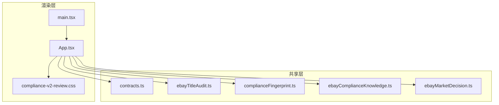
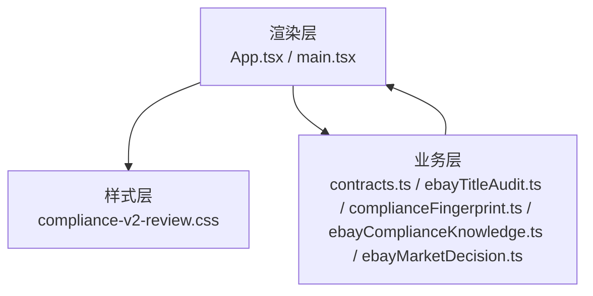
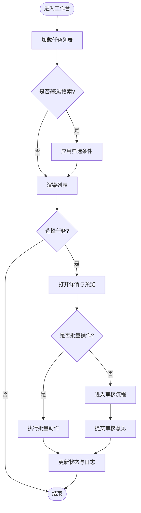
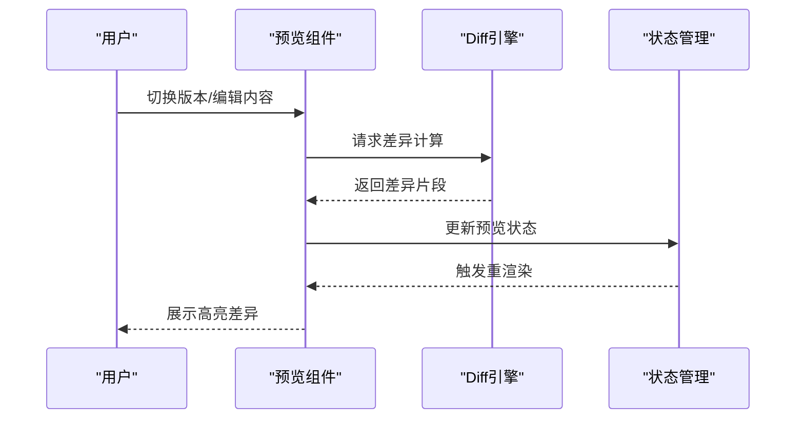
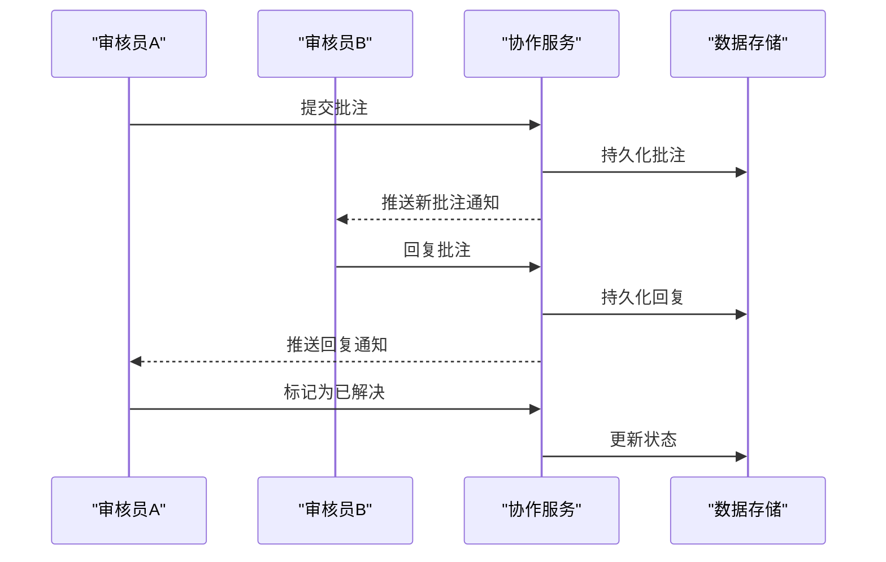
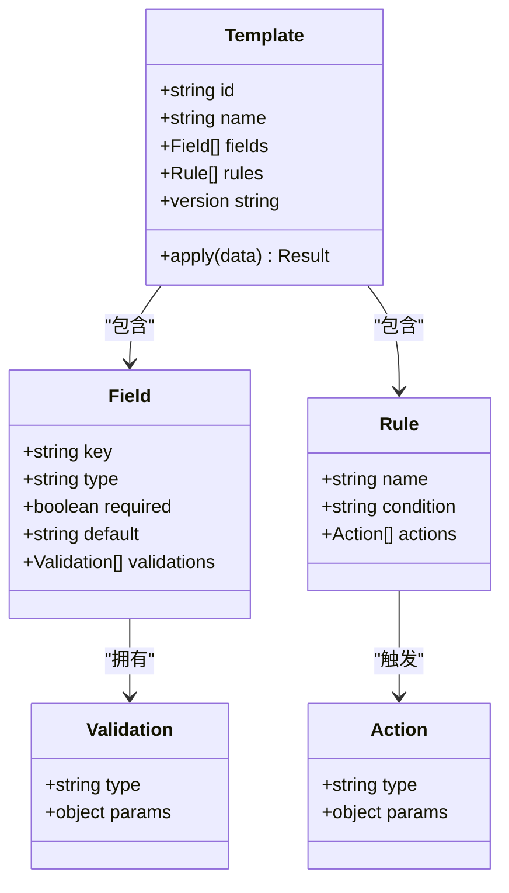
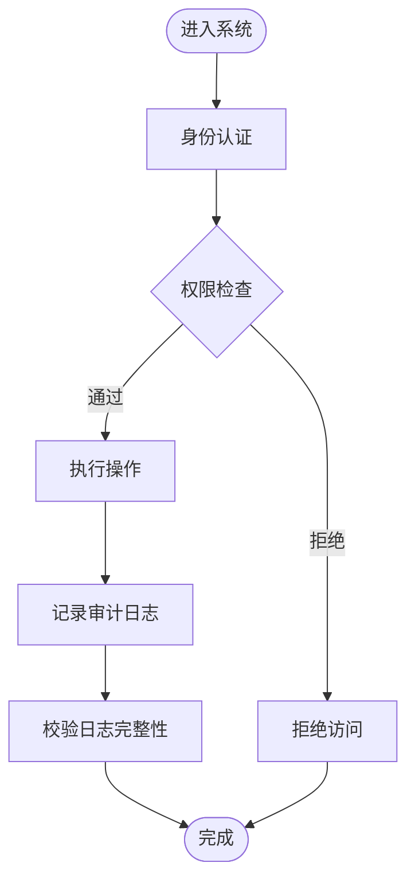
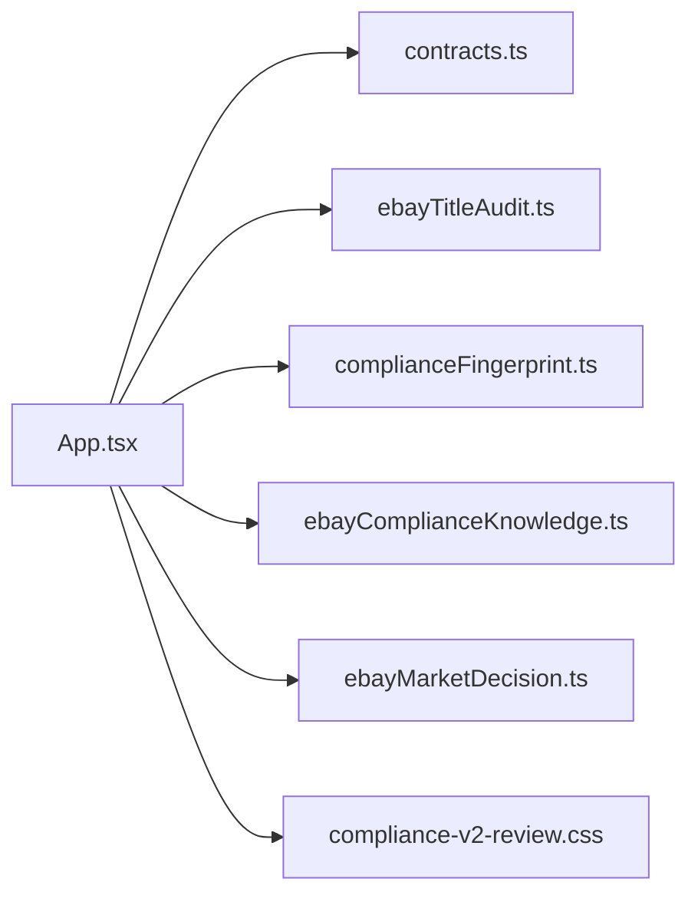

# V2审核面板

<cite>
**本文引用的文件**   
- [compliance-v2-review.css](file://src/renderer/compliance-v2-review.css)
- [App.tsx](file://src/renderer/App.tsx)
- [main.tsx](file://src/renderer/main.tsx)
- [contracts.ts](file://src/shared/contracts.ts)
- [ebayTitleAudit.ts](file://src/shared/ebayTitleAudit.ts)
- [complianceFingerprint.ts](file://src/shared/complianceFingerprint.ts)
- [ebayComplianceKnowledge.ts](file://src/shared/ebayComplianceKnowledge.ts)
- [ebayMarketDecision.ts](file://src/shared/ebayMarketDecision.ts)
</cite>

## 目录
1. [简介](#简介)
2. [项目结构](#项目结构)
3. [核心组件](#核心组件)
4. [架构总览](#架构总览)
5. [详细组件分析](#详细组件分析)
6. [依赖关系分析](#依赖关系分析)
7. [性能考量](#性能考量)
8. [故障排查指南](#故障排查指南)
9. [结论](#结论)
10. [附录](#附录)

## 简介
本文件面向V2审核面板，系统化阐述现代化审核界面设计、交互式审核工作流、实时预览对比与协作审核能力。文档覆盖审核状态管理、版本控制与历史记录、模板配置、批量操作接口、效率优化工具、用户权限管理、审核日志记录与审计追踪等关键主题，帮助读者快速理解并高效使用或扩展该功能模块。

## 项目结构
V2审核面板位于渲染层（renderer）与共享逻辑（shared）之间：
- 渲染层负责UI呈现、交互流程、实时预览与对比、协作会话展示。
- 共享层提供数据契约、合规知识、标题审核与市场决策等通用能力。
- 样式文件定义V2审核面板的视觉规范与布局。

图表来源
- [App.tsx](file://src/renderer/App.tsx)
- [main.tsx](file://src/renderer/main.tsx)
- [compliance-v2-review.css](file://src/renderer/compliance-v2-review.css)
- [contracts.ts](file://src/shared/contracts.ts)
- [ebayTitleAudit.ts](file://src/shared/ebayTitleAudit.ts)
- [complianceFingerprint.ts](file://src/shared/complianceFingerprint.ts)
- [ebayComplianceKnowledge.ts](file://src/shared/ebayComplianceKnowledge.ts)
- [ebayMarketDecision.ts](file://src/shared/ebayMarketDecision.ts)

章节来源
- [compliance-v2-review.css](file://src/renderer/compliance-v2-review.css)
- [App.tsx](file://src/renderer/App.tsx)
- [main.tsx](file://src/renderer/main.tsx)
- [contracts.ts](file://src/shared/contracts.ts)
- [ebayTitleAudit.ts](file://src/shared/ebayTitleAudit.ts)
- [complianceFingerprint.ts](file://src/shared/complianceFingerprint.ts)
- [ebayComplianceKnowledge.ts](file://src/shared/ebayComplianceKnowledge.ts)
- [ebayMarketDecision.ts](file://src/shared/ebayMarketDecision.ts)

## 核心组件
- 审核工作台（Review Workbench）
  - 职责：承载审核任务列表、筛选与排序、批量操作入口、进度与状态展示。
  - 交互：支持键盘快捷键、拖拽排序、批量勾选与一键处理。
- 实时预览对比（Live Preview & Diff）
  - 职责：左右分栏展示“原稿/修改稿”，高亮差异、标注变更原因、支持缩放与滚动同步。
  - 特性：增量更新、懒加载、防抖渲染。
- 协作审核（Collaborative Review）
  - 职责：多用户评论、@提及、指派与状态同步、在线光标与批注。
  - 机制：事件驱动的消息总线，乐观更新与冲突合并。
- 模板与规则（Templates & Rules）
  - 职责：审核模板配置、字段校验规则、评分阈值、自动建议生成。
  - 扩展：插件式规则引擎，支持自定义校验器与输出格式。
- 权限与审计（Permissions & Audit）
  - 职责：角色与权限矩阵、操作日志、审计追踪、敏感操作二次确认。
  - 存储：不可篡改日志、时间戳、签名校验。

章节来源
- [compliance-v2-review.css](file://src/renderer/compliance-v2-review.css)
- [App.tsx](file://src/renderer/App.tsx)
- [contracts.ts](file://src/shared/contracts.ts)
- [ebayTitleAudit.ts](file://src/shared/ebayTitleAudit.ts)
- [complianceFingerprint.ts](file://src/shared/complianceFingerprint.ts)
- [ebayComplianceKnowledge.ts](file://src/shared/ebayComplianceKnowledge.ts)
- [ebayMarketDecision.ts](file://src/shared/ebayMarketDecision.ts)

## 架构总览
V2审核面板采用分层架构：
- 表现层（Renderer）：React组件、样式与交互。
- 业务层（Shared）：数据契约、合规知识与市场决策、标题审核算法。
- 数据层（可选扩展）：本地持久化、远程服务集成（不在本次范围）。

图表来源
- [App.tsx](file://src/renderer/App.tsx)
- [main.tsx](file://src/renderer/main.tsx)
- [compliance-v2-review.css](file://src/renderer/compliance-v2-review.css)
- [contracts.ts](file://src/shared/contracts.ts)
- [ebayTitleAudit.ts](file://src/shared/ebayTitleAudit.ts)
- [complianceFingerprint.ts](file://src/shared/complianceFingerprint.ts)
- [ebayComplianceKnowledge.ts](file://src/shared/ebayComplianceKnowledge.ts)
- [ebayMarketDecision.ts](file://src/shared/ebayMarketDecision.ts)

## 详细组件分析

### 审核工作台（Review Workbench）
- 功能要点
  - 任务清单：分页、筛选、排序、搜索。
  - 批量操作：通过复选框选择多条记录，执行统一动作（如批量标记、批量导出、批量转交）。
  - 状态看板：按审核阶段（待审、审核中、已通过、已驳回）统计与跳转。
- 交互流程
  - 选择任务 → 打开详情 → 进入实时预览对比 → 提交审核意见 → 更新状态。
- 性能优化
  - 虚拟列表渲染长列表。
  - 防抖搜索与节流滚动。
  - 批量操作异步队列与重试。

章节来源
- [compliance-v2-review.css](file://src/renderer/compliance-v2-review.css)
- [App.tsx](file://src/renderer/App.tsx)

### 实时预览对比（Live Preview & Diff）
- 功能要点
  - 双栏对比：左侧原稿、右侧修改稿，差异高亮显示。
  - 变更溯源：每条差异附带原因说明、责任人、时间戳。
  - 视图控制：缩放、滚动同步、定位到变更点。
- 技术实现
  - 增量Diff计算，避免全量重绘。
  - 懒加载大文本与图片资源。
  - 撤销/重做栈支持。

章节来源
- [compliance-v2-review.css](file://src/renderer/compliance-v2-review.css)
- [App.tsx](file://src/renderer/App.tsx)

### 协作审核（Collaborative Review）
- 功能要点
  - 多人评论与批注：支持@提及、引用上下文、富文本。
  - 任务指派与流转：指定负责人、设置截止日期、状态同步。
  - 冲突解决：并发编辑时的合并策略与提示。
- 交互流程
  - 添加批注 → 通知相关人员 → 讨论与修订 → 达成一致 → 关闭批注。

章节来源
- [compliance-v2-review.css](file://src/renderer/compliance-v2-review.css)
- [App.tsx](file://src/renderer/App.tsx)

### 模板与规则（Templates & Rules）
- 功能要点
  - 模板配置：字段映射、必填项、默认值、校验规则。
  - 规则引擎：阈值判定、自动建议、风险提示。
  - 版本化：模板版本管理与回滚。
- 扩展性
  - 插件式规则注册，支持自定义校验函数与输出格式。

章节来源
- [contracts.ts](file://src/shared/contracts.ts)
- [ebayComplianceKnowledge.ts](file://src/shared/ebayComplianceKnowledge.ts)
- [ebayMarketDecision.ts](file://src/shared/ebayMarketDecision.ts)

### 权限与审计（Permissions & Audit）
- 功能要点
  - 角色与权限：基于角色的访问控制（RBAC），细粒度到字段级。
  - 操作日志：记录所有关键操作（创建、修改、删除、审批），不可篡改。
  - 审计追踪：关联用户、时间、IP、设备指纹，支持导出与查询。
- 安全实践
  - 敏感操作二次确认与审批流。
  - 日志签名与完整性校验。

章节来源
- [contracts.ts](file://src/shared/contracts.ts)
- [complianceFingerprint.ts](file://src/shared/complianceFingerprint.ts)

## 依赖关系分析
- 组件耦合
  - 渲染层依赖共享层的契约与算法，保持低耦合与高内聚。
  - 样式与组件分离，便于主题定制与响应式适配。
- 外部依赖
  - 可扩展接入远程服务（如翻译、图像合规检测、视频服务等），当前仓库未直接体现，预留接口位置。
- 潜在循环依赖
  - 通过契约与接口解耦，避免渲染层与共享层相互引用。

图表来源
- [App.tsx](file://src/renderer/App.tsx)
- [contracts.ts](file://src/shared/contracts.ts)
- [ebayTitleAudit.ts](file://src/shared/ebayTitleAudit.ts)
- [complianceFingerprint.ts](file://src/shared/complianceFingerprint.ts)
- [ebayComplianceKnowledge.ts](file://src/shared/ebayComplianceKnowledge.ts)
- [ebayMarketDecision.ts](file://src/shared/ebayMarketDecision.ts)
- [compliance-v2-review.css](file://src/renderer/compliance-v2-review.css)

章节来源
- [App.tsx](file://src/renderer/App.tsx)
- [contracts.ts](file://src/shared/contracts.ts)
- [ebayTitleAudit.ts](file://src/shared/ebayTitleAudit.ts)
- [complianceFingerprint.ts](file://src/shared/complianceFingerprint.ts)
- [ebayComplianceKnowledge.ts](file://src/shared/ebayComplianceKnowledge.ts)
- [ebayMarketDecision.ts](file://src/shared/ebayMarketDecision.ts)
- [compliance-v2-review.css](file://src/renderer/compliance-v2-review.css)

## 性能考量
- 渲染优化
  - 虚拟列表与分页加载，减少DOM节点数量。
  - 防抖与节流，降低高频事件带来的重排重绘。
  - 懒加载与按需加载，提升首屏速度。
- 数据处理
  - 增量Diff与局部更新，避免全量计算。
  - 批量操作队列化，避免阻塞主线程。
- 内存管理
  - 及时释放大对象与监听器，防止内存泄漏。
  - 图片与媒体资源压缩与缓存策略。

[本节为通用指导，不直接分析具体文件]

## 故障排查指南
- 常见问题
  - 预览不同步：检查Diff引擎输入一致性、版本号是否正确。
  - 协作消息丢失：确认消息总线连接状态、重试机制是否生效。
  - 权限不足：核对RBAC配置与用户角色映射。
  - 日志缺失：检查审计写入路径与权限、磁盘空间。
- 诊断步骤
  - 启用调试模式，查看控制台错误与网络请求。
  - 导出审计日志，进行时间线回溯。
  - 隔离问题组件，逐步验证依赖链。

章节来源
- [compliance-v2-review.css](file://src/renderer/compliance-v2-review.css)
- [App.tsx](file://src/renderer/App.tsx)

## 结论
V2审核面板以现代化UI与高效交互为核心，结合实时预览对比、协作审核、模板规则与权限审计，形成完整的审核闭环。通过分层架构与可扩展设计，既能满足当前需求，也为未来集成更多AI与服务能力预留空间。建议在实施中重点关注性能优化、数据安全与用户体验，确保审核流程顺畅、可追溯、可审计。

[本节为总结性内容，不直接分析具体文件]

## 附录
- 术语表
  - 审核工作台：集中处理审核任务的界面与工具集。
  - 实时预览对比：对原稿与修改稿进行差异可视化展示。
  - 协作审核：多用户共同参与审核、批注与决策的过程。
  - 模板与规则：用于标准化审核流程与自动校验的配置集合。
  - 权限与审计：基于角色的访问控制与操作日志记录体系。

[本节为概念性内容，不直接分析具体文件]