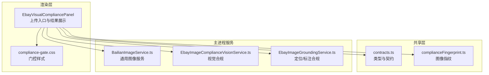
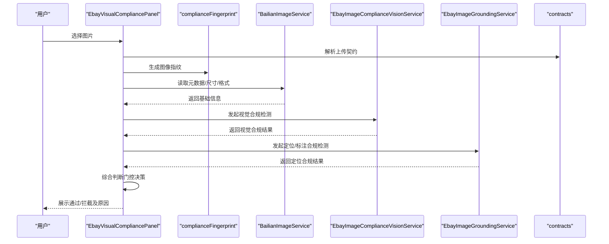
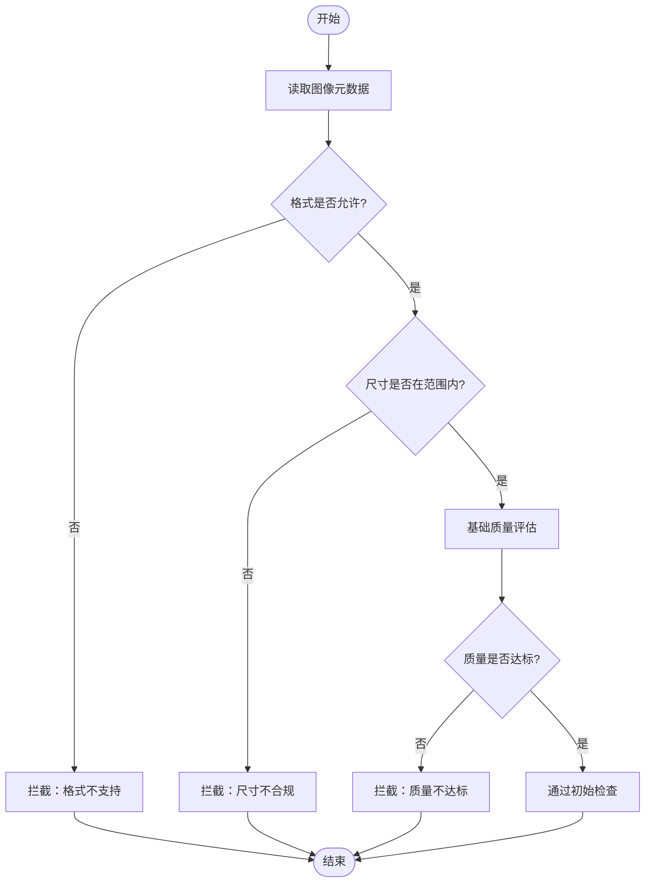
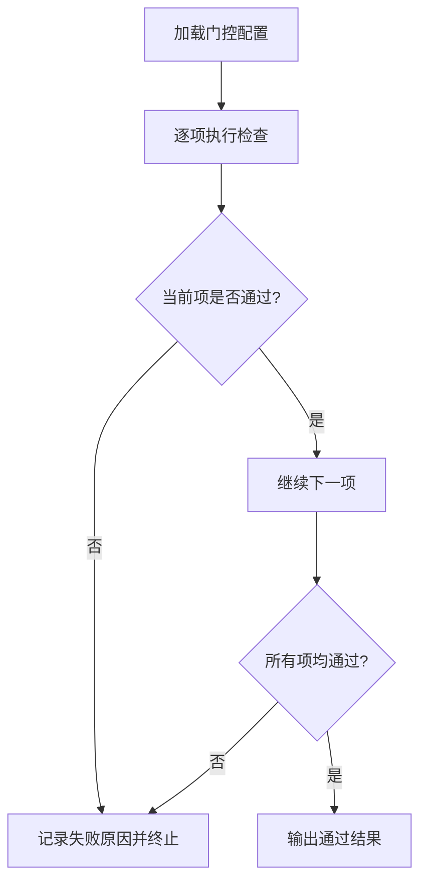
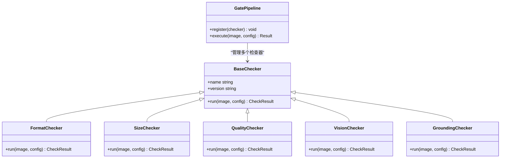
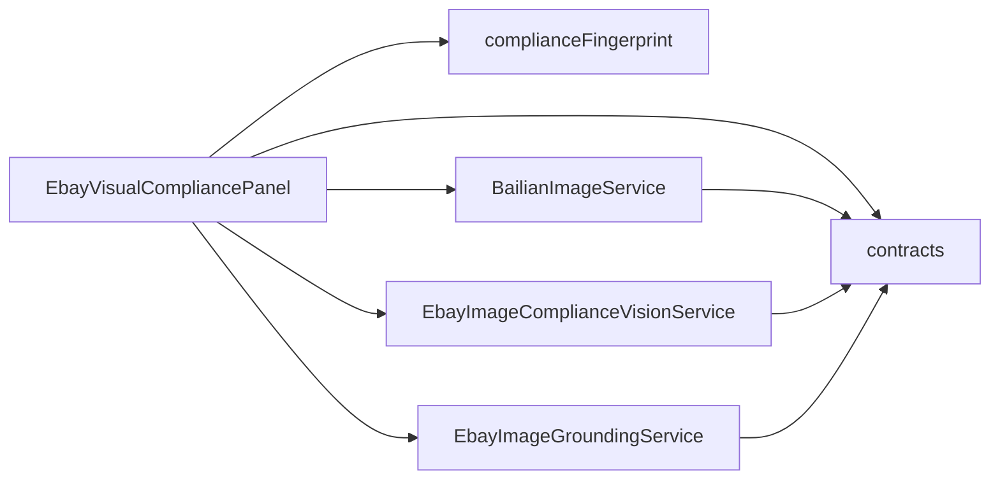

# 合规检查门控

<cite>
**本文引用的文件**   
- [src/renderer/VisualCompliancePanel.tsx](file://src/renderer/EbayVisualCompliancePanel.tsx)
- [src/shared/complianceFingerprint.ts](file://src/shared/complianceFingerprint.ts)
- [src/shared/contracts.ts](file://src/shared/contracts.ts)
- [src/main/services/BailianImageService.ts](file://src/main/services/BailianImageService.ts)
- [src/main/services/EbayImageComplianceVisionService.ts](file://src/main/services/EbayImageComplianceVisionService.ts)
- [src/main/services/EbayImageGroundingService.ts](file://src/main/services/EbayImageGroundingService.ts)
- [src/renderer/compliance-gate.css](file://src/renderer/compliance-gate.css)
</cite>

## 目录
1. [简介](#简介)
2. [项目结构](#项目结构)
3. [核心组件](#核心组件)
4. [架构总览](#架构总览)
5. [详细组件分析](#详细组件分析)
6. [依赖关系分析](#依赖关系分析)
7. [性能考量](#性能考量)
8. [故障排查指南](#故障排查指南)
9. [结论](#结论)
10. [附录](#附录)

## 简介
本文件面向“图片上传时的初始合规检查门控”能力，系统性说明：
- 初始检查机制：文件格式验证、尺寸检查与基础质量评估
- 门控规则配置方式、检查流程与拦截逻辑
- 自定义检查规则的扩展方法与错误处理策略
- 实际使用示例与常见问题解决方案

该功能贯穿前端渲染层（UI 与交互）、共享契约与指纹模块、以及主进程服务（AI 视觉与平台合规校验），确保在图片进入后续处理或发布前完成必要的质量与合规把关。

## 项目结构
围绕合规检查门控的相关代码主要分布在以下位置：
- 渲染层 UI 面板：负责触发上传、展示检查结果与拦截提示
- 共享契约与指纹：定义输入输出结构与图像指纹计算
- 主进程服务：封装 AI 视觉与 eBay 平台合规校验的调用
- 样式资源：用于门控结果与拦截状态的可视化呈现

图表来源
- [src/renderer/EbayVisualCompliancePanel.tsx](file://src/renderer/EbayVisualCompliancePanel.tsx)
- [src/shared/contracts.ts](file://src/shared/contracts.ts)
- [src/shared/complianceFingerprint.ts](file://src/shared/complianceFingerprint.ts)
- [src/main/services/BailianImageService.ts](file://src/main/services/BailianImageService.ts)
- [src/main/services/EbayImageComplianceVisionService.ts](file://src/main/services/EbayImageComplianceVisionService.ts)
- [src/main/services/EbayImageGroundingService.ts](file://src/main/services/EbayImageGroundingService.ts)
- [src/renderer/compliance-gate.css](file://src/renderer/compliance-gate.css)

章节来源
- [src/renderer/EbayVisualCompliancePanel.tsx](file://src/renderer/EbayVisualCompliancePanel.tsx)
- [src/shared/contracts.ts](file://src/shared/contracts.ts)
- [src/shared/complianceFingerprint.ts](file://src/shared/complianceFingerprint.ts)
- [src/main/services/BailianImageService.ts](file://src/main/services/BailianImageService.ts)
- [src/main/services/EbayImageComplianceVisionService.ts](file://src/main/services/EbayImageComplianceVisionService.ts)
- [src/main/services/EbayImageGroundingService.ts](file://src/main/services/EbayImageGroundingService.ts)
- [src/renderer/compliance-gate.css](file://src/renderer/compliance-gate.css)

## 核心组件
- 渲染层面板（EbayVisualCompliancePanel）
  - 职责：承载图片选择与上传入口；聚合并展示初始检查与门控结果；根据门控状态禁用后续操作
  - 关键点：在上传前执行格式与尺寸校验；失败时即时阻断并给出可理解提示
- 共享契约（contracts）
  - 职责：统一定义上传请求、检查结果、门控决策等数据结构，保证前后端一致
- 图像指纹（complianceFingerprint）
  - 职责：生成图像指纹，用于去重、溯源与一致性校验
- 主进程服务
  - BailianImageService：通用图像服务封装（如转码、压缩、元数据读取）
  - EbayImageComplianceVisionService：基于视觉模型的合规判定（如水印、Logo、敏感元素）
  - EbayImageGroundingService：基于定位/标注的合规校验（如主体占比、留白比例）

章节来源
- [src/renderer/EbayVisualCompliancePanel.tsx](file://src/renderer/EbayVisualCompliancePanel.tsx)
- [src/shared/contracts.ts](file://src/shared/contracts.ts)
- [src/shared/complianceFingerprint.ts](file://src/shared/complianceFingerprint.ts)
- [src/main/services/BailianImageService.ts](file://src/main/services/BailianImageService.ts)
- [src/main/services/EbayImageComplianceVisionService.ts](file://src/main/services/EbayImageComplianceVisionService.ts)
- [src/main/services/EbayImageGroundingService.ts](file://src/main/services/EbayImageGroundingService.ts)

## 架构总览
下图展示了图片从选择到门控决策的关键调用链路与数据流向。

图表来源
- [src/renderer/EbayVisualCompliancePanel.tsx](file://src/renderer/EbayVisualCompliancePanel.tsx)
- [src/shared/contracts.ts](file://src/shared/contracts.ts)
- [src/shared/complianceFingerprint.ts](file://src/shared/complianceFingerprint.ts)
- [src/main/services/BailianImageService.ts](file://src/main/services/BailianImageService.ts)
- [src/main/services/EbayImageComplianceVisionService.ts](file://src/main/services/EbayImageComplianceVisionService.ts)
- [src/main/services/EbayImageGroundingService.ts](file://src/main/services/EbayImageGroundingService.ts)

## 详细组件分析

### 初始检查机制（格式、尺寸、基础质量）
- 文件格式验证
  - 依据上传契约中允许的 MIME 类型与后缀白名单进行校验
  - 对非允许类型直接拦截并提示更换格式
- 尺寸检查
  - 读取图像宽高与像素密度，校验是否满足最小/最大边长与分辨率要求
  - 超出阈值时提示裁剪或重新拍摄
- 基础质量评估
  - 结合图像指纹与元数据进行初步质量判断（如过曝、模糊、低对比度等启发式指标）
  - 质量不达标时给出改进建议并阻止进入下一步

图表来源
- [src/renderer/EbayVisualCompliancePanel.tsx](file://src/renderer/EbayVisualCompliancePanel.tsx)
- [src/main/services/BailianImageService.ts](file://src/main/services/BailianImageService.ts)
- [src/shared/contracts.ts](file://src/shared/contracts.ts)

章节来源
- [src/renderer/EbayVisualCompliancePanel.tsx](file://src/renderer/EbayVisualCompliancePanel.tsx)
- [src/main/services/BailianImageService.ts](file://src/main/services/BailianImageService.ts)
- [src/shared/contracts.ts](file://src/shared/contracts.ts)

### 门控规则配置与拦截逻辑
- 配置项要点
  - 允许的文件格式集合
  - 尺寸上下限（宽/高/像素密度）
  - 质量阈值（模糊、噪声、曝光等指标的权重与阈值）
  - 视觉与定位合规的开关与阈值
- 拦截优先级
  - 格式 > 尺寸 > 质量 > 视觉合规 > 定位合规
  - 任一环节不通过即中断流程并返回具体原因
- 决策输出
  - 统一以契约中的“门控结果”结构返回，包含通过与否、各子项得分与失败原因

图表来源
- [src/renderer/EbayVisualCompliancePanel.tsx](file://src/renderer/EbayVisualCompliancePanel.tsx)
- [src/shared/contracts.ts](file://src/shared/contracts.ts)

章节来源
- [src/renderer/EbayVisualCompliancePanel.tsx](file://src/renderer/EbayVisualCompliancePanel.tsx)
- [src/shared/contracts.ts](file://src/shared/contracts.ts)

### 自定义检查规则的扩展方法
- 扩展点设计
  - 在面板侧提供“插件式”检查器接口，按顺序注册多个检查器
  - 每个检查器实现统一的输入/输出契约，便于组合与替换
- 实现建议
  - 新增检查器时仅关注单一维度（如色彩空间、EXIF 完整性、版权水印强度）
  - 将阈值与权重外置为配置项，避免硬编码
  - 通过契约统一上报“通过/警告/拒绝”三级结果

图表来源
- [src/renderer/EbayVisualCompliancePanel.tsx](file://src/renderer/EbayVisualCompliancePanel.tsx)
- [src/shared/contracts.ts](file://src/shared/contracts.ts)

章节来源
- [src/renderer/EbayVisualCompliancePanel.tsx](file://src/renderer/EbayVisualCompliancePanel.tsx)
- [src/shared/contracts.ts](file://src/shared/contracts.ts)

### 错误处理策略
- 分类与处理
  - 输入错误（空图、损坏文件）：立即拦截并提示重新选择
  - 网络/服务异常（AI 服务超时、不可用）：降级为本地快速检查，保留重试与回退路径
  - 业务规则冲突（多规则同时拒绝）：汇总所有失败原因，优先展示关键问题
- 用户体验
  - 明确区分“可修复”与“不可修复”的错误
  - 提供一键修复建议（如自动裁剪、压缩、重拍指引）

章节来源
- [src/renderer/EbayVisualCompliancePanel.tsx](file://src/renderer/EbayVisualCompliancePanel.tsx)
- [src/main/services/BailianImageService.ts](file://src/main/services/BailianImageService.ts)
- [src/main/services/EbayImageComplianceVisionService.ts](file://src/main/services/EbayImageComplianceVisionService.ts)
- [src/main/services/EbayImageGroundingService.ts](file://src/main/services/EbayImageGroundingService.ts)

## 依赖关系分析
- 耦合与内聚
  - 渲染层仅依赖契约与指纹模块，保持 UI 与业务解耦
  - 主进程服务之间职责清晰：通用图像处理、视觉合规、定位合规各司其职
- 外部依赖
  - 视觉模型与定位模型通过主进程服务抽象，便于替换供应商或升级版本
- 潜在循环依赖
  - 通过契约与接口隔离，避免渲染层与服务层直接互相引用

图表来源
- [src/renderer/EbayVisualCompliancePanel.tsx](file://src/renderer/EbayVisualCompliancePanel.tsx)
- [src/shared/contracts.ts](file://src/shared/contracts.ts)
- [src/shared/complianceFingerprint.ts](file://src/shared/complianceFingerprint.ts)
- [src/main/services/BailianImageService.ts](file://src/main/services/BailianImageService.ts)
- [src/main/services/EbayImageComplianceVisionService.ts](file://src/main/services/EbayImageComplianceVisionService.ts)
- [src/main/services/EbayImageGroundingService.ts](file://src/main/services/EbayImageGroundingService.ts)

章节来源
- [src/renderer/EbayVisualCompliancePanel.tsx](file://src/renderer/EbayVisualCompliancePanel.tsx)
- [src/shared/contracts.ts](file://src/shared/contracts.ts)
- [src/shared/complianceFingerprint.ts](file://src/shared/complianceFingerprint.ts)
- [src/main/services/BailianImageService.ts](file://src/main/services/BailianImageService.ts)
- [src/main/services/EbayImageComplianceVisionService.ts](file://src/main/services/EbayImageComplianceVisionService.ts)
- [src/main/services/EbayImageGroundingService.ts](file://src/main/services/EbayImageGroundingService.ts)

## 性能考量
- 前端快速校验优先：格式与尺寸在前端即时判断，减少不必要的后端调用
- 并发与降级：视觉与定位检查可并行执行；任一失败不影响其他分支，最终合并结果
- 缓存与复用：图像指纹可用于重复上传的快速比对，避免重复计算
- 资源控制：限制单次处理的图像大小与分辨率，防止内存峰值过高

[本节为通用指导，无需特定文件来源]

## 故障排查指南
- 常见现象
  - 上传后立即被拦截：检查格式与尺寸配置是否正确
  - 视觉/定位检查不稳定：确认服务可用性、网络状况与超时设置
  - 结果不一致：核对指纹生成与质量评估参数是否稳定
- 定位步骤
  - 查看门控结果明细，定位首个失败的检查项
  - 启用调试日志，观察各检查器的输入输出
  - 临时关闭非关键检查项，逐步缩小问题范围
- 恢复策略
  - 调整阈值与权重，平衡通过率与合规性
  - 增加重试与降级路径，提升鲁棒性

章节来源
- [src/renderer/EbayVisualCompliancePanel.tsx](file://src/renderer/EbayVisualCompliancePanel.tsx)
- [src/main/services/BailianImageService.ts](file://src/main/services/BailianImageService.ts)
- [src/main/services/EbayImageComplianceVisionService.ts](file://src/main/services/EbayImageComplianceVisionService.ts)
- [src/main/services/EbayImageGroundingService.ts](file://src/main/services/EbayImageGroundingService.ts)

## 结论
合规检查门控通过“前端快速校验 + 主进程深度检查”的分层策略，在保证用户体验的同时，有效把控图片质量与平台合规。借助契约化设计与插件式检查器，系统具备良好的可扩展性与可维护性。建议持续优化阈值与算法，完善错误提示与降级策略，以提升整体通过率与稳定性。

[本节为总结性内容，无需特定文件来源]

## 附录
- 使用示例（端到端流程）
  - 用户在面板中选择图片
  - 系统执行格式与尺寸校验，失败则提示并阻止继续
  - 通过后生成指纹并调用视觉与定位服务
  - 综合各项结果输出门控决策，展示通过或拦截原因
- 最佳实践
  - 将易变参数（阈值、权重）外置为配置
  - 为每个检查器编写单元测试与回归用例
  - 对关键路径添加监控与告警

[本节为概念性内容，无需特定文件来源]