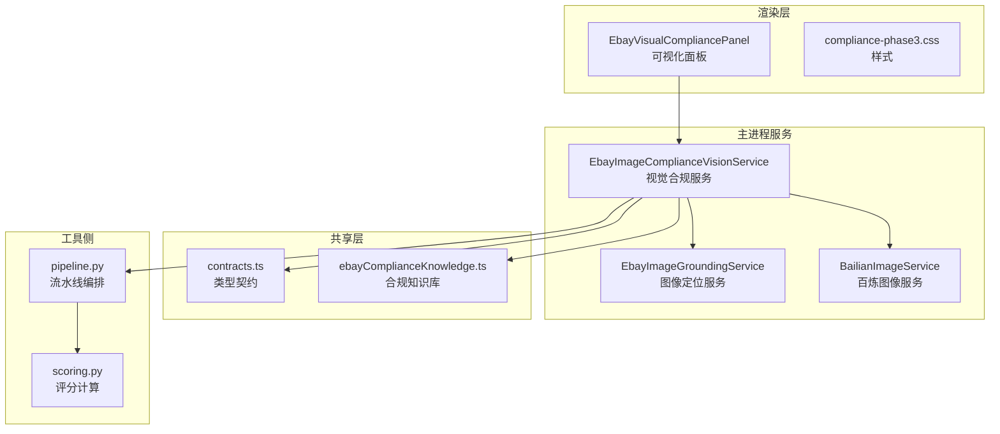
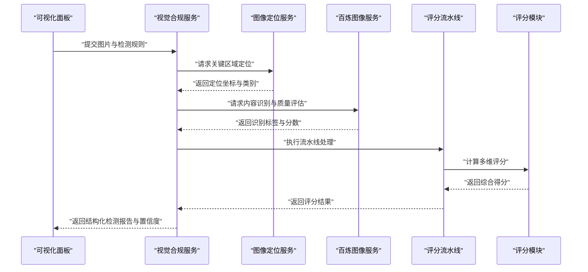
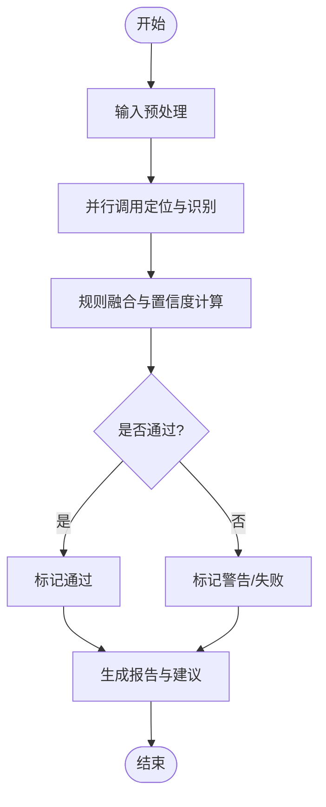
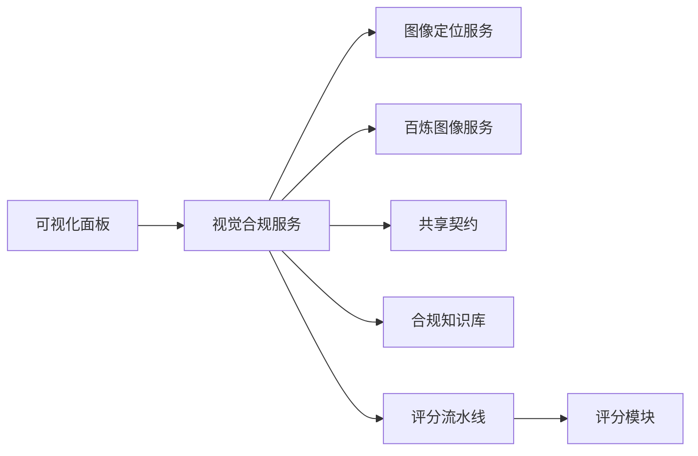

# 第三阶段合规检测

<cite>
**本文引用的文件**   
- [EbayImageComplianceVisionService.ts](file://src/main/services/EbayImageComplianceVisionService.ts)
- [EbayImageGroundingService.ts](file://src/main/services/EbayImageGroundingService.ts)
- [BailianImageService.ts](file://src/main/services/BailianImageService.ts)
- [EbayVisualCompliancePanel.tsx](file://src/renderer/EbayVisualCompliancePanel.tsx)
- [compliance-phase3.css](file://src/renderer/compliance-phase3.css)
- [contracts.ts](file://src/shared/contracts.ts)
- [ebayComplianceKnowledge.ts](file://src/shared/ebayComplianceKnowledge.ts)
- [tools/realshift/scoring.py](file://tools/realshift/scoring.py)
- [tools/realshift/pipeline.py](file://tools/realshift/pipeline.py)
</cite>

## 目录
1. [简介](#简介)
2. [项目结构](#项目结构)
3. [核心组件](#核心组件)
4. [架构总览](#架构总览)
5. [详细组件分析](#详细组件分析)
6. [依赖关系分析](#依赖关系分析)
7. [性能考虑](#性能考虑)
8. [故障排查指南](#故障排查指南)
9. [结论](#结论)
10. [附录](#附录)

## 简介
本文件聚焦“第三阶段合规检测”的高级图片分析能力，涵盖内容识别、品牌元素检测与视觉质量评分。文档从系统架构、数据流、算法实现到结果解释与修复建议进行系统化说明，并提供批量处理配置、性能优化与自定义检测规则的实现指南，帮助开发者快速落地并扩展该能力。

## 项目结构
围绕第三阶段合规检测的关键代码分布在以下位置：
- 主进程服务层：图片合规视觉服务、 grounding（定位）服务、百炼图像服务
- 渲染层面板：可视化合规检查面板与样式
- 共享契约与知识：数据结构定义、平台合规知识库
- 工具侧评分与流水线：Python 侧的评分与流水线编排

图表来源 
- [EbayImageComplianceVisionService.ts](file://src/main/services/EbayImageComplianceVisionService.ts)
- [EbayImageGroundingService.ts](file://src/main/services/EbayImageGroundingService.ts)
- [BailianImageService.ts](file://src/main/services/BailianImageService.ts)
- [EbayVisualCompliancePanel.tsx](file://src/renderer/EbayVisualCompliancePanel.tsx)
- [compliance-phase3.css](file://src/renderer/compliance-phase3.css)
- [contracts.ts](file://src/shared/contracts.ts)
- [ebayComplianceKnowledge.ts](file://src/shared/ebayComplianceKnowledge.ts)
- [tools/realshift/pipeline.py](file://tools/realshift/pipeline.py)
- [tools/realshift/scoring.py](file://tools/realshift/scoring.py)

章节来源
- [EbayImageComplianceVisionService.ts](file://src/main/services/EbayImageComplianceVisionService.ts)
- [EbayImageGroundingService.ts](file://src/main/services/EbayImageGroundingService.ts)
- [BailianImageService.ts](file://src/main/services/BailianImageService.ts)
- [EbayVisualCompliancePanel.tsx](file://src/renderer/EbayVisualCompliancePanel.tsx)
- [compliance-phase3.css](file://src/renderer/compliance-phase3.css)
- [contracts.ts](file://src/shared/contracts.ts)
- [ebayComplianceKnowledge.ts](file://src/shared/ebayComplianceKnowledge.ts)
- [tools/realshift/pipeline.py](file://tools/realshift/pipeline.py)
- [tools/realshift/scoring.py](file://tools/realshift/scoring.py)

## 核心组件
- 视觉合规服务：负责调用视觉模型与 grounding 服务，聚合检测结果，生成结构化报告与置信度。
- 图像定位服务：提供品牌元素、文本区域等关键区域的定位信息，辅助后续判定与修复建议。
- 百炼图像服务：封装外部 AI 图像能力（如内容识别、OCR、质量评估），作为统一接入点。
- 可视化面板：将检测结果以交互方式呈现，支持问题定位、详情展开与一键修复建议。
- 共享契约与知识库：定义输入输出类型、检测项分类、阈值与规则集，保证前后端一致性。
- 工具侧评分与流水线：对图像进行多维度评分与流水线化处理，支撑批量分析与性能优化。

章节来源
- [EbayImageComplianceVisionService.ts](file://src/main/services/EbayImageComplianceVisionService.ts)
- [EbayImageGroundingService.ts](file://src/main/services/EbayImageGroundingService.ts)
- [BailianImageService.ts](file://src/main/services/BailianImageService.ts)
- [EbayVisualCompliancePanel.tsx](file://src/renderer/EbayVisualCompliancePanel.tsx)
- [contracts.ts](file://src/shared/contracts.ts)
- [ebayComplianceKnowledge.ts](file://src/shared/ebayComplianceKnowledge.ts)
- [tools/realshift/pipeline.py](file://tools/realshift/pipeline.py)
- [tools/realshift/scoring.py](file://tools/realshift/scoring.py)

## 架构总览
第三阶段合规检测采用“前端面板 + 主进程服务 + 外部 AI + 工具侧评分”的分层架构。前端触发检测任务，主进程协调视觉与 grounding 服务，调用百炼图像能力获取内容识别与质量评分，结合知识库与规则进行判定，最终输出带置信度的结构化结果，并在面板中可视化展示。

图表来源 
- [EbayVisualCompliancePanel.tsx](file://src/renderer/EbayVisualCompliancePanel.tsx)
- [EbayImageComplianceVisionService.ts](file://src/main/services/EbayImageComplianceVisionService.ts)
- [EbayImageGroundingService.ts](file://src/main/services/EbayImageGroundingService.ts)
- [BailianImageService.ts](file://src/main/services/BailianImageService.ts)
- [tools/realshift/pipeline.py](file://tools/realshift/pipeline.py)
- [tools/realshift/scoring.py](file://tools/realshift/scoring.py)

## 详细组件分析

### 视觉合规服务（高级图片分析）
- 功能要点
  - 整合内容识别、品牌元素检测与视觉质量评分
  - 基于多源信号（定位、识别标签、质量分数）计算置信度
  - 输出结构化报告，包含问题分类、严重等级与修复建议
- 算法与流程
  - 输入预处理：尺寸归一化、格式校验、元数据提取
  - 多模型并行：调用 grounding 与百炼图像服务
  - 规则融合：依据知识库与阈值进行判定
  - 置信度计算：加权融合各子项得分，输出总体置信度
  - 结果分类：按平台规则归类为通过/警告/失败
- 错误处理
  - 网络异常重试与降级策略
  - 模型返回异常的结构化捕获与日志记录
  - 超时控制与资源释放

图表来源 
- [EbayImageComplianceVisionService.ts](file://src/main/services/EbayImageComplianceVisionService.ts)
- [EbayImageGroundingService.ts](file://src/main/services/EbayImageGroundingService.ts)
- [BailianImageService.ts](file://src/main/services/BailianImageService.ts)
- [ebayComplianceKnowledge.ts](file://src/shared/ebayComplianceKnowledge.ts)

章节来源
- [EbayImageComplianceVisionService.ts](file://src/main/services/EbayImageComplianceVisionService.ts)
- [EbayImageGroundingService.ts](file://src/main/services/EbayImageGroundingService.ts)
- [BailianImageService.ts](file://src/main/services/BailianImageService.ts)
- [ebayComplianceKnowledge.ts](file://src/shared/ebayComplianceKnowledge.ts)

### 图像定位服务（品牌元素检测）
- 功能要点
  - 检测品牌 Logo、水印、促销标签等关键区域
  - 输出边界框坐标与类别标签，供后续判定使用
- 算法要点
  - 目标检测模型与模板匹配结合
  - 非极大值抑制与区域合并
  - 置信度阈值过滤与后处理
- 集成点
  - 与视觉合规服务协作，提供定位结果
  - 与知识库联动，映射类别到平台规则

章节来源
- [EbayImageGroundingService.ts](file://src/main/services/EbayImageGroundingService.ts)
- [ebayComplianceKnowledge.ts](file://src/shared/ebayComplianceKnowledge.ts)

### 百炼图像服务（AI 驱动的内容识别与质量评估）
- 功能要点
  - 统一封装外部 AI 图像能力（内容识别、OCR、质量评分）
  - 参数配置与重试机制
  - 响应解析与标准化输出
- 算法要点
  - 多模态识别融合
  - 质量指标：清晰度、对比度、色彩均衡、噪声水平
  - 置信度校准与阈值策略
- 集成点
  - 被视觉合规服务调用，提供识别与质量信号

章节来源
- [BailianImageService.ts](file://src/main/services/BailianImageService.ts)
- [contracts.ts](file://src/shared/contracts.ts)

### 可视化面板（检测结果解释与修复建议）
- 功能要点
  - 展示检测结果、置信度与问题分类
  - 高亮定位区域，支持详情展开
  - 提供一键修复建议与批量操作入口
- 交互流程
  - 用户选择图片与规则
  - 触发检测并加载结果
  - 展示问题列表与修复建议
  - 支持导出报告与批量处理

章节来源
- [EbayVisualCompliancePanel.tsx](file://src/renderer/EbayVisualCompliancePanel.tsx)
- [compliance-phase3.css](file://src/renderer/compliance-phase3.css)

### 共享契约与知识库（类型与规则）
- 契约定义
  - 输入输出数据结构、字段含义与约束
  - 检测项枚举与严重等级
- 知识库
  - 平台合规规则、阈值与示例
  - 品牌白名单与黑名单映射
  - 修复建议模板

章节来源
- [contracts.ts](file://src/shared/contracts.ts)
- [ebayComplianceKnowledge.ts](file://src/shared/ebayComplianceKnowledge.ts)

### 工具侧评分与流水线（批量处理与性能优化）
- 流水线编排
  - 多步骤处理：预处理、识别、定位、评分、报告生成
  - 可插拔模块与并行执行
- 评分模块
  - 多维指标加权计算
  - 置信度校准与阈值决策
- 批量处理
  - 队列管理、并发控制、进度回调
  - 失败重试与断点续跑

章节来源
- [tools/realshift/pipeline.py](file://tools/realshift/pipeline.py)
- [tools/realshift/scoring.py](file://tools/realshift/scoring.py)

## 依赖关系分析
- 组件耦合
  - 视觉合规服务依赖定位服务与百炼图像服务
  - 面板依赖服务层接口与共享契约
  - 工具侧评分与流水线独立于前端，但与服务层输出对齐
- 外部依赖
  - 百炼图像 API
  - 第三方模型或 SDK（若存在）
- 潜在循环依赖
  - 通过契约解耦避免循环引用

图表来源 
- [EbayVisualCompliancePanel.tsx](file://src/renderer/EbayVisualCompliancePanel.tsx)
- [EbayImageComplianceVisionService.ts](file://src/main/services/EbayImageComplianceVisionService.ts)
- [EbayImageGroundingService.ts](file://src/main/services/EbayImageGroundingService.ts)
- [BailianImageService.ts](file://src/main/services/BailianImageService.ts)
- [contracts.ts](file://src/shared/contracts.ts)
- [ebayComplianceKnowledge.ts](file://src/shared/ebayComplianceKnowledge.ts)
- [tools/realshift/pipeline.py](file://tools/realshift/pipeline.py)
- [tools/realshift/scoring.py](file://tools/realshift/scoring.py)

章节来源
- [EbayImageComplianceVisionService.ts](file://src/main/services/EbayImageComplianceVisionService.ts)
- [EbayImageGroundingService.ts](file://src/main/services/EbayImageGroundingService.ts)
- [BailianImageService.ts](file://src/main/services/BailianImageService.ts)
- [EbayVisualCompliancePanel.tsx](file://src/renderer/EbayVisualCompliancePanel.tsx)
- [contracts.ts](file://src/shared/contracts.ts)
- [ebayComplianceKnowledge.ts](file://src/shared/ebayComplianceKnowledge.ts)
- [tools/realshift/pipeline.py](file://tools/realshift/pipeline.py)
- [tools/realshift/scoring.py](file://tools/realshift/scoring.py)

## 性能考虑
- 并行与异步
  - 定位与识别并行调用，减少端到端延迟
  - 面板异步加载与增量渲染
- 缓存与复用
  - 中间结果缓存（定位、识别标签）
  - 模型权重与配置预热
- 资源管理
  - 图片尺寸限制与压缩
  - 超时与取消机制
- 批处理优化
  - 队列并发度调优
  - 失败重试与断点续跑
- 监控与度量
  - 耗时统计与错误率上报
  - 关键指标看板

[本节为通用指导，不直接分析具体文件]

## 故障排查指南
- 常见问题
  - 外部 API 超时或限流：检查重试与降级策略
  - 模型返回异常：核对输入格式与字段约束
  - 定位不准确：调整阈值与后处理参数
  - 面板渲染卡顿：检查并发与数据量
- 诊断步骤
  - 查看服务日志与错误码
  - 复现实例与最小化输入
  - 逐步隔离依赖（定位、识别、评分）
- 修复建议
  - 更新规则与阈值
  - 增加重试与容错
  - 优化图片预处理与尺寸

章节来源
- [EbayImageComplianceVisionService.ts](file://src/main/services/EbayImageComplianceVisionService.ts)
- [EbayImageGroundingService.ts](file://src/main/services/EbayImageGroundingService.ts)
- [BailianImageService.ts](file://src/main/services/BailianImageService.ts)
- [EbayVisualCompliancePanel.tsx](file://src/renderer/EbayVisualCompliancePanel.tsx)

## 结论
第三阶段合规检测通过视觉合规服务、定位服务与百炼图像服务的协同，实现了内容识别、品牌元素检测与视觉质量评分的一体化能力。借助共享契约与知识库，系统具备可扩展的规则体系与清晰的置信度计算流程。配合工具侧的评分与流水线，可实现高效批量处理与性能优化。建议在生产环境完善监控与告警，持续迭代规则与阈值，确保合规检测的准确性与稳定性。

[本节为总结性内容，不直接分析具体文件]

## 附录
- 自定义检测规则实现指南
  - 在知识库中添加新规则与阈值
  - 在契约中扩展字段与枚举
  - 在服务层融合新信号与置信度权重
  - 在面板中展示新增检测项与建议
- 批量处理配置
  - 设置并发度与队列大小
  - 配置重试次数与超时时间
  - 启用进度回调与失败重试
- 性能优化清单
  - 图片预处理与压缩
  - 模型预热与缓存
  - 异步与并行策略
  - 监控与度量

[本节为补充信息，不直接分析具体文件]