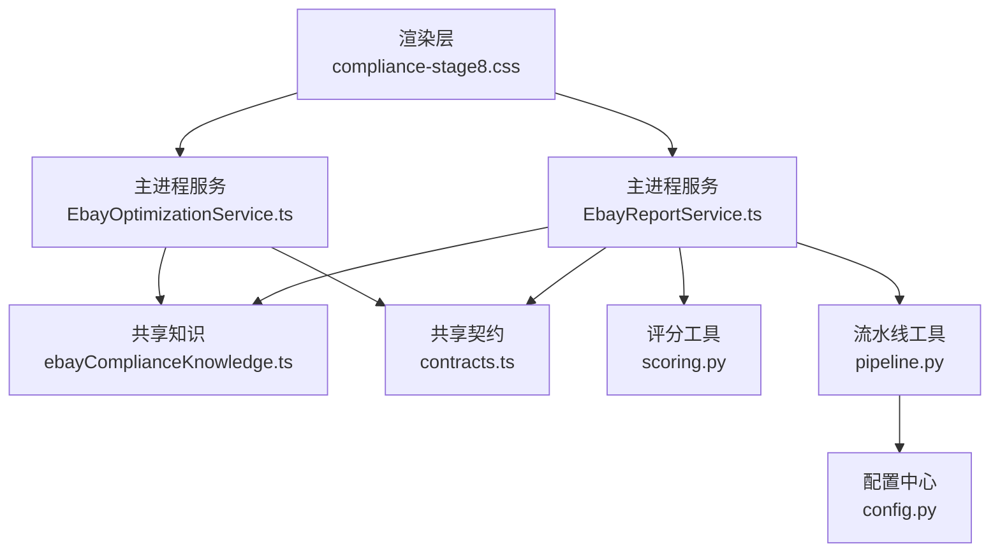
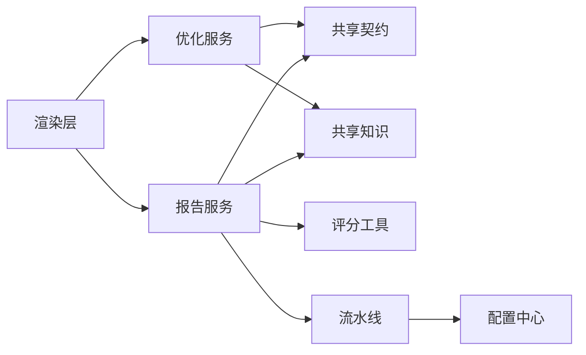

# 第八阶段合规审核

<cite>
**本文引用的文件**   
- [src/renderer/compliance-stage8.css](file://src/renderer/compliance-stage8.css)
- [src/main/services/EbayReportService.ts](file://src/main/services/EbayReportService.ts)
- [src/main/services/EbayOptimizationService.ts](file://src/main/services/EbayOptimizationService.ts)
- [src/shared/ebayComplianceKnowledge.ts](file://src/shared/ebayComplianceKnowledge.ts)
- [src/shared/contracts.ts](file://src/shared/contracts.ts)
- [tools/realshift/scoring.py](file://tools/realshift/scoring.py)
- [tools/realshift/pipeline.py](file://tools/realshift/pipeline.py)
- [tools/realshift/config.py](file://tools/realshift/config.py)
</cite>

## 目录
1. [引言](#引言)
2. [项目结构](#项目结构)
3. [核心组件](#核心组件)
4. [架构总览](#架构总览)
5. [详细组件分析](#详细组件分析)
6. [依赖关系分析](#依赖关系分析)
7. [性能考量](#性能考量)
8. [故障排查指南](#故障排查指南)
9. [结论](#结论)
10. [附录](#附录)

## 引言
本文件面向“第八阶段合规审核”的落地与使用，聚焦深度合规审查流程、多维度质量评估、违规风险预测与合规性打分系统。文档从系统架构、数据流、处理逻辑、集成点、错误处理与性能特征等维度展开，并提供可视化展示、报告生成与导出、流程定制、阈值配置与自动化审核设置等实践指导，帮助读者快速理解并高效使用该能力。

## 项目结构
围绕第八阶段合规审核，前端渲染层提供样式与界面支撑，主进程服务负责报告与优化编排，共享模块承载合规知识与契约定义，工具侧提供评分与流水线实现。整体采用前后端分离与服务化协作模式，便于扩展与自动化集成。



图表来源
- [src/renderer/compliance-stage8.css](file://src/renderer/compliance-stage8.css)
- [src/main/services/EbayReportService.ts](file://src/main/services/EbayReportService.ts)
- [src/main/services/EbayOptimizationService.ts](file://src/main/services/EbayOptimizationService.ts)
- [src/shared/ebayComplianceKnowledge.ts](file://src/shared/ebayComplianceKnowledge.ts)
- [src/shared/contracts.ts](file://src/shared/contracts.ts)
- [tools/realshift/scoring.py](file://tools/realshift/scoring.py)
- [tools/realshift/pipeline.py](file://tools/realshift/pipeline.py)
- [tools/realshift/config.py](file://tools/realshift/config.py)

章节来源
- [src/renderer/compliance-stage8.css](file://src/renderer/compliance-stage8.css)
- [src/main/services/EbayReportService.ts](file://src/main/services/EbayReportService.ts)
- [src/main/services/EbayOptimizationService.ts](file://src/main/services/EbayOptimizationService.ts)
- [src/shared/ebayComplianceKnowledge.ts](file://src/shared/ebayComplianceKnowledge.ts)
- [src/shared/contracts.ts](file://src/shared/contracts.ts)
- [tools/realshift/scoring.py](file://tools/realshift/scoring.py)
- [tools/realshift/pipeline.py](file://tools/realshift/pipeline.py)
- [tools/realshift/config.py](file://tools/realshift/config.py)

## 核心组件
- 渲染层（UI）：通过第八阶段样式文件提供审核结果可视化与交互入口，支持查看多维质量指标、风险预警与评分详情。
- 报告服务：负责汇总审核输入、调用评分与流水线、生成结构化报告与导出。
- 优化服务：基于合规知识与契约进行规则校验与优化建议生成，辅助提升合规通过率。
- 共享知识：沉淀平台合规要点、类目规则与常见违规模式，为评分与优化提供依据。
- 共享契约：统一数据结构与接口约定，确保前后端与服务间的数据一致性。
- 评分工具：实现多维度质量评估与合规性打分算法，输出分数与明细。
- 流水线工具：编排多步骤审核流程，支持可配置的阈值与策略。
- 配置中心：集中管理阈值、权重、策略开关与自动化参数。

章节来源
- [src/renderer/compliance-stage8.css](file://src/renderer/compliance-stage8.css)
- [src/main/services/EbayReportService.ts](file://src/main/services/EbayReportService.ts)
- [src/main/services/EbayOptimizationService.ts](file://src/main/services/EbayOptimizationService.ts)
- [src/shared/ebayComplianceKnowledge.ts](file://src/shared/ebayComplianceKnowledge.ts)
- [src/shared/contracts.ts](file://src/shared/contracts.ts)
- [tools/realshift/scoring.py](file://tools/realshift/scoring.py)
- [tools/realshift/pipeline.py](file://tools/realshift/pipeline.py)
- [tools/realshift/config.py](file://tools/realshift/config.py)

## 架构总览
第八阶段合规审核采用“前端驱动 + 主进程编排 + 工具评分”的分层架构。前端触发审核任务，主进程服务根据契约组装输入，调用共享知识进行规则匹配，再交由评分工具计算得分，最后由流水线整合结果并生成报告。配置中心贯穿全流程，提供阈值与策略控制。

```mermaid
sequenceDiagram
participant UI as "渲染层"
participant Report as "报告服务"
participant Opt as "优化服务"
participant Know as "共享知识"
participant Score as "评分工具"
participant Pipe as "流水线"
participant Conf as "配置中心"
UI->>Report : 发起审核请求
Report->>Conf : 读取阈值与策略
Report->>Know : 加载合规知识
Report->>Score : 提交多维评估输入
Score-->>Report : 返回分数与明细
Report->>Pipe : 执行流水线编排
Pipe-->>Report : 产出审核结果
Report->>Opt : 生成优化建议
Opt-->>Report : 返回建议清单
Report-->>UI : 输出可视化与报告
```

图表来源
- [src/main/services/EbayReportService.ts](file://src/main/services/EbayReportService.ts)
- [src/main/services/EbayOptimizationService.ts](file://src/main/services/EbayOptimizationService.ts)
- [src/shared/ebayComplianceKnowledge.ts](file://src/shared/ebayComplianceKnowledge.ts)
- [src/shared/contracts.ts](file://src/shared/contracts.ts)
- [tools/realshift/scoring.py](file://tools/realshift/scoring.py)
- [tools/realshift/pipeline.py](file://tools/realshift/pipeline.py)
- [tools/realshift/config.py](file://tools/realshift/config.py)

## 详细组件分析

### 渲染层（第八阶段样式）
- 作用：提供审核结果的视觉呈现，包括多维质量指标、风险等级、评分分布与关键问题定位。
- 特点：模块化样式便于主题切换与响应式适配；通过类名与状态标识驱动交互反馈。
- 使用建议：在新增审核维度时同步更新样式类，保证一致性与可维护性。

章节来源
- [src/renderer/compliance-stage8.css](file://src/renderer/compliance-stage8.css)

### 报告服务（EbayReportService）
- 职责：聚合审核输入、协调评分与流水线、生成结构化报告与导出。
- 关键点：
  - 输入校验遵循共享契约，确保字段完整与类型正确。
  - 调用评分工具获取多维分数与证据项。
  - 将结果按模板组织，支持导出为多种格式。
- 异常处理：对超时、网络失败与解析错误进行兜底与重试策略。

章节来源
- [src/main/services/EbayReportService.ts](file://src/main/services/EbayReportService.ts)
- [src/shared/contracts.ts](file://src/shared/contracts.ts)

### 优化服务（EbayOptimizationService）
- 职责：基于合规知识与契约进行规则校验，生成优化建议与整改路径。
- 关键点：
  - 规则库来自共享知识，覆盖标题、描述、图片、类目等维度。
  - 建议优先级按风险影响与修复成本排序。
  - 支持批量优化与增量优化两种模式。
- 异常处理：对规则冲突与缺失信息进行提示与降级处理。

章节来源
- [src/main/services/EbayOptimizationService.ts](file://src/main/services/EbayOptimizationService.ts)
- [src/shared/ebayComplianceKnowledge.ts](file://src/shared/ebayComplianceKnowledge.ts)
- [src/shared/contracts.ts](file://src/shared/contracts.ts)

### 共享知识（ebayComplianceKnowledge）
- 内容：平台合规要点、类目限制、敏感词与图片规范等。
- 用途：为评分与优化提供规则依据，支持版本化管理与热更新。
- 扩展方式：新增规则条目需标注适用场景与置信度。

章节来源
- [src/shared/ebayComplianceKnowledge.ts](file://src/shared/ebayComplianceKnowledge.ts)

### 共享契约（contracts）
- 内容：统一的数据结构与接口约定，涵盖输入、输出、错误码与枚举值。
- 用途：确保各组件间数据一致性，降低耦合与沟通成本。
- 维护建议：变更需同步更新文档与测试用例。

章节来源
- [src/shared/contracts.ts](file://src/shared/contracts.ts)

### 评分工具（scoring.py）
- 功能：实现多维度质量评估与合规性打分算法，输出总分与各维度得分、证据项与风险提示。
- 算法要点：
  - 维度权重可配置，支持动态调整。
  - 证据项加权与惩罚机制，体现违规严重性。
  - 归一化处理与边界保护，避免极端值影响。
- 性能：批处理与缓存命中策略，减少重复计算。

章节来源
- [tools/realshift/scoring.py](file://tools/realshift/scoring.py)

### 流水线（pipeline.py）
- 功能：编排多步骤审核流程，串联输入校验、规则匹配、评分计算、报告生成与导出。
- 特性：
  - 步骤可插拔，支持条件分支与并行执行。
  - 中间结果持久化，便于断点续审与回溯。
  - 错误隔离与重试，保障流程稳定性。
- 配置：通过配置中心注入阈值、策略与开关。

章节来源
- [tools/realshift/pipeline.py](file://tools/realshift/pipeline.py)
- [tools/realshift/config.py](file://tools/realshift/config.py)

### 配置中心（config.py）
- 内容：阈值、权重、策略开关、自动化参数与审计日志级别。
- 管理：支持环境区分与动态重载，便于灰度发布与A/B测试。
- 安全：敏感配置加密存储与访问控制。

章节来源
- [tools/realshift/config.py](file://tools/realshift/config.py)

## 依赖关系分析
第八阶段合规审核的依赖关系清晰分层：渲染层依赖主进程服务，主进程服务依赖共享知识与契约，评分与流水线作为外部工具被调用，配置中心贯穿全流程。



图表来源
- [src/renderer/compliance-stage8.css](file://src/renderer/compliance-stage8.css)
- [src/main/services/EbayReportService.ts](file://src/main/services/EbayReportService.ts)
- [src/main/services/EbayOptimizationService.ts](file://src/main/services/EbayOptimizationService.ts)
- [src/shared/ebayComplianceKnowledge.ts](file://src/shared/ebayComplianceKnowledge.ts)
- [src/shared/contracts.ts](file://src/shared/contracts.ts)
- [tools/realshift/scoring.py](file://tools/realshift/scoring.py)
- [tools/realshift/pipeline.py](file://tools/realshift/pipeline.py)
- [tools/realshift/config.py](file://tools/realshift/config.py)

章节来源
- [src/main/services/EbayReportService.ts](file://src/main/services/EbayReportService.ts)
- [src/main/services/EbayOptimizationService.ts](file://src/main/services/EbayOptimizationService.ts)
- [src/shared/ebayComplianceKnowledge.ts](file://src/shared/ebayComplianceKnowledge.ts)
- [src/shared/contracts.ts](file://src/shared/contracts.ts)
- [tools/realshift/scoring.py](file://tools/realshift/scoring.py)
- [tools/realshift/pipeline.py](file://tools/realshift/pipeline.py)
- [tools/realshift/config.py](file://tools/realshift/config.py)

## 性能考量
- 批处理与缓存：评分与流水线对热点数据进行缓存，减少重复计算与IO开销。
- 并行执行：流水线支持步骤并行，缩短端到端耗时。
- 资源限流：对高负载场景启用队列与限流，保障系统稳定。
- 内存管理：大对象及时释放，避免内存泄漏。
- 监控与告警：关键指标埋点与阈值告警，便于快速定位瓶颈。

[本节为通用性能指导，不直接分析具体文件]

## 故障排查指南
- 常见问题：
  - 输入校验失败：检查契约字段完整性与类型。
  - 评分异常：确认权重与阈值配置是否正确。
  - 流水线中断：查看步骤日志与错误码，定位失败节点。
  - 报告导出失败：检查权限与目标路径。
- 诊断方法：
  - 启用调试日志与追踪ID。
  - 回放中间结果与证据项。
  - 逐步禁用步骤以隔离问题。
- 恢复策略：
  - 自动重试与降级回退。
  - 人工介入与工单流转。

章节来源
- [src/main/services/EbayReportService.ts](file://src/main/services/EbayReportService.ts)
- [tools/realshift/pipeline.py](file://tools/realshift/pipeline.py)
- [tools/realshift/config.py](file://tools/realshift/config.py)

## 结论
第八阶段合规审核通过分层架构与工具化评分，实现了多维度质量评估、风险预测与合规打分的一体化流程。借助共享知识与契约，系统具备良好扩展性与稳定性；通过配置中心与流水线编排，支持灵活定制与自动化运行。建议持续完善规则库与监控体系，以提升审核准确率与效率。

[本节为总结性内容，不直接分析具体文件]

## 附录
- 审核标准：
  - 标题与描述：关键词密度、敏感词检测、可读性与规范性。
  - 图片与媒体：分辨率、水印、版权与平台规范。
  - 类目与属性：类目准确性、必填属性完整性。
  - 价格与促销：价格合理性、促销信息合规。
- 评分算法：
  - 维度权重：按业务重要性动态配置。
  - 证据加权：违规严重性与频率影响总分。
  - 归一化：分数映射至统一区间，便于比较。
- 风险评估模型：
  - 风险等级：低、中、高、极高。
  - 触发条件：阈值与组合规则。
  - 处置建议：整改优先级与时间窗口。
- 可视化与报告：
  - 仪表盘：总分、维度分、风险分布与趋势。
  - 报告模板：结构化摘要、证据清单与建议。
  - 导出格式：PDF、CSV、JSON。
- 流程定制与自动化：
  - 阈值配置：按类目或市场差异化设置。
  - 策略开关：启用/禁用特定规则与步骤。
  - 定时任务：批量审核与周期性巡检。

[本节为概念性说明，不直接分析具体文件]