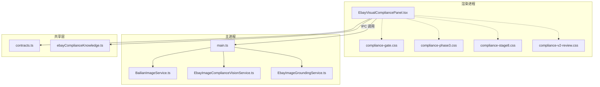
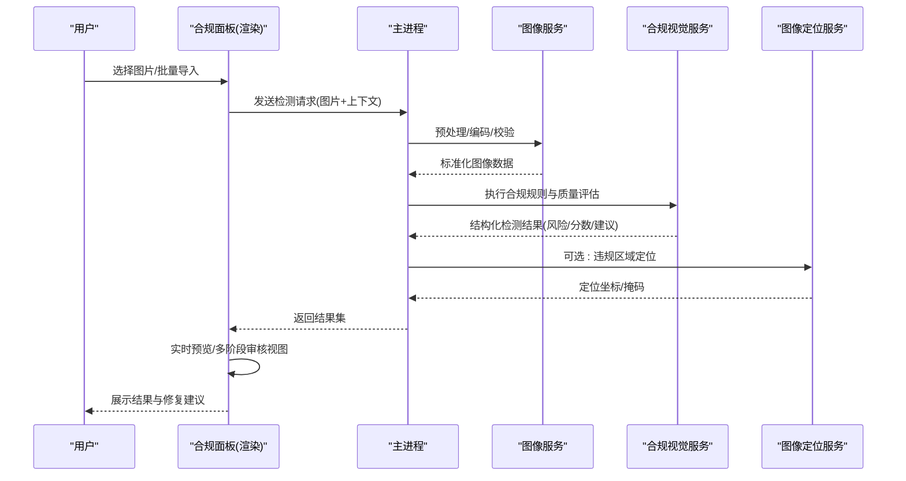
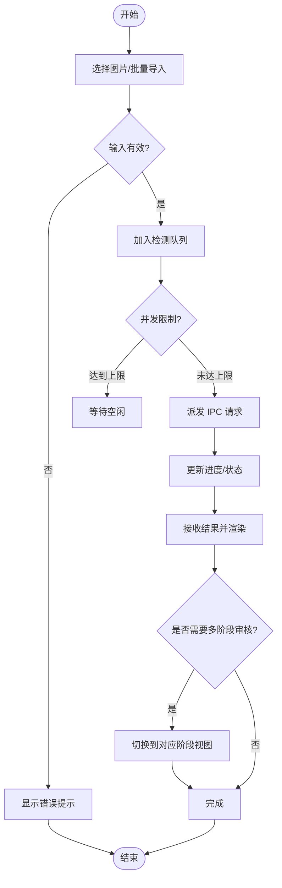
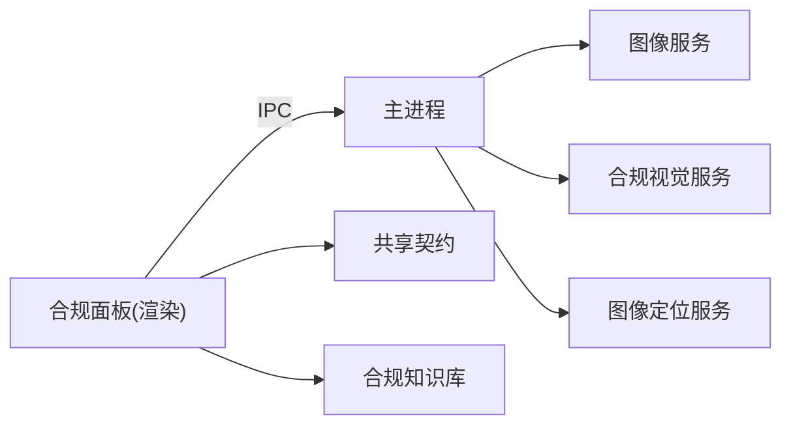

# 视觉合规面板

<cite>
**本文引用的文件**   
- [EbayVisualCompliancePanel.tsx](file://src/renderer/EbayVisualCompliancePanel.tsx)
- [compliance-gate.css](file://src/renderer/compliance-gate.css)
- [compliance-phase3.css](file://src/renderer/compliance-phase3.css)
- [compliance-stage8.css](file://src/renderer/compliance-stage8.css)
- [compliance-v2-review.css](file://src/renderer/compliance-v2-review.css)
- [BailianImageService.ts](file://src/main/services/BailianImageService.ts)
- [EbayImageComplianceVisionService.ts](file://src/main/services/EbayImageComplianceVisionService.ts)
- [EbayImageGroundingService.ts](file://src/main/services/EbayImageGroundingService.ts)
- [contracts.ts](file://src/shared/contracts.ts)
- [ebayComplianceKnowledge.ts](file://src/shared/ebayComplianceKnowledge.ts)
- [main.ts](file://src/main/main.ts)
</cite>

## 目录
1. [简介](#简介)
2. [项目结构](#项目结构)
3. [核心组件](#核心组件)
4. [架构总览](#架构总览)
5. [详细组件分析](#详细组件分析)
6. [依赖关系分析](#依赖关系分析)
7. [性能考量](#性能考量)
8. [故障排查指南](#故障排查指南)
9. [结论](#结论)
10. [附录](#附录)

## 简介
本文件面向“视觉合规面板”的完整技术文档，聚焦图片合规检查、违规检测与质量评估机制。内容覆盖规则引擎、检测结果展示、修复建议、多阶段审核流程、实时预览与批量处理，以及规则配置、自定义检测与集成指南。读者可据此快速理解系统架构、数据流与关键实现要点，并用于二次开发与问题定位。

## 项目结构
本项目采用 Electron 架构，前端渲染进程提供可视化面板与交互逻辑，主进程承载服务层（图像合规、翻译、视频等），共享层定义契约与领域知识。视觉合规面板位于渲染层，通过 IPC 调用主进程服务进行图像分析与结果聚合，并以 CSS 样式模块组织不同阶段的 UI。

**图表来源** 
- [EbayVisualCompliancePanel.tsx](file://src/renderer/EbayVisualCompliancePanel.tsx)
- [compliance-gate.css](file://src/renderer/compliance-gate.css)
- [compliance-phase3.css](file://src/renderer/compliance-phase3.css)
- [compliance-stage8.css](file://src/renderer/compliance-stage8.css)
- [compliance-v2-review.css](file://src/renderer/compliance-v2-review.css)
- [BailianImageService.ts](file://src/main/services/BailianImageService.ts)
- [EbayImageComplianceVisionService.ts](file://src/main/services/EbayImageComplianceVisionService.ts)
- [EbayImageGroundingService.ts](file://src/main/services/EbayImageGroundingService.ts)
- [contracts.ts](file://src/shared/contracts.ts)
- [ebayComplianceKnowledge.ts](file://src/shared/ebayComplianceKnowledge.ts)
- [main.ts](file://src/main/main.ts)

**章节来源**
- [EbayVisualCompliancePanel.tsx](file://src/renderer/EbayVisualCompliancePanel.tsx)
- [main.ts](file://src/main/main.ts)
- [contracts.ts](file://src/shared/contracts.ts)
- [ebayComplianceKnowledge.ts](file://src/shared/ebayComplianceKnowledge.ts)

## 核心组件
- 视觉合规面板（渲染层）：负责用户交互、实时预览、批量任务队列、结果展示与修复建议呈现。
- 图像服务（主进程）：封装第三方或内部图像能力（如百炼图像服务），统一输入输出格式。
- 合规视觉服务（主进程）：执行合规规则判定、风险分级、质量评分与结构化报告生成。
- 图像定位服务（主进程）：对违规区域进行定位与标注，辅助人工复核与自动修复建议。
- 共享契约与知识（共享层）：定义数据结构、枚举与平台合规知识库，确保前后端一致。

**章节来源**
- [EbayVisualCompliancePanel.tsx](file://src/renderer/EbayVisualCompliancePanel.tsx)
- [BailianImageService.ts](file://src/main/services/BailianImageService.ts)
- [EbayImageComplianceVisionService.ts](file://src/main/services/EbayImageComplianceVisionService.ts)
- [EbayImageGroundingService.ts](file://src/main/services/EbayImageGroundingService.ts)
- [contracts.ts](file://src/shared/contracts.ts)
- [ebayComplianceKnowledge.ts](file://src/shared/ebayComplianceKnowledge.ts)

## 架构总览
视觉合规面板采用“渲染层交互 + 主进程服务 + 共享契约”的分层架构。面板通过 IPC 将待检图片与上下文参数发送至主进程；主进程编排图像服务、合规视觉服务与定位服务，返回结构化结果；面板根据结果渲染多阶段审核视图与修复建议。

**图表来源** 
- [EbayVisualCompliancePanel.tsx](file://src/renderer/EbayVisualCompliancePanel.tsx)
- [BailianImageService.ts](file://src/main/services/BailianImageService.ts)
- [EbayImageComplianceVisionService.ts](file://src/main/services/EbayImageComplianceVisionService.ts)
- [EbayImageGroundingService.ts](file://src/main/services/EbayImageGroundingService.ts)
- [main.ts](file://src/main/main.ts)

## 详细组件分析

### 视觉合规面板（渲染层）
- 功能职责
  - 图片选择与批量导入、进度与状态管理
  - 实时预览与分阶段审核视图切换
  - 结果展示：风险等级、质量分数、违规项明细、修复建议
  - 规则配置入口与自定义检测开关
- 交互流程
  - 用户操作触发 IPC 请求，进入“待检/检测中/完成/失败”状态机
  - 支持批量队列并发控制与重试策略
  - 结果按阶段渲染，结合 CSS 主题区分 Gate/Phase3/Stage8/Review
- 关键数据结构
  - 使用共享契约定义图片元数据、检测结果、定位信息与建议列表

**图表来源** 
- [EbayVisualCompliancePanel.tsx](file://src/renderer/EbayVisualCompliancePanel.tsx)
- [compliance-gate.css](file://src/renderer/compliance-gate.css)
- [compliance-phase3.css](file://src/renderer/compliance-phase3.css)
- [compliance-stage8.css](file://src/renderer/compliance-stage8.css)
- [compliance-v2-review.css](file://src/renderer/compliance-v2-review.css)

**章节来源**
- [EbayVisualCompliancePanel.tsx](file://src/renderer/EbayVisualCompliancePanel.tsx)
- [compliance-gate.css](file://src/renderer/compliance-gate.css)
- [compliance-phase3.css](file://src/renderer/compliance-phase3.css)
- [compliance-stage8.css](file://src/renderer/compliance-stage8.css)
- [compliance-v2-review.css](file://src/renderer/compliance-v2-review.css)

### 图像服务（主进程）
- 职责
  - 统一图像输入校验、格式转换、尺寸与质量预检
  - 与外部图像能力对接（例如百炼图像服务）
  - 返回标准化的图像数据供后续服务消费
- 关键点
  - 异常捕获与降级策略（网络超时、格式不支持等）
  - 缓存与去重（相同哈希避免重复处理）

**章节来源**
- [BailianImageService.ts](file://src/main/services/BailianImageService.ts)

### 合规视觉服务（主进程）
- 职责
  - 基于规则引擎执行合规检查（文本、图形、品牌、敏感元素等）
  - 计算质量评分与风险等级，生成结构化报告
  - 输出修复建议（裁剪、替换、去水印、对比度调整等）
- 关键点
  - 规则版本化与热更新能力
  - 可扩展的检测插件接口（自定义检测接入）

**章节来源**
- [EbayImageComplianceVisionService.ts](file://src/main/services/EbayImageComplianceVisionService.ts)
- [contracts.ts](file://src/shared/contracts.ts)
- [ebayComplianceKnowledge.ts](file://src/shared/ebayComplianceKnowledge.ts)

### 图像定位服务（主进程）
- 职责
  - 对违规区域进行定位与标注（坐标、掩码、置信度）
  - 为面板提供可视化叠加信息，辅助人工复核与自动修复
- 关键点
  - 定位精度与召回率的权衡
  - 与规则引擎结果的关联映射

**章节来源**
- [EbayImageGroundingService.ts](file://src/main/services/EbayImageGroundingService.ts)

### 共享契约与知识（共享层）
- 契约
  - 定义图片对象、检测结果、定位信息、建议项的结构与枚举
- 知识
  - 平台合规知识库（类目规则、文案规范、品牌白名单等）
  - 规则版本与生效范围

**章节来源**
- [contracts.ts](file://src/shared/contracts.ts)
- [ebayComplianceKnowledge.ts](file://src/shared/ebayComplianceKnowledge.ts)

## 依赖关系分析
- 耦合与内聚
  - 面板与主进程通过 IPC 解耦，服务间以契约约束，降低耦合
  - 共享层提高一致性，减少重复定义
- 外部依赖
  - 图像服务可能依赖第三方 API（如百炼），需考虑限流与容错
- 潜在循环依赖
  - 当前分层清晰，未见循环引用

**图表来源** 
- [EbayVisualCompliancePanel.tsx](file://src/renderer/EbayVisualCompliancePanel.tsx)
- [main.ts](file://src/main/main.ts)
- [BailianImageService.ts](file://src/main/services/BailianImageService.ts)
- [EbayImageComplianceVisionService.ts](file://src/main/services/EbayImageComplianceVisionService.ts)
- [EbayImageGroundingService.ts](file://src/main/services/EbayImageGroundingService.ts)
- [contracts.ts](file://src/shared/contracts.ts)
- [ebayComplianceKnowledge.ts](file://src/shared/ebayComplianceKnowledge.ts)

**章节来源**
- [main.ts](file://src/main/main.ts)
- [contracts.ts](file://src/shared/contracts.ts)

## 性能考量
- 批量处理
  - 并发队列与背压控制，避免阻塞 UI
  - 任务拆分与增量更新，提升响应速度
- 图像处理
  - 预检与裁剪减少无效计算
  - 缓存与去重降低重复开销
- 网络与服务
  - 超时与重试策略，失败快速回退
  - 结果分页与懒加载，减少内存占用

[本节为通用指导，不直接分析具体文件]

## 故障排查指南
- 常见问题
  - 图片格式不支持或过大：检查输入校验与尺寸限制
  - 第三方服务不可用：查看网络状态与降级路径
  - 规则未生效：确认规则版本与生效范围
- 定位方法
  - 查看面板状态与日志输出
  - 核对契约字段是否匹配
  - 验证知识库配置与规则版本
- 恢复步骤
  - 重试失败任务
  - 清理缓存与临时文件
  - 回滚到上一稳定版本

**章节来源**
- [EbayVisualCompliancePanel.tsx](file://src/renderer/EbayVisualCompliancePanel.tsx)
- [BailianImageService.ts](file://src/main/services/BailianImageService.ts)
- [EbayImageComplianceVisionService.ts](file://src/main/services/EbayImageComplianceVisionService.ts)
- [EbayImageGroundingService.ts](file://src/main/services/EbayImageGroundingService.ts)
- [contracts.ts](file://src/shared/contracts.ts)
- [ebayComplianceKnowledge.ts](file://src/shared/ebayComplianceKnowledge.ts)

## 结论
视觉合规面板通过清晰的层次与契约，实现了从图片输入到合规检测、质量评估、结果展示与修复建议的全链路能力。借助多阶段审核、实时预览与批量处理，满足复杂业务场景需求。建议在后续迭代中持续优化规则引擎的可扩展性与性能，完善监控与诊断能力。

[本节为总结性内容，不直接分析具体文件]

## 附录
- 规则配置
  - 在共享知识库中维护规则条目与版本，面板提供配置入口
  - 支持启用/禁用特定规则与自定义检测插件
- 自定义检测
  - 在主进程中注册新的检测服务，遵循契约接口
  - 面板侧增加对应的展示与交互逻辑
- 集成指南
  - 新增 IPC 通道时，确保契约同步更新
  - 对外部服务的调用需包含超时、重试与降级策略

[本节为补充说明，不直接分析具体文件]