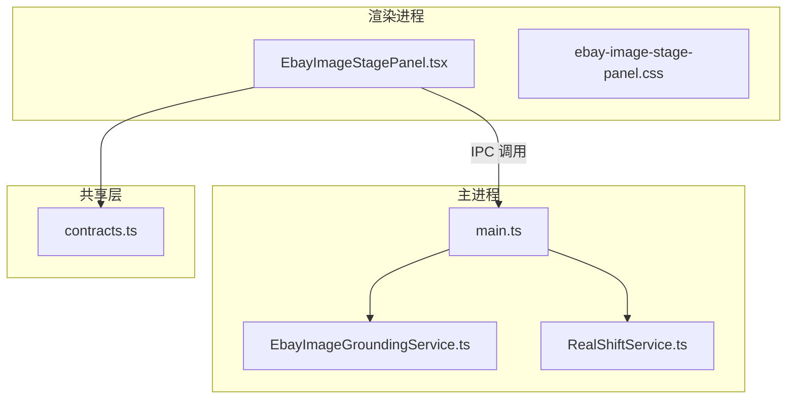
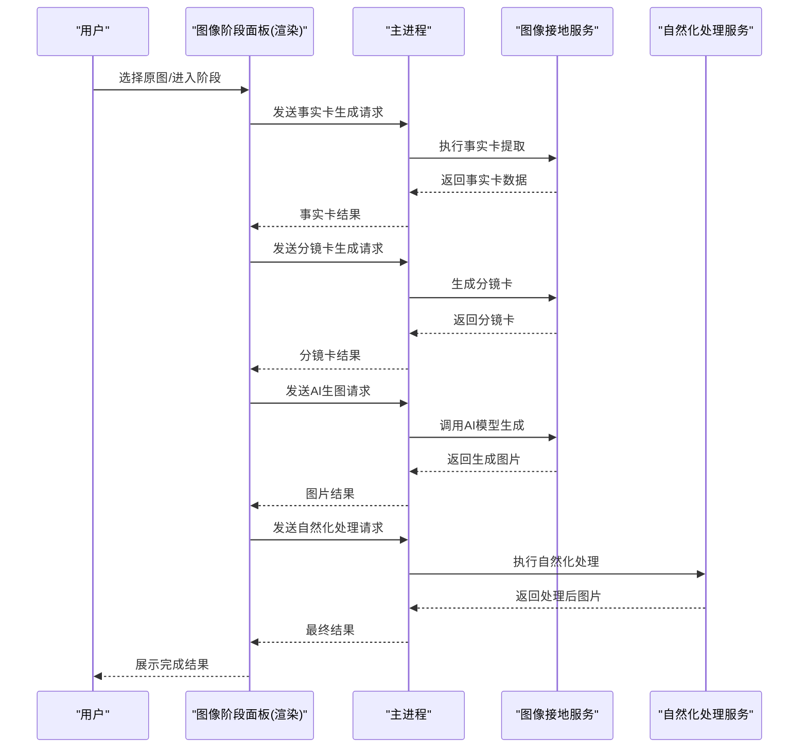
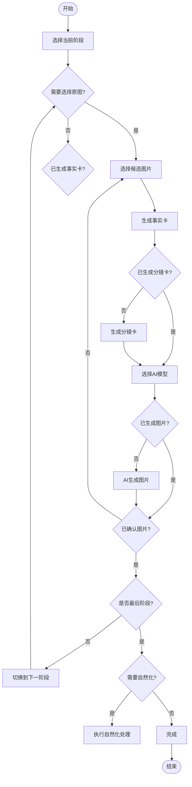
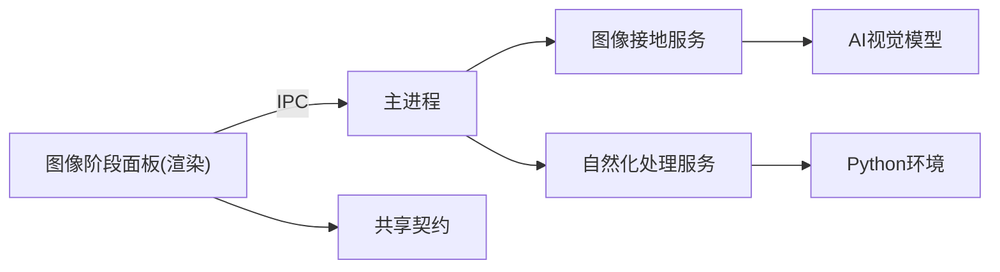

# 视觉合规面板

<cite>
**本文引用的文件**   
- [EbayImageStagePanel.tsx](file://src/renderer/EbayImageStagePanel.tsx)
- [ebay-image-stage-panel.css](file://src/renderer/ebay-image-stage-panel.css)
- [contracts.ts](file://src/shared/contracts.ts)
- [EbayImageGroundingService.ts](file://src/main/services/EbayImageGroundingService.ts)
- [RealShiftService.ts](file://src/main/services/RealShiftService.ts)
- [main.ts](file://src/main/main.ts)
</cite>

## 更新摘要
**变更内容**
- 移除了旧的 EbayVisualCompliancePanel.tsx 组件
- 新增了更全面的 EbayImageStagePanel.tsx 图像阶段面板系统
- 实现了五阶段图像处理流程：主图生成、产品图生成、痛点图生成、场景图生成、自然化处理
- 增强了事实卡、分镜卡编辑和AI生图功能
- 添加了并发控制和模型推荐机制

## 目录
1. [简介](#简介)
2. [项目结构](#项目结构)
3. [核心组件](#核心组件)
4. [架构总览](#架构总览)
5. [详细组件分析](#详细组件分析)
6. [依赖关系分析](#依赖关系分析)
7. [性能考量](#性能考量)
8. [故障排查指南](#故障排查指南)
9. [结论](#结论)
10. [附录](#附录)

## 简介
本文件面向"视觉合规面板"的完整技术文档，聚焦图片合规检查、违规检测与质量评估机制。新版系统采用五阶段线性处理流程，通过事实卡提取、分镜卡编辑、AI智能生成和自然化处理，提供完整的电商图片优化解决方案。内容覆盖规则引擎、检测结果展示、修复建议、多阶段审核流程、实时预览与批量处理，以及规则配置、自定义检测和集成指南。读者可据此快速理解系统架构、数据流与关键实现要点，并用于二次开发与问题定位。

## 项目结构
本项目采用 Electron 架构，前端渲染进程提供可视化面板与交互逻辑，主进程承载服务层（图像合规、翻译、视频等），共享层定义契约与领域知识。视觉合规面板位于渲染层，通过 IPC 调用主进程服务进行图像分析与结果聚合，并以 CSS 样式模块组织不同阶段的 UI。

**图表来源** 
- [EbayImageStagePanel.tsx](file://src/renderer/EbayImageStagePanel.tsx)
- [ebay-image-stage-panel.css](file://src/renderer/ebay-image-stage-panel.css)
- [EbayImageGroundingService.ts](file://src/main/services/EbayImageGroundingService.ts)
- [RealShiftService.ts](file://src/main/services/RealShiftService.ts)
- [contracts.ts](file://src/shared/contracts.ts)
- [main.ts](file://src/main/main.ts)

**章节来源**
- [EbayImageStagePanel.tsx](file://src/renderer/EbayImageStagePanel.tsx)
- [main.ts](file://src/main/main.ts)
- [contracts.ts](file://src/shared/contracts.ts)

## 核心组件
- 图像阶段面板（渲染层）：负责用户交互、五阶段流程管理、实时预览、批量任务队列、结果展示与修复建议呈现。
- 图像接地服务（主进程）：执行事实卡提取、分镜卡生成、商品主体识别和保护属性分析。
- 自然化处理服务（主进程）：对AI生成的图片进行自然化处理，使其更接近实拍质感。
- 共享契约（共享层）：定义数据结构、枚举和类型约束，确保前后端一致。

**章节来源**
- [EbayImageStagePanel.tsx](file://src/renderer/EbayImageStagePanel.tsx)
- [EbayImageGroundingService.ts](file://src/main/services/EbayImageGroundingService.ts)
- [RealShiftService.ts](file://src/main/services/RealShiftService.ts)
- [contracts.ts](file://src/shared/contracts.ts)

## 架构总览
图像阶段面板采用"渲染层交互 + 主进程服务 + 共享契约"的分层架构。面板通过 IPC 将待检图片与上下文参数发送至主进程；主进程编排图像接地服务和自然化处理服务，返回结构化结果；面板根据结果渲染五阶段审核视图与修复建议。

**图表来源** 
- [EbayImageStagePanel.tsx](file://src/renderer/EbayImageStagePanel.tsx)
- [EbayImageGroundingService.ts](file://src/main/services/EbayImageGroundingService.ts)
- [RealShiftService.ts](file://src/main/services/RealShiftService.ts)
- [main.ts](file://src/main/main.ts)

## 详细组件分析

### 图像阶段面板（渲染层）
- 功能职责
  - 五阶段流程管理：主图生成、产品图生成、痛点图生成、场景图生成、自然化处理
  - 原图选择与批量导入、进度与状态管理
  - 事实卡生成与编辑、分镜卡创建与修改
  - AI模型选择与推荐、图片生成与确认
  - 自然化处理与结果展示
- 交互流程
  - 用户操作触发 IPC 请求，进入各阶段状态机
  - 支持并发控制（分析并发和生图并发独立配置）
  - 结果按阶段渲染，支持重新生成和撤回确认
- 关键数据结构
  - 使用共享契约定义图片元数据、事实卡、分镜卡、生成结果和处理状态

**图表来源** 
- [EbayImageStagePanel.tsx](file://src/renderer/EbayImageStagePanel.tsx)
- [ebay-image-stage-panel.css](file://src/renderer/ebay-image-stage-panel.css)

**章节来源**
- [EbayImageStagePanel.tsx](file://src/renderer/EbayImageStagePanel.tsx)
- [ebay-image-stage-panel.css](file://src/renderer/ebay-image-stage-panel.css)

### 图像接地服务（主进程）
- 职责
  - 事实卡提取：从原图中识别商品主体、保护属性和核实事实
  - 分镜卡生成：基于事实卡创建可编辑的分镜卡，包含镜头描述、验收标准和禁止事项
  - 模型推荐：根据阶段类型推荐合适的AI生图模型
  - 提示词构建：为AI生图构建符合平台规范的提示词
- 关键点
  - 支持事实卡继承：前一阶段的全局信息可传递到后续阶段
  - 灵活的分镜卡编辑：用户可调整镜头描述、证据、验收标准等
  - 智能提示词生成：根据是否有参照图选择不同的提示词策略

**章节来源**
- [EbayImageGroundingService.ts](file://src/main/services/EbayImageGroundingService.ts)
- [contracts.ts](file://src/shared/contracts.ts)

### 自然化处理服务（主进程）
- 职责
  - 图片自然化处理：使AI生成的图片更接近实拍质感
  - 依赖预检：在执行前检查Python环境和依赖包
  - 批量处理：支持多张图片的顺序处理和容错机制
  - 结果管理：保存原始图、处理后图片和分析报告
- 关键点
  - 逐张容错：单张图片处理失败不影响其他图片继续处理
  - 环境检查：启动前验证Python解释器和Pillow/numpy依赖
  - 配置文件管理：支持light和balanced两种处理档位

**章节来源**
- [RealShiftService.ts](file://src/main/services/RealShiftService.ts)

### 共享契约（共享层）
- 契约
  - 定义五阶段类型：HERO、PRODUCT、PAIN_POINT、SCENE、NATURALIZE
  - 阶段步骤状态：PENDING、SELECTING、GROUNDING、STORYBOARD、GENERATING、REVIEW、CONFIRMED
  - 事实卡结构：商品主体描述、保护属性、核实事实、生成指令等
  - 分镜卡结构：镜头标题、描述、证据、验收标准、禁止事项等
  - 自然化处理：RealShiftProfile类型和处理结果结构
- 关键点
  - 类型安全：确保前后端数据结构一致性
  - 扩展性：支持新增阶段和属性的向后兼容

**章节来源**
- [contracts.ts](file://src/shared/contracts.ts)

## 依赖关系分析
- 耦合与内聚
  - 面板与主进程通过IPC解耦，服务间以契约约束，降低耦合
  - 共享层提高一致性，减少重复定义
  - 五阶段流程具有清晰的阶段边界和依赖关系
- 外部依赖
  - 图像接地服务依赖AI视觉模型API
  - 自然化处理服务依赖Python环境和第三方库
- 潜在循环依赖
  - 当前分层清晰，未见循环引用

**图表来源** 
- [EbayImageStagePanel.tsx](file://src/renderer/EbayImageStagePanel.tsx)
- [main.ts](file://src/main/main.ts)
- [EbayImageGroundingService.ts](file://src/main/services/EbayImageGroundingService.ts)
- [RealShiftService.ts](file://src/main/services/RealShiftService.ts)
- [contracts.ts](file://src/shared/contracts.ts)

**章节来源**
- [main.ts](file://src/main/main.ts)
- [contracts.ts](file://src/shared/contracts.ts)

## 性能考量
- 并发控制
  - 分析任务和生图任务使用独立的并发限制（最高6和4）
  - 使用mapWithConcurrency函数实现有限并发遍历
  - 并发设置持久化到localStorage，用户可自定义调整
- 图像处理
  - 事实卡和分镜卡生成采用并行处理
  - 自然化处理采用顺序处理但支持逐张容错
  - 图片缓存和去重避免重复处理
- 网络与服务
  - AI模型调用支持超时和重试机制
  - 错误处理完善，单个任务失败不影响整体流程
  - 进度反馈实时更新用户体验

## 故障排查指南
- 常见问题
  - 事实卡生成失败：检查AI模型API连接和输入图片质量
  - 分镜卡编辑无效：确认编辑字段格式和用户输入
  - AI生图失败：验证模型选择和提示词有效性
  - 自然化处理不可用：检查Python环境和依赖包安装
- 定位方法
  - 查看各阶段状态和错误提示信息
  - 检查并发设置是否过高导致资源耗尽
  - 验证共享契约数据类型匹配
  - 查看主进程日志输出
- 恢复步骤
  - 重新生成失败的阶段
  - 调整并发设置降低负载
  - 清理缓存和临时文件
  - 重启应用重置状态

**章节来源**
- [EbayImageStagePanel.tsx](file://src/renderer/EbayImageStagePanel.tsx)
- [EbayImageGroundingService.ts](file://src/main/services/EbayImageGroundingService.ts)
- [RealShiftService.ts](file://src/main/services/RealShiftService.ts)
- [contracts.ts](file://src/shared/contracts.ts)

## 结论
新版图像阶段面板通过五阶段线性处理流程，实现了从原图选择到最终自然化处理的完整电商图片优化工作流。相比旧版单一合规检查，新系统提供了更精细的控制和更好的用户体验。通过事实卡提取、分镜卡编辑、AI智能生成和自然化处理，满足了复杂业务场景需求。建议在后续迭代中持续优化AI模型调用效率和用户体验，完善监控与诊断能力。

## 附录
- 阶段配置
  - 五阶段类型可在共享契约中扩展
  - 每个阶段支持独立的模型推荐和参数配置
  - 阶段间数据继承机制确保一致性
- 自定义检测
  - 在主进程中注册新的检测服务，遵循契约接口
  - 面板侧增加对应的展示与交互逻辑
  - 支持插件式架构便于功能扩展
- 集成指南
  - 新增IPC通道时，确保契约同步更新
  - 对外部服务的调用需包含超时、重试与降级策略
  - 前端状态管理与后端服务保持同步