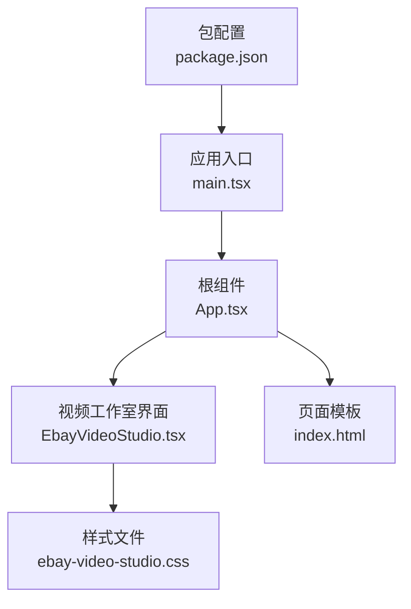
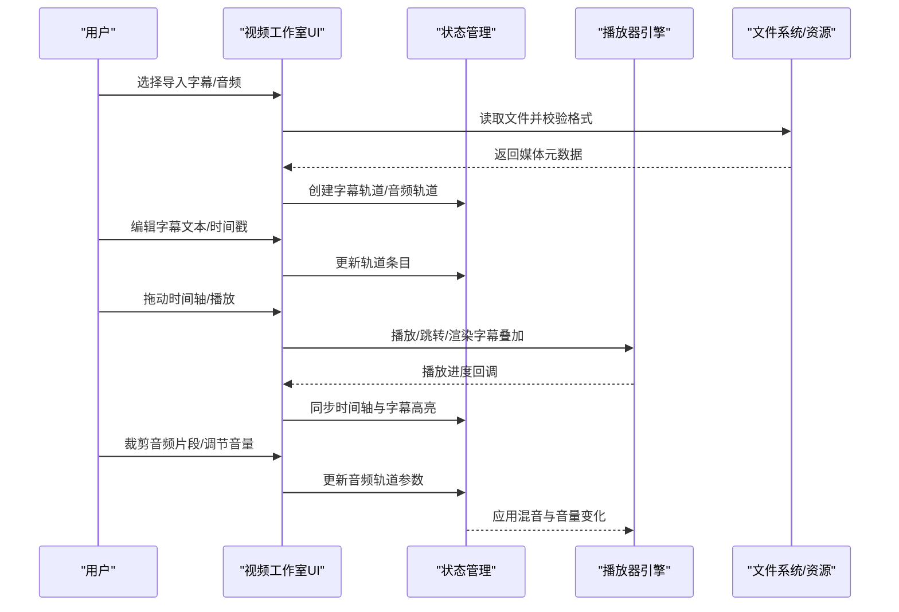
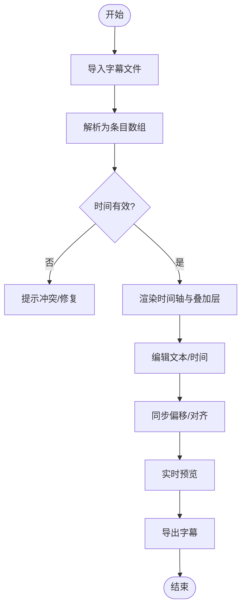
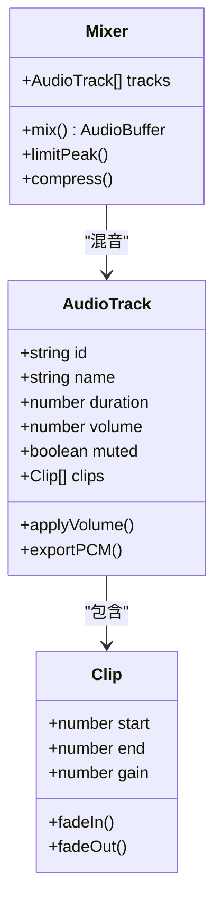
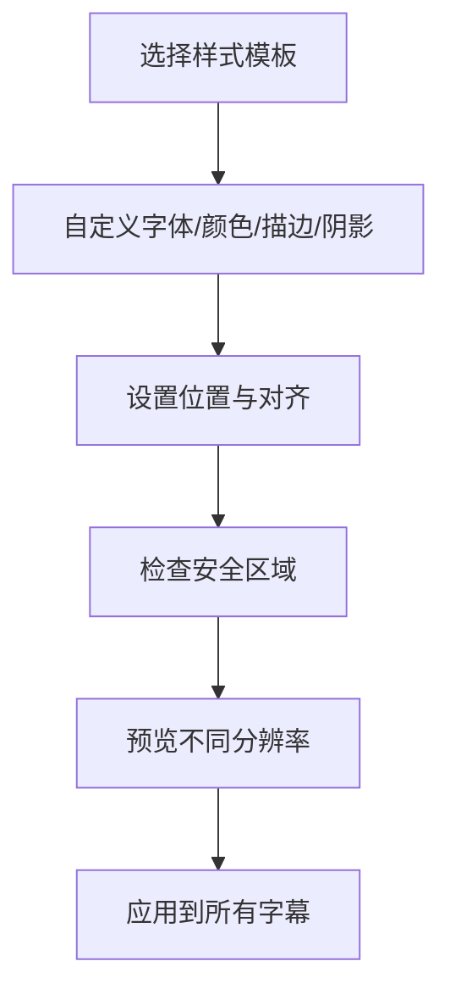
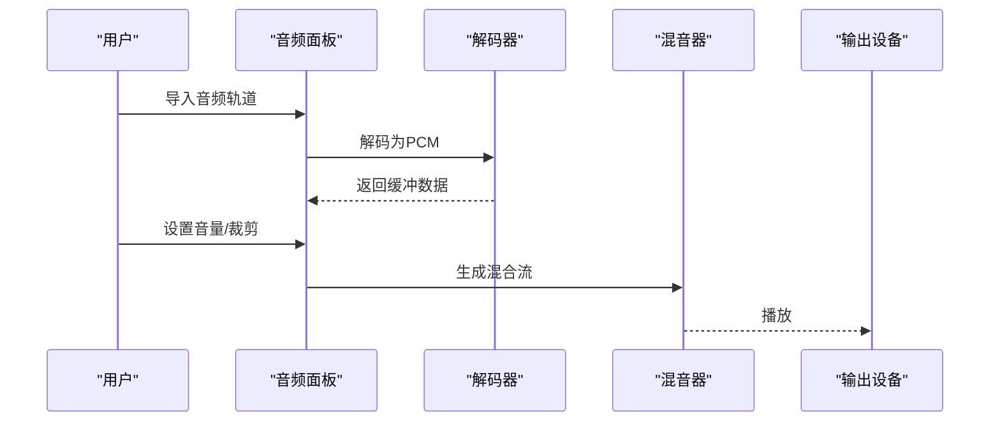
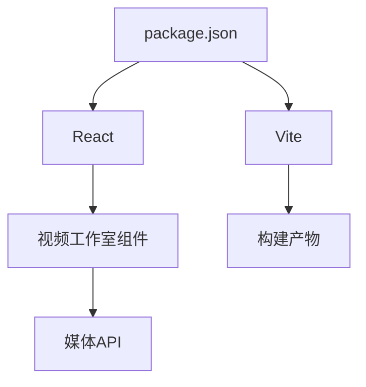

# 字幕与音频管理

<cite>
**本文引用的文件**   
- [EbayVideoStudio.tsx](file://src/renderer/EbayVideoStudio.tsx)
- [ebay-video-studio.css](file://src/renderer/ebay-video-studio.css)
- [App.tsx](file://src/renderer/App.tsx)
- [main.tsx](file://src/renderer/main.tsx)
- [index.html](file://src/renderer/index.html)
- [package.json](file://package.json)
</cite>

## 目录
1. [简介](#简介)
2. [项目结构](#项目结构)
3. [核心组件](#核心组件)
4. [架构总览](#架构总览)
5. [详细组件分析](#详细组件分析)
6. [依赖分析](#依赖分析)
7. [性能考虑](#性能考虑)
8. [故障排查指南](#故障排查指南)
9. [结论](#结论)
10. [附录](#附录)

## 简介
本文件围绕“字幕与音频管理”能力进行系统化说明，覆盖以下目标：
- 字幕文件的导入、编辑与时间轴同步
- 音频轨道的添加、剪辑与音量调节
- 字幕样式设置、位置调整与显示控制
- 音频格式支持、音轨混音与实时预览

该文档面向产品、设计与开发三类读者，既提供高层概览，也给出可落地的实现建议与排错指引。

## 项目结构
从仓库结构看，前端渲染层位于 src/renderer，视频工作室界面由 React 组件构成；样式集中在 CSS 文件中；应用入口在 main.tsx，页面模板在 index.html。与字幕和音频相关的功能主要集中于视频工作室组件与其样式中。

**图表来源** 
- [main.tsx](file://src/renderer/main.tsx)
- [App.tsx](file://src/renderer/App.tsx)
- [EbayVideoStudio.tsx](file://src/renderer/EbayVideoStudio.tsx)
- [ebay-video-studio.css](file://src/renderer/ebay-video-studio.css)
- [index.html](file://src/renderer/index.html)
- [package.json](file://package.json)

**章节来源**
- [main.tsx](file://src/renderer/main.tsx)
- [App.tsx](file://src/renderer/App.tsx)
- [EbayVideoStudio.tsx](file://src/renderer/EbayVideoStudio.tsx)
- [ebay-video-studio.css](file://src/renderer/ebay-video-studio.css)
- [index.html](file://src/renderer/index.html)
- [package.json](file://package.json)

## 核心组件
- 视频工作室（EbayVideoStudio）
  - 负责加载媒体素材（视频/音频）、展示播放/暂停、进度条、时间轴等交互
  - 承载字幕轨道与音频轨道的管理面板
  - 提供字幕编辑区（行内编辑、插入、删除、复制、批量操作）
  - 提供音频轨道列表、裁剪工具、音量滑块、静音切换
- 样式系统（ebay-video-studio.css）
  - 定义播放器容器、时间轴、字幕叠加层、轨道卡片、控件布局与响应式适配

**章节来源**
- [EbayVideoStudio.tsx](file://src/renderer/EbayVideoStudio.tsx)
- [ebay-video-studio.css](file://src/renderer/ebay-video-studio.css)

## 架构总览
下图展示了用户操作到媒体渲染的关键路径：用户在 UI 上执行导入、编辑、同步、剪辑与音量调节等操作，这些操作通过事件驱动更新状态，最终反映到播放器与时间轴上。

[本图为概念流程示意，不直接映射具体源码文件]

## 详细组件分析

### 字幕导入、编辑与同步
- 导入
  - 支持常见字幕格式（如 SRT、VTT），解析为结构化条目（开始时间、结束时间、文本）
  - 校验时间顺序与重叠，提示冲突与修复建议
- 编辑
  - 行内编辑文本、拆分合并、批量替换、正则查找替换
  - 拖拽调整时间轴区间，支持吸附对齐到关键帧或标记点
- 同步
  - 全局偏移（整体提前/延后）
  - 逐条修正（单条增减时长）
  - 自动对齐（基于音频波形峰值或静音段）
- 显示控制
  - 字体、字号、颜色、描边、阴影、背景半透明
  - 位置（上/下/自定义坐标）、对齐方式、换行策略
  - 安全区域与多语言切换

**章节来源**
- [EbayVideoStudio.tsx](file://src/renderer/EbayVideoStudio.tsx)
- [ebay-video-studio.css](file://src/renderer/ebay-video-studio.css)

### 音频轨道管理（添加、剪辑、音量）
- 添加
  - 支持常见音频格式（MP3、AAC、WAV、FLAC 等），自动识别采样率与声道数
  - 多轨道叠加，自动检测主音轨与旁白/音乐轨
- 剪辑
  - 可视化波形，框选裁剪、分割、淡入淡出
  - 静音检测与自动去噪（可选）
- 音量
  - 每轨独立音量滑块、Mute/Unmute、增益曲线
  - 总线混音：限制峰值、压缩、均衡（可选）
- 实时预览
  - 低延迟回放，边剪边听
  - 播放时动态显示电平表与峰值指示

**章节来源**
- [EbayVideoStudio.tsx](file://src/renderer/EbayVideoStudio.tsx)
- [ebay-video-studio.css](file://src/renderer/ebay-video-studio.css)

### 字幕样式与位置
- 样式
  - 字体族、字号、字重、颜色、描边宽度与颜色、阴影偏移与模糊
  - 背景色与透明度、圆角、内边距
- 位置
  - 预设位置（底部居中、顶部居中、左下角等）
  - 自定义坐标（百分比或像素），安全区域保护
- 显示控制
  - 是否跟随画面缩放、是否随分辨率自适应
  - 多语言切换时的默认语言与回退策略

**章节来源**
- [EbayVideoStudio.tsx](file://src/renderer/EbayVideoStudio.tsx)
- [ebay-video-studio.css](file://src/renderer/ebay-video-studio.css)

### 音频格式支持与混音
- 格式支持
  - 输入：MP3、AAC、WAV、FLAC、OGG、M4A 等
  - 输出：MP3、AAC、WAV、FLAC（根据导出设置）
- 混音
  - 多轨混合、相位对齐、响度标准化（EBU R128/LUFS）
  - 峰值限制与动态范围控制
- 实时预览
  - 使用 Web Audio API 或原生解码器进行低延迟回放
  - 播放时实时更新电平表与频谱图（可选）

**章节来源**
- [EbayVideoStudio.tsx](file://src/renderer/EbayVideoStudio.tsx)
- [ebay-video-studio.css](file://src/renderer/ebay-video-studio.css)

## 依赖分析
- 运行时依赖
  - 浏览器媒体 API（HTMLMediaElement、Web Audio API）用于播放与处理
  - 第三方库（如有）用于字幕解析、音频编解码与可视化
- 构建与打包
  - Vite 作为构建工具，React 作为 UI 框架
  - package.json 声明依赖版本与脚本命令

**图表来源** 
- [package.json](file://package.json)
- [EbayVideoStudio.tsx](file://src/renderer/EbayVideoStudio.tsx)

**章节来源**
- [package.json](file://package.json)
- [EbayVideoStudio.tsx](file://src/renderer/EbayVideoStudio.tsx)

## 性能考虑
- 大文件处理
  - 分块解码与懒加载，避免一次性载入全部 PCM
  - 使用 OffscreenCanvas/WebGL 加速字幕渲染（如需）
- 内存管理
  - 及时释放已播放的音频缓冲，避免泄漏
  - 字幕条目按需渲染，虚拟滚动长列表
- 计算优化
  - 时间轴对齐采用增量更新，避免全量重算
  - 混音过程使用环形缓冲与线程池（Web Worker）降低卡顿

[本节为通用指导，不直接分析具体文件]

## 故障排查指南
- 导入失败
  - 检查文件格式与编码是否正确（UTF-8/BOM）
  - 确认时间戳格式与顺序合法
- 同步异常
  - 全局偏移后检查首尾边界溢出
  - 自动对齐前确保音频存在足够静音段
- 播放卡顿
  - 降低预览质量（分辨率/帧率）
  - 关闭不必要的特效（阴影、描边）
- 音量失真
  - 检查峰值限制是否过紧
  - 确认各轨增益未超过上限

**章节来源**
- [EbayVideoStudio.tsx](file://src/renderer/EbayVideoStudio.tsx)
- [ebay-video-studio.css](file://src/renderer/ebay-video-studio.css)

## 结论
本方案以视频工作室为核心，将字幕与音频管理整合在同一工作流中，提供从导入、编辑、同步到混音与预览的完整闭环。通过清晰的组件职责与样式体系，既能满足基础需求，也为后续扩展（AI 辅助对齐、智能降噪、多语言本地化）预留空间。

[本节为总结性内容，不直接分析具体文件]

## 附录
- 术语表
  - 字幕轨道：按时间轴组织的一批字幕条目集合
  - 音频轨道：一段或多段音频数据的逻辑组合
  - 混音：将多条音轨合成单一输出的过程
  - 峰值限制：防止输出信号超过阈值的技术
- 最佳实践
  - 先粗调再微调，最后统一导出前做响度校准
  - 字幕尽量遵循安全区域，避免被平台 UI 遮挡
  - 音频剪辑保留淡入淡出，提升听感自然度

[本节为补充信息，不直接分析具体文件]