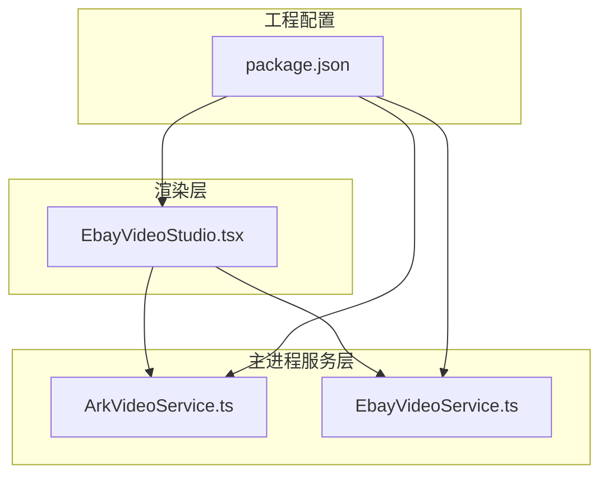
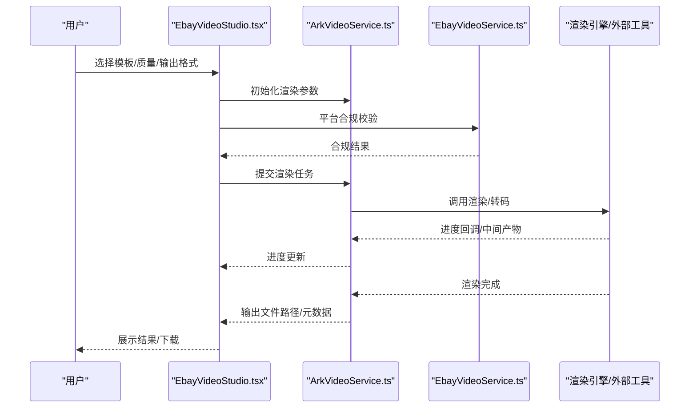
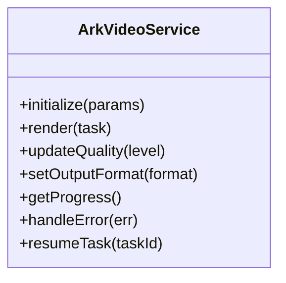
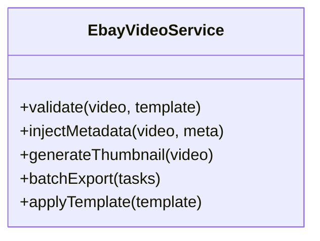
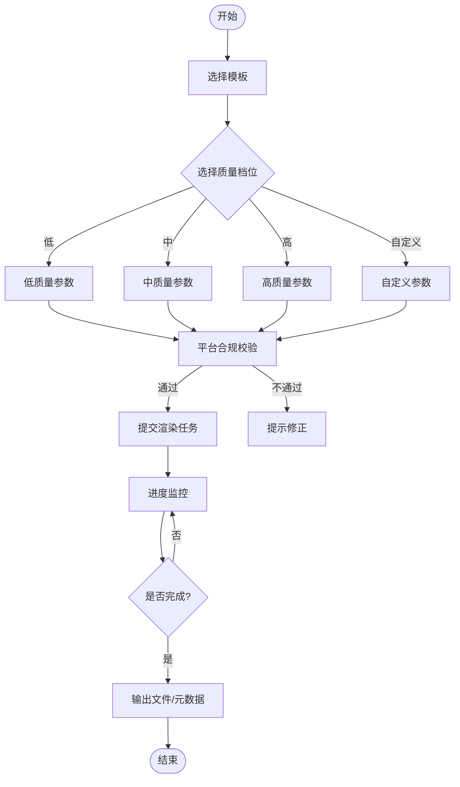
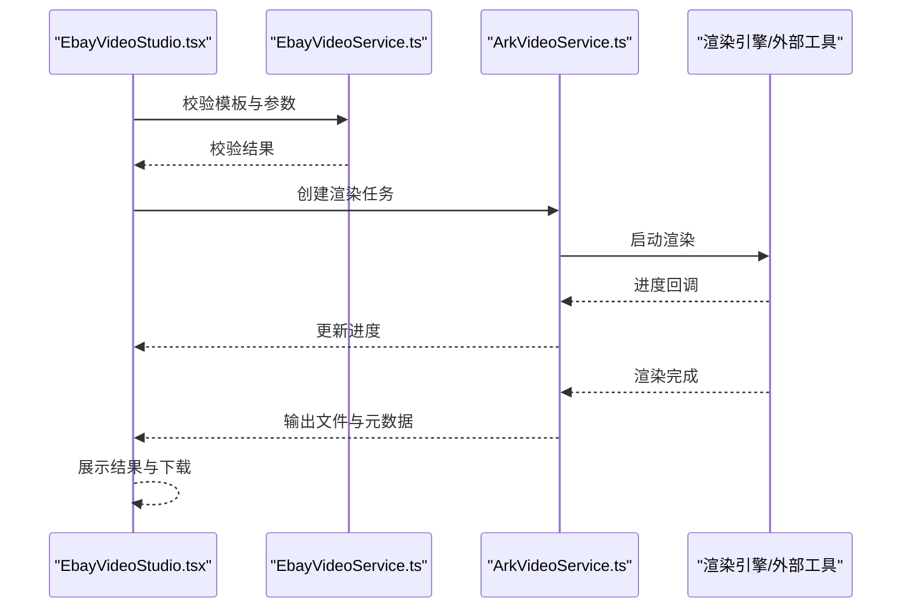
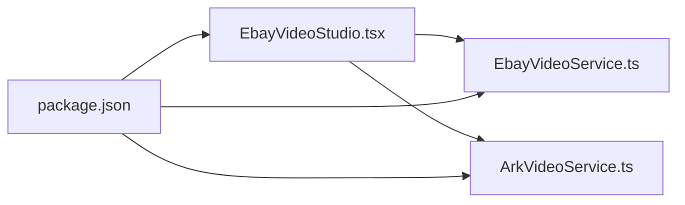

# 导出与渲染系统

<cite>
**本文引用的文件**   
- [src/main/services/ArkVideoService.ts](file://src/main/services/ArkVideoService.ts)
- [src/main/services/EbayVideoService.ts](file://src/main/services/EbayVideoService.ts)
- [src/renderer/EbayVideoStudio.tsx](file://src/renderer/EbayVideoStudio.tsx)
- [package.json](file://package.json)
</cite>

## 目录
1. [简介](#简介)
2. [项目结构](#项目结构)
3. [核心组件](#核心组件)
4. [架构总览](#架构总览)
5. [详细组件分析](#详细组件分析)
6. [依赖关系分析](#依赖关系分析)
7. [性能考量](#性能考量)
8. [故障排查指南](#故障排查指南)
9. [结论](#结论)
10. [附录](#附录)

## 简介
本文件围绕“导出与渲染系统”展开，聚焦视频渲染引擎、编码设置与输出格式配置，涵盖多质量档次、压缩算法与文件大小优化策略。同时说明进度监控、错误处理与中断恢复机制，并给出批量导出、模板预设与自动化工作流的实践建议。文档以仓库中的视频相关服务与渲染界面为依据进行系统化梳理，帮助开发者与使用者快速理解并高效使用该系统。

## 项目结构
与导出与渲染相关的代码主要分布在以下位置：
- 主进程服务层：封装视频能力与服务调用（如 ArkVideoService、EbayVideoService）
- 渲染层界面：提供用户交互与任务编排（如 EbayVideoStudio）
- 工程配置：声明依赖与脚本入口（如 package.json）

图表来源
- [src/renderer/EbayVideoStudio.tsx](file://src/renderer/EbayVideoStudio.tsx)
- [src/main/services/ArkVideoService.ts](file://src/main/services/ArkVideoService.ts)
- [src/main/services/EbayVideoService.ts](file://src/main/services/EbayVideoService.ts)
- [package.json](file://package.json)

章节来源
- [src/main/services/ArkVideoService.ts](file://src/main/services/ArkVideoService.ts)
- [src/main/services/EbayVideoService.ts](file://src/main/services/EbayVideoService.ts)
- [src/renderer/EbayVideoStudio.tsx](file://src/renderer/EbayVideoStudio.tsx)
- [package.json](file://package.json)

## 核心组件
- 视频服务（ArkVideoService）：对外暴露视频处理能力，包括渲染、转码、质量档位选择、输出格式配置等。通常负责与底层渲染引擎或外部工具链对接，统一参数校验与结果回传。
- 平台视频服务（EbayVideoService）：面向特定平台（如 eBay）的视频规范适配，包含合规检查、尺寸/时长限制、封面图生成、元数据注入等。
- 渲染界面（EbayVideoStudio）：提供导出任务创建、参数配置、进度展示、错误提示、批量操作与模板管理等功能。

章节来源
- [src/main/services/ArkVideoService.ts](file://src/main/services/ArkVideoService.ts)
- [src/main/services/EbayVideoService.ts](file://src/main/services/EbayVideoService.ts)
- [src/renderer/EbayVideoStudio.tsx](file://src/renderer/EbayVideoStudio.tsx)

## 架构总览
导出与渲染系统的整体流程如下：用户在渲染界面选择模板与质量档位，提交导出任务；主进程服务层根据平台规范与渲染引擎能力进行参数组装与执行；渲染完成后返回结果与元数据，界面更新进度与状态。

图表来源
- [src/renderer/EbayVideoStudio.tsx](file://src/renderer/EbayVideoStudio.tsx)
- [src/main/services/ArkVideoService.ts](file://src/main/services/ArkVideoService.ts)
- [src/main/services/EbayVideoService.ts](file://src/main/services/EbayVideoService.ts)

## 详细组件分析

### ArkVideoService（视频服务）
职责与要点
- 渲染引擎对接：封装渲染命令、队列管理与并发控制
- 编码设置：分辨率、帧率、码率、编码器、色彩空间、容器格式等
- 质量档位：低/中/高/自定义，映射到不同编码参数组合
- 输出格式：MP4、MOV、WebM 等，支持封面图与元数据写入
- 进度监控：通过回调或事件上报进度百分比、阶段信息
- 错误处理：网络/磁盘/编码异常分类与重试策略
- 中断恢复：断点续传、中间产物缓存、任务持久化

图表来源
- [src/main/services/ArkVideoService.ts](file://src/main/services/ArkVideoService.ts)

章节来源
- [src/main/services/ArkVideoService.ts](file://src/main/services/ArkVideoService.ts)

### EbayVideoService（平台视频服务）
职责与要点
- 平台规范：尺寸、时长、码率上限、封面比例、字幕嵌入
- 合规检查：内容检测、敏感信息过滤、水印要求
- 元数据注入：标题、描述、标签、版权信息
- 批量导出：队列编排、去重、失败重试
- 模板预设：常用规格一键应用

图表来源
- [src/main/services/EbayVideoService.ts](file://src/main/services/EbayVideoService.ts)

章节来源
- [src/main/services/EbayVideoService.ts](file://src/main/services/EbayVideoService.ts)

### EbayVideoStudio（渲染界面）
职责与要点
- 模板管理：加载/编辑/保存模板预设
- 质量档位选择：低/中/高/自定义，实时预览参数影响
- 输出格式配置：容器、分辨率、帧率、码率、封面图
- 进度监控：实时进度条、阶段提示、剩余时间估算
- 错误处理：友好提示、重试按钮、日志导出
- 批量导出：任务列表、暂停/继续、取消全部

图表来源
- [src/renderer/EbayVideoStudio.tsx](file://src/renderer/EbayVideoStudio.tsx)

章节来源
- [src/renderer/EbayVideoStudio.tsx](file://src/renderer/EbayVideoStudio.tsx)

### 渲染与导出流程（序列图）

图表来源
- [src/renderer/EbayVideoStudio.tsx](file://src/renderer/EbayVideoStudio.tsx)
- [src/main/services/EbayVideoService.ts](file://src/main/services/EbayVideoService.ts)
- [src/main/services/ArkVideoService.ts](file://src/main/services/ArkVideoService.ts)

## 依赖关系分析
- 渲染界面依赖两个服务：平台合规与渲染执行
- 服务之间解耦：平台规范与渲染引擎分离，便于替换与扩展
- 工程配置提供依赖声明与脚本入口，确保环境一致性

图表来源
- [src/renderer/EbayVideoStudio.tsx](file://src/renderer/EbayVideoStudio.tsx)
- [src/main/services/EbayVideoService.ts](file://src/main/services/EbayVideoService.ts)
- [src/main/services/ArkVideoService.ts](file://src/main/services/ArkVideoService.ts)
- [package.json](file://package.json)

章节来源
- [src/renderer/EbayVideoStudio.tsx](file://src/renderer/EbayVideoStudio.tsx)
- [src/main/services/EbayVideoService.ts](file://src/main/services/EbayVideoService.ts)
- [src/main/services/ArkVideoService.ts](file://src/main/services/ArkVideoService.ts)
- [package.json](file://package.json)

## 性能考量
- 编码参数调优：在目标画质下尽量降低码率，启用硬件加速（如适用）
- 并发控制：合理设置并行渲染任务数，避免内存与I/O瓶颈
- 中间产物缓存：复用已生成的关键帧与缩略图，减少重复计算
- 分块渲染：长视频分段渲染与拼接，提升稳定性与可恢复性
- 输出优化：选择合适的容器与编码组合，平衡体积与画质

[本节为通用指导，无需引用具体文件]

## 故障排查指南
常见问题与处理建议
- 渲染失败：检查输入素材格式、平台合规参数、磁盘空间与权限
- 进度停滞：确认渲染引擎状态、网络与外部依赖可用性
- 输出异常：验证编码参数与容器兼容性，查看错误日志
- 中断恢复：利用任务持久化与中间产物，从最近检查点恢复

章节来源
- [src/main/services/ArkVideoService.ts](file://src/main/services/ArkVideoService.ts)
- [src/main/services/EbayVideoService.ts](file://src/main/services/EbayVideoService.ts)
- [src/renderer/EbayVideoStudio.tsx](file://src/renderer/EbayVideoStudio.tsx)

## 结论
导出与渲染系统通过清晰的分层设计与模块化服务，实现了灵活的模板预设、多质量档位与平台合规保障。配合进度监控、错误处理与中断恢复机制，能够满足批量导出与自动化工作流的需求。建议在性能与稳定性方面持续优化编码参数与并发策略，以提升用户体验与资源利用率。

[本节为总结性内容，无需引用具体文件]

## 附录
- 模板预设：建议按平台规范维护多套模板，覆盖常见场景
- 质量档位：低/中/高对应不同码率与分辨率组合，便于快速切换
- 输出格式：优先 MP4/H.264 兼容性与 WebM/VP9 的体积优势
- 自动化工作流：结合脚本与队列管理，实现定时批量导出与发布

[本节为补充说明，无需引用具体文件]