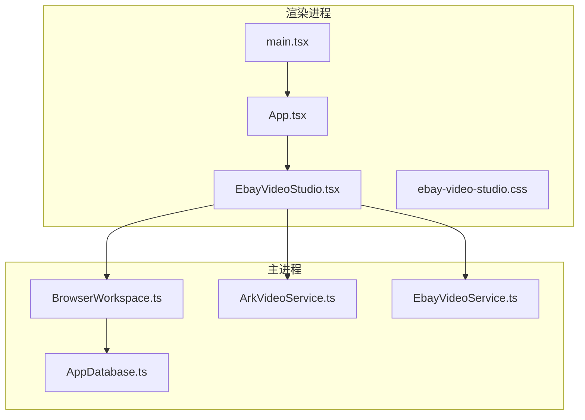
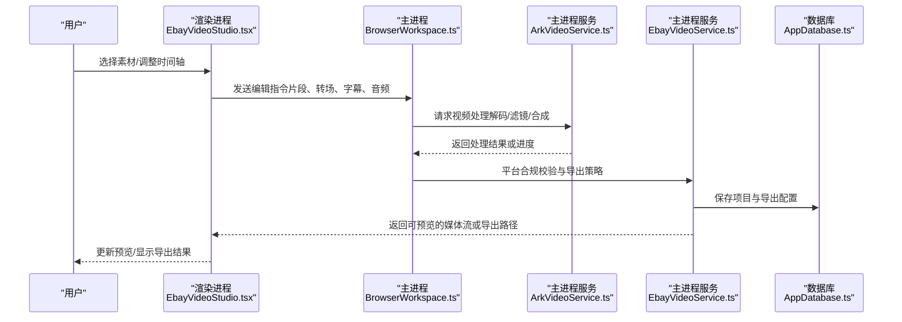
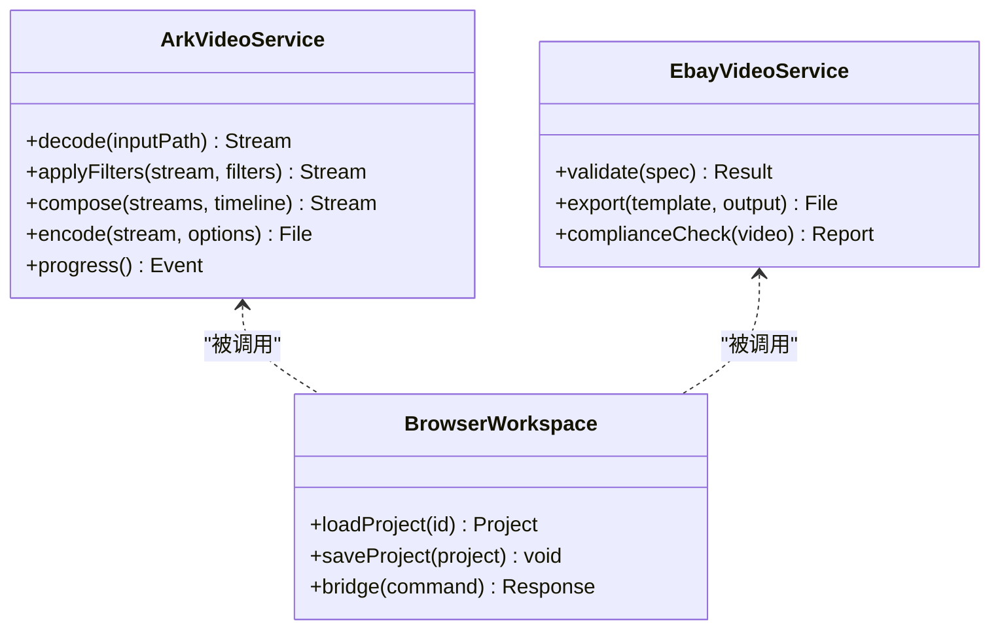
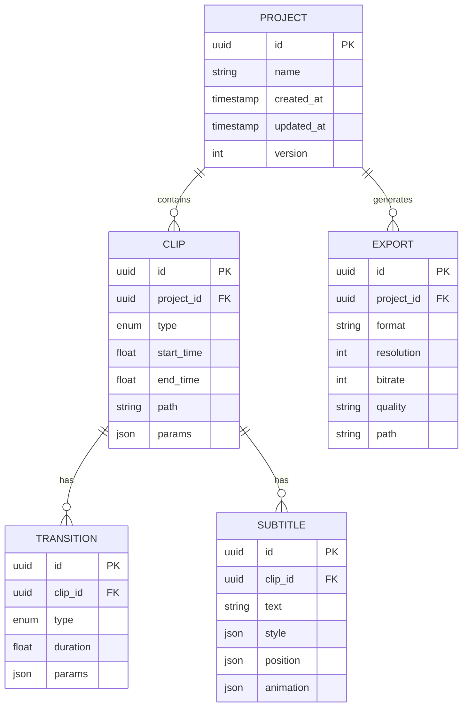
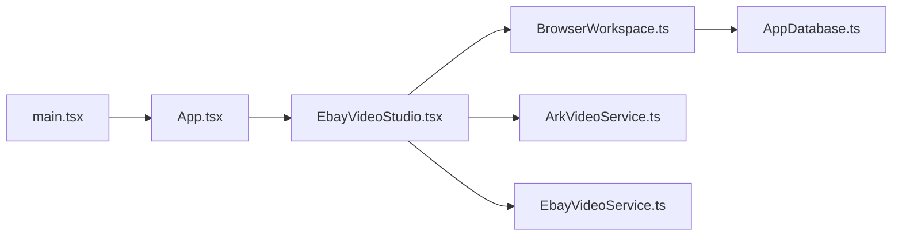

# 视频工作室

<cite>
**本文引用的文件**   
- [EbayVideoStudio.tsx](file://src/renderer/EbayVideoStudio.tsx)
- [ebay-video-studio.css](file://src/renderer/ebay-video-studio.css)
- [main.tsx](file://src/renderer/main.tsx)
- [App.tsx](file://src/renderer/App.tsx)
- [ArkVideoService.ts](file://src/main/services/ArkVideoService.ts)
- [EbayVideoService.ts](file://src/main/services/EbayVideoService.ts)
- [BrowserWorkspace.ts](file://src/main/browser/BrowserWorkspace.ts)
- [AppDatabase.ts](file://src/main/database/AppDatabase.ts)
- [package.json](file://package.json)
- [vite.config.ts](file://vite.config.ts)
</cite>

## 目录
1. [简介](#简介)
2. [项目结构](#项目结构)
3. [核心组件](#核心组件)
4. [架构总览](#架构总览)
5. [详细组件分析](#详细组件分析)
6. [依赖关系分析](#依赖关系分析)
7. [性能考虑](#性能考虑)
8. [故障排除指南](#故障排除指南)
9. [结论](#结论)
10. [附录](#附录)

## 简介
本仓库实现了一个面向电商场景的视频工作室，提供视频剪辑、时间轴操作、转场与字幕、音频处理、预览与渲染导出等能力。前端基于 React（TypeScript）构建用户界面与交互逻辑，主进程通过服务层调用外部或本地视频处理能力，数据库用于持久化项目与配置。整体采用 Electron 架构：渲染进程负责 UI 与交互，主进程负责系统级能力与服务桥接。

## 项目结构
- 渲染层（renderer）
  - 入口与路由：main.tsx、App.tsx
  - 视频工作室页面：EbayVideoStudio.tsx（UI 与交互）、ebay-video-studio.css（样式）
- 主进程（main）
  - 浏览器工作区：BrowserWorkspace.ts（浏览器上下文与工作区管理）
  - 数据库：AppDatabase.ts（项目与元数据持久化）
  - 服务层：ArkVideoService.ts、EbayVideoService.ts（视频处理与平台适配）
- 工程配置
  - package.json（依赖与脚本）
  - vite.config.ts（构建与开发服务器配置）

图表来源
- [main.tsx](file://src/renderer/main.tsx)
- [App.tsx](file://src/renderer/App.tsx)
- [EbayVideoStudio.tsx](file://src/renderer/EbayVideoStudio.tsx)
- [BrowserWorkspace.ts](file://src/main/browser/BrowserWorkspace.ts)
- [AppDatabase.ts](file://src/main/database/AppDatabase.ts)
- [ArkVideoService.ts](file://src/main/services/ArkVideoService.ts)
- [EbayVideoService.ts](file://src/main/services/EbayVideoService.ts)

章节来源
- [main.tsx](file://src/renderer/main.tsx)
- [App.tsx](file://src/renderer/App.tsx)
- [EbayVideoStudio.tsx](file://src/renderer/EbayVideoStudio.tsx)
- [ebay-video-studio.css](file://src/renderer/ebay-video-studio.css)
- [BrowserWorkspace.ts](file://src/main/browser/BrowserWorkspace.ts)
- [AppDatabase.ts](file://src/main/database/AppDatabase.ts)
- [ArkVideoService.ts](file://src/main/services/ArkVideoService.ts)
- [EbayVideoService.ts](file://src/main/services/EbayVideoService.ts)
- [package.json](file://package.json)
- [vite.config.ts](file://vite.config.ts)

## 核心组件
- 视频工作室页面（EbayVideoStudio.tsx）
  - 职责：时间轴编辑、素材管理、转场与字幕、音频轨道、预览播放、渲染与导出设置、错误提示与状态反馈。
  - 交互要点：拖拽排序、裁剪与分割、关键帧控制、实时预览、批量导出。
- 主进程服务
  - ArkVideoService.ts：封装底层视频处理能力（解码、编码、滤镜、合成）。
  - EbayVideoService.ts：面向 eBay 平台的格式、尺寸、合规性校验与导出策略。
- 浏览器工作区（BrowserWorkspace.ts）
  - 职责：维护当前项目上下文、资源索引、会话状态、与渲染进程的通信桥接。
- 数据库（AppDatabase.ts）
  - 职责：项目元数据、时间轴片段、转场与字幕配置、导出设置的持久化。

章节来源
- [EbayVideoStudio.tsx](file://src/renderer/EbayVideoStudio.tsx)
- [ArkVideoService.ts](file://src/main/services/ArkVideoService.ts)
- [EbayVideoService.ts](file://src/main/services/EbayVideoService.ts)
- [BrowserWorkspace.ts](file://src/main/browser/BrowserWorkspace.ts)
- [AppDatabase.ts](file://src/main/database/AppDatabase.ts)

## 架构总览
系统采用“渲染进程 + 主进程服务”的分层架构。渲染层专注 UI 与交互，主进程集中处理视频编解码、平台合规与持久化。通过 IPC 将渲染层的编辑指令下发至主进程服务，再由服务协调底层能力完成处理。

图表来源
- [EbayVideoStudio.tsx](file://src/renderer/EbayVideoStudio.tsx)
- [BrowserWorkspace.ts](file://src/main/browser/BrowserWorkspace.ts)
- [ArkVideoService.ts](file://src/main/services/ArkVideoService.ts)
- [EbayVideoService.ts](file://src/main/services/EbayVideoService.ts)
- [AppDatabase.ts](file://src/main/database/AppDatabase.ts)

## 详细组件分析

### 视频工作室页面（EbayVideoStudio.tsx）
- 功能模块
  - 时间轴编辑器：多轨道（视频、音频、字幕），支持拖拽、缩放、分割、裁剪、关键帧。
  - 转场效果：淡入淡出、滑动、缩放等，支持时长与方向设置。
  - 字幕添加：文本输入、样式（字体、颜色、描边、阴影）、位置与动画。
  - 音频处理：音量调节、降噪、均衡、淡入淡出、音轨对齐。
  - 预览播放：实时回放、跳帧、缩放、全屏。
  - 渲染与导出：分辨率、码率、帧率、容器格式、质量预设、批量导出。
- 交互流程
  - 用户操作触发事件，渲染层生成编辑指令并发送至主进程。
  - 主进程根据指令调用 ArkVideoService/EbayVideoService 进行处理。
  - 处理结果回传渲染层，更新预览与状态。

图表来源
- [EbayVideoStudio.tsx](file://src/renderer/EbayVideoStudio.tsx)
- [ArkVideoService.ts](file://src/main/services/ArkVideoService.ts)
- [EbayVideoService.ts](file://src/main/services/EbayVideoService.ts)

章节来源
- [EbayVideoStudio.tsx](file://src/renderer/EbayVideoStudio.tsx)
- [ebay-video-studio.css](file://src/renderer/ebay-video-studio.css)

### 主进程服务（ArkVideoService.ts / EbayVideoService.ts）
- ArkVideoService.ts
  - 职责：视频解码、滤镜应用、合成、编码、进度回调。
  - 关键点：线程池/队列管理、内存占用控制、错误重试机制。
- EbayVideoService.ts
  - 职责：eBay 平台规格校验（分辨率、码率、时长、封面）、合规检查、导出模板。
  - 关键点：规则引擎、失败回退策略、日志上报。

图表来源
- [ArkVideoService.ts](file://src/main/services/ArkVideoService.ts)
- [EbayVideoService.ts](file://src/main/services/EbayVideoService.ts)
- [BrowserWorkspace.ts](file://src/main/browser/BrowserWorkspace.ts)

章节来源
- [ArkVideoService.ts](file://src/main/services/ArkVideoService.ts)
- [EbayVideoService.ts](file://src/main/services/EbayVideoService.ts)
- [BrowserWorkspace.ts](file://src/main/browser/BrowserWorkspace.ts)

### 数据库（AppDatabase.ts）
- 职责：存储项目元数据、时间轴片段、转场与字幕配置、导出设置。
- 数据结构建议
  - 项目表：id、名称、创建时间、更新时间、版本。
  - 片段表：id、项目id、类型（视频/音频/字幕）、起止时间、路径、参数。
  - 转场表：id、片段id、类型、时长、参数。
  - 字幕表：id、片段id、文本、样式、位置、动画。
  - 导出表：id、项目id、格式、分辨率、码率、质量、路径。

图表来源
- [AppDatabase.ts](file://src/main/database/AppDatabase.ts)

章节来源
- [AppDatabase.ts](file://src/main/database/AppDatabase.ts)

### 入口与路由（main.tsx / App.tsx）
- main.tsx：初始化渲染进程、挂载根组件、全局异常捕获。
- App.tsx：路由与页面组织，加载视频工作室页面与其他功能面板。

章节来源
- [main.tsx](file://src/renderer/main.tsx)
- [App.tsx](file://src/renderer/App.tsx)

## 依赖关系分析
- 渲染层依赖主进程服务进行视频处理与平台合规校验。
- 主进程服务依赖数据库进行项目与配置的持久化。
- 构建与运行依赖 Vite 打包与 Node 环境。

图表来源
- [EbayVideoStudio.tsx](file://src/renderer/EbayVideoStudio.tsx)
- [BrowserWorkspace.ts](file://src/main/browser/BrowserWorkspace.ts)
- [ArkVideoService.ts](file://src/main/services/ArkVideoService.ts)
- [EbayVideoService.ts](file://src/main/services/EbayVideoService.ts)
- [AppDatabase.ts](file://src/main/database/AppDatabase.ts)
- [main.tsx](file://src/renderer/main.tsx)
- [App.tsx](file://src/renderer/App.tsx)

章节来源
- [package.json](file://package.json)
- [vite.config.ts](file://vite.config.ts)

## 性能考虑
- 渲染优化
  - 使用虚拟滚动与懒加载减少大列表渲染开销。
  - 预览时降低分辨率与帧率，导出时恢复高质量。
- 主进程优化
  - 任务队列与并发限制，避免阻塞 UI。
  - 分块解码与增量合成，降低内存峰值。
- 存储优化
  - 增量保存与快照机制，避免全量写入。
  - 压缩与去重，减少磁盘占用。
- 平台合规
  - 提前校验分辨率、码率、时长，避免无效渲染。

[本节为通用指导，不直接分析具体文件]

## 故障排除指南
- 常见问题
  - 预览卡顿：检查预览分辨率与硬件加速；确认 GPU 驱动与权限。
  - 导出失败：核对平台规格与编码器支持；查看错误日志与中间文件。
  - 字幕错位：确认坐标系统与缩放比例；检查关键帧与时间轴精度。
  - 音频不同步：检查采样率与声道配置；对齐起始时间与延迟补偿。
- 调试步骤
  - 启用详细日志与性能追踪。
  - 逐步隔离问题（仅视频/仅音频/仅字幕）。
  - 使用最小复现用例定位。

章节来源
- [ArkVideoService.ts](file://src/main/services/ArkVideoService.ts)
- [EbayVideoService.ts](file://src/main/services/EbayVideoService.ts)
- [AppDatabase.ts](file://src/main/database/AppDatabase.ts)

## 结论
本项目以清晰的渲染/主进程分层与模块化服务设计，实现了完整的视频工作室能力。通过 ArkVideoService 与 EbayVideoService 的协作，兼顾了通用视频处理与平台合规需求。建议在后续迭代中强化性能监控、错误恢复与用户体验细节，进一步提升稳定性与易用性。

[本节为总结，不直接分析具体文件]

## 附录
- 视频格式支持（示例）
  - 输入：MP4、MOV、AVI、MKV、WebM
  - 输出：MP4（H.264/H.265）、MOV、WebM、GIF（静态帧序列）
- 渲染设置（示例）
  - 分辨率：720p、1080p、4K
  - 码率：自适应/固定（kbps）
  - 帧率：24/30/60 fps
  - 质量：低/中/高/无损
- 导出选项（示例）
  - 容器与编码组合、封面图、元数据嵌入、批量导出队列

[本节为概念性说明，不直接分析具体文件]