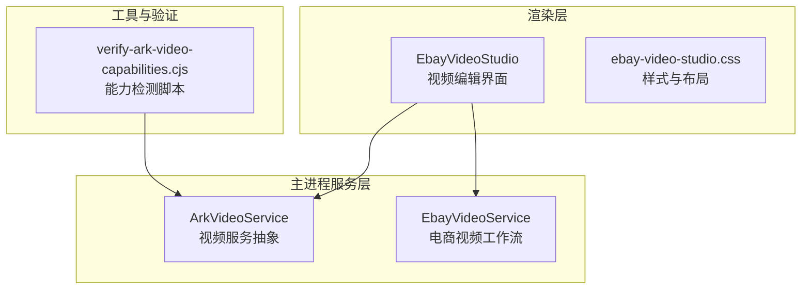
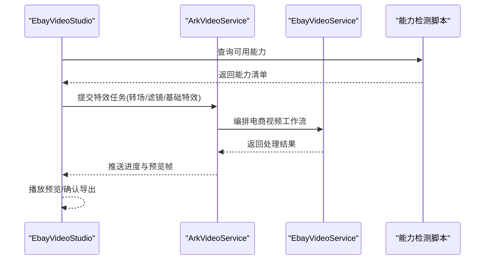
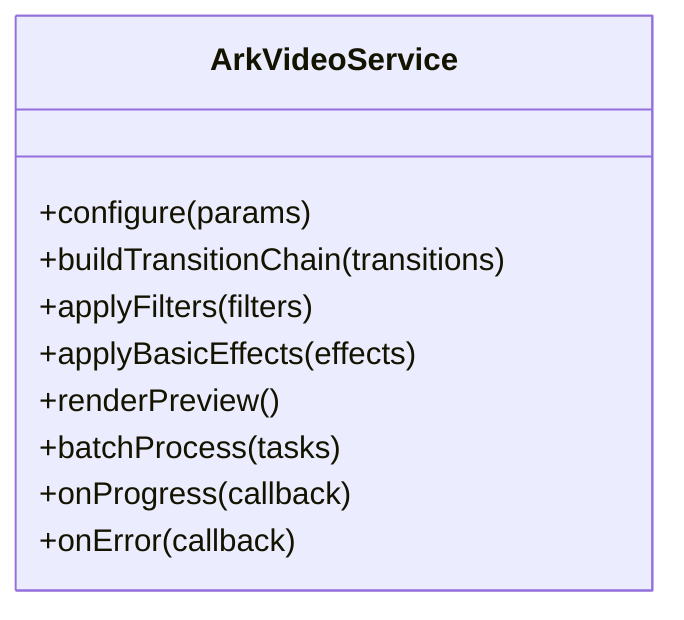
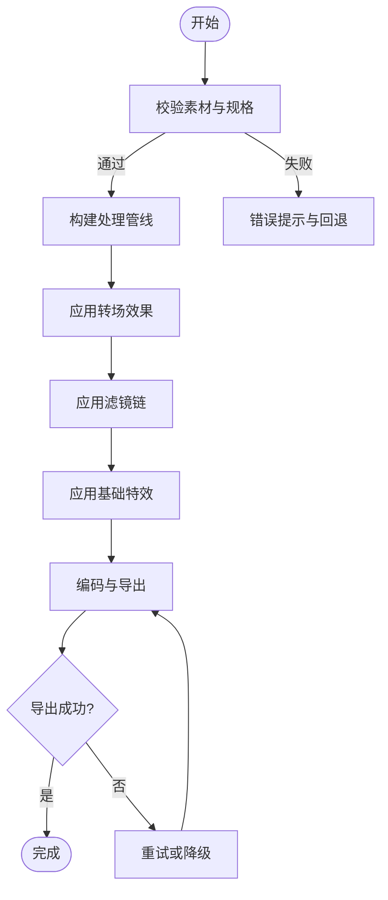
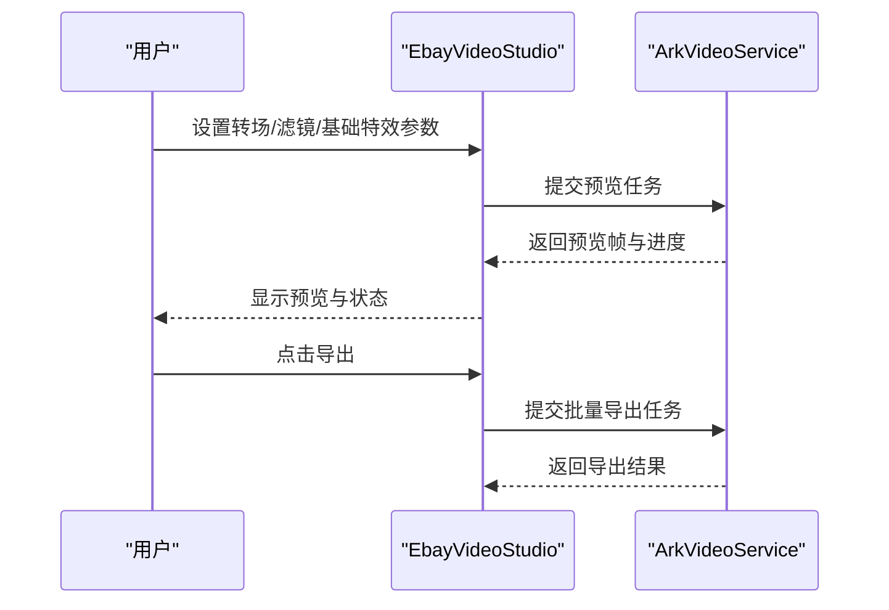
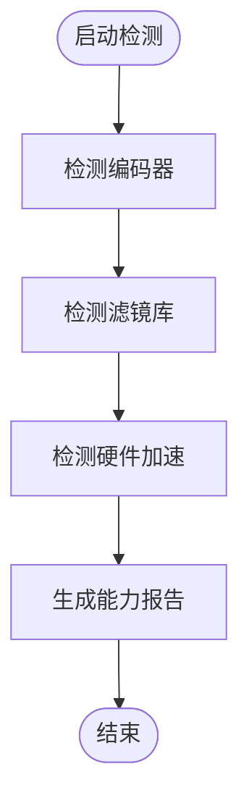
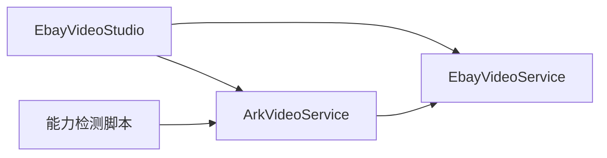

# 视频特效工具

<cite>
**本文引用的文件**   
- [src/main/services/ArkVideoService.ts](file://src/main/services/ArkVideoService.ts)
- [src/main/services/EbayVideoService.ts](file://src/main/services/EbayVideoService.ts)
- [src/renderer/EbayVideoStudio.tsx](file://src/renderer/EbayVideoStudio.tsx)
- [src/renderer/ebay-video-studio.css](file://src/renderer/ebay-video-studio.css)
- [tools/verify-ark-video-capabilities.cjs](file://tools/verify-ark-video-capabilities.cjs)
</cite>

## 目录
1. [简介](#简介)
2. [项目结构](#项目结构)
3. [核心组件](#核心组件)
4. [架构总览](#架构总览)
5. [详细组件分析](#详细组件分析)
6. [依赖关系分析](#依赖关系分析)
7. [性能考量](#性能考量)
8. [故障排查指南](#故障排查指南)
9. [结论](#结论)
10. [附录](#附录) 

## 简介
本文件为“视频特效工具”的权威技术文档，聚焦于转场效果、滤镜应用与视觉特效的实现机制。内容涵盖：
- 转场效果的参数配置与应用方式
- 色彩调整、画面缩放、旋转等基础特效的处理逻辑
- 特效预览、批量应用与自定义扩展接口
- 渲染管线与错误处理策略
- 性能优化建议与常见问题排查

本说明面向开发者与高级用户，既提供高层架构概览，也深入到关键模块的实现细节，帮助快速理解并扩展视频特效能力。

## 项目结构
本项目采用前后端分离的架构：
- 主进程服务层：封装视频处理能力（如调用外部服务或本地工具）
- 渲染层：提供视频编辑界面、预览与交互控制
- 工具脚本：用于能力检测与验证

图表来源
- [src/renderer/EbayVideoStudio.tsx](file://src/renderer/EbayVideoStudio.tsx)
- [src/renderer/ebay-video-studio.css](file://src/renderer/ebay-video-studio.css)
- [src/main/services/ArkVideoService.ts](file://src/main/services/ArkVideoService.ts)
- [src/main/services/EbayVideoService.ts](file://src/main/services/EbayVideoService.ts)
- [tools/verify-ark-video-capabilities.cjs](file://tools/verify-ark-video-capabilities.cjs)

章节来源
- [src/main/services/ArkVideoService.ts](file://src/main/services/ArkVideoService.ts)
- [src/main/services/EbayVideoService.ts](file://src/main/services/EbayVideoService.ts)
- [src/renderer/EbayVideoStudio.tsx](file://src/renderer/EbayVideoStudio.tsx)
- [src/renderer/ebay-video-studio.css](file://src/renderer/ebay-video-studio.css)
- [tools/verify-ark-video-capabilities.cjs](file://tools/verify-ark-video-capabilities.cjs)

## 核心组件
- ArkVideoService：定义视频处理的统一接口与服务契约，负责编排转场、滤镜、基础特效等处理流程，并与底层引擎或服务进行通信。
- EbayVideoService：面向电商场景的视频工作流实现，包含素材准备、转场拼接、滤镜叠加、输出规格校验与批量导出。
- EbayVideoStudio：前端视频编辑面板，提供时间轴、预览窗口、参数面板与批量操作入口。
- verify-ark-video-capabilities.cjs：运行期能力检测脚本，用于探测可用编码器、滤镜库与硬件加速支持。

章节来源
- [src/main/services/ArkVideoService.ts](file://src/main/services/ArkVideoService.ts)
- [src/main/services/EbayVideoService.ts](file://src/main/services/EbayVideoService.ts)
- [src/renderer/EbayVideoStudio.tsx](file://src/renderer/EbayVideoStudio.tsx)
- [tools/verify-ark-video-capabilities.cjs](file://tools/verify-ark-video-capabilities.cjs)

## 架构总览
整体数据流从渲染层发起请求，经主进程服务层编排执行，最终通过编码器输出视频。关键路径包括：
- 参数解析与校验
- 转场与滤镜链构建
- 帧级处理与合成
- 编码与导出

图表来源
- [src/renderer/EbayVideoStudio.tsx](file://src/renderer/EbayVideoStudio.tsx)
- [src/main/services/ArkVideoService.ts](file://src/main/services/ArkVideoService.ts)
- [src/main/services/EbayVideoService.ts](file://src/main/services/EbayVideoService.ts)
- [tools/verify-ark-video-capabilities.cjs](file://tools/verify-ark-video-capabilities.cjs)

## 详细组件分析

### ArkVideoService：视频服务抽象
职责与要点：
- 定义统一的视频处理接口，屏蔽底层差异
- 管理转场、滤镜、基础特效的参数模型与校验规则
- 编排处理管线，支持顺序与并行阶段
- 提供进度回调与错误上报机制

关键能力：
- 转场效果：淡入淡出、滑动、缩放、旋转、混合等
- 滤镜应用：色彩校正、饱和度、对比度、锐化、模糊等
- 基础特效：缩放、裁剪、旋转、翻转、画布填充
- 预览与批处理：分帧预览、队列化处理、失败重试

图表来源
- [src/main/services/ArkVideoService.ts](file://src/main/services/ArkVideoService.ts)

章节来源
- [src/main/services/ArkVideoService.ts](file://src/main/services/ArkVideoService.ts)

### EbayVideoService：电商视频工作流
职责与要点：
- 针对电商平台的视频规范进行适配（分辨率、码率、时长限制）
- 将素材预处理、转场拼接、滤镜叠加、字幕与水印整合为流水线
- 支持批量导入与导出，提供模板化工作流

关键能力：
- 素材校验与标准化
- 多片段转场拼接
- 滤镜链叠加与强度控制
- 输出格式与平台合规检查

图表来源
- [src/main/services/EbayVideoService.ts](file://src/main/services/EbayVideoService.ts)

章节来源
- [src/main/services/EbayVideoService.ts](file://src/main/services/EbayVideoService.ts)

### EbayVideoStudio：前端视频编辑面板
职责与要点：
- 提供时间轴、预览窗口、参数面板与批量操作入口
- 与主进程服务层通信，发送特效任务与接收进度
- 支持实时预览与一键导出

关键能力：
- 参数面板：转场类型、持续时间、强度、方向等
- 滤镜面板：色彩、对比度、饱和度、锐化等
- 基础特效面板：缩放比例、旋转角度、裁剪区域
- 批量操作：选择多个片段，统一应用特效

图表来源
- [src/renderer/EbayVideoStudio.tsx](file://src/renderer/EbayVideoStudio.tsx)
- [src/main/services/ArkVideoService.ts](file://src/main/services/ArkVideoService.ts)

章节来源
- [src/renderer/EbayVideoStudio.tsx](file://src/renderer/EbayVideoStudio.tsx)
- [src/renderer/ebay-video-studio.css](file://src/renderer/ebay-video-studio.css)

### 能力检测脚本：verify-ark-video-capabilities.cjs
职责与要点：
- 探测可用编码器、滤镜库与硬件加速支持
- 生成能力清单供上层决策使用
- 在启动时自动检测，避免运行时异常

关键能力：
- 编码器可用性检测
- 滤镜库版本与特性检测
- 硬件加速能力评估

图表来源
- [tools/verify-ark-video-capabilities.cjs](file://tools/verify-ark-video-capabilities.cjs)

章节来源
- [tools/verify-ark-video-capabilities.cjs](file://tools/verify-ark-video-capabilities.cjs)

## 依赖关系分析
组件间依赖清晰，耦合度低，便于扩展与维护：
- 渲染层依赖服务层接口，不直接访问底层实现
- 服务层之间通过明确契约协作
- 能力检测脚本独立运行，不影响主流程

图表来源
- [src/renderer/EbayVideoStudio.tsx](file://src/renderer/EbayVideoStudio.tsx)
- [src/main/services/ArkVideoService.ts](file://src/main/services/ArkVideoService.ts)
- [src/main/services/EbayVideoService.ts](file://src/main/services/EbayVideoService.ts)
- [tools/verify-ark-video-capabilities.cjs](file://tools/verify-ark-video-capabilities.cjs)

章节来源
- [src/renderer/EbayVideoStudio.tsx](file://src/renderer/EbayVideoStudio.tsx)
- [src/main/services/ArkVideoService.ts](file://src/main/services/ArkVideoService.ts)
- [src/main/services/EbayVideoService.ts](file://src/main/services/EbayVideoService.ts)
- [tools/verify-ark-video-capabilities.cjs](file://tools/verify-ark-video-capabilities.cjs)

## 性能考量
- 分帧预览：仅对关键帧进行渲染，降低CPU占用
- 并行处理：多段视频可并行处理，提升吞吐
- 硬件加速：优先使用GPU加速，减少编码延迟
- 内存管理：及时释放中间帧缓存，避免内存泄漏
- 渐进式导出：支持分段导出与断点续传

[本节为通用指导，无需特定文件引用]

## 故障排查指南
常见问题与解决思路：
- 编码器不可用：检查系统环境与支持列表，回退到软件编码
- 滤镜失效：确认滤镜库版本与特性匹配
- 预览卡顿：降低预览分辨率或关闭不必要的特效
- 导出失败：检查磁盘空间与权限，查看错误日志定位问题

章节来源
- [src/main/services/ArkVideoService.ts](file://src/main/services/ArkVideoService.ts)
- [src/main/services/EbayVideoService.ts](file://src/main/services/EbayVideoService.ts)
- [tools/verify-ark-video-capabilities.cjs](file://tools/verify-ark-video-capabilities.cjs)

## 结论
本视频特效工具通过清晰的分层架构与模块化设计，实现了灵活的转场、滤镜与基础特效处理能力。结合能力检测与性能优化策略，能够在保证质量的同时提供高效的预览与导出体验。未来可扩展更多特效类型与自定义插件接口，以满足多样化需求。

[本节为总结性内容，无需特定文件引用]

## 附录
- 转场效果参数示例：类型、持续时间、强度、方向、混合模式
- 滤镜参数示例：亮度、对比度、饱和度、色相、锐化、模糊
- 基础特效参数示例：缩放比例、旋转角度、裁剪矩形、画布填充颜色
- 批量应用流程：选择片段→应用特效→预览→导出
- 自定义扩展接口：注册新滤镜、新增转场类型、接入第三方编码器

[本节为补充信息，无需特定文件引用]