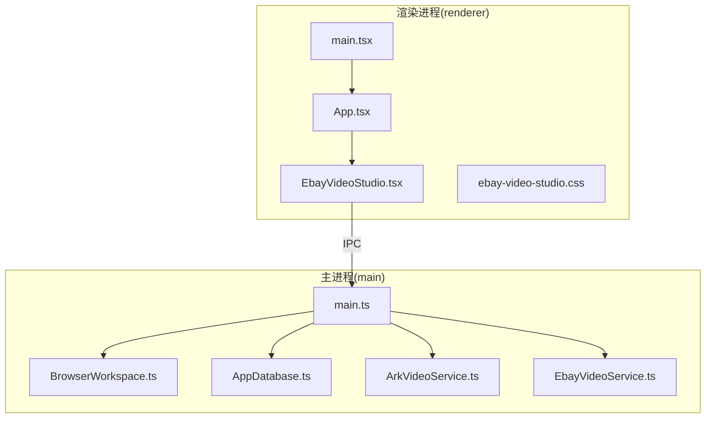
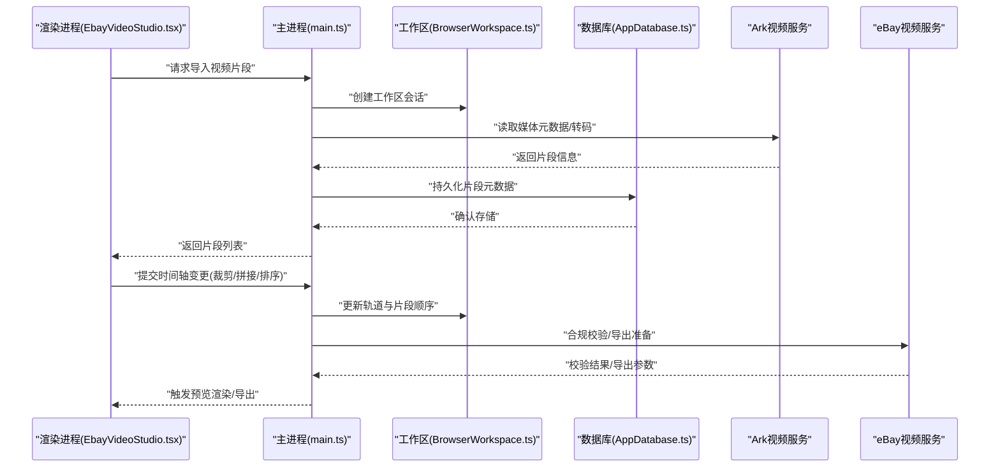
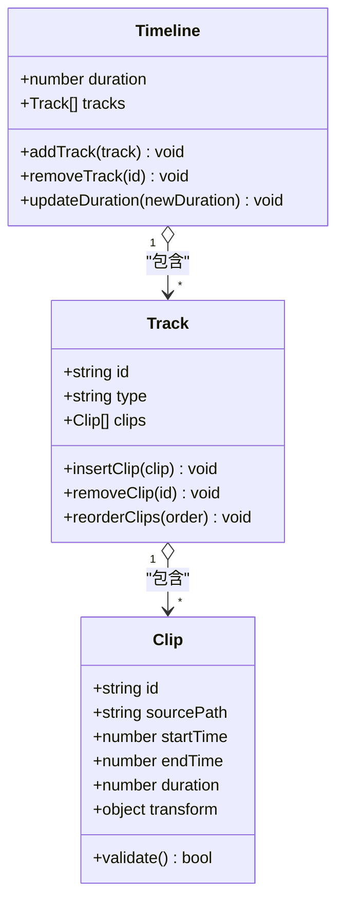
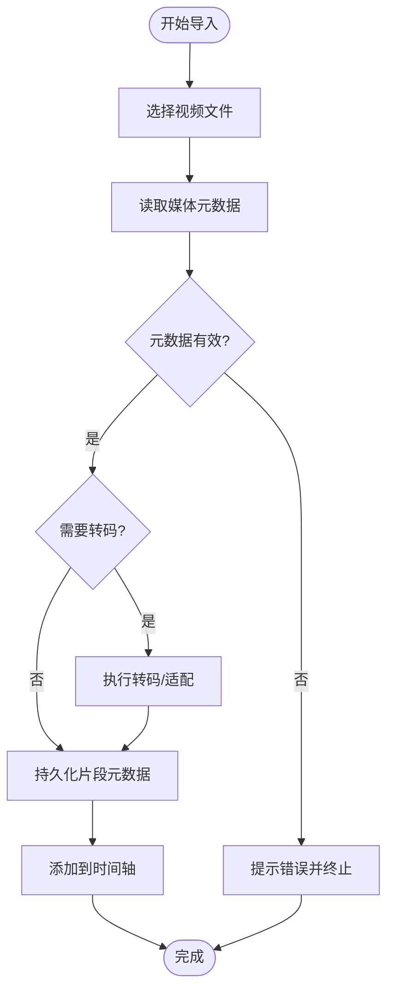
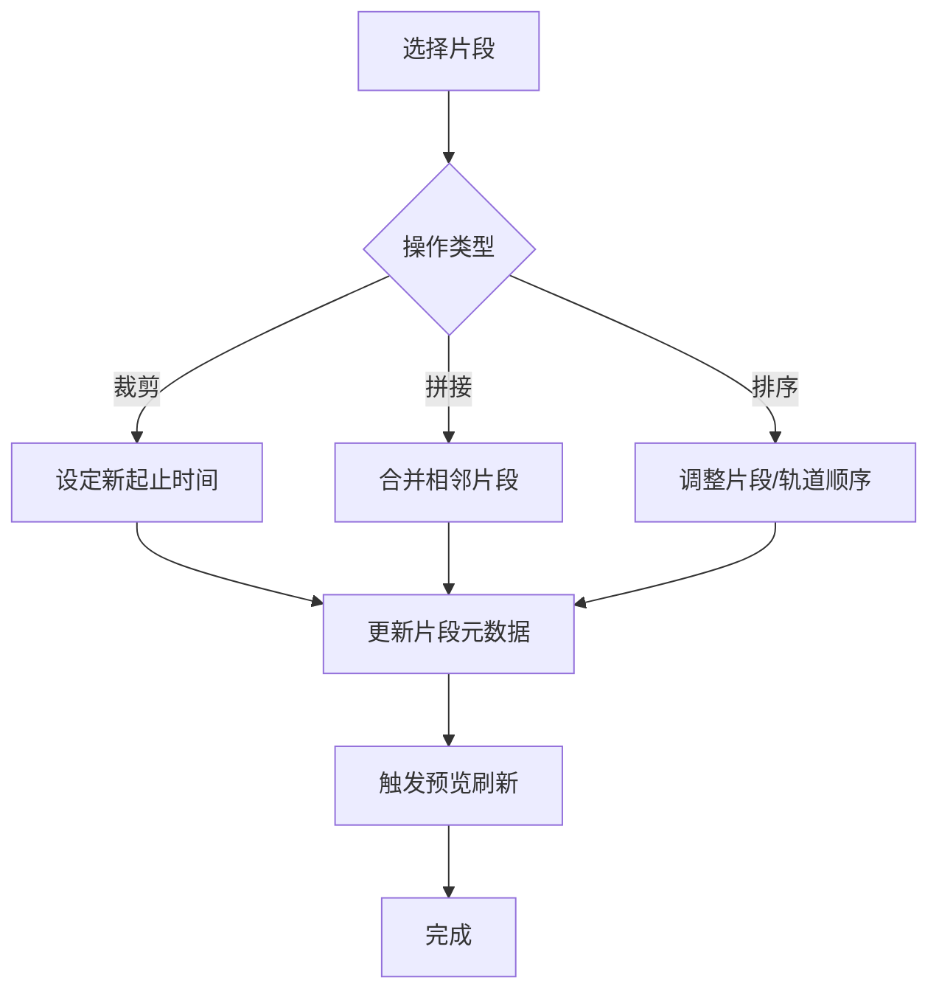
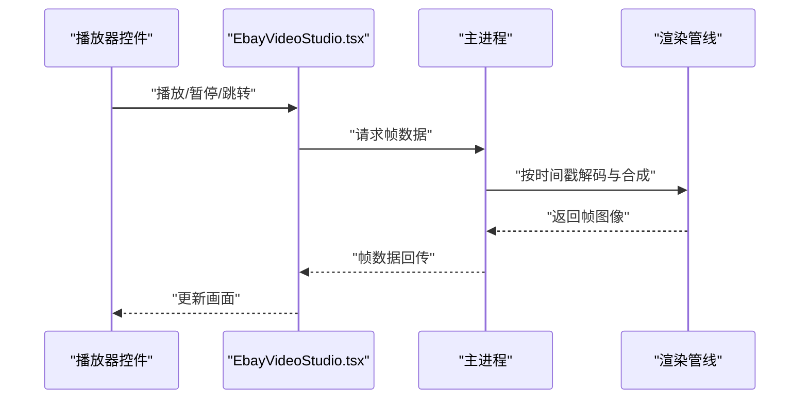
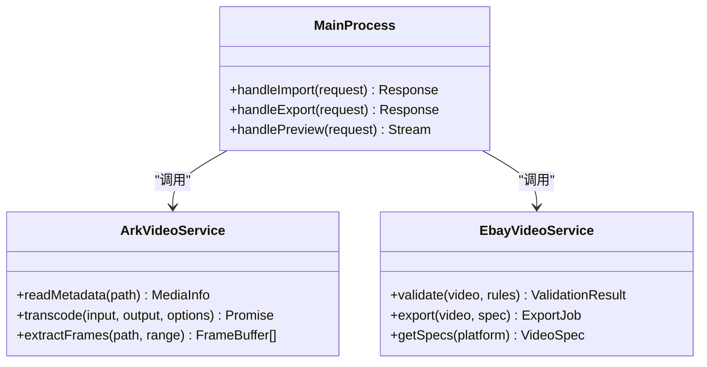
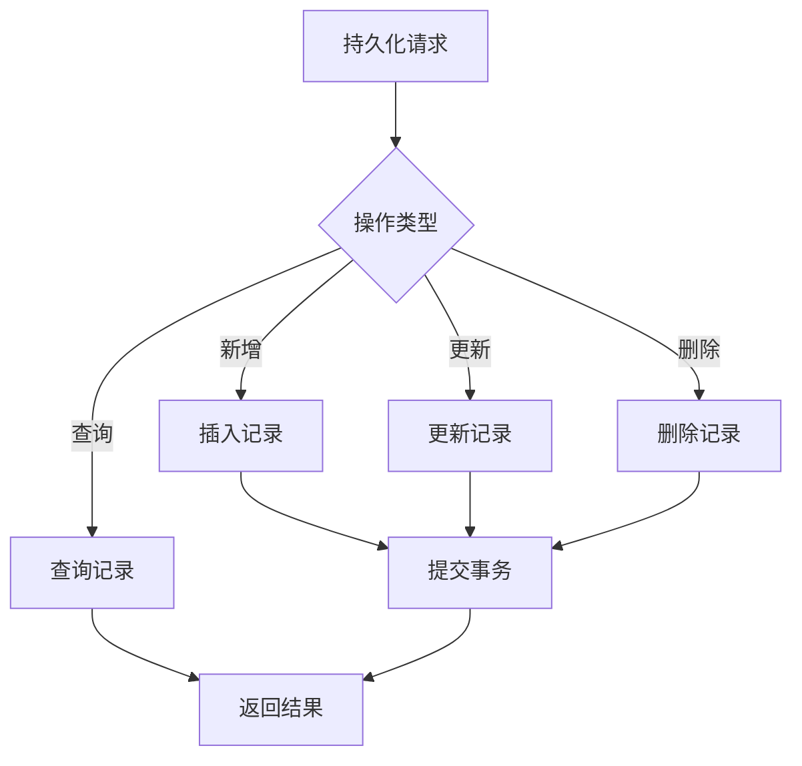
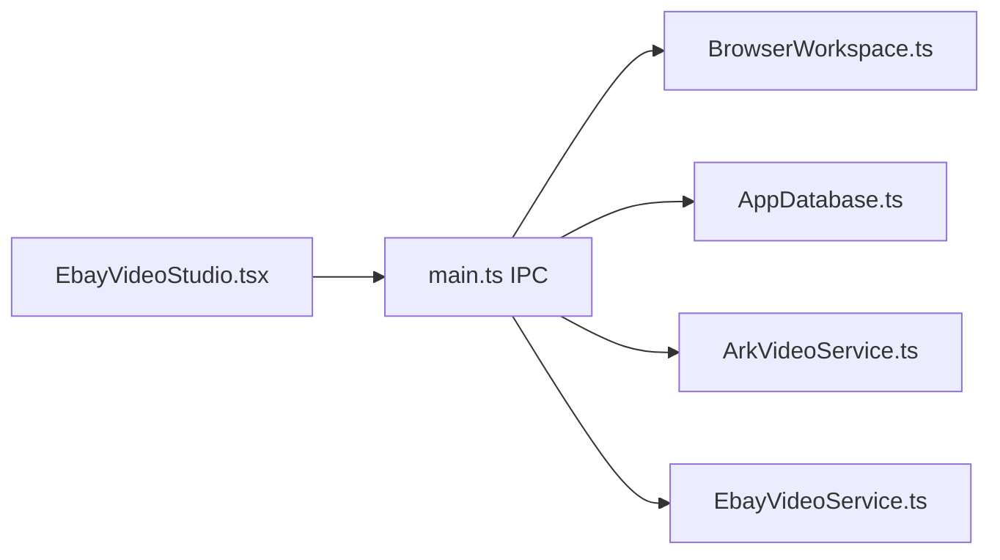

# 视频编辑器核心

<cite>
**本文引用的文件**   
- [package.json](file://package.json)
- [vite.config.ts](file://vite.config.ts)
- [tsconfig.json](file://tsconfig.json)
- [src/main/main.ts](file://src/main/main.ts)
- [src/main/browser/BrowserWorkspace.ts](file://src/main/browser/BrowserWorkspace.ts)
- [src/main/database/AppDatabase.ts](file://src/main/database/AppDatabase.ts)
- [src/main/services/ArkVideoService.ts](file://src/main/services/ArkVideoService.ts)
- [src/main/services/EbayVideoService.ts](file://src/main/services/EbayVideoService.ts)
- [src/renderer/App.tsx](file://src/renderer/App.tsx)
- [src/renderer/EbayVideoStudio.tsx](file://src/renderer/EbayVideoStudio.tsx)
- [src/renderer/main.tsx](file://src/renderer/main.tsx)
- [src/renderer/ebay-video-studio.css](file://src/renderer/ebay-video-studio.css)
</cite>

## 目录
1. [简介](#简介)
2. [项目结构](#项目结构)
3. [核心组件](#核心组件)
4. [架构总览](#架构总览)
5. [详细组件分析](#详细组件分析)
6. [依赖关系分析](#依赖关系分析)
7. [性能与内存管理](#性能与内存管理)
8. [故障排查指南](#故障排查指南)
9. [结论](#结论)
10. [附录](#附录)

## 简介
本文件面向“视频编辑器核心”的架构与实现，围绕时间轴管理、视频轨道处理、片段导入/裁剪/拼接/排序、播放控制与预览渲染等关键能力进行系统化说明。文档同时覆盖视频格式支持、性能优化与内存管理策略，帮助开发者快速理解并扩展该编辑器的核心功能。

## 项目结构
本项目采用 Electron + React 的前后端分离架构：
- main 进程负责应用生命周期、数据库与外部服务桥接（如 ArkVideoService、EbayVideoService）。
- renderer 进程承载 UI 与交互逻辑（App.tsx、EbayVideoStudio.tsx），通过 IPC 与 main 通信。
- shared 提供跨进程共享类型与契约。
- tools 包含辅助脚本与验证工具。

图表来源
- [src/main/main.ts](file://src/main/main.ts)
- [src/main/browser/BrowserWorkspace.ts](file://src/main/browser/BrowserWorkspace.ts)
- [src/main/database/AppDatabase.ts](file://src/main/database/AppDatabase.ts)
- [src/main/services/ArkVideoService.ts](file://src/main/services/ArkVideoService.ts)
- [src/main/services/EbayVideoService.ts](file://src/main/services/EbayVideoService.ts)
- [src/renderer/main.tsx](file://src/renderer/main.tsx)
- [src/renderer/App.tsx](file://src/renderer/App.tsx)
- [src/renderer/EbayVideoStudio.tsx](file://src/renderer/EbayVideoStudio.tsx)

章节来源
- [package.json](file://package.json)
- [vite.config.ts](file://vite.config.ts)
- [tsconfig.json](file://tsconfig.json)

## 核心组件
- 应用入口与窗口管理：main.ts 初始化 Electron 主进程，创建渲染窗口，注册 IPC 通道。
- 浏览器工作区：BrowserWorkspace.ts 封装浏览器侧工作区状态与操作，供主进程调度。
- 数据持久化：AppDatabase.ts 提供本地数据库访问，用于保存工程、片段元数据与用户设置。
- 视频服务：
  - ArkVideoService.ts 封装 Ark 平台相关视频能力（转码、合成、元数据读取等）。
  - EbayVideoService.ts 封装 eBay 平台相关视频能力（合规校验、导出规格等）。
- 渲染界面：
  - App.tsx 作为根组件，组织页面路由与全局状态。
  - EbayVideoStudio.tsx 实现视频工作室的核心 UI：时间轴、轨道、播放器、工具栏。
  - ebay-video-studio.css 定义时间轴与轨道样式。

章节来源
- [src/main/main.ts](file://src/main/main.ts)
- [src/main/browser/BrowserWorkspace.ts](file://src/main/browser/BrowserWorkspace.ts)
- [src/main/database/AppDatabase.ts](file://src/main/database/AppDatabase.ts)
- [src/main/services/ArkVideoService.ts](file://src/main/services/ArkVideoService.ts)
- [src/main/services/EbayVideoService.ts](file://src/main/services/EbayVideoService.ts)
- [src/renderer/App.tsx](file://src/renderer/App.tsx)
- [src/renderer/EbayVideoStudio.tsx](file://src/renderer/EbayVideoStudio.tsx)
- [src/renderer/ebay-video-studio.css](file://src/renderer/ebay-video-studio.css)

## 架构总览
整体采用“渲染层(UI)+主进程(业务/IO)+服务层(平台能力)+数据层(持久化)”的分层架构。渲染层通过 IPC 调用主进程能力，主进程协调 BrowserWorkspace、数据库与视频服务完成具体任务。

图表来源
- [src/renderer/EbayVideoStudio.tsx](file://src/renderer/EbayVideoStudio.tsx)
- [src/main/main.ts](file://src/main/main.ts)
- [src/main/browser/BrowserWorkspace.ts](file://src/main/browser/BrowserWorkspace.ts)
- [src/main/database/AppDatabase.ts](file://src/main/database/AppDatabase.ts)
- [src/main/services/ArkVideoService.ts](file://src/main/services/ArkVideoService.ts)
- [src/main/services/EbayVideoService.ts](file://src/main/services/EbayVideoService.ts)

## 详细组件分析

### 时间轴与轨道模型
- 时间轴由多个轨道组成，每个轨道包含若干片段；片段具备起止时间、源路径、变换属性等元数据。
- 时间轴变更（插入、删除、裁剪、移动）会触发重排与预览刷新。
- 轨道层级决定叠加顺序，上层覆盖下层。

图表来源
- [src/renderer/EbayVideoStudio.tsx](file://src/renderer/EbayVideoStudio.tsx)
- [src/main/browser/BrowserWorkspace.ts](file://src/main/browser/BrowserWorkspace.ts)

章节来源
- [src/renderer/EbayVideoStudio.tsx](file://src/renderer/EbayVideoStudio.tsx)
- [src/main/browser/BrowserWorkspace.ts](file://src/main/browser/BrowserWorkspace.ts)

### 片段导入与元数据处理
- 导入流程：选择文件→读取元数据→可选转码→写入数据库→渲染到时间轴。
- 元数据包括时长、分辨率、编码、帧率等，用于后续裁剪与导出决策。

图表来源
- [src/main/services/ArkVideoService.ts](file://src/main/services/ArkVideoService.ts)
- [src/main/database/AppDatabase.ts](file://src/main/database/AppDatabase.ts)
- [src/renderer/EbayVideoStudio.tsx](file://src/renderer/EbayVideoStudio.tsx)

章节来源
- [src/main/services/ArkVideoService.ts](file://src/main/services/ArkVideoService.ts)
- [src/main/database/AppDatabase.ts](file://src/main/database/AppDatabase.ts)
- [src/renderer/EbayVideoStudio.tsx](file://src/renderer/EbayVideoStudio.tsx)

### 裁剪、拼接与排序
- 裁剪：在片段上设置新的起止时间，重新计算时长与关键帧位置。
- 拼接：将相邻片段合并为单一片段，需对齐帧率与编码参数。
- 排序：调整片段顺序或轨道层级，影响最终合成输出。

图表来源
- [src/renderer/EbayVideoStudio.tsx](file://src/renderer/EbayVideoStudio.tsx)
- [src/main/browser/BrowserWorkspace.ts](file://src/main/browser/BrowserWorkspace.ts)

章节来源
- [src/renderer/EbayVideoStudio.tsx](file://src/renderer/EbayVideoStudio.tsx)
- [src/main/browser/BrowserWorkspace.ts](file://src/main/browser/BrowserWorkspace.ts)

### 播放控制与预览渲染
- 播放控制：播放、暂停、跳转、逐帧步进、循环模式。
- 预览渲染：基于当前时间轴状态生成帧序列，必要时进行实时转码与缩放。
- 渲染管线：解码→滤镜/变换→合成→输出到画布或离屏缓冲。

图表来源
- [src/renderer/EbayVideoStudio.tsx](file://src/renderer/EbayVideoStudio.tsx)
- [src/main/main.ts](file://src/main/main.ts)

章节来源
- [src/renderer/EbayVideoStudio.tsx](file://src/renderer/EbayVideoStudio.tsx)
- [src/main/main.ts](file://src/main/main.ts)

### 平台服务集成（Ark/eBay）
- ArkVideoService：负责媒体读取、转码、基础处理能力。
- EbayVideoService：负责合规校验、导出规格、平台特定参数。

图表来源
- [src/main/services/ArkVideoService.ts](file://src/main/services/ArkVideoService.ts)
- [src/main/services/EbayVideoService.ts](file://src/main/services/EbayVideoService.ts)
- [src/main/main.ts](file://src/main/main.ts)

章节来源
- [src/main/services/ArkVideoService.ts](file://src/main/services/ArkVideoService.ts)
- [src/main/services/EbayVideoService.ts](file://src/main/services/EbayVideoService.ts)
- [src/main/main.ts](file://src/main/main.ts)

### 数据持久化（AppDatabase）
- 存储内容：工程配置、片段元数据、用户偏好、导出任务状态。
- 操作：增删改查、事务、索引优化。

图表来源
- [src/main/database/AppDatabase.ts](file://src/main/database/AppDatabase.ts)

章节来源
- [src/main/database/AppDatabase.ts](file://src/main/database/AppDatabase.ts)

## 依赖关系分析
- 渲染层依赖主进程的 IPC 接口，主进程依赖 BrowserWorkspace、数据库与视频服务。
- 视频服务之间无直接耦合，通过主进程统一编排。
- 数据库独立于服务层，仅暴露数据访问接口。

图表来源
- [src/renderer/EbayVideoStudio.tsx](file://src/renderer/EbayVideoStudio.tsx)
- [src/main/main.ts](file://src/main/main.ts)
- [src/main/browser/BrowserWorkspace.ts](file://src/main/browser/BrowserWorkspace.ts)
- [src/main/database/AppDatabase.ts](file://src/main/database/AppDatabase.ts)
- [src/main/services/ArkVideoService.ts](file://src/main/services/ArkVideoService.ts)
- [src/main/services/EbayVideoService.ts](file://src/main/services/EbayVideoService.ts)

章节来源
- [src/main/main.ts](file://src/main/main.ts)
- [src/main/browser/BrowserWorkspace.ts](file://src/main/browser/BrowserWorkspace.ts)
- [src/main/database/AppDatabase.ts](file://src/main/database/AppDatabase.ts)
- [src/main/services/ArkVideoService.ts](file://src/main/services/ArkVideoService.ts)
- [src/main/services/EbayVideoService.ts](file://src/main/services/EbayVideoService.ts)
- [src/renderer/EbayVideoStudio.tsx](file://src/renderer/EbayVideoStudio.tsx)

## 性能与内存管理
- 解码与渲染
  - 使用硬件加速解码与 GPU 合成，降低 CPU 占用。
  - 按需解码与帧缓存，避免全量加载。
- 转码与导出
  - 异步队列与分片处理，避免阻塞主线程。
  - 增量导出与断点续传，提升大文件稳定性。
- 内存管理
  - 及时释放帧缓冲与临时文件。
  - 限制并发解码与渲染任务数量。
- 时间轴优化
  - 懒加载片段元数据，延迟解析未使用片段。
  - 对频繁操作（裁剪/移动）进行批处理与撤销栈。

[本节为通用指导，不直接分析具体文件]

## 故障排查指南
- 导入失败
  - 检查文件格式与编码是否受支持。
  - 查看 ArkVideoService 的错误日志与转码输出。
- 预览卡顿
  - 降低预览分辨率或帧率。
  - 检查是否存在过多滤镜或复杂变换。
- 导出失败
  - 核对 eBay 合规规则与导出规格。
  - 检查磁盘空间与权限。
- 数据不一致
  - 校验数据库事务完整性。
  - 对比时间轴状态与持久化记录。

章节来源
- [src/main/services/ArkVideoService.ts](file://src/main/services/ArkVideoService.ts)
- [src/main/services/EbayVideoService.ts](file://src/main/services/EbayVideoService.ts)
- [src/main/database/AppDatabase.ts](file://src/main/database/AppDatabase.ts)

## 结论
本视频编辑器核心以分层架构为基础，结合时间轴与轨道模型，实现了片段导入、裁剪、拼接、排序、播放控制与预览渲染等关键能力。通过 Ark/eBay 平台服务集成与数据库持久化，满足多平台导出与合规需求。性能与内存管理策略确保在大工程下的稳定运行。建议持续优化解码与渲染管线，完善错误诊断与用户反馈机制。

[本节为总结性内容，不直接分析具体文件]

## 附录
- 构建与开发
  - 使用 Vite 构建前端资源，TypeScript 编译配置见 tsconfig.json。
  - Electron 主进程入口为 main.ts，渲染进程入口为 main.tsx。
- 样式与主题
  - ebay-video-studio.css 定义时间轴与轨道样式，便于定制外观。

章节来源
- [vite.config.ts](file://vite.config.ts)
- [tsconfig.json](file://tsconfig.json)
- [src/main/main.ts](file://src/main/main.ts)
- [src/renderer/main.tsx](file://src/renderer/main.tsx)
- [src/renderer/ebay-video-studio.css](file://src/renderer/ebay-video-studio.css)