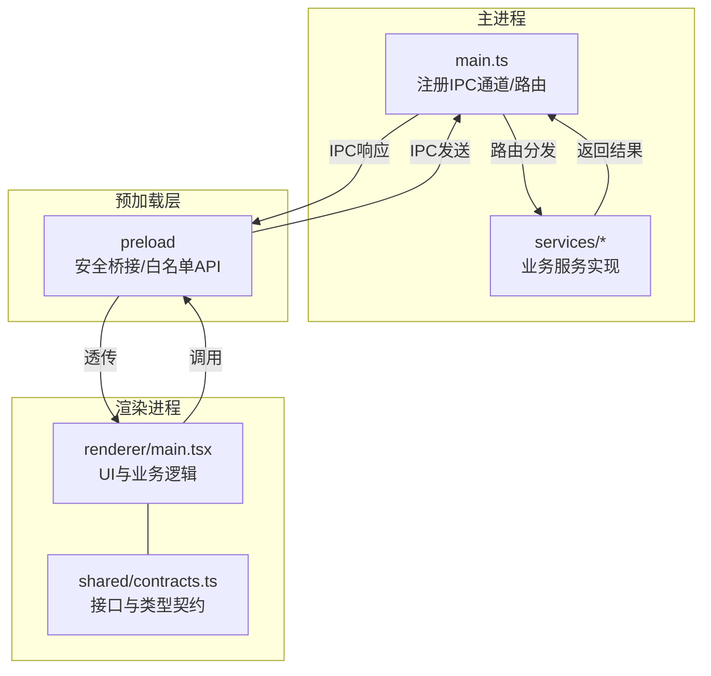
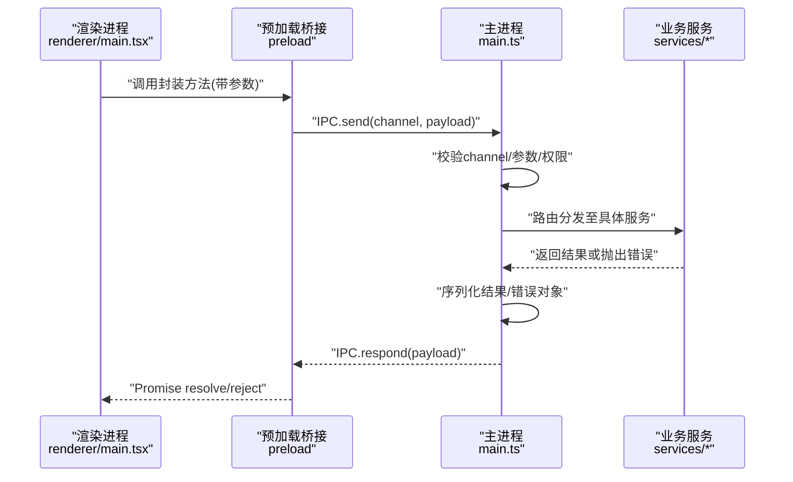
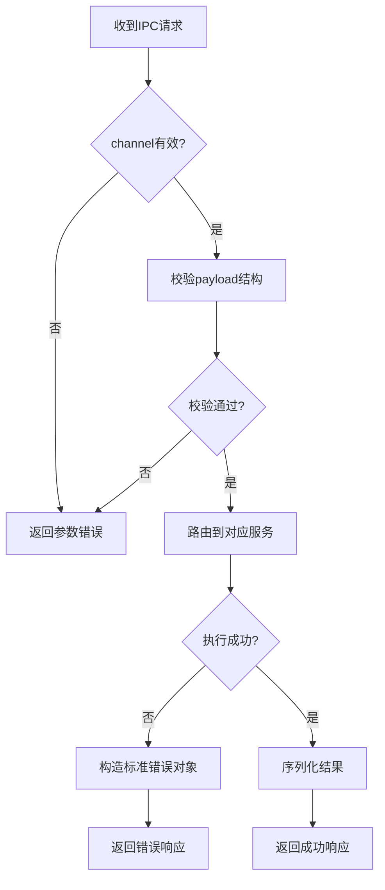
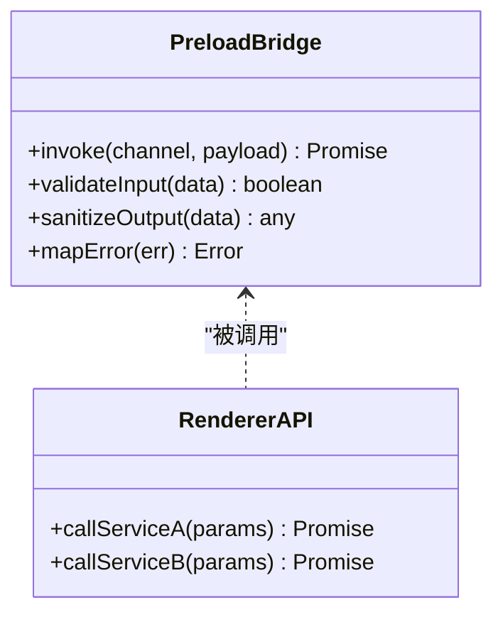
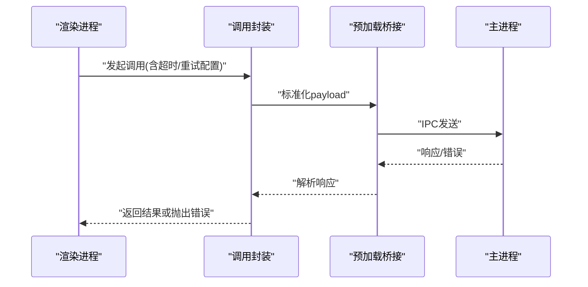
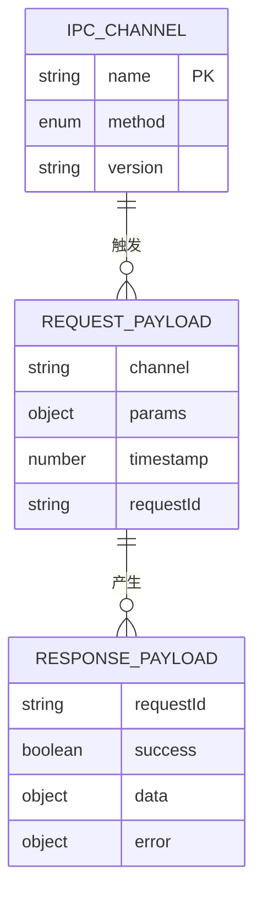
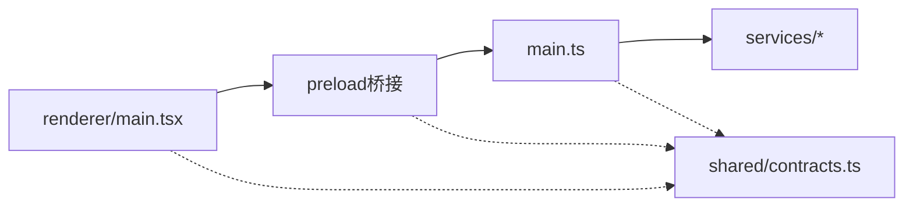

# IPC通信机制

<cite>
**本文引用的文件**   
- [src/main/main.ts](file://src/main/main.ts)
- [src/renderer/main.tsx](file://src/renderer/main.tsx)
- [src/shared/contracts.ts](file://src/shared/contracts.ts)
- [package.json](file://package.json)
</cite>

## 目录
1. [简介](#简介)
2. [项目结构](#项目结构)
3. [核心组件](#核心组件)
4. [架构总览](#架构总览)
5. [详细组件分析](#详细组件分析)
6. [依赖关系分析](#依赖关系分析)
7. [性能考虑](#性能考虑)
8. [故障排查指南](#故障排查指南)
9. [结论](#结论)
10. [附录](#附录)

## 简介
本文件为砚都跨境项目的IPC（进程间通信）机制提供系统化、可落地的架构文档。内容覆盖Electron主进程与渲染进程之间的消息传递、事件订阅与异步调用；preload脚本的安全桥接职责；API封装与数据序列化策略；共享契约文件的接口定义与类型安全保证；错误处理、超时控制与性能优化；以及IPC调用的最佳实践与常见问题解决方案。读者无需深入底层即可理解并正确使用本项目中的IPC能力。

## 项目结构
本项目采用典型的Electron多进程架构：
- 主进程（main）：负责系统级能力、外部服务集成与资源管理，通过IPC暴露受控API。
- 渲染进程（renderer）：运行前端界面逻辑，通过安全的桥接API调用主进程能力。
- 预加载脚本（preload）：在渲染进程上下文内注入受限的API，屏蔽危险的原生能力，实现最小权限原则。
- 共享契约（shared）：前后端共用的接口与类型定义，确保跨进程数据结构一致与类型安全。

**图示来源** 
- [src/main/main.ts](file://src/main/main.ts)
- [src/renderer/main.tsx](file://src/renderer/main.tsx)
- [src/shared/contracts.ts](file://src/shared/contracts.ts)

**章节来源**
- [src/main/main.ts](file://src/main/main.ts)
- [src/renderer/main.tsx](file://src/renderer/main.tsx)
- [src/shared/contracts.ts](file://src/shared/contracts.ts)

## 核心组件
- 主进程IPC路由：集中注册频道、鉴权校验、参数校验、路由分发与异常捕获。
- 预加载桥接：仅暴露必要方法，对输入进行白名单校验与结构化序列化，屏蔽危险API。
- 渲染侧调用封装：统一请求格式、重试与超时、错误映射与日志上报。
- 共享契约：以强类型定义跨进程数据结构，避免“隐式约定”导致的运行时错误。

**章节来源**
- [src/main/main.ts](file://src/main/main.ts)
- [src/renderer/main.tsx](file://src/renderer/main.tsx)
- [src/shared/contracts.ts](file://src/shared/contracts.ts)

## 架构总览
下图展示一次典型IPC调用从渲染进程到主进程的完整流程，包括参数校验、路由分发、服务执行、结果序列化与安全返回。

**图示来源** 
- [src/renderer/main.tsx](file://src/renderer/main.tsx)
- [src/main/main.ts](file://src/main/main.ts)
- [src/shared/contracts.ts](file://src/shared/contracts.ts)

## 详细组件分析

### 主进程IPC路由与调度
- 通道注册：按功能域划分频道命名空间，避免冲突。
- 参数校验：基于共享契约进行入参结构校验，拒绝非法数据。
- 路由分发：根据频道名将请求转发至对应服务模块。
- 异常处理：统一捕获错误，转换为标准错误对象，包含错误码与可读信息。
- 结果序列化：仅允许JSON可序列化的数据类型，避免循环引用与函数等不可序列化值。

**图示来源** 
- [src/main/main.ts](file://src/main/main.ts)
- [src/shared/contracts.ts](file://src/shared/contracts.ts)

**章节来源**
- [src/main/main.ts](file://src/main/main.ts)
- [src/shared/contracts.ts](file://src/shared/contracts.ts)

### 预加载脚本的安全桥接
- 最小权限：仅暴露必要的API方法，不直接暴露Node.js或Electron原生能力。
- 输入过滤：对传入参数进行类型与范围检查，防止恶意或意外数据进入主进程。
- 输出净化：对返回数据进行白名单过滤，移除敏感字段。
- 错误映射：将主进程错误映射为前端友好的错误对象，便于上层处理。
- 幂等与去抖：对高频调用提供本地缓存或去抖策略，降低主进程压力。

**图示来源** 
- [src/renderer/main.tsx](file://src/renderer/main.tsx)
- [src/shared/contracts.ts](file://src/shared/contracts.ts)

**章节来源**
- [src/renderer/main.tsx](file://src/renderer/main.tsx)
- [src/shared/contracts.ts](file://src/shared/contracts.ts)

### 渲染进程调用封装
- 统一入口：所有IPC调用通过封装方法发起，保证一致的请求格式与错误处理。
- 超时控制：为每次调用设置合理超时，避免阻塞UI线程。
- 重试策略：对网络或服务瞬时失败进行有限次重试，指数退避。
- 错误分类：区分参数错误、权限错误、服务错误与超时错误，便于定位问题。
- 日志上报：记录关键调用轨迹与错误堆栈，支持线上问题回溯。

**图示来源** 
- [src/renderer/main.tsx](file://src/renderer/main.tsx)
- [src/main/main.ts](file://src/main/main.ts)

**章节来源**
- [src/renderer/main.tsx](file://src/renderer/main.tsx)
- [src/main/main.ts](file://src/main/main.ts)

### 共享契约与类型安全
- 接口定义：在共享文件中统一定义IPC频道、请求/响应结构与枚举值。
- 类型约束：使用强类型约束参数与返回值，编译期发现不一致。
- 版本兼容：通过版本号或兼容性标记，平滑演进接口而不破坏旧客户端。
- 校验前置：在主进程与预加载层均进行结构校验，双重保障。

**图示来源** 
- [src/shared/contracts.ts](file://src/shared/contracts.ts)

**章节来源**
- [src/shared/contracts.ts](file://src/shared/contracts.ts)

## 依赖关系分析
- 渲染进程依赖预加载桥接提供的API，间接依赖主进程服务。
- 主进程依赖共享契约进行参数校验与路由匹配。
- 预加载桥接依赖共享契约进行输入输出净化与错误映射。
- 所有模块通过共享契约保持数据结构一致性，降低耦合度。

**图示来源** 
- [src/renderer/main.tsx](file://src/renderer/main.tsx)
- [src/main/main.ts](file://src/main/main.ts)
- [src/shared/contracts.ts](file://src/shared/contracts.ts)

**章节来源**
- [src/renderer/main.tsx](file://src/renderer/main.tsx)
- [src/main/main.ts](file://src/main/main.ts)
- [src/shared/contracts.ts](file://src/shared/contracts.ts)

## 性能考虑
- 批量操作：合并多次小请求为单次批量调用，减少IPC开销。
- 流式传输：大文件/大数据采用分块或流式传输，避免内存峰值。
- 缓存策略：对读多写少的数据在预加载层做短期缓存，降低重复调用。
- 异步优先：避免在主线程执行耗时任务，必要时使用Worker或子进程。
- 监控指标：统计调用延迟、错误率与吞吐，持续优化热点路径。

[本节为通用指导，不直接分析具体文件]

## 故障排查指南
- 常见错误分类
  - 参数错误：检查共享契约与入参结构是否一致。
  - 权限错误：确认当前用户角色与频道访问权限。
  - 服务错误：查看主进程服务日志与异常堆栈。
  - 超时错误：调整超时阈值或优化服务响应时间。
- 定位步骤
  - 启用调试日志，记录requestId与调用链。
  - 复现问题并抓取IPC请求/响应报文。
  - 逐步缩小范围至具体频道与服务。
- 恢复策略
  - 自动重试与降级：对非关键路径启用重试与默认值。
  - 熔断保护：对不稳定服务快速失败，避免雪崩。
  - 回滚机制：接口变更时保留向后兼容版本。

**章节来源**
- [src/main/main.ts](file://src/main/main.ts)
- [src/renderer/main.tsx](file://src/renderer/main.tsx)
- [src/shared/contracts.ts](file://src/shared/contracts.ts)

## 结论
通过“共享契约 + 预加载桥接 + 主进程路由”的分层设计，砚都跨境项目在保障安全性的同时实现了高效、稳定的IPC通信。统一的错误处理、超时控制与性能优化策略进一步提升了系统的健壮性与可维护性。建议在实际开发中严格遵循本文的最佳实践，持续完善监控与诊断能力。

[本节为总结性内容，不直接分析具体文件]

## 附录
- 环境配置要点
  - Electron版本与特性开关需与项目依赖保持一致。
  - 预加载脚本需在窗口创建时正确注入。
- 参考文件
  - 主进程入口与IPC注册：[src/main/main.ts](file://src/main/main.ts)
  - 渲染进程入口与调用封装：[src/renderer/main.tsx](file://src/renderer/main.tsx)
  - 共享契约与类型定义：[src/shared/contracts.ts](file://src/shared/contracts.ts)
  - 项目依赖与脚本：[package.json](file://package.json)

**章节来源**
- [src/main/main.ts](file://src/main/main.ts)
- [src/renderer/main.tsx](file://src/renderer/main.tsx)
- [src/shared/contracts.ts](file://src/shared/contracts.ts)
- [package.json](file://package.json)