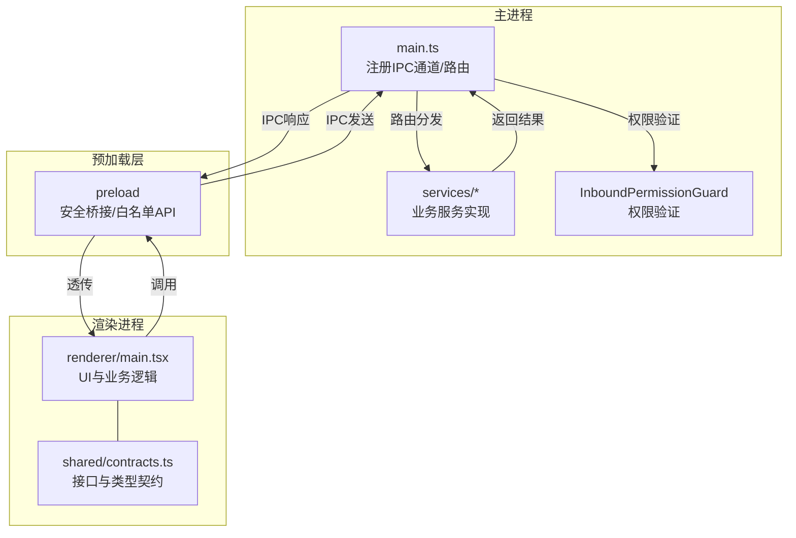
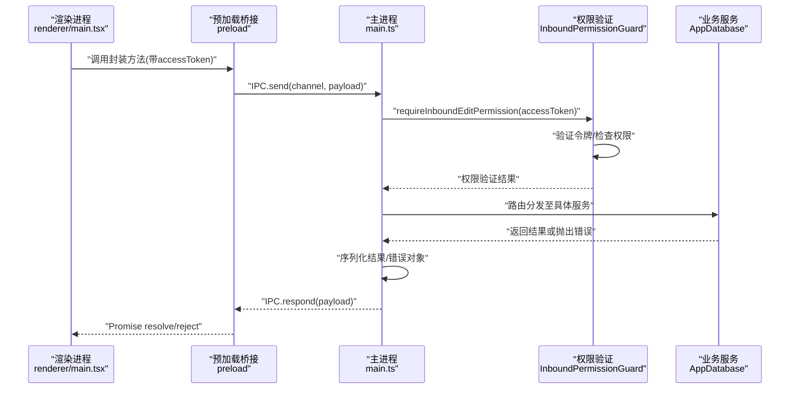
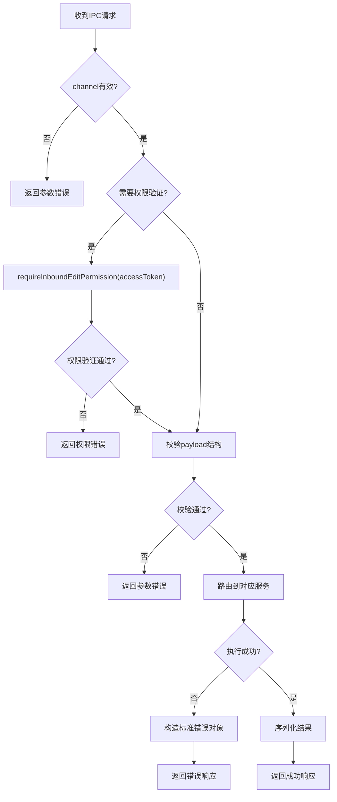
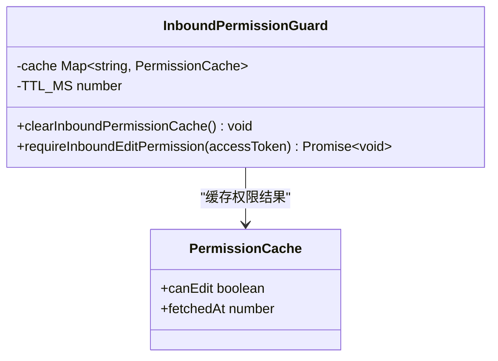
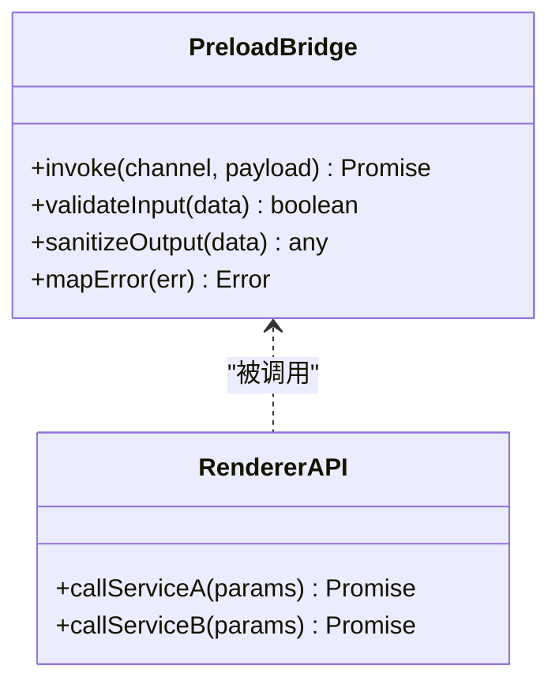
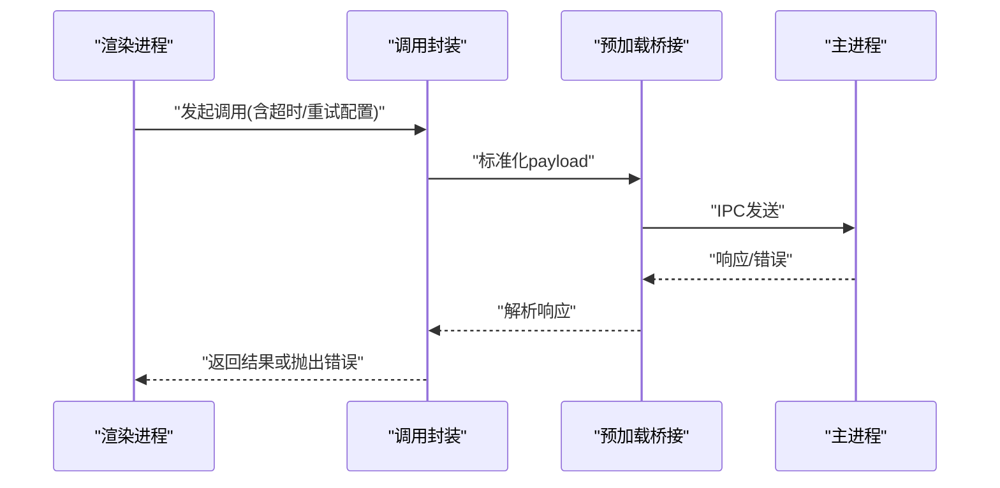
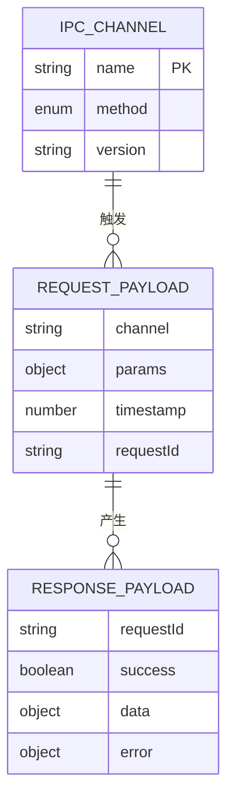
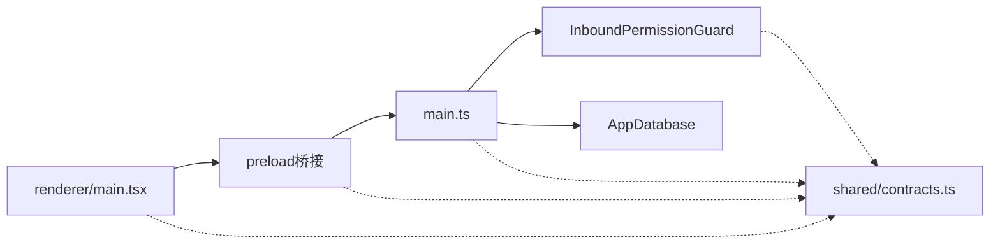

# IPC通信机制

<cite>
**本文引用的文件**   
- [src/main/main.ts](file://src/main/main.ts)
- [src/main/services/InboundPermissionGuard.ts](file://src/main/services/InboundPermissionGuard.ts)
- [src/shared/contracts.ts](file://src/shared/contracts.ts)
- [src/main/database/AppDatabase.ts](file://src/main/database/AppDatabase.ts)
</cite>

## 更新摘要
**变更内容**   
- 新增入库处理相关的IPC消息处理器，包括reedit、return、erpIntake等操作通道
- 强化了令牌验证机制，引入requireInboundEditPermission权限校验
- 更新了主进程IPC路由，所有写操作都需要accessToken参数进行权限验证
- 增强了共享契约中的入库相关类型定义

## 目录
1. [简介](#简介)
2. [项目结构](#项目结构)
3. [核心组件](#核心组件)
4. [架构总览](#架构总览)
5. [详细组件分析](#详细组件分析)
6. [依赖关系分析](#依赖关系分析)
7. [性能考虑](#性能考虑)
8. [故障排查指南](#故障排查指南)
9. [结论](#结论)
10. [附录](#附录)

## 简介
本文件为砚都跨境项目的IPC（进程间通信）机制提供系统化、可落地的架构文档。内容覆盖Electron主进程与渲染进程之间的消息传递、事件订阅与异步调用；preload脚本的安全桥接职责；API封装与数据序列化策略；共享契约文件的接口定义与类型安全保证；错误处理、超时控制与性能优化；以及IPC调用的最佳实践与常见问题解决方案。特别关注最新的入库处理增强功能，包括增强的消息处理器和强化的令牌验证机制。

## 项目结构
本项目采用典型的Electron多进程架构：
- 主进程（main）：负责系统级能力、外部服务集成与资源管理，通过IPC暴露受控API。
- 渲染进程（renderer）：运行前端界面逻辑，通过安全的桥接API调用主进程能力。
- 预加载脚本（preload）：在渲染进程上下文内注入受限的API，屏蔽危险的原生能力，实现最小权限原则。
- 共享契约（shared）：前后端共用的接口与类型定义，确保跨进程数据结构一致与类型安全。

```mermaid
graph TB
subgraph "主进程"
M["main.ts<br/>注册IPC通道/路由"]
S["services/*<br/>业务服务实现"]
P["InboundPermissionGuard<br/>权限验证"]
end
subgraph "预加载层"
PR["preload<br/>安全桥接/白名单API"]
end
subgraph "渲染进程"
R["renderer/main.tsx<br/>UI与业务逻辑"]
SH["shared/contracts.ts<br/>接口与类型契约"]
end
R --> |调用| PR
PR --> |IPC发送| M
M --> |路由分发| S
M --> |权限验证| P
S --> |返回结果| M
M --> |IPC响应| PR
PR --> |透传| R
R --- SH
```

**图示来源** 
- [src/main/main.ts](file://src/main/main.ts)
- [src/main/services/InboundPermissionGuard.ts](file://src/main/services/InboundPermissionGuard.ts)
- [src/shared/contracts.ts](file://src/shared/contracts.ts)

## 核心组件
- 主进程IPC路由：集中注册频道、鉴权校验、参数校验、路由分发与异常捕获。
- 预加载桥接：仅暴露必要方法，对输入进行白名单校验与结构化序列化，屏蔽危险API。
- 权限验证器：专门处理入库操作的权限验证，支持令牌缓存和会话过期检测。
- 渲染侧调用封装：统一请求格式、重试与超时、错误映射与日志上报。
- 共享契约：以强类型定义跨进程数据结构，避免"隐式约定"导致的运行时错误。

## 架构总览
下图展示一次典型IPC调用从渲染进程到主进程的完整流程，包括参数校验、权限验证、路由分发、服务执行、结果序列化与安全返回。

```mermaid
sequenceDiagram
participant UI as "渲染进程<br/>renderer/main.tsx"
participant Bridge as "预加载桥接<br/>preload"
participant Main as "主进程<br/>main.ts"
participant Auth as "权限验证<br/>InboundPermissionGuard"
participant Service as "业务服务<br/>AppDatabase"
UI->>Bridge : "调用封装方法(带accessToken)"
Bridge->>Main : "IPC.send(channel, payload)"
Main->>Auth : "requireInboundEditPermission(accessToken)"
Auth->>Auth : "验证令牌/检查权限"
Auth-->>Main : "权限验证结果"
Main->>Service : "路由分发至具体服务"
Service-->>Main : "返回结果或抛出错误"
Main->>Main : "序列化结果/错误对象"
Main-->>Bridge : "IPC.respond(payload)"
Bridge-->>UI : "Promise resolve/reject"
```

**图示来源** 
- [src/main/main.ts](file://src/main/main.ts)
- [src/main/services/InboundPermissionGuard.ts](file://src/main/services/InboundPermissionGuard.ts)
- [src/shared/contracts.ts](file://src/shared/contracts.ts)

## 详细组件分析

### 主进程IPC路由与调度
- 通道注册：按功能域划分频道命名空间，避免冲突。
- 参数校验：基于共享契约进行入参结构校验，拒绝非法数据。
- 权限验证：所有写操作必须通过requireInboundEditPermission进行令牌验证。
- 路由分发：根据频道名将请求转发至对应服务模块。
- 异常处理：统一捕获错误，转换为标准错误对象，包含错误码与可读信息。
- 结果序列化：仅允许JSON可序列化的数据类型，避免循环引用与函数等不可序列化值。

**更新** 新增了针对入库处理的专用IPC通道，包括erp:intake、inbound:reedit、inbound:confirm、inbound:reject、inbound:return等，所有写操作都需要accessToken参数。

```mermaid
flowchart TD
A["收到IPC请求"] --> B{"channel有效?"}
B --> |否| E["返回参数错误"]
B --> |是| C{"需要权限验证?"}
C --> |是| D["requireInboundEditPermission(accessToken)"]
D --> F{"权限验证通过?"}
F --> |否| G["返回权限错误"]
F --> |是| H["校验payload结构"]
C --> |否| H["校验payload结构"]
H --> I{"校验通过?"}
I --> |否| J["返回参数错误"]
I --> |是| K["路由到对应服务"]
K --> L{"执行成功?"}
L --> |否| M["构造标准错误对象"]
L --> |是| N["序列化结果"]
M --> O["返回错误响应"]
N --> P["返回成功响应"]
```

**图示来源** 
- [src/main/main.ts](file://src/main/main.ts)
- [src/main/services/InboundPermissionGuard.ts](file://src/main/services/InboundPermissionGuard.ts)
- [src/shared/contracts.ts](file://src/shared/contracts.ts)

**章节来源**
- [src/main/main.ts:2596-2619](file://src/main/main.ts#L2596-L2619)
- [src/shared/contracts.ts](file://src/shared/contracts.ts)

### 权限验证机制
- 令牌验证：通过requireInboundEditPermission函数验证用户令牌的有效性。
- 权限检查：调用服务器API /api/erp/capabilities 检查用户是否具有erp.warehouse.edit权限。
- 缓存机制：使用60秒TTL缓存权限检查结果，减少重复网络请求。
- 会话过期处理：特殊处理SERVER_SESSION_EXPIRED错误，便于前端重新登录。
- 失败保护：网络错误或权限不足时抛出明确的错误信息。

```mermaid
classDiagram
class InboundPermissionGuard {
+clearInboundPermissionCache() void
+requireInboundEditPermission(accessToken) Promise~void~
-cache Map~string, PermissionCache~
-TTL_MS number
}
class PermissionCache {
+canEdit boolean
+fetchedAt number
}
InboundPermissionGuard --> PermissionCache : "缓存权限结果"
```

**图示来源** 
- [src/main/services/InboundPermissionGuard.ts](file://src/main/services/InboundPermissionGuard.ts)

**章节来源**
- [src/main/services/InboundPermissionGuard.ts:1-39](file://src/main/services/InboundPermissionGuard.ts#L1-L39)

### 预加载脚本的安全桥接
- 最小权限：仅暴露必要的API方法，不直接暴露Node.js或Electron原生能力。
- 输入过滤：对传入参数进行类型与范围检查，防止恶意或意外数据进入主进程。
- 输出净化：对返回数据进行白名单过滤，移除敏感字段。
- 错误映射：将主进程错误映射为前端友好的错误对象，便于上层处理。
- 幂等与去抖：对高频调用提供本地缓存或去抖策略，降低主进程压力。

```mermaid
classDiagram
class PreloadBridge {
+invoke(channel, payload) Promise
+validateInput(data) boolean
+sanitizeOutput(data) any
+mapError(err) Error
}
class RendererAPI {
+callServiceA(params) Promise
+callServiceB(params) Promise
}
PreloadBridge <.. RendererAPI : "被调用"
```

**图示来源** 
- [src/shared/contracts.ts](file://src/shared/contracts.ts)

**章节来源**
- [src/shared/contracts.ts](file://src/shared/contracts.ts)

### 渲染进程调用封装
- 统一入口：所有IPC调用通过封装方法发起，保证一致的请求格式与错误处理。
- 超时控制：为每次调用设置合理超时，避免阻塞UI线程。
- 重试策略：对网络或服务瞬时失败进行有限次重试，指数退避。
- 错误分类：区分参数错误、权限错误、服务错误与超时错误，便于定位问题。
- 日志上报：记录关键调用轨迹与错误堆栈，支持线上问题回溯。

```mermaid
sequenceDiagram
participant UI as "渲染进程"
participant API as "调用封装"
participant Bridge as "预加载桥接"
participant Main as "主进程"
UI->>API : "发起调用(含超时/重试配置)"
API->>Bridge : "标准化payload"
Bridge->>Main : "IPC发送"
Main-->>Bridge : "响应/错误"
Bridge-->>API : "解析响应"
API-->>UI : "返回结果或抛出错误"
```

**图示来源** 
- [src/main/main.ts](file://src/main/main.ts)

**章节来源**
- [src/main/main.ts](file://src/main/main.ts)

### 共享契约与类型安全
- 接口定义：在共享文件中统一定义IPC频道、请求/响应结构与枚举值。
- 类型约束：使用强类型约束参数与返回值，编译期发现不一致。
- 版本兼容：通过版本号或兼容性标记，平滑演进接口而不破坏旧客户端。
- 校验前置：在主进程与预加载层均进行结构校验，双重保障。

**更新** 新增了入库处理相关的类型定义，包括InboundSnapshot、InboundProcessingItem、InboundErpIntakeInput等，支持完整的入库工作流。

```mermaid
erDiagram
IPC_CHANNEL {
string name PK
enum method
string version
}
REQUEST_PAYLOAD {
string channel
object params
number timestamp
string requestId
}
RESPONSE_PAYLOAD {
string requestId
boolean success
object data
object error
}
IPC_CHANNEL ||--o{ REQUEST_PAYLOAD : "触发"
REQUEST_PAYLOAD ||--o{ RESPONSE_PAYLOAD : "产生"
```

**图示来源** 
- [src/shared/contracts.ts](file://src/shared/contracts.ts)

**章节来源**
- [src/shared/contracts.ts:1800-1837](file://src/shared/contracts.ts#L1800-L1837)

## 依赖关系分析
- 渲染进程依赖预加载桥接提供的API，间接依赖主进程服务。
- 主进程依赖共享契约进行参数校验与路由匹配。
- 权限验证器依赖服务器API进行实时权限检查。
- 预加载桥接依赖共享契约进行输入输出净化与错误映射。
- 所有模块通过共享契约保持数据结构一致性，降低耦合度。

```mermaid
graph LR
R["renderer/main.tsx"] --> P["preload桥接"]
P --> M["main.ts"]
M --> A["InboundPermissionGuard"]
M --> S["AppDatabase"]
R -.-> C["shared/contracts.ts"]
P -.-> C
M -.-> C
A -.-> C
```

**图示来源** 
- [src/main/main.ts](file://src/main/main.ts)
- [src/main/services/InboundPermissionGuard.ts](file://src/main/services/InboundPermissionGuard.ts)
- [src/shared/contracts.ts](file://src/shared/contracts.ts)

**章节来源**
- [src/main/main.ts](file://src/main/main.ts)
- [src/main/services/InboundPermissionGuard.ts](file://src/main/services/InboundPermissionGuard.ts)
- [src/shared/contracts.ts](file://src/shared/contracts.ts)

## 性能考虑
- 批量操作：合并多次小请求为单次批量调用，减少IPC开销。
- 流式传输：大文件/大数据采用分块或流式传输，避免内存峰值。
- 缓存策略：对读多写少的数据在预加载层做短期缓存，降低重复调用。
- 权限缓存：使用60秒TTL缓存权限检查结果，减少重复网络请求。
- 异步优先：避免在主线程执行耗时任务，必要时使用Worker或子进程。
- 监控指标：统计调用延迟、错误率与吞吐，持续优化热点路径。

## 故障排查指南
- 常见错误分类
  - 参数错误：检查共享契约与入参结构是否一致。
  - 权限错误：确认当前用户角色与频道访问权限，检查accessToken是否有效。
  - 服务错误：查看主进程服务日志与异常堆栈。
  - 超时错误：调整超时阈值或优化服务响应时间。
  - 会话过期：处理SERVER_SESSION_EXPIRED错误，提示用户重新登录。
- 定位步骤
  - 启用调试日志，记录requestId与调用链。
  - 复现问题并抓取IPC请求/响应报文。
  - 逐步缩小范围至具体频道与服务。
  - 检查权限验证日志，确认令牌有效性。
- 恢复策略
  - 自动重试与降级：对非关键路径启用重试与默认值。
  - 熔断保护：对不稳定服务快速失败，避免雪崩。
  - 回滚机制：接口变更时保留向后兼容版本。
  - 会话刷新：检测到会话过期时自动触发重新登录流程。

**章节来源**
- [src/main/main.ts](file://src/main/main.ts)
- [src/main/services/InboundPermissionGuard.ts](file://src/main/services/InboundPermissionGuard.ts)
- [src/shared/contracts.ts](file://src/shared/contracts.ts)

## 结论
通过"共享契约 + 预加载桥接 + 主进程路由 + 权限验证"的分层设计，砚都跨境项目在保障安全性的同时实现了高效、稳定的IPC通信。特别是新增的入库处理增强功能和强化的令牌验证机制，进一步提升了系统的健壮性与可维护性。统一的错误处理、超时控制与性能优化策略确保了系统的可靠性。建议在实际开发中严格遵循本文的最佳实践，持续完善监控与诊断能力。

## 附录
- 环境配置要点
  - Electron版本与特性开关需与项目依赖保持一致。
  - 预加载脚本需在窗口创建时正确注入。
  - 权限验证服务器API需正确配置。
- 参考文件
  - 主进程入口与IPC注册：[src/main/main.ts](file://src/main/main.ts)
  - 权限验证服务：[src/main/services/InboundPermissionGuard.ts](file://src/main/services/InboundPermissionGuard.ts)
  - 共享契约与类型定义：[src/shared/contracts.ts](file://src/shared/contracts.ts)
  - 数据库操作：[src/main/database/AppDatabase.ts](file://src/main/database/AppDatabase.ts)

**章节来源**
- [src/main/main.ts](file://src/main/main.ts)
- [src/main/services/InboundPermissionGuard.ts](file://src/main/services/InboundPermissionGuard.ts)
- [src/shared/contracts.ts](file://src/shared/contracts.ts)
- [src/main/database/AppDatabase.ts](file://src/main/database/AppDatabase.ts)