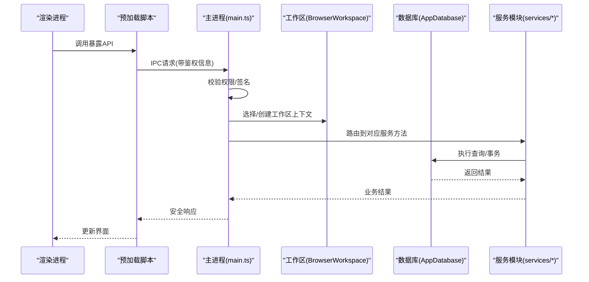
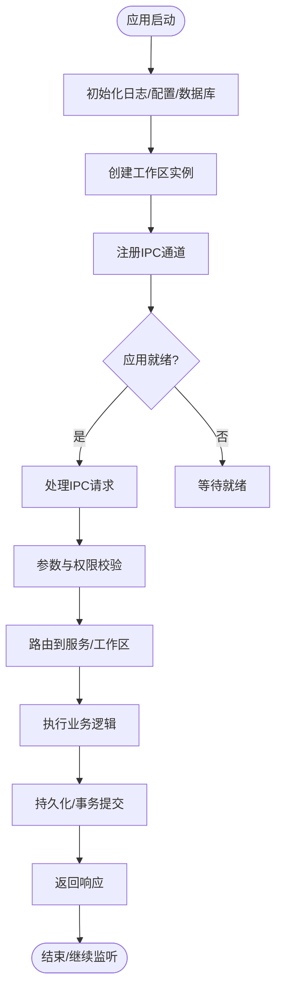
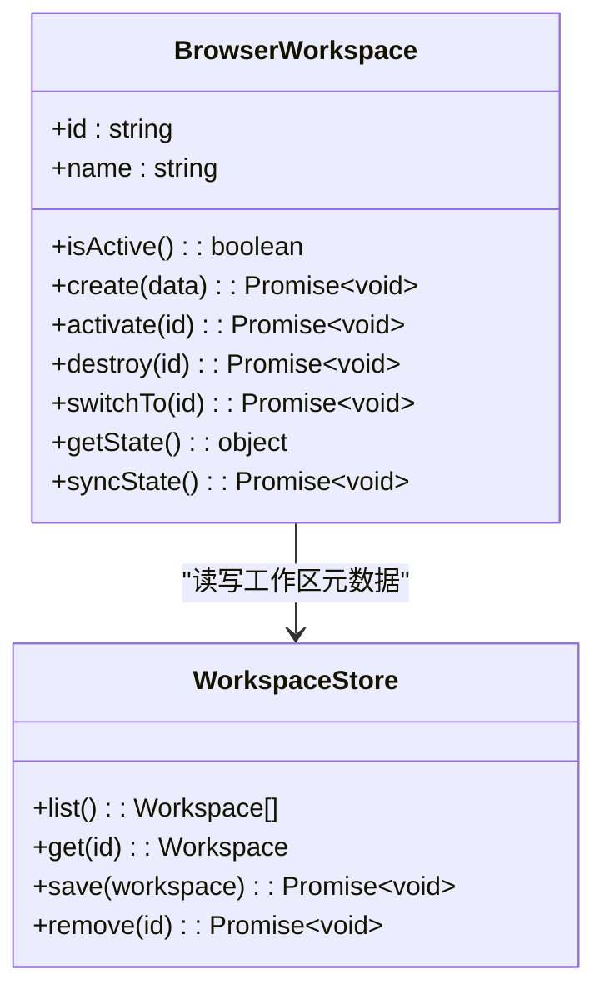
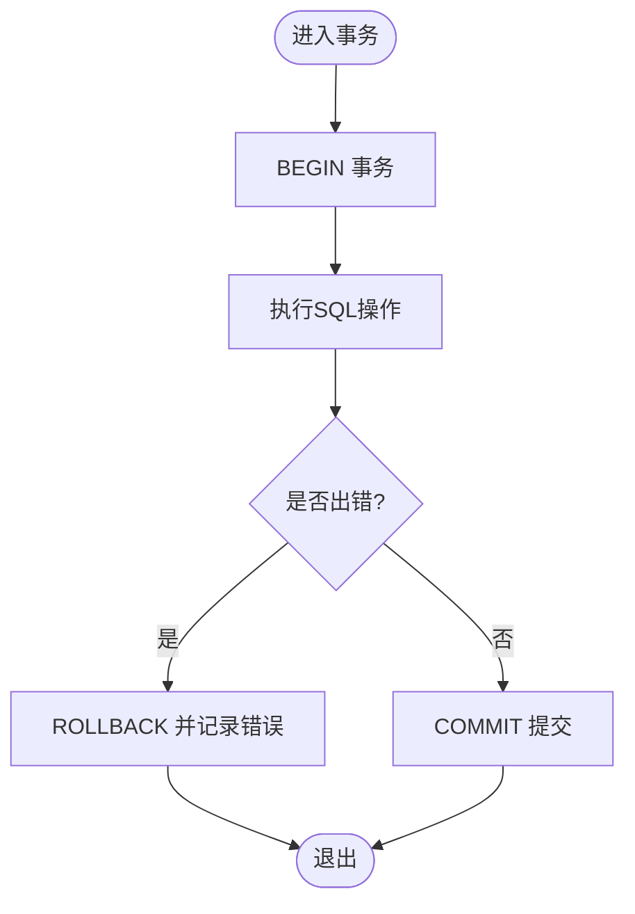
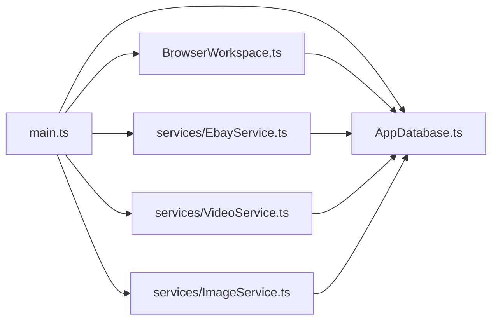

# Main进程架构

<cite>
**本文档引用的文件**   
- [main.ts](file://src/main/main.ts)
- [BrowserWorkspace.ts](file://src/main/browser/BrowserWorkspace.ts)
- [AppDatabase.ts](file://src/main/database/AppDatabase.ts)
- [package.json](file://package.json)
</cite>

## 目录
1. [简介](#简介)
2. [项目结构](#项目结构)
3. [核心组件](#核心组件)
4. [架构总览](#架构总览)
5. [详细组件分析](#详细组件分析)
6. [依赖关系分析](#依赖关系分析)
7. [性能考虑](#性能考虑)
8. [故障排查指南](#故障排查指南)
9. [结论](#结论)
10. [附录](#附录)

## 简介
本文件为砚都跨境项目的Electron主进程（Main）提供系统化架构文档。重点覆盖：
- 应用生命周期管理、窗口管理与系统事件处理
- BrowserWorkspace的工作空间管理机制
- AppDatabase的数据库连接与事务处理
- 主进程对服务模块的协调、IPC安全机制、错误处理与日志记录策略

该文档面向不同技术背景的读者，既提供高层概览，也给出代码级结构与交互图，帮助快速理解与扩展。

## 项目结构
主进程相关源码位于 src/main 目录，包含入口 main.ts、浏览器工作区 BrowserWorkspace.ts、数据库 AppDatabase.ts 以及多个业务服务模块。渲染进程与预加载脚本位于 src/renderer 与 src/preload。

```mermaid
graph TB
subgraph "主进程"
A["main.ts<br/>应用入口/生命周期"]
B["BrowserWorkspace.ts<br/>工作区管理"]
C["AppDatabase.ts<br/>数据库连接/事务"]
D["services/*<br/>业务服务模块"]
end
subgraph "渲染进程"
R["renderer/*<br/>UI与业务界面"]
end
subgraph "预加载"
P["preload/*<br/>安全桥接"]
end
A --> B
A --> C
A --> D
R <- --> P
P <- --> A
```

图表来源
- [main.ts:1-200](file://src/main/main.ts#L1-L200)
- [BrowserWorkspace.ts:1-200](file://src/main/browser/BrowserWorkspace.ts#L1-L200)
- [AppDatabase.ts:1-200](file://src/main/database/AppDatabase.ts#L1-L200)

章节来源
- [package.json:1-100](file://package.json#L1-L100)

## 核心组件
- 主进程入口（main.ts）
  - 负责Electron应用启动、生命周期钩子、窗口创建与管理、全局菜单/快捷键、系统事件监听、IPC通道注册、资源清理等。
  - 作为各服务与工作区的统一协调者，集中处理跨进程通信与安全校验。
- 工作区管理（BrowserWorkspace.ts）
  - 维护多工作区实例，隔离数据与上下文；提供工作区切换、创建、销毁、状态同步与持久化能力。
- 数据库访问（AppDatabase.ts）
  - 封装SQLite或本地存储的连接、迁移、查询与事务；保证并发安全与异常恢复。
- 服务模块（services/*）
  - 对外暴露业务能力（如Ebay、视频、图像、翻译、飞书机器人等），由主进程通过IPC路由调用。

章节来源
- [main.ts:1-200](file://src/main/main.ts#L1-L200)
- [BrowserWorkspace.ts:1-200](file://src/main/browser/BrowserWorkspace.ts#L1-L200)
- [AppDatabase.ts:1-200](file://src/main/database/AppDatabase.ts#L1-L200)

## 架构总览
主进程采用“入口+工作区+数据库+服务”的分层架构。入口统一调度，工作区隔离用户上下文，数据库提供可靠数据层，服务模块实现领域逻辑。IPC作为唯一对外通道，承载安全校验与权限控制。



图表来源
- [main.ts:1-200](file://src/main/main.ts#L1-L200)
- [BrowserWorkspace.ts:1-200](file://src/main/browser/BrowserWorkspace.ts#L1-L200)
- [AppDatabase.ts:1-200](file://src/main/database/AppDatabase.ts#L1-L200)

## 详细组件分析

### 主进程入口（main.ts）
职责要点
- 应用生命周期：初始化、就绪、窗口关闭、退出前清理。
- 窗口管理：创建/销毁/聚焦/隐藏窗口，窗口状态持久化。
- 系统事件：剪贴板、热键、托盘、协议处理器等。
- IPC注册：定义频道、参数校验、权限检查、错误包装与日志。
- 资源管理：内存、句柄、定时器、文件锁释放。

关键流程（示例）
- 启动阶段：加载配置、初始化日志、初始化数据库、创建工作区、注册IPC。
- 运行时：接收IPC→鉴权→路由→调用服务→读写数据库→返回结果。
- 退出阶段：保存状态、关闭数据库、释放资源、退出进程。



图表来源
- [main.ts:1-200](file://src/main/main.ts#L1-L200)

章节来源
- [main.ts:1-200](file://src/main/main.ts#L1-L200)

### 工作区管理（BrowserWorkspace.ts）
设计目标
- 多工作区隔离：每个工作区拥有独立上下文、缓存与配置。
- 生命周期：创建、激活、切换、销毁与自动回收。
- 状态同步：工作区状态变更广播给渲染进程。
- 持久化：工作区元数据与偏好设置落盘。

核心能力
- 工作区集合管理：增删改查、按ID/名称查找。
- 上下文路由：根据当前工作区选择正确的数据源与服务实例。
- 事件总线：工作区切换、数据变更、错误上报。



图表来源
- [BrowserWorkspace.ts:1-200](file://src/main/browser/BrowserWorkspace.ts#L1-L200)

章节来源
- [BrowserWorkspace.ts:1-200](file://src/main/browser/BrowserWorkspace.ts#L1-L200)

### 数据库访问（AppDatabase.ts）
设计目标
- 统一连接池/单例连接，避免重复打开。
- 事务封装：支持嵌套事务回滚与错误恢复。
- 迁移与版本管理：确保数据结构演进一致性。
- 并发安全：队列化写操作，读操作可并行。

核心能力
- 连接管理：初始化、重试、健康检查、优雅关闭。
- 查询封装：参数化查询、结果映射、分页与排序。
- 事务处理：begin/commit/rollback、异常捕获与日志。
- 迁移脚本：按版本号顺序执行，失败回滚并告警。



图表来源
- [AppDatabase.ts:1-200](file://src/main/database/AppDatabase.ts#L1-L200)

章节来源
- [AppDatabase.ts:1-200](file://src/main/database/AppDatabase.ts#L1-L200)

### 服务模块（services/*）
职责划分
- 外部服务集成：如Ebay、视频、图像、翻译、飞书机器人等。
- 内部工具：命令解析、插件桥接、合规检测等。
- 主进程协调：通过IPC路由到具体服务，统一鉴权与限流。

协作模式
- 服务间解耦：通过主进程消息总线进行通信。
- 错误归一化：将第三方错误转换为标准错误码与消息。
- 可观测性：结构化日志、指标上报与追踪ID透传。

章节来源
- [main.ts:1-200](file://src/main/main.ts#L1-L200)

## 依赖关系分析
主进程依赖关系清晰分层：入口→工作区→数据库→服务。IPC作为唯一对外接口，所有跨进程调用必须经过安全校验。



图表来源
- [main.ts:1-200](file://src/main/main.ts#L1-L200)
- [BrowserWorkspace.ts:1-200](file://src/main/browser/BrowserWorkspace.ts#L1-L200)
- [AppDatabase.ts:1-200](file://src/main/database/AppDatabase.ts#L1-L200)

章节来源
- [main.ts:1-200](file://src/main/main.ts#L1-L200)

## 性能考虑
- 数据库
  - 使用连接池与批量写入减少IO开销。
  - 热点查询加索引，避免全表扫描。
  - 大事务拆分为小事务，降低锁竞争。
- 工作区
  - 懒加载工作区上下文，按需初始化。
  - 状态增量同步，避免全量刷新。
- IPC
  - 合并高频小消息，减少序列化开销。
  - 限制单次载荷大小，防止阻塞主线程。
- 资源
  - 及时释放文件句柄、定时器与事件监听器。
  - 监控内存峰值，必要时触发GC提示。

[本节为通用指导，不直接分析具体文件]

## 故障排查指南
常见问题与定位步骤
- IPC调用失败
  - 检查频道名与参数结构是否正确。
  - 查看主进程日志中的鉴权与路由错误。
  - 确认预加载脚本是否正确暴露API。
- 数据库连接异常
  - 检查数据库文件路径与权限。
  - 查看迁移脚本是否成功执行。
  - 观察事务回滚日志与错误堆栈。
- 工作区切换异常
  - 检查工作区是否存在与状态是否一致。
  - 确认状态同步事件是否被渲染进程消费。
  - 验证持久化文件是否损坏。
- 服务调用超时
  - 检查外部服务可用性。
  - 查看重试与熔断策略是否生效。
  - 核对超时阈值与日志追踪ID。

章节来源
- [main.ts:1-200](file://src/main/main.ts#L1-L200)
- [AppDatabase.ts:1-200](file://src/main/database/AppDatabase.ts#L1-L200)
- [BrowserWorkspace.ts:1-200](file://src/main/browser/BrowserWorkspace.ts#L1-L200)

## 结论
本架构以主进程为核心，通过工作区隔离上下文、数据库保障数据一致性、服务模块实现领域能力，形成清晰的分层与职责边界。IPC作为唯一对外通道，配合鉴权、限流与日志，确保安全性与可观测性。建议持续完善错误归一化、监控指标与自动化测试，以提升稳定性与可维护性。

[本节为总结性内容，不直接分析具体文件]

## 附录
- 术语
  - 主进程：Electron中运行Node环境的进程，负责系统级任务。
  - 渲染进程：运行Web页面的进程，负责UI与用户交互。
  - 预加载脚本：在渲染进程加载前注入，用于安全地暴露API。
  - 工作区：隔离的用户上下文与数据域。
  - 事务：一组原子操作的集合，要么全部成功，要么全部回滚。

[本节为概念说明，不直接分析具体文件]