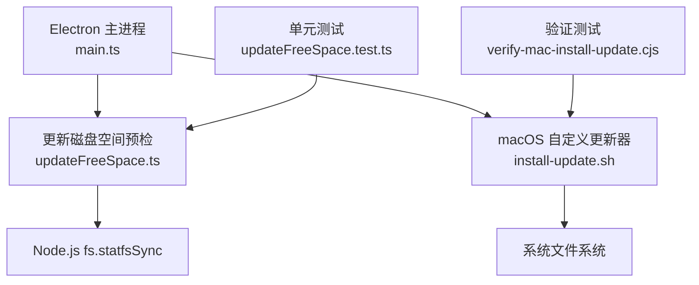
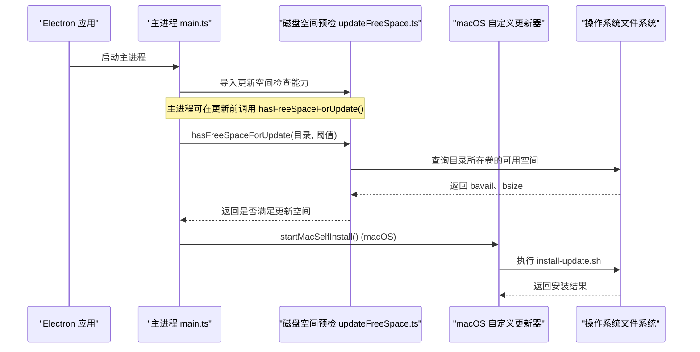
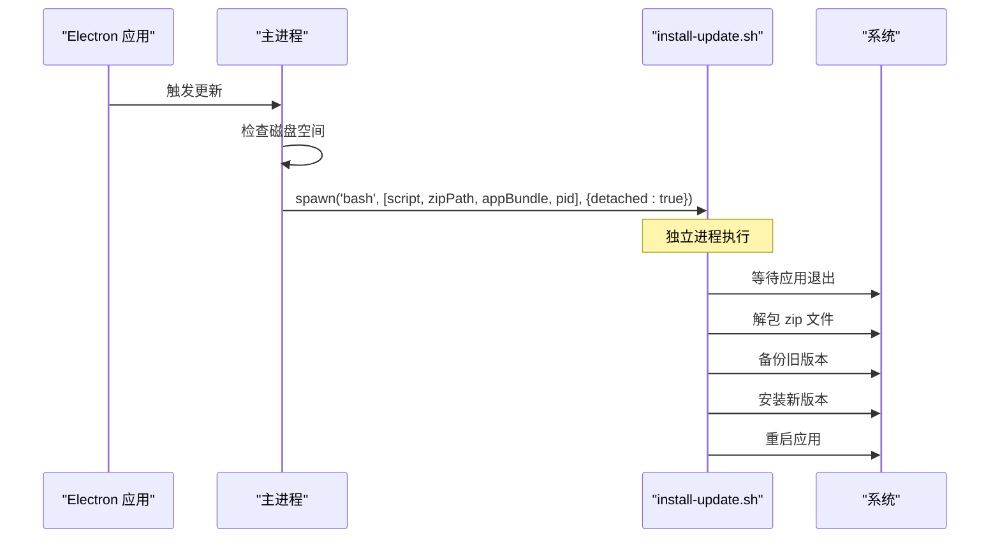
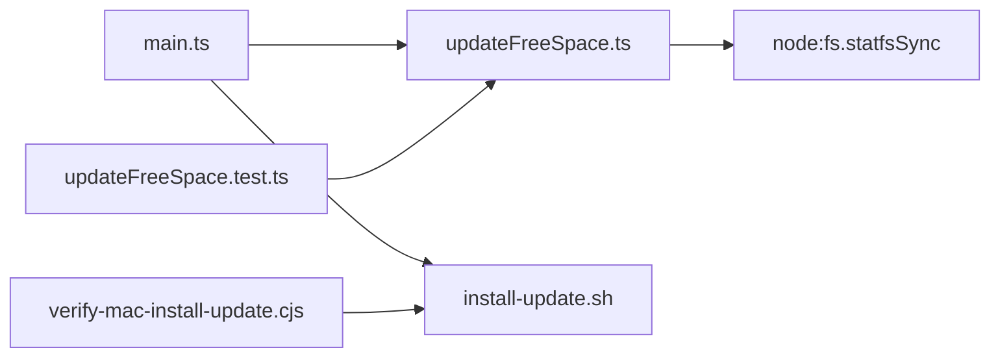

# 自动更新磁盘空间检查

<cite>
**本文引用的文件**   
- [src/main/updateFreeSpace.ts](file://src/main/updateFreeSpace.ts)
- [src/main/__tests__/updateFreeSpace.test.ts](file://src/main/__tests__/updateFreeSpace.test.ts)
- [src/main/main.ts](file://src/main/main.ts)
- [resources/mac-updater/install-update.sh](file://resources/mac-updater/install-update.sh)
- [tools/verify-mac-install-update.cjs](file://tools/verify-mac-install-update.cjs)
</cite>

## 更新摘要
**所做更改**   
- 更新了 macOS 更新机制架构，反映从 Squirrel 内置机制到自定义安装器脚本的迁移
- 新增分离式脚本执行模型和日志管理章节
- 更新了故障排查指南以包含新的日志位置和错误处理
- 保持了原有的磁盘空间检查功能描述

## 目录
1. [引言](#引言)
2. [项目结构定位](#项目结构定位)
3. [核心组件](#核心组件)
4. [架构总览](#架构总览)
5. [详细组件分析](#详细组件分析)
6. [macOS 自定义更新机制](#macos-自定义更新机制)
7. [依赖关系分析](#依赖关系分析)
8. [性能与行为特征](#性能与行为特征)
9. [故障排查指南](#故障排查指南)
10. [结论](#结论)

## 引言
本模块用于在 Electron 主进程启动阶段，对应用安装/更新所需的磁盘可用空间进行预检。其背景是 macOS ShipIt 解包更新时，需要完成"包体拷贝 + 约 2.2GB 解包"的连续空间；当数据卷接近满时，底层 ditto 会报出难以理解的"No space left on device"，用户只能看到晦涩的系统级错误。该模块通过提前检测可用空间，把不足情况转换为可读提示，从而避免用户在更新过程中遇到不可解释的错误。

**重要更新**：macOS 平台的更新机制已完全重新设计，从 Squirrel 内置机制迁移到自定义安装器脚本，但磁盘空间检查功能保持不变。

## 项目结构定位
该功能位于 Electron 主进程代码中，属于系统级基础设施能力：
- 实现文件：`src/main/updateFreeSpace.ts`
- 单元测试：`src/main/__tests__/updateFreeSpace.test.ts`
- 调用方：`src/main/main.ts`（在主进程入口附近引入并准备使用）
- macOS 自定义安装器：`resources/mac-updater/install-update.sh`

**图表来源**
- [src/main/main.ts:23-23](file://src/main/main.ts#L23-L23)
- [src/main/updateFreeSpace.ts:7-19](file://src/main/updateFreeSpace.ts#L7-L19)
- [src/main/main.ts:3257-3271](file://src/main/main.ts#L3257-L3271)
- [resources/mac-updater/install-update.sh:1-58](file://resources/mac-updater/install-update.sh#L1-L58)

**章节来源**
- [src/main/updateFreeSpace.ts:1-20](file://src/main/updateFreeSpace.ts#L1-L20)
- [src/main/__tests__/updateFreeSpace.test.ts:1-22](file://src/main/__tests__/updateFreeSpace.test.ts#L1-L22)
- [src/main/main.ts:23-23](file://src/main/main.ts#L23-L23)
- [resources/mac-updater/install-update.sh:1-58](file://resources/mac-updater/install-update.sh#L1-L58)

## 核心组件
该模块对外暴露三个关键内容：
- `UPDATE_REQUIRED_FREE_BYTES`：一次更新所需最低可用字节数，默认值为 4GB。
- `freeBytesOnVolume(dir, statfsImpl)`：计算指定目录所在卷的可用字节数。
- `hasFreeSpaceForUpdate(dir, requiredBytes, statfsImpl)`：判断当前卷是否满足更新所需空间。

这些导出均面向主进程中的更新流程、错误提示和测试用例。

**章节来源**
- [src/main/updateFreeSpace.ts:9-19](file://src/main/updateFreeSpace.ts#L9-L19)

## 架构总览
从系统角度看，该模块承担"更新前置校验"职责，处于 Electron 主进程与操作系统文件系统之间：

**图表来源**
- [src/main/main.ts:23-23](file://src/main/main.ts#L23-L23)
- [src/main/updateFreeSpace.ts:12-19](file://src/main/updateFreeSpace.ts#L12-L19)
- [src/main/main.ts:3257-3271](file://src/main/main.ts#L3257-L3271)

## 详细组件分析

### 更新所需空间常量
- 常量名：`UPDATE_REQUIRED_FREE_BYTES`
- 值含义：一次更新所需的最低可用空间，包含包体拷贝、解包余量与替换缓冲。
- 设计意图：将"约 4GB"这一经验阈值集中管理，便于后续调整与测试复用。

复杂度与影响：
- 时间复杂度：O(1)
- 空间复杂度：O(1)
- 可维护性：阈值集中定义，避免多处硬编码。

**章节来源**
- [src/main/updateFreeSpace.ts:9-10](file://src/main/updateFreeSpace.ts#L9-L10)

### 获取卷可用字节函数
- 函数名：`freeBytesOnVolume`
- 输入：
  - `dir`：任意路径字符串，用于确定目标卷。
  - `statfsImpl`：可选的 `statfsSync` 替代实现，便于测试注入。
- 输出：可用字节数，基于 `bavail * bsize` 计算。
- 异常处理：若底层 `statfsSync` 失败，错误会向上传播给调用方。

复杂度与影响：
- 时间复杂度：O(1)
- 空间复杂度：O(1)
- 平台差异：`statfsSync` 的行为由 Node.js 与操作系统提供，Windows/macOS/Linux 的具体语义可能不同。

**章节来源**
- [src/main/updateFreeSpace.ts:12-15](file://src/main/updateFreeSpace.ts#L12-L15)

### 更新空间判断函数
- 函数名：`hasFreeSpaceForUpdate`
- 输入：
  - `dir`：待检查目录。
  - `requiredBytes`：所需空间阈值，默认使用 `UPDATE_REQUIRED_FREE_BYTES`。
  - `statfsImpl`：可选的 `statfsSync` 替代实现。
- 输出：布尔值，表示是否满足更新空间要求。
- 判断逻辑：可用字节数大于等于所需字节数即放行。

复杂度与影响：
- 时间复杂度：O(1)
- 空间复杂度：O(1)
- 边界行为：等于阈值时视为满足，有利于减少临界误判。

**章节来源**
- [src/main/updateFreeSpace.ts:17-19](file://src/main/updateFreeSpace.ts#L17-L19)

### 单元测试覆盖
测试围绕以下场景展开：
- 空间充足：返回 true。
- 空间不足：返回 false，模拟 ShipIt ditto ENOSPC 场景。
- 临界值等于阈值：返回 true。

测试策略：
- 通过自定义 `fakeStatfs` 构造 `bavail` 与 `bsize`，绕过真实文件系统调用。
- 直接断言 `hasFreeSpaceForUpdate` 的返回值，验证阈值比较逻辑。

**章节来源**
- [src/main/__tests__/updateFreeSpace.test.ts:4-20](file://src/main/__tests__/updateFreeSpace.test.ts#L4-L20)

### 主进程集成点
主进程在启动阶段导入该模块，以便在更新流程中使用空间预检能力。当前可见的集成点是导入语句，实际调用位置可能在更新相关逻辑中进一步扩展。

**章节来源**
- [src/main/main.ts:23-23](file://src/main/main.ts#L23-L23)

## macOS 自定义更新机制

### 架构变更概述
macOS 平台的更新机制已从 Squirrel 内置机制完全迁移到自定义安装器脚本。这一变更解决了 Squirrel 在应用进程内解包时被退出杀死以及未签名包校验失败的问题。

### 分离式脚本执行模型
新的更新流程采用分离式脚本执行模型：

**图表来源**
- [src/main/main.ts:3257-3271](file://src/main/main.ts#L3257-L3271)
- [resources/mac-updater/install-update.sh:16-58](file://resources/mac-updater/install-update.sh#L16-L58)

### 安装器脚本功能
`install-update.sh` 脚本实现了完整的更新流程：

- **进程隔离**：通过 `detached: true` 参数确保脚本在独立进程中运行
- **应用退出等待**：最多等待 120 秒确保应用完全退出
- **安全解包**：使用 `ditto` 命令解压更新包
- **版本备份**：将旧版本备份为 `<app>.old-<timestamp>` 格式
- **原子替换**：先移动旧版本，再移动新版本，失败时自动回滚
- **自动重启**：安装完成后自动启动新版本应用

### 日志管理系统
所有更新操作都记录到统一的日志位置：

- **日志目录**：`~/Library/Logs/yandu-updater/`
- **日志文件**：`install.log`
- **日志格式**：包含时间戳、操作状态和错误信息
- **错误码**：定义了详细的退出码用于诊断问题

**章节来源**
- [src/main/main.ts:3241-3271](file://src/main/main.ts#L3241-L3271)
- [resources/mac-updater/install-update.sh:1-58](file://resources/mac-updater/install-update.sh#L1-L58)

## 依赖关系分析
该模块依赖关系清晰且耦合度低：
- 内部依赖：无其他业务模块。
- 外部依赖：仅依赖 Node.js 的 `node:fs.statfsSync`。
- 被依赖方：主进程 `main.ts` 与单元测试。

**图表来源**
- [src/main/updateFreeSpace.ts:7-7](file://src/main/updateFreeSpace.ts#L7-L7)
- [src/main/main.ts:23-23](file://src/main/main.ts#L23-L23)
- [src/main/main.ts:3257-3271](file://src/main/main.ts#L3257-L3271)
- [src/main/__tests__/updateFreeSpace.test.ts:2-2](file://src/main/__tests__/updateFreeSpace.test.ts#L2-L2)
- [tools/verify-mac-install-update.cjs:12-12](file://tools/verify-mac-install-update.cjs#L12-L12)

**章节来源**
- [src/main/updateFreeSpace.ts:7-19](file://src/main/updateFreeSpace.ts#L7-L19)
- [src/main/main.ts:23-23](file://src/main/main.ts#L23-L23)
- [src/main/main.ts:3257-3271](file://src/main/main.ts#L3257-L3271)
- [src/main/__tests__/updateFreeSpace.test.ts:1-21](file://src/main/__tests__/updateFreeSpace.test.ts#L1-L21)
- [tools/verify-mac-install-update.cjs:1-56](file://tools/verify-mac-install-update.cjs#L1-L56)

## 性能与行为特征
- 调用开销极低：每次检查仅进行一次文件系统统计查询。
- 内存占用极小：不缓存状态，不持有大对象。
- 可测试性强：通过注入 `statfsImpl` 完全隔离真实文件系统。
- 可扩展性：如需调整阈值或增加更细粒度的空间检查，可在该模块内扩展。
- **新增特性**：macOS 平台支持分离式脚本执行，避免主进程阻塞。

## 故障排查指南
常见排查方向：
- 阈值不合理：如果频繁出现"空间不足"但实际可更新，应评估 `UPDATE_REQUIRED_FREE_BYTES` 是否过大。
- 平台差异：`statfsSync` 在不同操作系统上的语义可能不同，需结合运行环境验证。
- 路径无效：传入的 `dir` 必须存在于有效卷上，否则底层调用可能抛出异常。
- 权限问题：某些受限目录可能无法正确读取可用空间信息。
- 测试注入失效：单元测试中 `fakeStatfs` 返回的 `bavail` 与 `bsize` 需与实际字节换算一致。

**macOS 特定故障排查**：
- **日志位置**：检查 `~/Library/Logs/yandu-updater/install.log` 获取详细安装日志
- **脚本执行**：确认 `install-update.sh` 具有执行权限
- **应用退出**：验证应用是否能正常退出，脚本最多等待 120 秒
- **zip 文件**：检查更新包是否完整且包含有效的 `.app` 文件
- **版本备份**：查看是否有 `.old-*` 格式的备份文件存在

建议操作：
- 在调用 `hasFreeSpaceForUpdate` 前后记录日志，确认传入目录与阈值。
- 在更新失败时，优先检查磁盘可用空间与错误提示是否匹配。
- 如需要更精确的空间估算，可在该模块中增加"包大小 + 解包倍数"的可配置项。
- **macOS 平台**：检查分离式脚本的执行状态和日志输出。

**章节来源**
- [src/main/updateFreeSpace.ts:1-10](file://src/main/updateFreeSpace.ts#L1-L10)
- [src/main/__tests__/updateFreeSpace.test.ts:4-20](file://src/main/__tests__/updateFreeSpace.test.ts#L4-L20)
- [resources/mac-updater/install-update.sh:11-58](file://resources/mac-updater/install-update.sh#L11-L58)

## 结论
该模块以最小实现解决了 Electron 应用在 macOS 更新场景中因磁盘空间不足导致的底层报错问题。通过将 4GB 阈值集中管理、提供可注入的文件系统接口，并配合单元测试覆盖关键分支，它在保证可测试性的同时保持了低耦合与高内聚。

**重大改进**：macOS 平台的更新机制现已完全迁移到自定义安装器脚本，解决了 Squirrel 的竞态条件和签名验证问题。新的分离式脚本执行模型确保了更新的可靠性和可追溯性，而磁盘空间检查功能保持不变，继续为用户提供清晰的存储空间提示。未来若更新包体积变化或平台行为变化，只需调整阈值或补充平台适配逻辑即可。