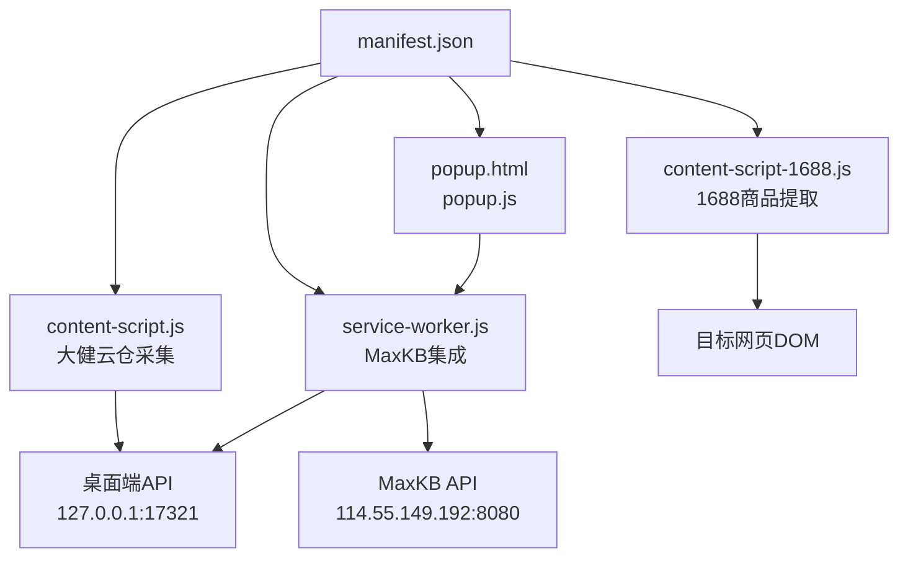
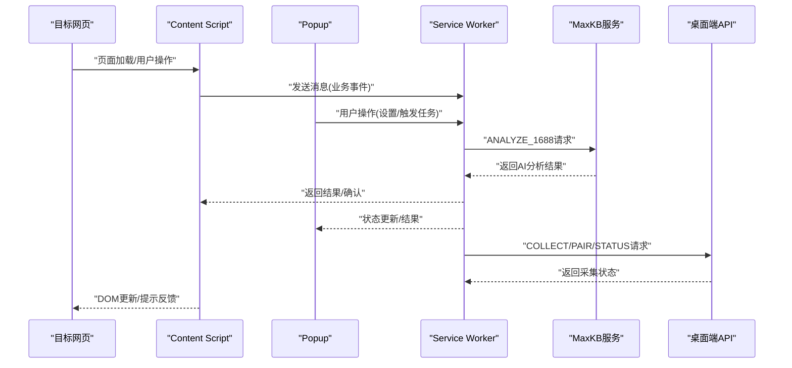
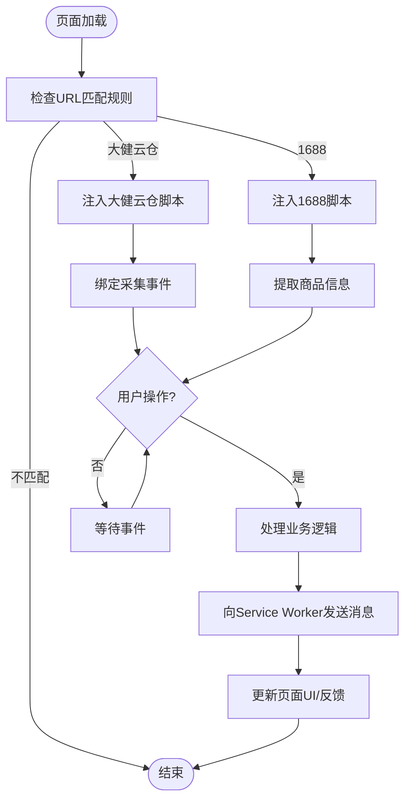
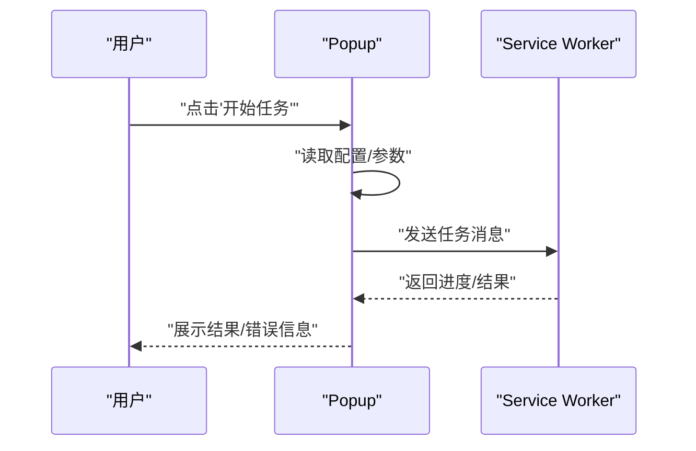
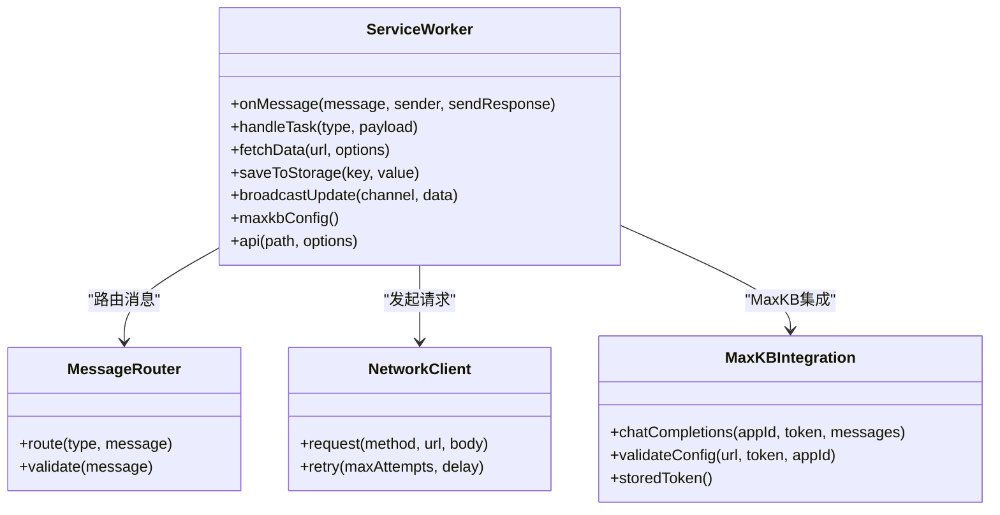
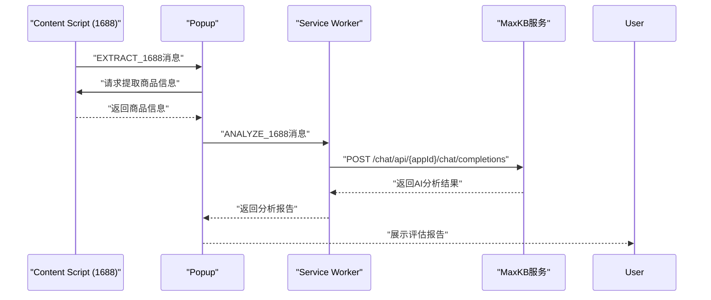
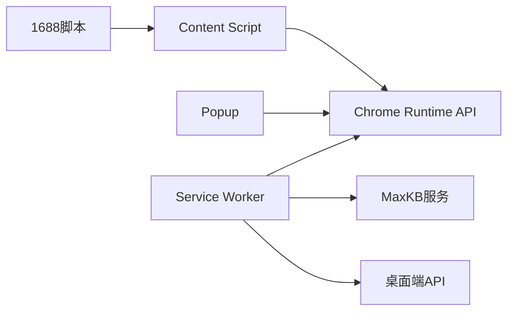

# 浏览器扩展架构

<cite>
**本文引用的文件**   
- [browser-extension/README.md](file://browser-extension/README.md)
- [browser-extension/manifest.json](file://browser-extension/manifest.json)
- [browser-extension/content-script.js](file://browser-extension/content-script.js)
- [browser-extension/content-script-1688.js](file://browser-extension/content-script-1688.js)
- [browser-extension/content-script.css](file://browser-extension/content-script.css)
- [browser-extension/popup.html](file://browser-extension/popup.html)
- [browser-extension/popup.js](file://browser-extension/popup.js)
- [browser-extension/service-worker.js](file://browser-extension/service-worker.js)
</cite>

## 更新摘要
**所做更改**   
- 更新了Service Worker章节，反映MaxKB集成的完全重写实现
- 新增了MaxKB配置管理和认证机制的详细说明
- 更新了API通信协议以反映从RAGFlow到MaxKB的迁移
- 增强了安全考虑部分以涵盖MaxKB令牌管理
- 更新了故障排查指南以包含MaxKB相关问题的诊断方法

## 目录
1. [简介](#简介)
2. [项目结构](#项目结构)
3. [核心组件](#核心组件)
4. [架构总览](#架构总览)
5. [详细组件分析](#详细组件分析)
6. [MaxKB集成架构](#maxkb集成架构)
7. [依赖关系分析](#依赖关系分析)
8. [性能考虑](#性能考虑)
9. [故障排查指南](#故障排查指南)
10. [结论](#结论)
11. [附录](#附录)

## 简介
本文件为"砚都跨境"项目的Chrome浏览器扩展提供完整的架构文档。内容覆盖Manifest配置与各脚本职责、Content Script的内容注入与DOM操作机制、Popup用户交互逻辑、Service Worker后台任务处理，以及扩展与主应用之间的通信协议、消息格式与安全注意事项。同时给出安装、配置与调试指南，帮助开发者快速理解并高效维护该扩展。

**重要更新** 版本0.3.0已完成从RAGFlow到MaxKB v2.10.5-lts CE的全面迁移，实现了更强大的AI选品分析能力。

## 项目结构
扩展位于 browser-extension 目录，采用现代Chrome扩展（Manifest V3）结构：
- manifest.json：扩展元数据、权限声明、入口脚本注册等
- content-script.js / content-script-1688.js：页面内注入的脚本与样式
- popup.html / popup.js：弹出面板界面与交互逻辑
- service-worker.js：后台任务与跨上下文通信协调

图表来源
- [browser-extension/manifest.json](file://browser-extension/manifest.json)
- [browser-extension/content-script.js](file://browser-extension/content-script.js)
- [browser-extension/content-script-1688.js](file://browser-extension/content-script-1688.js)
- [browser-extension/popup.html](file://browser-extension/popup.html)
- [browser-extension/popup.js](file://browser-extension/popup.js)
- [browser-extension/service-worker.js](file://browser-extension/service-worker.js)

章节来源
- [browser-extension/README.md](file://browser-extension/README.md)
- [browser-extension/manifest.json](file://browser-extension/manifest.json)

## 核心组件
- Manifest（manifest.json）
  - 定义扩展名称、版本、图标、权限范围
  - 声明MV3架构下的service worker入口
  - 指定content scripts匹配规则与注入时机
  - 配置host_permissions以访问MaxKB服务
- Content Script（content-script.js + content-script-1688.js + content-script.css）
  - 在匹配的网页中注入，监听DOM变化与用户事件
  - 通过chrome.runtime API与service worker或popup通信
  - 动态插入UI元素、样式与事件绑定
- Popup（popup.html/js）
  - 提供用户可操作的轻量界面
  - 管理用户设置、触发任务、展示状态
  - 通过chrome.runtime.sendMessage与service worker交互
- Service Worker（service-worker.js）
  - 作为后台进程处理异步任务、网络请求、定时任务
  - 集中管理消息路由与跨上下文通信
  - 负责与MaxKB服务的集成和认证

章节来源
- [browser-extension/manifest.json](file://browser-extension/manifest.json)
- [browser-extension/content-script.js](file://browser-extension/content-script.js)
- [browser-extension/content-script-1688.js](file://browser-extension/content-script-1688.js)
- [browser-extension/content-script.css](file://browser-extension/content-script.css)
- [browser-extension/popup.html](file://browser-extension/popup.html)
- [browser-extension/popup.js](file://browser-extension/popup.js)
- [browser-extension/service-worker.js](file://browser-extension/service-worker.js)

## 架构总览
下图展示了扩展各组件之间的交互关系与数据流向。Content Script在目标页面运行，Popup由用户主动打开，Service Worker作为后台协调者统一处理消息与任务，并通过MaxKB服务进行AI分析。

图表来源
- [browser-extension/content-script.js](file://browser-extension/content-script.js)
- [browser-extension/content-script-1688.js](file://browser-extension/content-script-1688.js)
- [browser-extension/service-worker.js](file://browser-extension/service-worker.js)
- [browser-extension/popup.js](file://browser-extension/popup.js)

## 详细组件分析

### Manifest配置与脚本职责
- 权限与能力
  - 声明必要的运行时权限（storage、activeTab、tabs），确保最小权限原则
  - 使用MV3的service worker替代旧版background page
  - 配置host_permissions以访问MaxKB服务和桌面端API
- 内容脚本注入
  - 通过matches/globs精确匹配目标站点与路径
  - 控制注入时机（document_idle）与是否在所有框架中注入
  - 支持大健云仓和1688两个平台的差异化处理
- Action与Popup
  - 将popup关联到action，点击扩展图标时打开
  - 指定popup HTML与对应JS资源
- Service Worker
  - 指定service worker入口文件
  - 处理消息监听、事件回调与生命周期管理

章节来源
- [browser-extension/manifest.json](file://browser-extension/manifest.json)

### Content Script：内容注入、DOM操作与页面监听
- 注入机制
  - 由Manifest声明自动注入到匹配页面
  - 可在document不同阶段注入，避免阻塞渲染
  - 支持多平台差异化处理（大健云仓 vs 1688）
- DOM操作
  - 安全地查询与修改节点，避免破坏原有布局
  - 动态创建悬浮按钮、侧边栏或提示框，绑定事件
  - 1688页面专门的商品信息提取逻辑
- 页面监听
  - 监听用户交互（点击、输入）、URL变化、历史状态变更
  - 监听DOM变化（MutationObserver）以响应动态加载内容
- 通信
  - 使用chrome.runtime.sendMessage/postMessage与Service Worker或Popup交换数据
  - 对敏感数据进行校验与脱敏后再发送

图表来源
- [browser-extension/content-script.js](file://browser-extension/content-script.js)
- [browser-extension/content-script-1688.js](file://browser-extension/content-script-1688.js)
- [browser-extension/content-script.css](file://browser-extension/content-script.css)

章节来源
- [browser-extension/content-script.js](file://browser-extension/content-script.js)
- [browser-extension/content-script-1688.js](file://browser-extension/content-script-1688.js)
- [browser-extension/content-script.css](file://browser-extension/content-script.css)

### Popup：用户交互逻辑
- 界面结构
  - 提供简洁的操作面板，包含按钮、表单、状态显示区域
  - 新增MaxKB设置区域，支持服务地址、Application ID和Token配置
- 交互流程
  - 用户点击按钮触发任务（如采集、翻译、合规检查）
  - 读取本地存储的配置项（如API密钥、偏好设置）
  - 通过sendMessage调用Service Worker执行任务并展示结果
  - 支持1688商品的一键AI分析功能
- 错误与反馈
  - 捕获异常并提示用户重试或检查配置
  - 支持清空缓存、重置设置等维护操作

图表来源
- [browser-extension/popup.html](file://browser-extension/popup.html)
- [browser-extension/popup.js](file://browser-extension/popup.js)

章节来源
- [browser-extension/popup.html](file://browser-extension/popup.html)
- [browser-extension/popup.js](file://browser-extension/popup.js)

### Service Worker：后台任务处理
- 角色定位
  - 作为扩展的后台中枢，处理来自Content Script与Popup的消息
  - 统一管理网络请求、数据存储与第三方服务调用
  - 实现MaxKB服务的完整集成
- 任务调度
  - 接收任务后执行异步流程（如批量处理、分页抓取）
  - 通过runtime.onMessage监听消息，按类型分发处理
  - 支持多种消息类型：PAIR、STATUS、COLLECT、ANALYZE_1688、MAXKB_SAVE、MAXKB_STATUS
- 通信协议
  - 定义统一的消息格式（type、payload、timestamp等）
  - 对返回值进行标准化，便于前端消费
  - 实现MaxKB API调用的标准化封装
- 安全与健壮性
  - 校验输入参数、限制请求频率
  - 记录关键日志，便于问题追踪
  - 实现配置的安全存储和管理

图表来源
- [browser-extension/service-worker.js](file://browser-extension/service-worker.js)

章节来源
- [browser-extension/service-worker.js](file://browser-extension/service-worker.js)

### 扩展与主应用的通信协议
- 消息格式建议
  - type：消息类型（如 task/start、task/result、config/update）
  - payload：业务数据对象，需进行字段校验
  - meta：元数据（时间戳、会话ID、来源上下文）
- 安全考虑
  - 仅允许受信任来源的消息（检查sender.origin/tab.id）
  - 对敏感字段进行加密或签名验证
  - 限制消息大小与频率，防止滥用
- 错误处理
  - 统一的错误码与描述，便于前端展示与日志上报
  - 超时与重试策略，提升稳定性

章节来源
- [browser-extension/service-worker.js](file://browser-extension/service-worker.js)
- [browser-extension/content-script.js](file://browser-extension/content-script.js)
- [browser-extension/popup.js](file://browser-extension/popup.js)

## MaxKB集成架构

**重大更新** 版本0.3.0完成了从RAGFlow到MaxKB v2.10.5-lts CE的全面迁移，提供了更强大的AI选品分析能力。

### MaxKB服务配置
- 默认服务地址：`http://114.55.149.192:8080`
- 默认智能体：sourcing 选品分析师
- 认证方式：Bearer secret_key（直连chat，不需要admin token）
- Application ID：`01a02f8c-66d2-7803-b02b-e67d1cc6e02b`

### API端点迁移
- **旧版（RAGFlow）**：`http://114.55.149.192:8090`
- **新版（MaxKB）**：`http://114.55.149.192:8080/chat/api/{application_id}/chat/completions`

### 认证机制升级
- **旧版**：使用RAGFlow密钥进行认证
- **新版**：使用MaxKB令牌（secret_key）和应用ID进行认证
- 支持用户自定义配置，可通过Popup界面设置服务地址、令牌和应用ID

### 1688商品分析流程

图表来源
- [browser-extension/content-script-1688.js](file://browser-extension/content-script-1688.js)
- [browser-extension/service-worker.js](file://browser-extension/service-worker.js)
- [browser-extension/popup.js](file://browser-extension/popup.js)

### 配置管理机制
- 支持三种配置方式：
  1. 内置默认配置（服务地址和应用ID）
  2. 用户自定义配置（存储在chrome.storage.local）
  3. 环境变量配置（开发环境）
- 配置验证：在服务启动时验证配置的完整性和有效性
- 安全存储：敏感信息（如令牌）使用chrome.storage.local安全存储

章节来源
- [browser-extension/service-worker.js](file://browser-extension/service-worker.js)
- [browser-extension/popup.js](file://browser-extension/popup.js)
- [browser-extension/manifest.json](file://browser-extension/manifest.json)

## 依赖关系分析
- 内部依赖
  - Content Script依赖CSS样式与DOM API
  - Popup依赖HTML结构与JS逻辑
  - Service Worker独立运行，通过消息与其他组件通信
  - 1688专用脚本提供商品提取功能
- 外部依赖
  - Chrome扩展API（runtime、storage、tabs、scripting等）
  - MaxKB服务（AI分析能力）
  - 桌面端API（数据采集功能）

图表来源
- [browser-extension/content-script.js](file://browser-extension/content-script.js)
- [browser-extension/content-script-1688.js](file://browser-extension/content-script-1688.js)
- [browser-extension/popup.js](file://browser-extension/popup.js)
- [browser-extension/service-worker.js](file://browser-extension/service-worker.js)

章节来源
- [browser-extension/manifest.json](file://browser-extension/manifest.json)

## 性能考虑
- 注入优化
  - 仅在必要时注入Content Script，减少内存占用
  - 延迟初始化非关键逻辑，优先保证页面流畅
  - 1688脚本采用模块化设计，按需加载
- DOM操作
  - 批量更新节点，避免频繁重排重绘
  - 使用事件委托降低监听器数量
  - 优化1688商品信息的提取算法
- 通信效率
  - 合并小消息，减少频繁往返
  - 使用结构化克隆传输大数据，避免序列化开销
  - 实现MaxKB请求的缓存和去重机制
- 后台任务
  - 合理拆分长任务，避免阻塞主线程
  - 实现去重与缓存机制，减少重复计算
  - 优化MaxKB API调用的超时和重试策略

## 故障排查指南
- 常见问题
  - 扩展未生效：检查Manifest权限与匹配规则
  - 消息无法传递：确认sender与receiver的API使用正确
  - UI不更新：检查DOM选择器与事件绑定
  - MaxKB连接失败：验证服务地址、令牌和应用ID配置
  - 1688分析失败：检查商品页面结构和网络连通性
- 调试步骤
  - 使用Chrome DevTools查看Extension页面，启用Service Worker调试
  - 在Content Script中打印日志，观察注入时机与事件流
  - 通过storage查看配置是否正确写入
  - 检查MaxKB服务的连通性和响应状态
  - 验证1688页面的DOM结构和信息提取逻辑
- 日志与监控
  - 记录关键操作与错误堆栈
  - 上报匿名化指标，辅助问题定位
  - 监控MaxKB API的调用成功率和响应时间

**更新** 新增了MaxKB相关的故障排查步骤，包括服务连通性检查和配置验证。

章节来源
- [browser-extension/service-worker.js](file://browser-extension/service-worker.js)
- [browser-extension/content-script.js](file://browser-extension/content-script.js)
- [browser-extension/content-script-1688.js](file://browser-extension/content-script-1688.js)
- [browser-extension/popup.js](file://browser-extension/popup.js)

## 结论
本扩展采用MV3架构，通过Content Script、Popup与Service Worker各司其职，实现了页面增强、用户交互与后台任务的解耦设计。版本0.3.0完成的MaxKB集成显著提升了AI选品分析能力，从RAGFlow迁移到MaxKB v2.10.5-lts CE提供了更稳定和强大的AI服务支持。清晰的通信协议与安全策略保障了扩展的稳定与可扩展性。遵循本文档的安装、配置与调试指南，可有效提升开发与维护效率。

## 附录
- 安装与配置
  - 在Chrome中加载解压后的扩展文件夹
  - 在扩展设置中配置必要权限与API密钥
  - 刷新目标页面以激活Content Script
  - 配置MaxKB服务地址、Application ID和Secret Token
- 调试技巧
  - 使用DevTools的Application面板查看localStorage与IndexedDB
  - 通过Console过滤extension日志，快速定位问题
  - 临时禁用扩展功能模块，隔离故障范围
  - 检查MaxKB服务的连通性和响应状态
  - 验证1688页面的DOM结构和信息提取逻辑

**更新** 新增了MaxKB相关的配置和调试技巧。

章节来源
- [browser-extension/README.md](file://browser-extension/README.md)
- [browser-extension/manifest.json](file://browser-extension/manifest.json)
- [browser-extension/service-worker.js](file://browser-extension/service-worker.js)