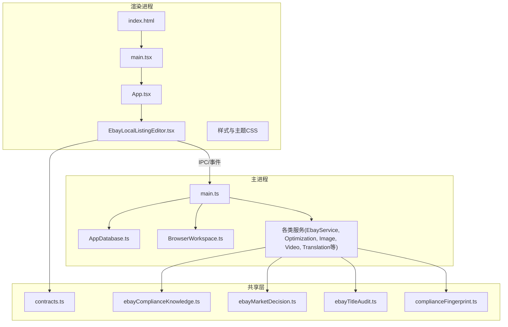
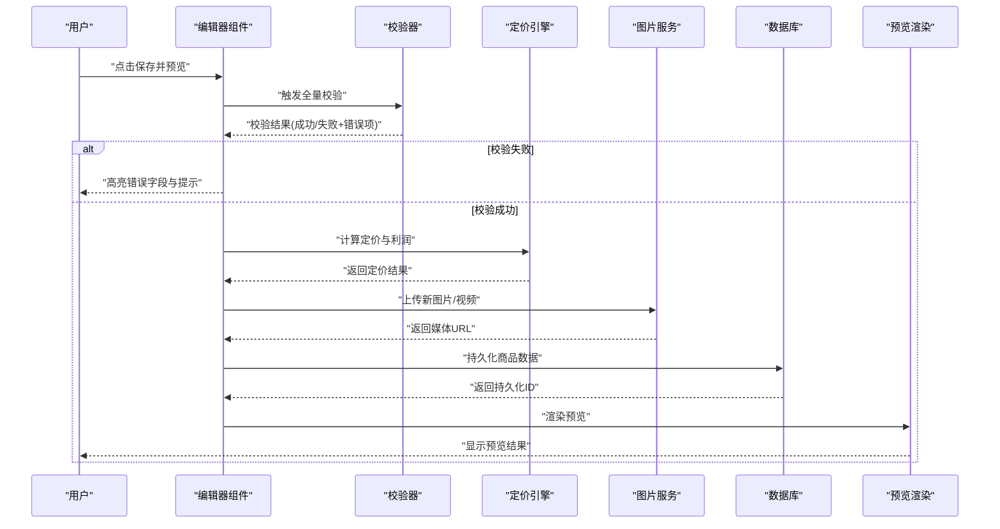
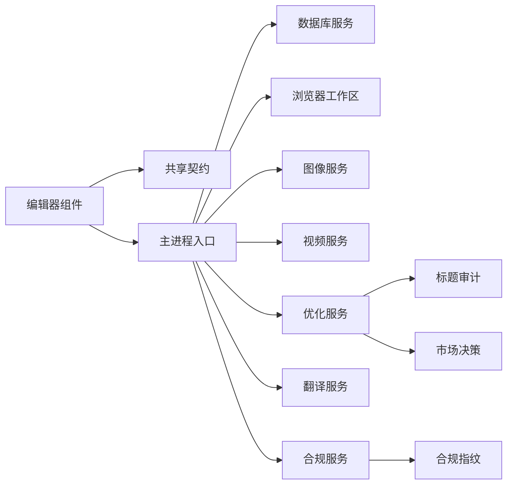

# Ebay本地商品编辑器

<cite>
**本文档引用的文件**   
- [EbayLocalListingEditor.tsx](file://src/renderer/EbayLocalListingEditor.tsx)
- [App.tsx](file://src/renderer/App.tsx)
- [main.tsx](file://src/renderer/main.tsx)
- [index.html](file://src/renderer/index.html)
- [styles.css](file://src/renderer/styles.css)
- [ebay-local-listing-pricing.css](file://src/renderer/ebay-local-listing-pricing.css)
- [ebay-local-listing-validation.css](file://src/renderer/ebay-local-listing-validation.css)
- [BrowserWorkspace.ts](file://src/main/browser/BrowserWorkspace.ts)
- [AppDatabase.ts](file://src/main/database/AppDatabase.ts)
- [main.ts](file://src/main/main.ts)
- [EbayService.ts](file://src/main/services/EbayService.ts)
- [EbayOptimizationService.ts](file://src/main/services/EbayOptimizationService.ts)
- [EbayImageComplianceVisionService.ts](file://src/main/services/EbayImageComplianceVisionService.ts)
- [EbayImageGroundingService.ts](file://src/main/services/EbayImageGroundingService.ts)
- [EbayVideoService.ts](file://src/main/services/EbayVideoService.ts)
- [BailianImageService.ts](file://src/main/services/BailianImageService.ts)
- [BailianTranslationService.ts](file://src/main/services/BailianTranslationService.ts)
- [ArkVideoService.ts](file://src/main/services/ArkVideoService.ts)
- [DeepSeekCommandService.ts](file://src/main/services/DeepSeekCommandService.ts)
- [FeishuBotService.ts](file://src/main/services/FeishuBotService.ts)
- [RealShiftService.ts](file://src/main/services/RealShiftService.ts)
- [CollectorPluginBridge.ts](file://src/main/services/CollectorPluginBridge.ts)
- [contracts.ts](file://src/shared/contracts.ts)
- [ebayComplianceKnowledge.ts](file://src/shared/ebayComplianceKnowledge.ts)
- [ebayMarketDecision.ts](file://src/shared/ebayMarketDecision.ts)
- [ebayTitleAudit.ts](file://src/shared/ebayTitleAudit.ts)
- [complianceFingerprint.ts](file://src/shared/complianceFingerprint.ts)
- [package.json](file://package.json)
</cite>

## 目录
1. [简介](#简介)
2. [项目结构](#项目结构)
3. [核心组件](#核心组件)
4. [架构总览](#架构总览)
5. [详细组件分析](#详细组件分析)
6. [依赖分析](#依赖分析)
7. [性能考虑](#性能考虑)
8. [故障排查指南](#故障排查指南)
9. [结论](#结论)
10. [附录：API接口与使用示例](#附录api接口与使用示例)

## 简介
本技术文档围绕“Ebay本地商品编辑器”组件，系统化阐述商品信息CRUD、表单验证、数据持久化、定价计算引擎、库存管理与SKU处理、图片上传与描述编辑、SEO优化、主进程同步、实时预览与批量操作、状态管理、错误处理与用户反馈机制，并提供完整的API说明与使用示例。文档面向开发者与产品工程师，兼顾可读性与可落地性。

## 项目结构
本项目采用Electron多进程架构：
- 渲染进程（renderer）：React前端界面与交互逻辑，包含Ebay本地商品编辑器组件及相关样式。
- 主进程（main）：数据库、浏览器工作区、服务桥接与外部能力集成。
- 共享层（shared）：类型契约、合规知识与标题审计等通用模块。



图表来源
- [index.html](file://src/renderer/index.html)
- [main.tsx](file://src/renderer/main.tsx)
- [App.tsx](file://src/renderer/App.tsx)
- [EbayLocalListingEditor.tsx](file://src/renderer/EbayLocalListingEditor.tsx)
- [main.ts](file://src/main/main.ts)
- [AppDatabase.ts](file://src/main/database/AppDatabase.ts)
- [BrowserWorkspace.ts](file://src/main/browser/BrowserWorkspace.ts)
- [contracts.ts](file://src/shared/contracts.ts)
- [ebayComplianceKnowledge.ts](file://src/shared/ebayComplianceKnowledge.ts)
- [ebayMarketDecision.ts](file://src/shared/ebayMarketDecision.ts)
- [ebayTitleAudit.ts](file://src/shared/ebayTitleAudit.ts)
- [complianceFingerprint.ts](file://src/shared/complianceFingerprint.ts)

章节来源
- [index.html](file://src/renderer/index.html)
- [main.tsx](file://src/renderer/main.tsx)
- [App.tsx](file://src/renderer/App.tsx)
- [EbayLocalListingEditor.tsx](file://src/renderer/EbayLocalListingEditor.tsx)
- [main.ts](file://src/main/main.ts)
- [AppDatabase.ts](file://src/main/database/AppDatabase.ts)
- [BrowserWorkspace.ts](file://src/main/browser/BrowserWorkspace.ts)
- [contracts.ts](file://src/shared/contracts.ts)
- [ebayComplianceKnowledge.ts](file://src/shared/ebayComplianceKnowledge.ts)
- [ebayMarketDecision.ts](file://src/shared/ebayMarketDecision.ts)
- [ebayTitleAudit.ts](file://src/shared/ebayTitleAudit.ts)
- [complianceFingerprint.ts](file://src/shared/complianceFingerprint.ts)

## 核心组件
- 渲染端编辑器组件：负责商品信息的展示、编辑、校验、预览与提交；维护表单状态与错误提示；支持批量操作与实时预览。
- 主进程服务层：封装数据库读写、浏览器自动化、图像与视频处理、翻译与AI优化、合规检查等能力，并通过IPC暴露给渲染端。
- 共享契约与知识：定义数据结构、校验规则、合规策略与标题审计方法，确保前后端一致。

章节来源
- [EbayLocalListingEditor.tsx](file://src/renderer/EbayLocalListingEditor.tsx)
- [App.tsx](file://src/renderer/App.tsx)
- [main.tsx](file://src/renderer/main.tsx)
- [AppDatabase.ts](file://src/main/database/AppDatabase.ts)
- [BrowserWorkspace.ts](file://src/main/browser/BrowserWorkspace.ts)
- [EbayService.ts](file://src/main/services/EbayService.ts)
- [EbayOptimizationService.ts](file://src/main/services/EbayOptimizationService.ts)
- [EbayImageComplianceVisionService.ts](file://src/main/services/EbayImageComplianceVisionService.ts)
- [EbayImageGroundingService.ts](file://src/main/services/EbayImageGroundingService.ts)
- [EbayVideoService.ts](file://src/main/services/EbayVideoService.ts)
- [BailianImageService.ts](file://src/main/services/BailianImageService.ts)
- [BailianTranslationService.ts](file://src/main/services/BailianTranslationService.ts)
- [ArkVideoService.ts](file://src/main/services/ArkVideoService.ts)
- [DeepSeekCommandService.ts](file://src/main/services/DeepSeekCommandService.ts)
- [FeishuBotService.ts](file://src/main/services/FeishuBotService.ts)
- [RealShiftService.ts](file://src/main/services/RealShiftService.ts)
- [CollectorPluginBridge.ts](file://src/main/services/CollectorPluginBridge.ts)
- [contracts.ts](file://src/shared/contracts.ts)
- [ebayComplianceKnowledge.ts](file://src/shared/ebayComplianceKnowledge.ts)
- [ebayMarketDecision.ts](file://src/shared/ebayMarketDecision.ts)
- [ebayTitleAudit.ts](file://src/shared/ebayTitleAudit.ts)
- [complianceFingerprint.ts](file://src/shared/complianceFingerprint.ts)

## 架构总览
系统通过渲染进程发起编辑请求，经IPC调用主进程服务层完成数据持久化、图像处理、翻译与优化、合规检查等操作，结果回传渲染端进行实时预览与用户反馈。

```mermaid
sequenceDiagram
participant UI as "渲染端编辑器"
participant IPC as "主进程入口"
participant DB as "数据库服务"
participant Img as "图像服务"
participant Opt as "优化服务"
participant Trans as "翻译服务"
participant Comp as "合规服务"
UI->>IPC : "创建/更新商品(表单数据)"
IPC->>DB : "持久化商品基础信息"
UI->>Img : "上传图片/视频"
Img-->>UI : "返回媒体URL/指纹"
UI->>Opt : "生成SEO标题/描述"
Opt-->>UI : "建议文案"
UI->>Trans : "多语言翻译"
Trans-->>UI : "翻译结果"
UI->>Comp : "合规校验(图片/标题/描述)"
Comp-->>UI : "合规结果与建议"
UI-->>UI : "实时预览与错误提示"
```

图表来源
- [EbayLocalListingEditor.tsx](file://src/renderer/EbayLocalListingEditor.tsx)
- [main.ts](file://src/main/main.ts)
- [AppDatabase.ts](file://src/main/database/AppDatabase.ts)
- [EbayImageComplianceVisionService.ts](file://src/main/services/EbayImageComplianceVisionService.ts)
- [EbayImageGroundingService.ts](file://src/main/services/EbayImageGroundingService.ts)
- [EbayOptimizationService.ts](file://src/main/services/EbayOptimizationService.ts)
- [BailianTranslationService.ts](file://src/main/services/BailianTranslationService.ts)
- [BailianImageService.ts](file://src/main/services/BailianImageService.ts)
- [EbayVideoService.ts](file://src/main/services/EbayVideoService.ts)

## 详细组件分析

### 渲染端编辑器组件（EbayLocalListingEditor.tsx）
- 职责
  - 商品信息的CRUD：新建、读取、更新、删除商品条目。
  - 表单验证：必填字段、格式校验、长度限制、价格范围、库存非负、SKU唯一性等。
  - 数据持久化：通过IPC调用主进程保存至数据库或缓存。
  - 定价计算引擎：成本、运费、平台费率、税费、利润目标等综合计算。
  - 库存管理与SKU处理：多规格变体、库存扣减、批次号、条码关联。
  - 图片上传与描述编辑：本地选择、压缩、预览、富文本编辑。
  - SEO优化：标题/描述生成、关键词提取、字符限制与可读性评分。
  - 实时预览：所见即所得的列表页预览。
  - 批量操作：批量导入、批量修改属性、批量设置价格策略。
  - 状态管理：表单状态、错误状态、加载态、撤销/重做。
  - 错误处理与用户反馈：统一错误捕获、提示、重试、降级。

- 关键流程
  - 新建商品：初始化空表单 -> 用户输入 -> 实时校验 -> 保存草稿 -> 可选发布。
  - 编辑商品：加载已有数据 -> 变更追踪 -> 校验冲突 -> 保存增量更新。
  - 删除商品：软删除标记、回收站恢复、级联清理媒体与日志。
  - 定价计算：输入成本与费用 -> 应用策略 -> 输出建议售价与利润。
  - 库存管理：入库/出库/调拨 -> 库存快照 -> 预警阈值。
  - SKU处理：生成/解析SKU -> 校验唯一性 -> 绑定变体属性。
  - 图片上传：选择文件 -> 压缩/转码 -> 上传到存储 -> 生成缩略图 -> 回写URL。
  - 描述编辑：富文本编辑 -> 清洗HTML -> 字数统计 -> SEO评分。
  - SEO优化：标题改写 -> 关键词密度 -> 可读性 -> 合规检查。
  - 实时预览：渲染模板 -> 动态替换变量 -> 响应式适配。
  - 批量操作：选择多条记录 -> 执行批处理任务 -> 进度与结果汇总。
  - 状态管理：表单状态树 -> 校验器 -> 错误聚合 -> 用户提示。
  - 错误处理：网络异常、权限不足、资源超限 -> 友好提示与重试。

- 交互时序（以“保存并预览”为例）


图表来源
- [EbayLocalListingEditor.tsx](file://src/renderer/EbayLocalListingEditor.tsx)
- [AppDatabase.ts](file://src/main/database/AppDatabase.ts)
- [BailianImageService.ts](file://src/main/services/BailianImageService.ts)
- [EbayVideoService.ts](file://src/main/services/EbayVideoService.ts)

章节来源
- [EbayLocalListingEditor.tsx](file://src/renderer/EbayLocalListingEditor.tsx)
- [ebay-local-listing-pricing.css](file://src/renderer/ebay-local-listing-pricing.css)
- [ebay-local-listing-validation.css](file://src/renderer/ebay-local-listing-validation.css)

### 主进程服务层
- 数据库服务（AppDatabase.ts）
  - 提供商品表、媒体表、SKU表、日志表的增删改查。
  - 事务支持、索引优化、备份与迁移。
- 浏览器工作区（BrowserWorkspace.ts）
  - 控制浏览器实例，抓取页面数据、模拟操作、导出清单。
- 图像与视频服务
  - 图像：压缩、裁剪、水印、合规检测、地面定位。
  - 视频：转码、封面、时长限制、清晰度选择。
- 翻译与优化服务
  - 多语言翻译、标题/描述优化、关键词推荐。
- 合规与审计服务
  - 图片合规、标题审计、市场决策、指纹识别。
- 第三方集成
  - DeepSeek命令、飞书机器人、RealShift、采集插件桥接。

章节来源
- [AppDatabase.ts](file://src/main/database/AppDatabase.ts)
- [BrowserWorkspace.ts](file://src/main/browser/BrowserWorkspace.ts)
- [EbayImageComplianceVisionService.ts](file://src/main/services/EbayImageComplianceVisionService.ts)
- [EbayImageGroundingService.ts](file://src/main/services/EbayImageGroundingService.ts)
- [EbayVideoService.ts](file://src/main/services/EbayVideoService.ts)
- [BailianImageService.ts](file://src/main/services/BailianImageService.ts)
- [BailianTranslationService.ts](file://src/main/services/BailianTranslationService.ts)
- [EbayOptimizationService.ts](file://src/main/services/EbayOptimizationService.ts)
- [DeepSeekCommandService.ts](file://src/main/services/DeepSeekCommandService.ts)
- [FeishuBotService.ts](file://src/main/services/FeishuBotService.ts)
- [RealShiftService.ts](file://src/main/services/RealShiftService.ts)
- [CollectorPluginBridge.ts](file://src/main/services/CollectorPluginBridge.ts)

### 共享契约与知识
- 契约（contracts.ts）
  - 定义商品、SKU、媒体、定价、校验规则等数据结构与类型。
- 合规知识（ebayComplianceKnowledge.ts）
  - 图片尺寸、背景、文字比例、类目限制等规则。
- 市场决策（ebayMarketDecision.ts）
  - 价格区间、销量预测、竞争策略。
- 标题审计（ebayTitleAudit.ts）
  - 字符限制、关键词权重、可读性评分。
- 合规指纹（complianceFingerprint.ts）
  - 图片哈希、去重、重复检测。

章节来源
- [contracts.ts](file://src/shared/contracts.ts)
- [ebayComplianceKnowledge.ts](file://src/shared/ebayComplianceKnowledge.ts)
- [ebayMarketDecision.ts](file://src/shared/ebayMarketDecision.ts)
- [ebayTitleAudit.ts](file://src/shared/ebayTitleAudit.ts)
- [complianceFingerprint.ts](file://src/shared/complianceFingerprint.ts)

## 依赖分析
- 组件耦合与内聚
  - 编辑器组件高度内聚于表单与预览逻辑，依赖主进程服务解耦复杂能力。
  - 共享契约保证前后端一致性，降低耦合风险。
- 直接/间接依赖
  - 渲染端依赖IPC与共享契约；主进程依赖数据库、浏览器、图像/视频、翻译/优化、合规服务。
- 循环依赖
  - 通过分层与契约隔离避免循环依赖。
- 外部依赖
  - 第三方AI服务、存储服务、浏览器自动化库。



图表来源
- [EbayLocalListingEditor.tsx](file://src/renderer/EbayLocalListingEditor.tsx)
- [contracts.ts](file://src/shared/contracts.ts)
- [main.ts](file://src/main/main.ts)
- [AppDatabase.ts](file://src/main/database/AppDatabase.ts)
- [BrowserWorkspace.ts](file://src/main/browser/BrowserWorkspace.ts)
- [EbayImageComplianceVisionService.ts](file://src/main/services/EbayImageComplianceVisionService.ts)
- [EbayImageGroundingService.ts](file://src/main/services/EbayImageGroundingService.ts)
- [EbayVideoService.ts](file://src/main/services/EbayVideoService.ts)
- [EbayOptimizationService.ts](file://src/main/services/EbayOptimizationService.ts)
- [BailianTranslationService.ts](file://src/main/services/BailianTranslationService.ts)
- [ebayTitleAudit.ts](file://src/shared/ebayTitleAudit.ts)
- [ebayMarketDecision.ts](file://src/shared/ebayMarketDecision.ts)
- [complianceFingerprint.ts](file://src/shared/complianceFingerprint.ts)

章节来源
- [EbayLocalListingEditor.tsx](file://src/renderer/EbayLocalListingEditor.tsx)
- [contracts.ts](file://src/shared/contracts.ts)
- [main.ts](file://src/main/main.ts)
- [AppDatabase.ts](file://src/main/database/AppDatabase.ts)
- [BrowserWorkspace.ts](file://src/main/browser/BrowserWorkspace.ts)
- [EbayImageComplianceVisionService.ts](file://src/main/services/EbayImageComplianceVisionService.ts)
- [EbayImageGroundingService.ts](file://src/main/services/EbayImageGroundingService.ts)
- [EbayVideoService.ts](file://src/main/services/EbayVideoService.ts)
- [EbayOptimizationService.ts](file://src/main/services/EbayOptimizationService.ts)
- [BailianTranslationService.ts](file://src/main/services/BailianTranslationService.ts)
- [ebayTitleAudit.ts](file://src/shared/ebayTitleAudit.ts)
- [ebayMarketDecision.ts](file://src/shared/ebayMarketDecision.ts)
- [complianceFingerprint.ts](file://src/shared/complianceFingerprint.ts)

## 性能考虑
- 表单校验与渲染
  - 使用防抖与节流减少频繁校验与重绘。
  - 大表单分片渲染与虚拟滚动。
- 图片与视频处理
  - 客户端压缩与转码，服务端按需生成缩略图。
  - 异步队列与并发控制，避免阻塞主线程。
- 数据库访问
  - 合理索引与分页查询，批量写入与事务合并。
- 网络与缓存
  - 接口缓存、离线草稿、增量同步。
- 内存与资源
  - 及时释放媒体对象，避免内存泄漏。
  - 限制并发任务数，防止OOM。

[本节为通用指导，不直接分析具体文件]

## 故障排查指南
- 常见问题
  - 表单校验失败：检查必填字段、格式、长度、价格范围、库存非负、SKU唯一性。
  - 图片上传失败：检查文件大小、格式、网络、存储权限。
  - 定价计算异常：检查成本、运费、平台费率、税费配置。
  - 合规校验失败：检查图片尺寸、背景、文字比例、类目限制。
  - 数据库写入失败：检查连接、事务、索引、约束。
- 调试步骤
  - 查看控制台错误与IPC日志。
  - 启用详细日志模式，定位失败节点。
  - 复现最小用例，逐步排除依赖。
- 恢复策略
  - 草稿自动保存，支持回滚。
  - 重试机制与降级方案（如跳过非关键校验）。
  - 告警通知（飞书机器人）与人工介入。

章节来源
- [ebay-local-listing-validation.css](file://src/renderer/ebay-local-listing-validation.css)
- [ebay-local-listing-pricing.css](file://src/renderer/ebay-local-listing-pricing.css)
- [AppDatabase.ts](file://src/main/database/AppDatabase.ts)
- [BailianImageService.ts](file://src/main/services/BailianImageService.ts)
- [EbayImageComplianceVisionService.ts](file://src/main/services/EbayImageComplianceVisionService.ts)
- [FeishuBotService.ts](file://src/main/services/FeishuBotService.ts)

## 结论
Ebay本地商品编辑器通过清晰的渲染-主进程分层、共享契约与模块化服务，实现了商品信息CRUD、表单验证、定价计算、库存与SKU管理、媒体处理、SEO优化与合规检查等核心能力。系统具备良好的扩展性与可维护性，适合跨境电商场景下的高效运营与合规上架。

[本节为总结性内容，不直接分析具体文件]

## 附录：API接口与使用示例
- 商品CRUD接口
  - 创建商品：POST /api/products/create，参数包含标题、描述、类目、价格、库存、SKU、媒体等。
  - 获取商品：GET /api/products/:id，返回商品详情与媒体列表。
  - 更新商品：PUT /api/products/:id，支持增量更新。
  - 删除商品：DELETE /api/products/:id，软删除与回收站支持。
- 定价计算接口
  - POST /api/pricing/calculate，输入成本、运费、平台费率、税费、利润目标，输出建议售价与利润。
- 库存与SKU接口
  - POST /api/inventory/add，入库登记。
  - POST /api/inventory/deduct，出库扣减。
  - POST /api/sku/generate，根据属性生成SKU。
- 媒体处理接口
  - POST /api/media/upload，上传图片/视频，返回URL与缩略图。
  - GET /api/media/thumbnail/:id，获取缩略图。
- 翻译与优化接口
  - POST /api/translate，输入文本与目标语言，返回翻译结果。
  - POST /api/optimize/title，输入原始标题，返回优化建议。
  - POST /api/optimize/description，输入描述，返回SEO优化建议。
- 合规检查接口
  - POST /api/compliance/image，图片合规检测，返回问题与建议。
  - POST /api/compliance/title，标题合规审计，返回评分与修正建议。
- 使用示例
  - 新建商品：构造表单数据 -> 调用创建接口 -> 校验通过后保存 -> 可选发布。
  - 批量导入：CSV/Excel -> 解析 -> 批量校验 -> 批量写入 -> 结果汇总。
  - 实时预览：编辑时触发预览接口 -> 渲染模板 -> 动态更新视图。

[本节为概念性接口说明，未直接映射具体代码文件]