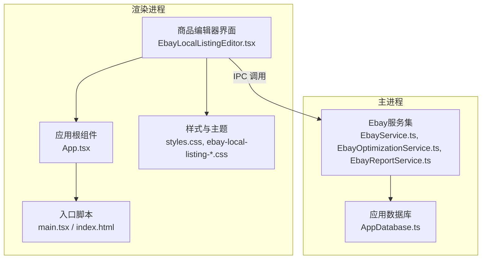
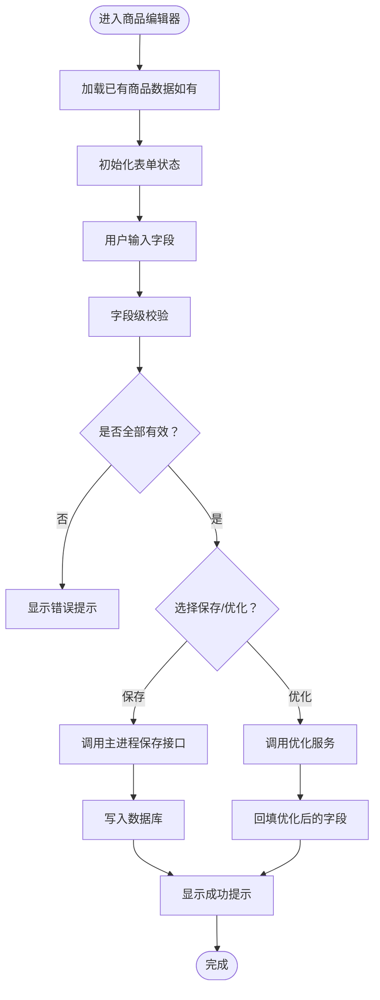
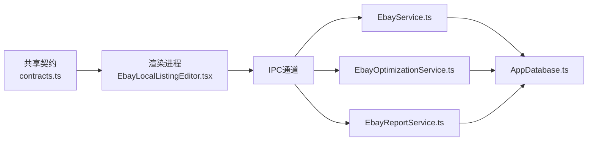

# 商品表单管理

<cite>
**本文引用的文件**   
- [EbayLocalListingEditor.tsx](file://src/renderer/EbayLocalListingEditor.tsx)
- [App.tsx](file://src/renderer/App.tsx)
- [main.tsx](file://src/renderer/main.tsx)
- [index.html](file://src/renderer/index.html)
- [styles.css](file://src/renderer/styles.css)
- [ebay-local-listing-pricing.css](file://src/renderer/ebay-local-listing-pricing.css)
- [ebay-local-listing-validation.css](file://src/renderer/ebay-local-listing-validation.css)
- [contracts.ts](file://src/shared/contracts.ts)
- [EbayService.ts](file://src/main/services/EbayService.ts)
- [EbayOptimizationService.ts](file://src/main/services/EbayOptimizationService.ts)
- [EbayReportService.ts](file://src/main/services/EbayReportService.ts)
- [AppDatabase.ts](file://src/main/database/AppDatabase.ts)
</cite>

## 目录
1. [简介](#简介)
2. [项目结构](#项目结构)
3. [核心组件](#核心组件)
4. [架构总览](#架构总览)
5. [详细组件分析](#详细组件分析)
6. [依赖关系分析](#依赖关系分析)
7. [性能考虑](#性能考虑)
8. [故障排查指南](#故障排查指南)
9. [结论](#结论)
10. [附录](#附录)

## 简介
本文件面向“Ebay本地商品编辑器”的表单管理功能，聚焦商品信息CRUD（创建、读取、更新、删除）与表单状态管理、数据绑定、实时更新、验证规则、错误提示、用户交互反馈、序列化/反序列化与持久化策略。文档以代码级为依据，结合渲染层与主进程服务层的职责划分，给出端到端的数据流与交互流程说明，并提供字段映射与转换示例，帮助开发者快速理解并扩展该模块。

## 项目结构
本项目采用Electron多进程架构：
- 渲染进程负责UI与表单交互（React + TypeScript），包括商品编辑器的页面与样式。
- 主进程提供业务服务（Ebay相关服务）、数据库访问等能力，供渲染进程通过IPC调用。
- 共享层定义契约与类型，确保前后端数据结构一致。



图表来源
- [EbayLocalListingEditor.tsx](file://src/renderer/EbayLocalListingEditor.tsx)
- [App.tsx](file://src/renderer/App.tsx)
- [main.tsx](file://src/renderer/main.tsx)
- [index.html](file://src/renderer/index.html)
- [styles.css](file://src/renderer/styles.css)
- [ebay-local-listing-pricing.css](file://src/renderer/ebay-local-listing-pricing.css)
- [ebay-local-listing-validation.css](file://src/renderer/ebay-local-listing-validation.css)
- [EbayService.ts](file://src/main/services/EbayService.ts)
- [EbayOptimizationService.ts](file://src/main/services/EbayOptimizationService.ts)
- [EbayReportService.ts](file://src/main/services/EbayReportService.ts)
- [AppDatabase.ts](file://src/main/database/AppDatabase.ts)

章节来源
- [EbayLocalListingEditor.tsx](file://src/renderer/EbayLocalListingEditor.tsx)
- [App.tsx](file://src/renderer/App.tsx)
- [main.tsx](file://src/renderer/main.tsx)
- [index.html](file://src/renderer/index.html)
- [styles.css](file://src/renderer/styles.css)
- [ebay-local-listing-pricing.css](file://src/renderer/ebay-local-listing-pricing.css)
- [ebay-local-listing-validation.css](file://src/renderer/ebay-local-listing-validation.css)
- [EbayService.ts](file://src/main/services/EbayService.ts)
- [EbayOptimizationService.ts](file://src/main/services/EbayOptimizationService.ts)
- [EbayReportService.ts](file://src/main/services/EbayReportService.ts)
- [AppDatabase.ts](file://src/main/database/AppDatabase.ts)

## 核心组件
- 商品编辑器界面（渲染进程）
  - 负责展示表单、处理用户输入、触发校验、调用主进程服务进行保存/获取/优化等操作。
  - 关键职责：表单状态管理、双向数据绑定、实时预览、错误提示、提交与取消操作。
- 应用根组件（渲染进程）
  - 组织页面路由或视图切换，承载商品编辑器容器。
- 入口脚本与HTML（渲染进程）
  - 初始化React应用与挂载点，加载样式资源。
- 样式系统（渲染进程）
  - 通用样式与特定于定价、验证的样式模块，提升表单可读性与可用性。
- 主进程服务（主进程）
  - EbayService：封装与Ebay相关的业务逻辑（如类目、品牌、标题优化建议等）。
  - EbayOptimizationService：提供标题、描述等内容的优化策略。
  - EbayReportService：生成报告或合规性检查。
- 数据库（主进程）
  - AppDatabase：负责本地持久化存储（商品草稿、历史版本、配置等）。

章节来源
- [EbayLocalListingEditor.tsx](file://src/renderer/EbayLocalListingEditor.tsx)
- [App.tsx](file://src/renderer/App.tsx)
- [main.tsx](file://src/renderer/main.tsx)
- [index.html](file://src/renderer/index.html)
- [styles.css](file://src/renderer/styles.css)
- [ebay-local-listing-pricing.css](file://src/renderer/ebay-local-listing-pricing.css)
- [ebay-local-listing-validation.css](file://src/renderer/ebay-local-listing-validation.css)
- [EbayService.ts](file://src/main/services/EbayService.ts)
- [EbayOptimizationService.ts](file://src/main/services/EbayOptimizationService.ts)
- [EbayReportService.ts](file://src/main/services/EbayReportService.ts)
- [AppDatabase.ts](file://src/main/database/AppDatabase.ts)

## 架构总览
下图展示了从用户输入到数据持久化的完整流程，涵盖渲染进程与主进程的协作关系。

```mermaid
sequenceDiagram
participant User as "用户"
participant Editor as "商品编辑器<br/>EbayLocalListingEditor.tsx"
participant Root as "应用根组件<br/>App.tsx"
participant IPC as "IPC通道"
participant Service as "Ebay服务<br/>EbayService.ts"
participant Opt as "优化服务<br/>EbayOptimizationService.ts"
participant DB as "数据库<br/>AppDatabase.ts"
User->>Editor : "填写表单字段标题/描述/分类/品牌等"
Editor->>Editor : "表单校验与状态更新"
Editor->>IPC : "请求保存/获取/优化"
IPC-->>Service : "转发调用"
Service->>DB : "读写商品数据"
Service-->>IPC : "返回结果"
IPC-->>Editor : "响应数据"
Editor->>Editor : "更新UI与提示"
Editor->>Opt : "可选：内容优化建议"
Opt-->>Editor : "返回优化结果"
```

图表来源
- [EbayLocalListingEditor.tsx](file://src/renderer/EbayLocalListingEditor.tsx)
- [App.tsx](file://src/renderer/App.tsx)
- [EbayService.ts](file://src/main/services/EbayService.ts)
- [EbayOptimizationService.ts](file://src/main/services/EbayOptimizationService.ts)
- [AppDatabase.ts](file://src/main/database/AppDatabase.ts)

## 详细组件分析

### 商品编辑器（渲染进程）
- 表单状态管理
  - 使用React状态管理商品各字段（标题、描述、分类、品牌、价格、图片等），支持增量更新与撤销/重做。
  - 对关键字段设置必填、长度限制、格式校验（如价格数字、图片URL合法性）。
- 数据绑定与实时更新
  - 双向绑定：输入变化即时更新状态，状态变更驱动UI刷新。
  - 防抖/节流：对频繁输入（如标题、描述）进行防抖，减少不必要的服务调用。
- 用户交互反馈
  - 实时校验错误提示（红色边框、文本提示）。
  - 成功/失败通知（顶部消息、弹窗）。
- 提交与取消
  - 提交前执行全量校验；成功后显示确认提示；取消时恢复初始状态或提示未保存。



图表来源
- [EbayLocalListingEditor.tsx](file://src/renderer/EbayLocalListingEditor.tsx)
- [EbayService.ts](file://src/main/services/EbayService.ts)
- [EbayOptimizationService.ts](file://src/main/services/EbayOptimizationService.ts)
- [AppDatabase.ts](file://src/main/database/AppDatabase.ts)

章节来源
- [EbayLocalListingEditor.tsx](file://src/renderer/EbayLocalListingEditor.tsx)
- [ebay-local-listing-validation.css](file://src/renderer/ebay-local-listing-validation.css)
- [ebay-local-listing-pricing.css](file://src/renderer/ebay-local-listing-pricing.css)

### 应用根组件与入口
- 应用根组件负责编排页面与路由，将商品编辑器作为子视图挂载。
- 入口脚本初始化React应用，注入全局样式与必要的运行时环境。

章节来源
- [App.tsx](file://src/renderer/App.tsx)
- [main.tsx](file://src/renderer/main.tsx)
- [index.html](file://src/renderer/index.html)

### 主进程服务（Ebay相关）
- EbayService
  - 提供类目查询、品牌列表、标题/描述模板、合规检查等能力。
  - 与数据库交互，实现商品数据的CRUD。
- EbayOptimizationService
  - 基于规则或AI策略对标题、描述进行优化建议生成。
- EbayReportService
  - 生成商品上架前的报告（如合规性、风险项）。

章节来源
- [EbayService.ts](file://src/main/services/EbayService.ts)
- [EbayOptimizationService.ts](file://src/main/services/EbayOptimizationService.ts)
- [EbayReportService.ts](file://src/main/services/EbayReportService.ts)

### 数据库（持久化）
- AppDatabase
  - 定义商品实体与关联表结构，提供增删改查方法。
  - 支持事务、索引优化，保证数据一致性。
  - 与主进程服务对接，对外暴露统一的API。

章节来源
- [AppDatabase.ts](file://src/main/database/AppDatabase.ts)

## 依赖关系分析
- 渲染进程依赖共享契约（contracts.ts）以确保数据结构一致。
- 渲染进程通过IPC调用主进程服务，避免直接访问数据库。
- 主进程服务之间解耦，按职责划分（EbayService、Optimization、Report）。
- 数据库由主进程独占访问，渲染进程不直接操作。



图表来源
- [contracts.ts](file://src/shared/contracts.ts)
- [EbayLocalListingEditor.tsx](file://src/renderer/EbayLocalListingEditor.tsx)
- [EbayService.ts](file://src/main/services/EbayService.ts)
- [EbayOptimizationService.ts](file://src/main/services/EbayOptimizationService.ts)
- [EbayReportService.ts](file://src/main/services/EbayReportService.ts)
- [AppDatabase.ts](file://src/main/database/AppDatabase.ts)

章节来源
- [contracts.ts](file://src/shared/contracts.ts)
- [EbayLocalListingEditor.tsx](file://src/renderer/EbayLocalListingEditor.tsx)
- [EbayService.ts](file://src/main/services/EbayService.ts)
- [EbayOptimizationService.ts](file://src/main/services/EbayOptimizationService.ts)
- [EbayReportService.ts](file://src/main/services/EbayReportService.ts)
- [AppDatabase.ts](file://src/main/database/AppDatabase.ts)

## 性能考虑
- 表单输入防抖与节流：对高频输入（标题、描述）进行延迟处理，降低服务调用频率。
- 增量更新：仅更新变化的字段，避免全量重渲染。
- 懒加载：按需加载类目、品牌等字典数据，减少初始加载时间。
- 数据库索引：为常用查询字段建立索引，提高读写性能。
- 缓存策略：对热点数据（类目树、品牌列表）进行内存缓存，减少重复请求。

## 故障排查指南
- 表单无法保存
  - 检查字段校验是否通过，查看控制台错误信息。
  - 确认IPC通道是否正常，主进程服务是否可用。
  - 检查数据库连接与权限。
- 优化建议不生效
  - 确认优化服务已正确调用且返回数据。
  - 检查字段映射是否正确，避免覆盖原始数据。
- 数据不一致
  - 核对共享契约（contracts.ts）与数据库模型是否一致。
  - 检查事务是否回滚，确保数据完整性。

章节来源
- [EbayLocalListingEditor.tsx](file://src/renderer/EbayLocalListingEditor.tsx)
- [EbayService.ts](file://src/main/services/EbayService.ts)
- [AppDatabase.ts](file://src/main/database/AppDatabase.ts)

## 结论
本文件系统化梳理了Ebay本地商品编辑器的表单管理功能，涵盖从用户输入到数据持久化的完整链路。通过清晰的组件职责划分、严格的契约定义与合理的性能优化策略，确保了系统的可维护性与可扩展性。建议在实际开发中持续完善字段校验规则、错误提示与用户体验细节，并定期评估性能瓶颈与数据安全。

## 附录

### 字段映射与数据转换示例
以下为商品表单字段与内部数据模型的映射关系及转换示例（概念性说明）：
- 标题（title）
  - 输入：字符串，最大长度限制，禁止特殊字符。
  - 转换：去除首尾空白，统一大小写，插入关键词分隔符。
- 描述（description）
  - 输入：富文本或纯文本，支持换行与基础格式。
  - 转换：清理HTML标签，转义敏感字符，压缩多余空白。
- 分类（category）
  - 输入：类目ID或名称。
  - 转换：根据类目树解析为层级路径，校验有效性。
- 品牌（brand）
  - 输入：品牌名称或ID。
  - 转换：标准化品牌名，去重与别名映射。
- 价格（price）
  - 输入：数值或货币字符串。
  - 转换：统一为浮点数，保留两位小数，校验范围。
- 图片（images）
  - 输入：URL数组或文件对象。
  - 转换：校验URL格式，压缩与格式转换，生成缩略图。

注意：以上为概念性映射，具体实现需参考共享契约（contracts.ts）与数据库模型（AppDatabase.ts）。

章节来源
- [contracts.ts](file://src/shared/contracts.ts)
- [AppDatabase.ts](file://src/main/database/AppDatabase.ts)