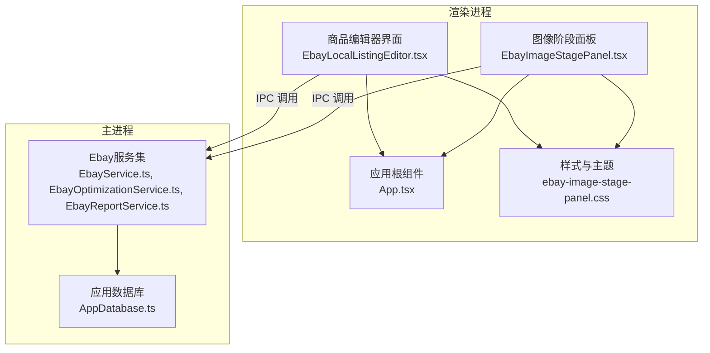
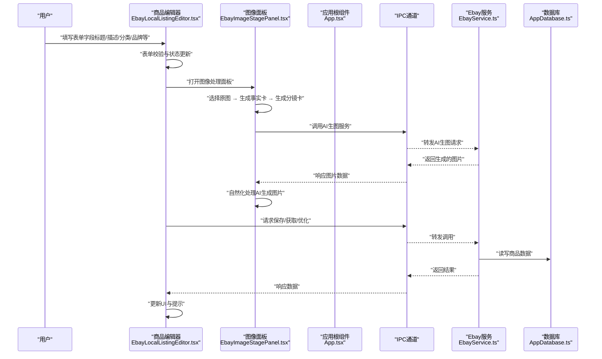
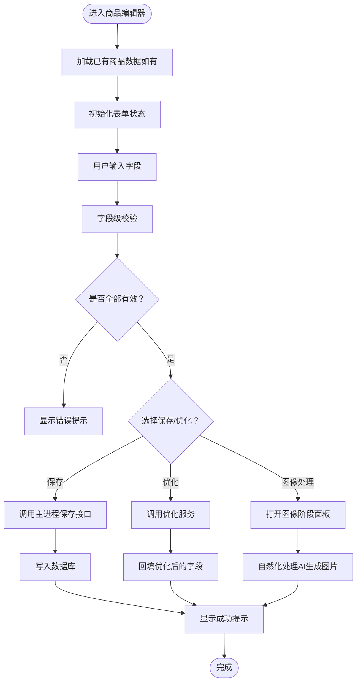
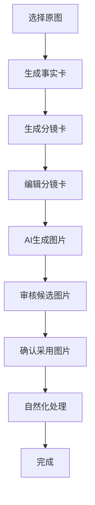
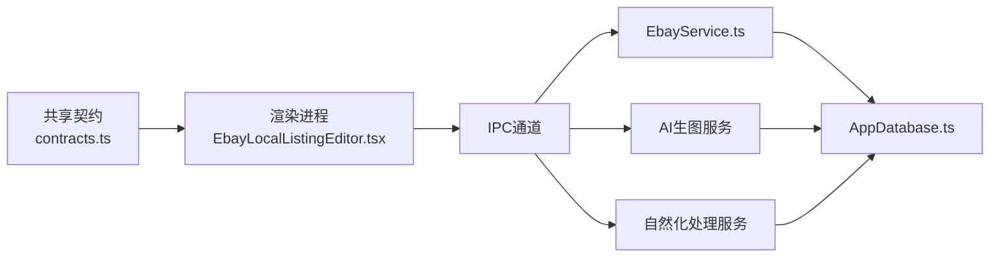

# 商品表单管理

<cite>
**本文引用的文件**   
- [EbayLocalListingEditor.tsx](file://src/renderer/EbayLocalListingEditor.tsx)
- [EbayImageStagePanel.tsx](file://src/renderer/EbayImageStagePanel.tsx)
- [App.tsx](file://src/renderer/App.tsx)
- [contracts.ts](file://src/shared/contracts.ts)
- [ebay-image-stage-panel.css](file://src/renderer/ebay-image-stage-panel.css)
</cite>

## 更新摘要
**所做更改**
- 新增自然化处理面板功能，支持AI生成图片的自然化转换
- 简化参考图片管理，采用固定参考限制替代复杂的localStorage状态管理
- 增强图像处理流程，包含事实卡、分镜卡、AI生成和确认的完整工作流
- 优化并发控制和性能配置，支持分析任务和生图任务的独立并发设置

## 目录
1. [简介](#简介)
2. [项目结构](#项目结构)
3. [核心组件](#核心组件)
4. [架构总览](#架构总览)
5. [详细组件分析](#详细组件分析)
6. [依赖关系分析](#依赖关系分析)
7. [性能考虑](#性能考虑)
8. [故障排查指南](#故障排查指南)
9. [结论](#结论)
10. [附录](#附录)

## 简介
本文档面向"Ebay本地商品编辑器"的表单管理功能，聚焦商品信息CRUD（创建、读取、更新、删除）与表单状态管理、数据绑定、实时更新、验证规则、错误提示、用户交互反馈、序列化/反序列化与持久化策略。特别关注图像处理能力的增强，包括新增的自然化处理面板和简化的参考图片管理机制。文档以代码级为依据，结合渲染层与主进程服务层的职责划分，给出端到端的数据流与交互流程说明，并提供字段映射与转换示例，帮助开发者快速理解并扩展该模块。

## 项目结构
本项目采用Electron多进程架构：
- 渲染进程负责UI与表单交互（React + TypeScript），包括商品编辑器的页面与样式。
- 主进程提供业务服务（Ebay相关服务）、数据库访问等能力，供渲染进程通过IPC调用。
- 共享层定义契约与类型，确保前后端数据结构一致。

**图表来源**
- [EbayLocalListingEditor.tsx](file://src/renderer/EbayLocalListingEditor.tsx)
- [EbayImageStagePanel.tsx](file://src/renderer/EbayImageStagePanel.tsx)
- [App.tsx](file://src/renderer/App.tsx)
- [ebay-image-stage-panel.css](file://src/renderer/ebay-image-stage-panel.css)

## 核心组件
- **商品编辑器界面**（渲染进程）
  - 负责展示表单、处理用户输入、触发校验、调用主进程服务进行保存/获取/优化等操作。
  - 关键职责：表单状态管理、双向数据绑定、实时预览、错误提示、提交与取消操作。
- **图像阶段面板**（渲染进程）
  - 提供完整的图像处理工作流，包括原图选择、事实卡生成、分镜卡编辑、AI图片生成和自然化处理。
  - 支持多阶段并行处理和并发控制，提升图像处理效率。
- **应用根组件**（渲染进程）
  - 组织页面路由或视图切换，承载商品编辑器容器和图像面板。
  - 管理localStorage中的参考图片选择和并发配置。
- **样式系统**（渲染进程）
  - 通用样式与特定于定价、验证、图像处理的样式模块，提升表单可读性与可用性。
- **主进程服务**（主进程）
  - EbayService：封装与Ebay相关的业务逻辑（如类目、品牌、标题优化建议等）。
  - 数据库访问：实现商品数据的CRUD操作。

**章节来源**
- [EbayLocalListingEditor.tsx](file://src/renderer/EbayLocalListingEditor.tsx)
- [EbayImageStagePanel.tsx](file://src/renderer/EbayImageStagePanel.tsx)
- [App.tsx](file://src/renderer/App.tsx)
- [ebay-image-stage-panel.css](file://src/renderer/ebay-image-stage-panel.css)

## 架构总览
下图展示了从用户输入到数据持久化的完整流程，涵盖渲染进程与主进程的协作关系，以及增强的图像处理流程。

**图表来源**
- [EbayLocalListingEditor.tsx](file://src/renderer/EbayLocalListingEditor.tsx)
- [EbayImageStagePanel.tsx](file://src/renderer/EbayImageStagePanel.tsx)
- [App.tsx](file://src/renderer/App.tsx)

## 详细组件分析

### 商品编辑器（渲染进程）
- **表单状态管理**
  - 使用React状态管理商品各字段（标题、描述、分类、品牌、价格、图片等），支持增量更新与撤销/重做。
  - 对关键字段设置必填、长度限制、格式校验（如价格数字、图片URL合法性）。
  - 图片数量限制为24张，最小尺寸要求500px。
- **数据绑定与实时更新**
  - 双向绑定：输入变化即时更新状态，状态变更驱动UI刷新。
  - 防抖/节流：对频繁输入（如标题、描述）进行防抖，减少不必要的服务调用。
- **用户交互反馈**
  - 实时校验错误提示（红色边框、文本提示）。
  - 成功/失败通知（顶部消息、弹窗）。
- **提交与取消**
  - 提交前执行全量校验；成功后显示确认提示；取消时恢复初始状态或提示未保存。

**图表来源**
- [EbayLocalListingEditor.tsx](file://src/renderer/EbayLocalListingEditor.tsx)

**章节来源**
- [EbayLocalListingEditor.tsx](file://src/renderer/EbayLocalListingEditor.tsx)

### 图像阶段面板（新增功能）
- **多阶段图像处理流程**
  - 原图选择：从已同步的原商品图片中选择参照（不限张数）。
  - 事实卡生成：每张原图生成1张事实卡，提取商品主体、保护属性、已核实事实等信息。
  - 分镜卡编辑：基于事实卡生成分镜卡，支持用户编辑镜头描述、内容依据、验收标准等。
  - AI图片生成：按分镜卡生成候选图片，支持每卡多个变体。
  - 图片确认：选择要采用的候选图片，确认后进入下一阶段。
  - 自然化处理：对已生成的AI图片进行自然化处理，使其更接近实拍质感。
- **并发控制与性能优化**
  - 分析任务并发：可配置的事实卡和分镜卡生成并发数（1-6）。
  - 生图任务并发：可配置的AI图片生成并发数（1-4）。
  - 并发设置持久化到localStorage，支持用户自定义配置。
- **参考图片管理简化**
  - 移除复杂的localStorage状态管理，采用固定参考限制。
  - 参考图片上限根据模型类型动态确定：wan2.7系列8张、Z-Image 1张、其他模型默认3张。
  - 用户手动勾选的参考图URL列表按商品持久化，生成分镜时优先使用这些参照。

**图表来源**
- [EbayImageStagePanel.tsx](file://src/renderer/EbayImageStagePanel.tsx)

**章节来源**
- [EbayImageStagePanel.tsx](file://src/renderer/EbayImageStagePanel.tsx)
- [ebay-image-stage-panel.css](file://src/renderer/ebay-image-stage-panel.css)

### 应用根组件与入口
- **应用根组件**负责编排页面与路由，将商品编辑器作为子视图挂载。
- **localStorage管理**：
  - 参考图片选择：`ebay-image-reference-selection:v1:{listingId}`
  - 源图片选择：`ebay-source-selection:v1:{listingId}`
  - 并发配置：`ebay-stage-concurrency:analysis:v1` 和 `ebay-stage-concurrency:generation:v1`
  - 模型默认设置：`ebay-image-default-model:v1`
- **入口脚本**初始化React应用，注入全局样式与必要的运行时环境。

**章节来源**
- [App.tsx](file://src/renderer/App.tsx)

### 主进程服务（Ebay相关）
- **EbayService**
  - 提供类目查询、品牌列表、标题/描述模板、合规检查等能力。
  - 与数据库交互，实现商品数据的CRUD。
  - 图片上传和处理：支持多种图片格式，最大单张图片12MB。
- **数据库**
  - 定义商品实体与关联表结构，提供增删改查方法。
  - 支持事务、索引优化，保证数据一致性。
  - 与主进程服务对接，对外暴露统一的API。

**章节来源**
- [App.tsx](file://src/renderer/App.tsx)

## 依赖关系分析
- 渲染进程依赖共享契约（contracts.ts）以确保数据结构一致。
- 渲染进程通过IPC调用主进程服务，避免直接访问数据库。
- 主进程服务之间解耦，按职责划分（EbayService、Optimization、Report）。
- 数据库由主进程独占访问，渲染进程不直接操作。
- 图像阶段面板依赖AI生图服务和自然化处理服务。

**图表来源**
- [contracts.ts](file://src/shared/contracts.ts)
- [EbayLocalListingEditor.tsx](file://src/renderer/EbayLocalListingEditor.tsx)
- [EbayImageStagePanel.tsx](file://src/renderer/EbayImageStagePanel.tsx)

**章节来源**
- [contracts.ts](file://src/shared/contracts.ts)
- [EbayLocalListingEditor.tsx](file://src/renderer/EbayLocalListingEditor.tsx)
- [EbayImageStagePanel.tsx](file://src/renderer/EbayImageStagePanel.tsx)

## 性能考虑
- **表单输入防抖与节流**：对高频输入（标题、描述）进行延迟处理，降低服务调用频率。
- **增量更新**：仅更新变化的字段，避免全量重渲染。
- **懒加载**：按需加载类目、品牌等字典数据，减少初始加载时间。
- **数据库索引**：为常用查询字段建立索引，提高读写性能。
- **缓存策略**：对热点数据（类目树、品牌列表）进行内存缓存，减少重复请求。
- **图像处理并发控制**：
  - 分析任务并发：1-6，影响事实卡和分镜卡生成速度。
  - 生图任务并发：1-4，影响AI图片生成速度。
  - 并发设置持久化，用户可根据设备性能调整。
- **参考图片限制**：根据模型类型自动限制参考图片数量，避免过度消耗资源。

## 故障排查指南
- **表单无法保存**
  - 检查字段校验是否通过，查看控制台错误信息。
  - 确认IPC通道是否正常，主进程服务是否可用。
  - 检查数据库连接与权限。
- **图像处理失败**
  - 确认AI生图服务已正确调用且返回数据。
  - 检查参考图片格式和大小是否符合要求。
  - 验证并发配置是否合理，过高可能导致服务限流。
- **自然化处理问题**
  - 检查Python环境和依赖库（Pillow/numpy）是否正确安装。
  - 确认预检通过后再进行处理。
  - 单个图片处理失败不影响其他图片继续处理。
- **数据不一致**
  - 核对共享契约（contracts.ts）与数据库模型是否一致。
  - 检查事务是否回滚，确保数据完整性。
- **localStorage相关问题**
  - 确认存储空间充足，避免超出配额。
  - 检查key命名规范，避免冲突。
  - 处理JSON解析异常，提供降级方案。

**章节来源**
- [EbayLocalListingEditor.tsx](file://src/renderer/EbayLocalListingEditor.tsx)
- [EbayImageStagePanel.tsx](file://src/renderer/EbayImageStagePanel.tsx)
- [App.tsx](file://src/renderer/App.tsx)

## 结论
本文档系统化梳理了Ebay本地商品编辑器的表单管理功能，特别关注了图像处理能力的增强。通过新增的自然化处理面板和简化的参考图片管理机制，显著提升了用户体验和功能完整性。通过清晰的组件职责划分、严格的契约定义与合理的性能优化策略，确保了系统的可维护性与可扩展性。建议在实际开发中持续完善字段校验规则、错误提示与用户体验细节，并定期评估性能瓶颈与数据安全。

## 附录

### 字段映射与数据转换示例
以下为商品表单字段与内部数据模型的映射关系及转换示例（概念性说明）：
- **标题（title）**
  - 输入：字符串，最大长度限制，禁止特殊字符。
  - 转换：去除首尾空白，统一大小写，插入关键词分隔符。
- **描述（description）**
  - 输入：富文本或纯文本，支持换行与基础格式。
  - 转换：清理HTML标签，转义敏感字符，压缩多余空白。
- **分类（category）**
  - 输入：类目ID或名称。
  - 转换：根据类目树解析为层级路径，校验有效性。
- **品牌（brand）**
  - 输入：品牌名称或ID。
  - 转换：标准化品牌名，去重与别名映射。
- **价格（price）**
  - 输入：数值或货币字符串。
  - 转换：统一为浮点数，保留两位小数，校验范围。
- **图片（images）**
  - 输入：URL数组或文件对象。
  - 转换：校验URL格式，压缩与格式转换，生成缩略图。
  - 限制：最多24张，最小尺寸500px，单张不超过12MB。
- **参考图片（reference images）**
  - 输入：用户选择的原图URL列表。
  - 转换：根据模型类型限制数量（wan2.7: 8张，Z-Image: 1张，其他: 3张）。
  - 存储：按商品ID持久化到localStorage。

**注意**：以上为概念性映射，具体实现需参考共享契约（contracts.ts）与数据库模型（AppDatabase.ts）。

**章节来源**
- [contracts.ts](file://src/shared/contracts.ts)
- [EbayLocalListingEditor.tsx](file://src/renderer/EbayLocalListingEditor.tsx)
- [EbayImageStagePanel.tsx](file://src/renderer/EbayImageStagePanel.tsx)
- [App.tsx](file://src/renderer/App.tsx)

### 图像处理工作流程详解
1. **原图选择阶段**
   - 用户从已同步的原商品图片中选择参照图。
   - 支持多选，无数量限制。
   - 选中的原图用于后续的事实卡生成。

2. **事实卡生成阶段**
   - 每张选中的原图生成1张事实卡。
   - 事实卡包含：商品主体、保护属性、已核实事实、警告信息等。
   - 支持继承前一阶段的全局事实卡。

3. **分镜卡生成阶段**
   - 基于事实卡生成分镜卡，包含镜头描述、内容依据、验收标准、禁止事项等。
   - 支持用户编辑分镜卡内容。
   - 每个分镜卡绑定对应的原图下标。

4. **AI图片生成阶段**
   - 按分镜卡生成候选图片，支持每卡多个变体（1-4个）。
   - 使用对应原图作为参照，确保商品一致性。
   - 支持单独重新生成某个分镜卡的图片。

5. **图片确认阶段**
   - 用户选择要采用的候选图片。
   - 确认后进入下一阶段，支持撤回确认。
   - 自动解锁下一个处理阶段。

6. **自然化处理阶段**
   - 对所有已确认的AI生成图片进行自然化处理。
   - 使AI生成图更接近实拍质感。
   - 支持轻度、均衡两种处理档位。
   - 单个图片处理失败不影响其他图片继续处理。

**章节来源**
- [EbayImageStagePanel.tsx](file://src/renderer/EbayImageStagePanel.tsx)