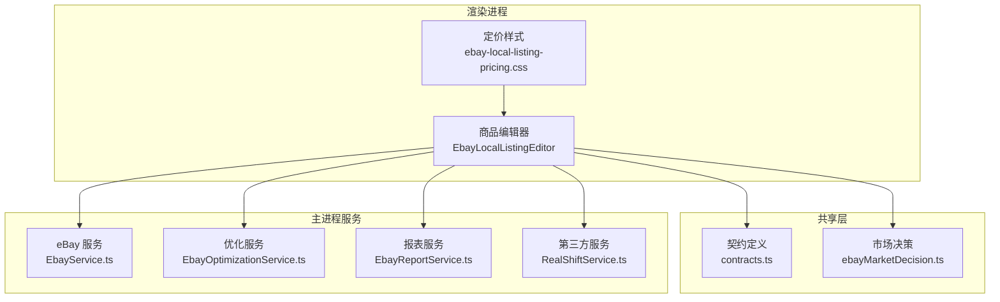
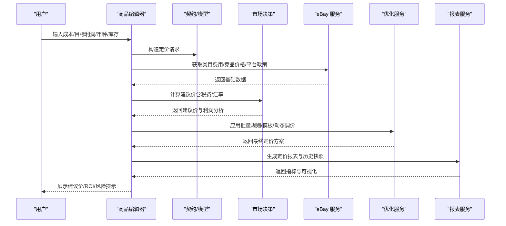
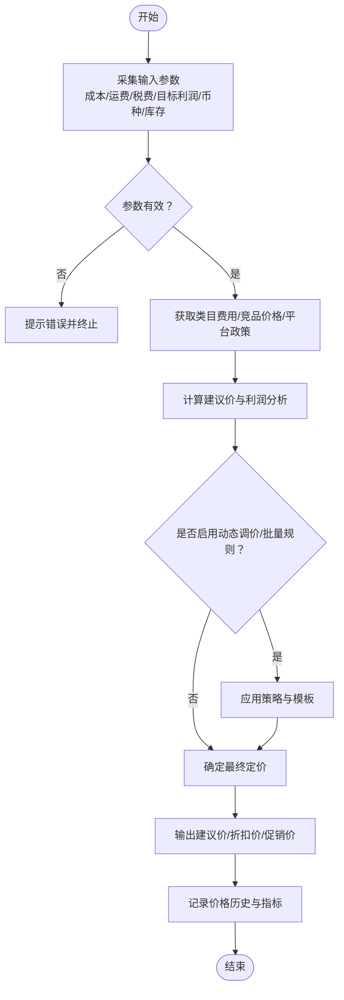
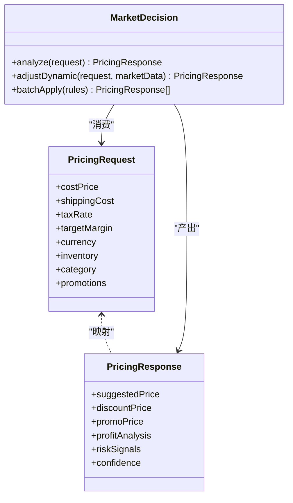
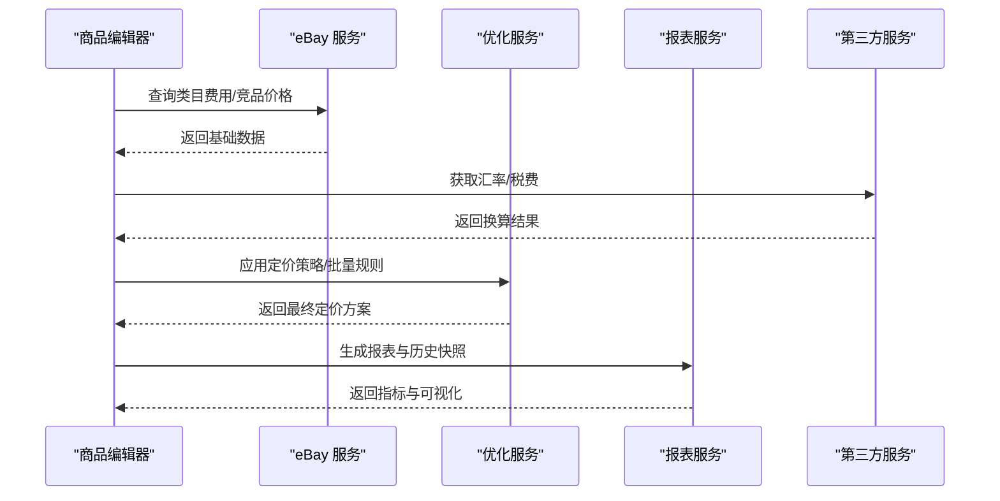
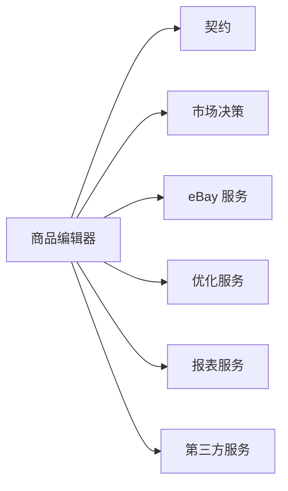

# 定价计算引擎

<cite>
**本文档引用的文件**   
- [EbayLocalListingEditor.tsx](file://src/renderer/EbayLocalListingEditor.tsx)
- [ebay-local-listing-pricing.css](file://src/renderer/ebay-local-listing-pricing.css)
- [contracts.ts](file://src/shared/contracts.ts)
- [ebayMarketDecision.ts](file://src/shared/ebayMarketDecision.ts)
- [EbayService.ts](file://src/main/services/EbayService.ts)
- [EbayOptimizationService.ts](file://src/main/services/EbayOptimizationService.ts)
- [EbayReportService.ts](file://src/main/services/EbayReportService.ts)
- [RealShiftService.ts](file://src/main/services/RealShiftService.ts)
- [package.json](file://package.json)
</cite>

## 目录
1. [简介](#简介)
2. [项目结构](#项目结构)
3. [核心组件](#核心组件)
4. [架构总览](#架构总览)
5. [详细组件分析](#详细组件分析)
6. [依赖关系分析](#依赖关系分析)
7. [性能考量](#性能考量)
8. [故障排查指南](#故障排查指南)
9. [结论](#结论)
10. [附录](#附录)

## 简介
本技术文档围绕 eBay 本地商品编辑器的“定价计算引擎”展开，系统化阐述成本计算、利润分析、市场定价策略与动态价格调整的实现思路；同时覆盖多币种支持、汇率换算、税费计算、定价模板、批量定价规则、价格历史追踪、库存管理集成、价格监控与竞争分析等能力。文档还给出定价优化建议与 ROI 计算公式，帮助读者从业务到工程全面理解并落地该引擎。

## 项目结构
本项目采用 Electron 架构，前端渲染进程负责用户交互与定价界面，主进程服务层提供数据获取、分析与报告生成能力，共享模块定义契约与市场决策逻辑。定价相关的关键位置包括：
- 渲染层：商品编辑器与定价面板（含样式）
- 共享层：契约定义与市场决策模型
- 主进程服务：eBay 服务、优化服务、报表服务、第三方服务桥接
- 配置与依赖：包管理与构建配置

图表来源
- [EbayLocalListingEditor.tsx](file://src/renderer/EbayLocalListingEditor.tsx)
- [ebay-local-listing-pricing.css](file://src/renderer/ebay-local-listing-pricing.css)
- [contracts.ts](file://src/shared/contracts.ts)
- [ebayMarketDecision.ts](file://src/shared/ebayMarketDecision.ts)
- [EbayService.ts](file://src/main/services/EbayService.ts)
- [EbayOptimizationService.ts](file://src/main/services/EbayOptimizationService.ts)
- [EbayReportService.ts](file://src/main/services/EbayReportService.ts)
- [RealShiftService.ts](file://src/main/services/RealShiftService.ts)

章节来源
- [package.json](file://package.json)

## 核心组件
- 商品编辑器与定价面板：承载定价输入、展示计算结果、驱动批量与模板操作
- 契约与数据模型：统一输入输出结构，确保前后端一致
- 市场决策：基于竞品、类目、历史与平台规则进行价格建议
- 服务层：
  - eBay 服务：获取类目、费用、竞品与价格基准
  - 优化服务：执行定价策略、动态调价与 A/B 测试
  - 报表服务：生成定价效果与 ROI 报表
  - 第三方服务：汇率、税费、物流等外部数据接入

章节来源
- [EbayLocalListingEditor.tsx](file://src/renderer/EbayLocalListingEditor.tsx)
- [contracts.ts](file://src/shared/contracts.ts)
- [ebayMarketDecision.ts](file://src/shared/ebayMarketDecision.ts)
- [EbayService.ts](file://src/main/services/EbayService.ts)
- [EbayOptimizationService.ts](file://src/main/services/EbayOptimizationService.ts)
- [EbayReportService.ts](file://src/main/services/EbayReportService.ts)
- [RealShiftService.ts](file://src/main/services/RealShiftService.ts)

## 架构总览
定价计算引擎遵循“输入—计算—策略—输出—反馈”的闭环：
- 输入：成本、运费、税费、平台佣金、目标利润率、币种、库存、竞品价格、促销计划
- 计算：成本汇总、税费折算、汇率换算、利润测算
- 策略：市场定价、动态调价、批量规则、模板套用
- 输出：建议售价、折扣价、促销价、ROI 指标
- 反馈：价格监控、销量转化、A/B 实验、历史追踪

图表来源
- [EbayLocalListingEditor.tsx](file://src/renderer/EbayLocalListingEditor.tsx)
- [contracts.ts](file://src/shared/contracts.ts)
- [ebayMarketDecision.ts](file://src/shared/ebayMarketDecision.ts)
- [EbayService.ts](file://src/main/services/EbayService.ts)
- [EbayOptimizationService.ts](file://src/main/services/EbayOptimizationService.ts)
- [EbayReportService.ts](file://src/main/services/EbayReportService.ts)

## 详细组件分析

### 商品编辑器与定价面板
- 职责：收集用户输入、调用服务层、展示计算结果、支持批量与模板
- 关键流程：
  - 输入校验与默认值填充
  - 触发定价计算（成本、税费、汇率、利润）
  - 展示建议价、折扣价、促销价与风险提示
  - 保存定价模板与批量规则
  - 同步至 eBay 或导出为 CSV

章节来源
- [EbayLocalListingEditor.tsx](file://src/renderer/EbayLocalListingEditor.tsx)
- [ebay-local-listing-pricing.css](file://src/renderer/ebay-local-listing-pricing.css)

### 契约与市场决策
- 契约定义：统一输入输出结构，确保前后端一致性
- 市场决策：结合竞品价格、类目费率、历史销量与平台规则生成建议价区间与置信度

图表来源
- [contracts.ts](file://src/shared/contracts.ts)
- [ebayMarketDecision.ts](file://src/shared/ebayMarketDecision.ts)

章节来源
- [contracts.ts](file://src/shared/contracts.ts)
- [ebayMarketDecision.ts](file://src/shared/ebayMarketDecision.ts)

### 服务层：eBay 服务、优化服务、报表服务、第三方服务
- eBay 服务：类目费用、竞品价格、平台政策、价格基准
- 优化服务：动态调价、A/B 测试、批量规则、模板套用
- 报表服务：ROI、转化率、价格弹性、历史对比
- 第三方服务：汇率、税费、物流成本

图表来源
- [EbayService.ts](file://src/main/services/EbayService.ts)
- [EbayOptimizationService.ts](file://src/main/services/EbayOptimizationService.ts)
- [EbayReportService.ts](file://src/main/services/EbayReportService.ts)
- [RealShiftService.ts](file://src/main/services/RealShiftService.ts)

章节来源
- [EbayService.ts](file://src/main/services/EbayService.ts)
- [EbayOptimizationService.ts](file://src/main/services/EbayOptimizationService.ts)
- [EbayReportService.ts](file://src/main/services/EbayReportService.ts)
- [RealShiftService.ts](file://src/main/services/RealShiftService.ts)

### 定价算法实现要点
- 成本计算：采购成本、运费、包装、仓储、退货损耗、平台佣金、支付手续费
- 税费计算：增值税/消费税按国家/地区与类目税率计算，支持含税/不含税切换
- 汇率换算：实时汇率源、缓存与回退机制，支持多币种显示与结算币种转换
- 利润分析：毛利率、净利率、盈亏平衡点、安全边际
- 市场定价策略：竞品锚定、类目均值、价格带分层、品牌定位
- 动态价格调整：时间窗、库存水位、转化率阈值、促销周期、A/B 实验
- 批量定价规则：按类目/供应商/渠道/标签批量套用公式与上下限
- 定价模板：预设模板与变量替换，支持版本化与灰度发布
- 价格历史追踪：时间序列存储、趋势分析、异常检测

章节来源
- [EbayLocalListingEditor.tsx](file://src/renderer/EbayLocalListingEditor.tsx)
- [ebayMarketDecision.ts](file://src/shared/ebayMarketDecision.ts)
- [EbayService.ts](file://src/main/services/EbayService.ts)
- [EbayOptimizationService.ts](file://src/main/services/EbayOptimizationService.ts)
- [EbayReportService.ts](file://src/main/services/EbayReportService.ts)
- [RealShiftService.ts](file://src/main/services/RealShiftService.ts)

### 多币种支持与汇率换算
- 支持多币种输入与显示，结算币种可独立配置
- 汇率源优先级：实时 API > 缓存 > 回退源
- 汇率更新频率与过期策略，避免频繁请求
- 汇率波动风险预警与价格保护策略

章节来源
- [RealShiftService.ts](file://src/main/services/RealShiftService.ts)
- [EbayService.ts](file://src/main/services/EbayService.ts)

### 税费计算功能
- 按国家/地区与类目匹配税率
- 含税/不含税模式切换，自动反算
- 跨境税费与关税估算，支持分仓策略

章节来源
- [EbayService.ts](file://src/main/services/EbayService.ts)
- [RealShiftService.ts](file://src/main/services/RealShiftService.ts)

### 定价模板与批量定价规则
- 模板字段：基础公式、上下限、促销叠加、币种、税费模式
- 批量规则：按类目/供应商/渠道/标签分组，支持条件分支
- 版本化管理：模板版本、灰度发布、回滚策略

章节来源
- [EbayLocalListingEditor.tsx](file://src/renderer/EbayLocalListingEditor.tsx)
- [EbayOptimizationService.ts](file://src/main/services/EbayOptimizationService.ts)

### 价格历史追踪
- 时间序列存储：建议价、成交价、折扣价、促销价
- 指标聚合：日均价、周均价、价格弹性、转化率
- 异常检测：跳涨/跳跌、竞品突变、汇率波动

章节来源
- [EbayReportService.ts](file://src/main/services/EbayReportService.ts)
- [EbayService.ts](file://src/main/services/EbayService.ts)

### 库存管理与价格监控
- 库存水位联动：低库存提价、高库存促销
- 价格监控：竞品价格抓取、阈值告警、自动调价
- 竞争分析：价格带分布、份额估算、差异化定位

章节来源
- [EbayService.ts](file://src/main/services/EbayService.ts)
- [EbayOptimizationService.ts](file://src/main/services/EbayOptimizationService.ts)

### 定价优化建议与 ROI 计算公式
- 优化建议：
  - 以竞品中位价为锚点，结合品牌定位微调
  - 利用促销周期提升转化率，控制毛利下限
  - 动态调价结合库存与转化率阈值
  - 多币种结算时预留汇率波动缓冲
- ROI 计算公式：
  - ROI = (净利润 / 总投入) × 100%
  - 净利润 = 销售收入 − 采购成本 − 运费 − 税费 − 平台佣金 − 支付手续费 − 营销费用 − 仓储与退货损耗
  - 总投入 = 采购成本 + 营销费用 + 仓储与退货损耗

章节来源
- [EbayReportService.ts](file://src/main/services/EbayReportService.ts)
- [EbayOptimizationService.ts](file://src/main/services/EbayOptimizationService.ts)

## 依赖关系分析
- 组件耦合：
  - 商品编辑器依赖契约与市场决策，降低与服务的直接耦合
  - 服务层通过接口抽象，便于替换与扩展
- 外部依赖：
  - eBay API：类目、费用、竞品、价格基准
  - 第三方服务：汇率、税费、物流
- 潜在循环依赖：
  - 通过契约与服务隔离，避免渲染层与服务层直接互相引用

图表来源
- [EbayLocalListingEditor.tsx](file://src/renderer/EbayLocalListingEditor.tsx)
- [contracts.ts](file://src/shared/contracts.ts)
- [ebayMarketDecision.ts](file://src/shared/ebayMarketDecision.ts)
- [EbayService.ts](file://src/main/services/EbayService.ts)
- [EbayOptimizationService.ts](file://src/main/services/EbayOptimizationService.ts)
- [EbayReportService.ts](file://src/main/services/EbayReportService.ts)
- [RealShiftService.ts](file://src/main/services/RealShiftService.ts)

章节来源
- [EbayLocalListingEditor.tsx](file://src/renderer/EbayLocalListingEditor.tsx)
- [contracts.ts](file://src/shared/contracts.ts)
- [ebayMarketDecision.ts](file://src/shared/ebayMarketDecision.ts)
- [EbayService.ts](file://src/main/services/EbayService.ts)
- [EbayOptimizationService.ts](file://src/main/services/EbayOptimizationService.ts)
- [EbayReportService.ts](file://src/main/services/EbayReportService.ts)
- [RealShiftService.ts](file://src/main/services/RealShiftService.ts)

## 性能考量
- 缓存策略：汇率、类目费用、竞品价格缓存，减少重复请求
- 异步处理：批量计算与报表生成使用队列与分页
- 增量更新：价格历史与指标增量计算，避免全量重算
- 降级策略：外部服务不可用时的回退与容错

[本节为通用指导，不直接分析具体文件]

## 故障排查指南
- 常见问题：
  - 汇率获取失败：检查网络与缓存，启用回退源
  - 税费计算异常：核对国家/地区与类目税率映射
  - 竞品价格缺失：重试抓取与降级策略
  - 动态调价未生效：检查规则与阈值配置
- 调试建议：
  - 打印定价请求与响应契约
  - 记录价格历史与指标变化
  - 开启 A/B 实验对比不同策略

章节来源
- [EbayService.ts](file://src/main/services/EbayService.ts)
- [EbayReportService.ts](file://src/main/services/EbayReportService.ts)
- [EbayOptimizationService.ts](file://src/main/services/EbayOptimizationService.ts)
- [RealShiftService.ts](file://src/main/services/RealShiftService.ts)

## 结论
本定价计算引擎以清晰的架构与模块化设计，实现了从成本到利润、从市场到策略、从静态到动态的全链路定价能力。通过多币种、税费、竞品与库存联动，以及模板与批量规则，满足复杂电商场景下的精细化定价需求。配合价格历史与报表分析，持续优化 ROI 与市场竞争力。

[本节为总结性内容，不直接分析具体文件]

## 附录
- 术语表：
  - 建议价：系统根据算法给出的参考售价
  - 折扣价：促销期间的降价售价
  - 促销价：限时活动价
  - 毛利率：(销售收入 − 变动成本) / 销售收入
  - 净利率：净利润 / 销售收入
- 最佳实践：
  - 设置合理的安全边际与价格下限
  - 定期复盘价格策略与 ROI
  - 结合竞品与库存动态调整

[本节为补充信息，不直接分析具体文件]