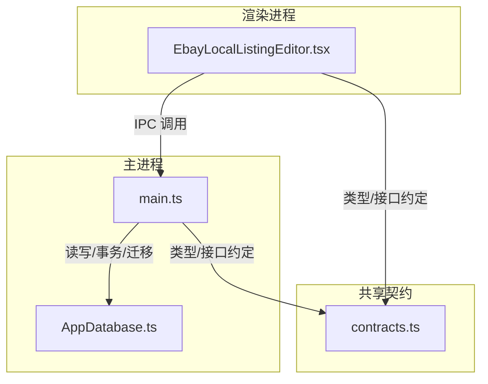
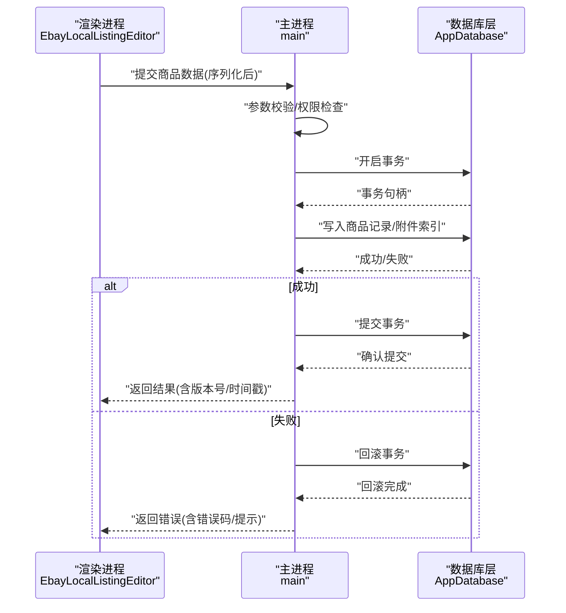
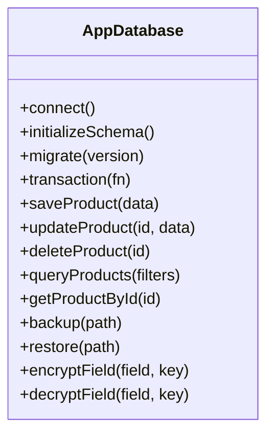
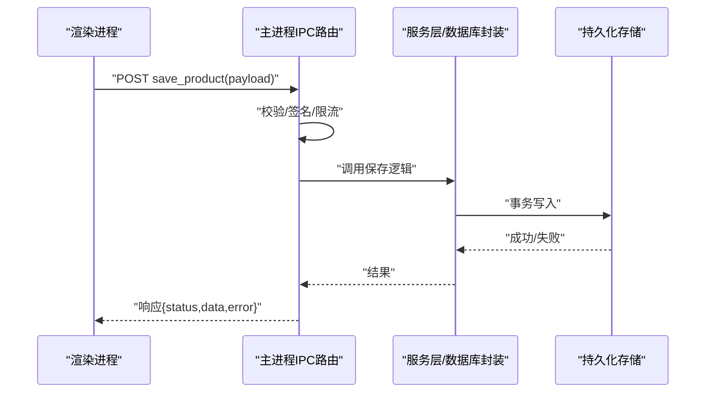
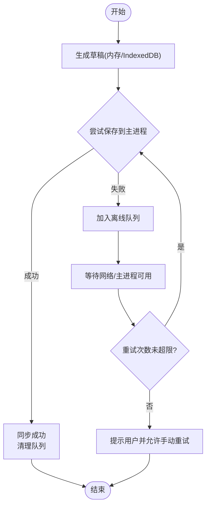
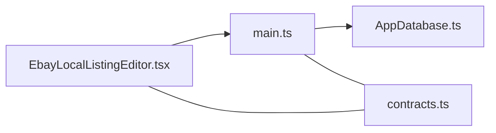

# 数据持久化

<cite>
**本文引用的文件**   
- [AppDatabase.ts](file://src/main/database/AppDatabase.ts)
- [main.ts](file://src/main/main.ts)
- [EbayLocalListingEditor.tsx](file://src/renderer/EbayLocalListingEditor.tsx)
- [contracts.ts](file://src/shared/contracts.ts)
</cite>

## 目录
1. [简介](#简介)
2. [项目结构](#项目结构)
3. [核心组件](#核心组件)
4. [架构总览](#架构总览)
5. [详细组件分析](#详细组件分析)
6. [依赖关系分析](#依赖关系分析)
7. [性能考量](#性能考量)
8. [故障排查指南](#故障排查指南)
9. [结论](#结论)
10. [附录](#附录)

## 简介
本技术文档聚焦于“Ebay本地商品编辑器”的数据持久化能力，涵盖以下关键主题：
- 本地存储机制与数据库选型
- 数据同步策略（主进程与渲染进程）
- 版本管理与数据迁移
- 商品数据的序列化格式与校验
- 备份与恢复机制
- 离线模式支持、冲突解决与一致性保证
- IPC 消息传递与状态同步
- 数据安全、加密与隐私保护

该文档旨在帮助开发者快速理解并扩展持久化子系统，同时为运维与测试提供可操作的指导。

## 项目结构
围绕数据持久化的相关文件主要集中在 main 进程的数据库层、主入口以及渲染进程的商品编辑器界面；共享契约定义用于跨进程数据结构约定。

图表来源
- [main.ts](file://src/main/main.ts)
- [AppDatabase.ts](file://src/main/database/AppDatabase.ts)
- [EbayLocalListingEditor.tsx](file://src/renderer/EbayLocalListingEditor.tsx)
- [contracts.ts](file://src/shared/contracts.ts)

章节来源
- [AppDatabase.ts](file://src/main/database/AppDatabase.ts)
- [main.ts](file://src/main/main.ts)
- [EbayLocalListingEditor.tsx](file://src/renderer/EbayLocalListingEditor.tsx)
- [contracts.ts](file://src/shared/contracts.ts)

## 核心组件
- 应用数据库封装（AppDatabase）
  - 负责数据库连接、表结构初始化、CRUD 操作、事务与并发控制、版本迁移钩子等。
- 主进程入口（main）
  - 注册 IPC 通道、桥接渲染进程请求到数据库层、处理错误与日志、维护全局状态。
- 渲染进程编辑器（EbayLocalListingEditor）
  - 发起数据读写请求、缓存本地草稿、处理离线写入队列、合并冲突、展示同步状态。
- 共享契约（contracts）
  - 定义 IPC 消息体、商品数据模型、枚举与校验规则，确保两端类型一致。

章节来源
- [AppDatabase.ts](file://src/main/database/AppDatabase.ts)
- [main.ts](file://src/main/main.ts)
- [EbayLocalListingEditor.tsx](file://src/renderer/EbayLocalListingEditor.tsx)
- [contracts.ts](file://src/shared/contracts.ts)

## 架构总览
下图展示了从渲染进程发起编辑保存，到主进程落库的完整流程，包括事务、迁移与错误处理。

图表来源
- [main.ts](file://src/main/main.ts)
- [AppDatabase.ts](file://src/main/database/AppDatabase.ts)
- [EbayLocalListingEditor.tsx](file://src/renderer/EbayLocalListingEditor.tsx)

## 详细组件分析

### 应用数据库封装（AppDatabase）
职责与要点：
- 连接管理：单例连接池、重连策略、健康检查。
- 模式管理：建表、字段约束、索引设计、外键策略。
- 数据访问：CRUD、批量写入、分页查询、条件过滤。
- 事务与并发：隔离级别、锁策略、死锁检测与重试。
- 版本与迁移：增量迁移脚本、幂等执行、回滚策略。
- 审计与日志：变更追踪、操作人/时间、不可变日志表。

建议的数据模型（概念性）：
- 商品主表：唯一标识、标题、描述、类目、价格、库存、状态、版本、时间戳、摘要哈希等。
- 媒体资源表：商品ID关联、URL/路径、指纹、大小、MIME、审核状态。
- 变更记录表：操作类型、差异快照、触发源（本地/远程）。
- 配置与元数据：迁移版本、特性开关、加密策略。

章节来源
- [AppDatabase.ts](file://src/main/database/AppDatabase.ts)

#### 类图（概念映射）

图表来源
- [AppDatabase.ts](file://src/main/database/AppDatabase.ts)

### 主进程入口（main）
职责与要点：
- IPC 通道注册：统一路由、鉴权、限流、超时与重试。
- 请求编排：将渲染进程请求转发至数据库层，聚合结果。
- 错误处理：标准化错误码、堆栈脱敏、用户友好提示。
- 状态广播：向渲染进程推送同步状态、进度与告警。
- 安全边界：沙箱隔离、最小权限原则、敏感信息不落地明文。

章节来源
- [main.ts](file://src/main/main.ts)

#### 序列图（IPC 保存流程）

图表来源
- [main.ts](file://src/main/main.ts)
- [AppDatabase.ts](file://src/main/database/AppDatabase.ts)

### 渲染进程编辑器（EbayLocalListingEditor）
职责与要点：
- 草稿管理：内存+IndexedDB双缓冲，断网自动缓存。
- 离线队列：写入失败入队，网络恢复后批量重放。
- 冲突解决：基于版本号/时间戳的乐观锁，必要时引入三方合并或人工介入。
- 状态同步：订阅主进程事件，刷新UI与工具栏状态。
- 数据导出：一键导出JSON/CSV，便于备份与审计。

章节来源
- [EbayLocalListingEditor.tsx](file://src/renderer/EbayLocalListingEditor.tsx)

#### 流程图（离线写入与重放）

图表来源
- [EbayLocalListingEditor.tsx](file://src/renderer/EbayLocalListingEditor.tsx)

### 共享契约（contracts）
职责与要点：
- 定义 IPC 消息体结构、字段命名规范、必填项与可选项。
- 定义商品数据模型、枚举值（如状态、类目、价格单位）。
- 定义校验规则（长度、格式、范围），在两端保持一致。
- 定义错误码与提示模板，便于统一处理。

章节来源
- [contracts.ts](file://src/shared/contracts.ts)

## 依赖关系分析
- 模块耦合
  - 渲染进程通过 IPC 依赖主进程；主进程依赖数据库封装；两者共同依赖共享契约。
- 外部依赖
  - 数据库引擎（SQLite/本地文件）、加密库（AES-GCM/ChaCha20）、序列化库（JSON/Buffer）。
- 潜在循环依赖
  - 避免渲染进程直接引用数据库实现；通过 IPC 解耦。
- 接口契约
  - 所有跨进程数据必须遵循 contracts 定义，新增字段需向后兼容。

图表来源
- [EbayLocalListingEditor.tsx](file://src/renderer/EbayLocalListingEditor.tsx)
- [main.ts](file://src/main/main.ts)
- [AppDatabase.ts](file://src/main/database/AppDatabase.ts)
- [contracts.ts](file://src/shared/contracts.ts)

章节来源
- [EbayLocalListingEditor.tsx](file://src/renderer/EbayLocalListingEditor.tsx)
- [main.ts](file://src/main/main.ts)
- [AppDatabase.ts](file://src/main/database/AppDatabase.ts)
- [contracts.ts](file://src/shared/contracts.ts)

## 性能考量
- 批量写入与事务合并：减少磁盘IO与锁竞争。
- 索引优化：对高频查询字段建立复合索引。
- 懒加载与分页：大列表按需加载，避免一次性加载。
- 压缩与去重：媒体资源指纹去重、内容压缩。
- 异步与背压：高负载时降级非关键写入，保障核心路径。
- 缓存策略：热点数据内存缓存，过期与失效策略明确。

[本节为通用性能建议，不直接分析具体文件]

## 故障排查指南
常见问题与定位步骤：
- 无法连接数据库
  - 检查连接参数、权限、磁盘空间、锁文件残留。
- 写入失败/事务回滚
  - 查看错误码、约束冲突、唯一索引冲突、外键约束。
- 迁移失败
  - 核对迁移脚本幂等性、目标版本、回滚策略。
- 离线队列堆积
  - 检查主进程可用性、IPC 通道、重试上限与退避策略。
- 数据不一致
  - 对比版本号/时间戳、摘要哈希、审计日志。

章节来源
- [AppDatabase.ts](file://src/main/database/AppDatabase.ts)
- [main.ts](file://src/main/main.ts)
- [EbayLocalListingEditor.tsx](file://src/renderer/EbayLocalListingEditor.tsx)

## 结论
本持久化方案以主进程为中心，结合数据库封装与共享契约，实现了可靠、可扩展且安全的本地数据存储。通过事务、迁移、离线队列与冲突解决策略，保障了数据一致性与用户体验。建议在后续迭代中持续完善监控、审计与自动化测试，进一步提升稳定性与可维护性。

[本节为总结性内容，不直接分析具体文件]

## 附录

### 数据同步策略与版本管理
- 同步策略
  - 乐观锁：基于版本号/时间戳，冲突时提示用户选择保留策略。
  - 增量同步：仅传输差异字段，降低带宽与计算开销。
  - 最终一致性：允许短暂不一致，通过后台任务收敛。
- 版本管理
  - 数据库版本：迁移脚本按序执行，支持向前/向后兼容。
  - 数据模型版本：字段弃用与新增采用灰度策略。
  - 客户端版本：强制升级策略与兼容性矩阵。

章节来源
- [AppDatabase.ts](file://src/main/database/AppDatabase.ts)
- [contracts.ts](file://src/shared/contracts.ts)

### 商品数据序列化格式
- 推荐格式：JSON（可读性好、生态丰富），二进制附件使用Base64或独立文件索引。
- 字段规范：统一命名、类型约束、必填标记、默认值。
- 校验与清洗：服务端/主进程二次校验，防止脏数据入库。
- 摘要与完整性：对关键字段计算摘要哈希，用于一致性校验。

章节来源
- [contracts.ts](file://src/shared/contracts.ts)

### 备份与恢复机制
- 备份
  - 全量备份：定时快照，压缩归档，异地副本。
  - 增量备份：基于变更日志，缩短恢复窗口。
- 恢复
  - 选择性恢复：按商品ID或时间范围恢复。
  - 一致性校验：恢复后校验摘要哈希与完整性。
- 生命周期
  - 保留策略：按版本/时间清理旧备份，释放空间。

章节来源
- [AppDatabase.ts](file://src/main/database/AppDatabase.ts)

### 离线模式支持与冲突解决
- 离线模式
  - 草稿优先：离线编辑优先落盘，在线后同步。
  - 队列重放：失败任务进入队列，网络恢复后重试。
- 冲突解决
  - 自动合并：无冲突字段自动合并，冲突字段标记待处理。
  - 人工介入：提供差异对比与合并工具。
- 一致性保证
  - 幂等写入：重复提交不会产生副作用。
  - 审计追踪：记录每次变更的来源与原因。

章节来源
- [EbayLocalListingEditor.tsx](file://src/renderer/EbayLocalListingEditor.tsx)
- [AppDatabase.ts](file://src/main/database/AppDatabase.ts)

### 数据通信、IPC 与状态同步
- IPC 通道
  - 统一路由、鉴权、限流、超时与重试。
  - 消息体遵循 contracts 定义，包含版本与签名。
- 状态同步
  - 事件驱动：主进程广播状态变化，渲染进程订阅更新。
  - 增量更新：仅推送差异，减少UI抖动。
- 错误处理
  - 标准化错误码与提示，便于前端统一处理。

章节来源
- [main.ts](file://src/main/main.ts)
- [contracts.ts](file://src/shared/contracts.ts)

### 数据加密、安全存储与隐私保护
- 加密策略
  - 字段级加密：敏感字段（如联系方式、地址）使用强加密算法。
  - 密钥管理：密钥与数据分离存储，支持轮换与吊销。
- 安全存储
  - 权限控制：文件系统最小权限，防篡改与防泄露。
  - 安全擦除：删除时覆盖敏感数据，防止恢复。
- 隐私保护
  - 数据脱敏：日志与调试输出去除敏感信息。
  - 合规审计：记录访问与操作，满足合规要求。

章节来源
- [AppDatabase.ts](file://src/main/database/AppDatabase.ts)
- [main.ts](file://src/main/main.ts)