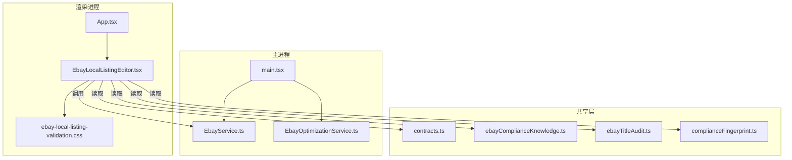
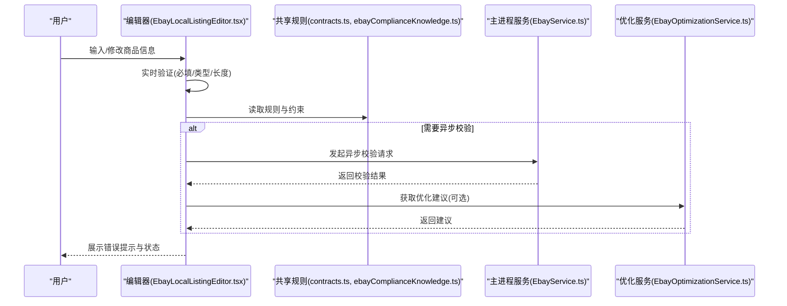
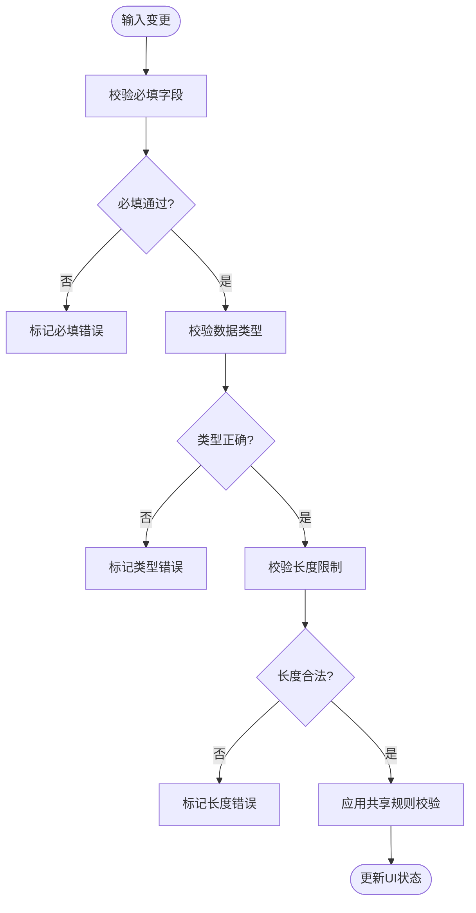
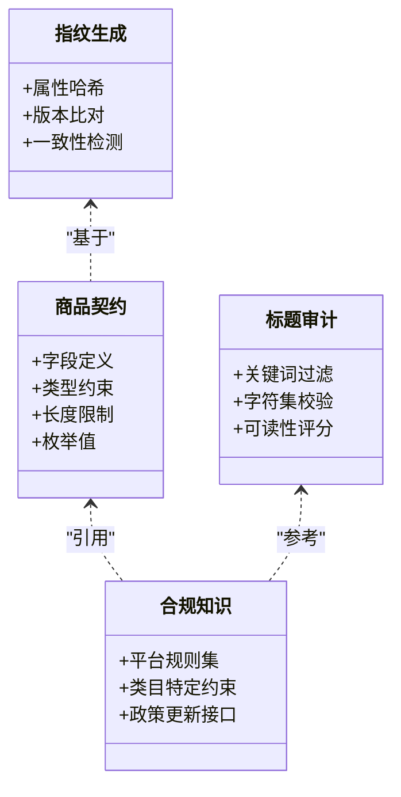
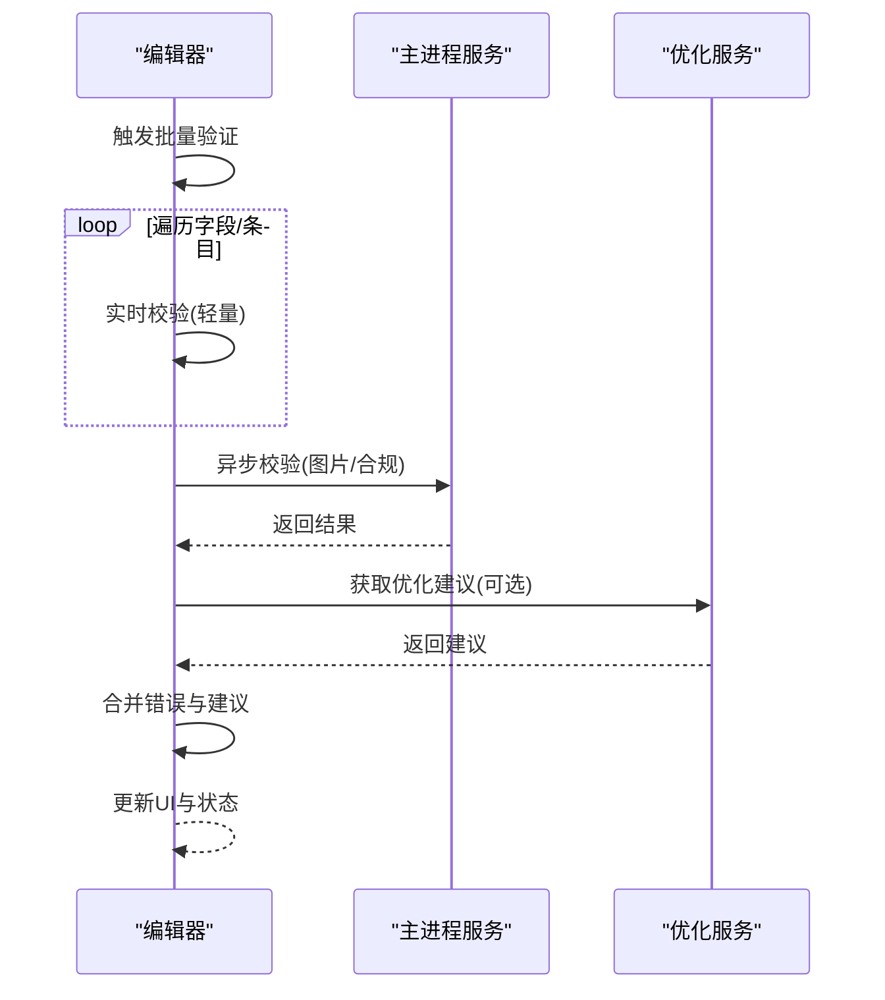
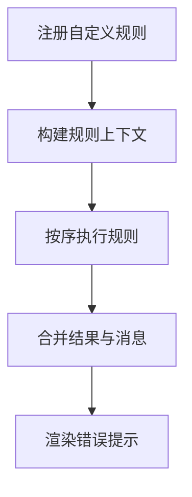
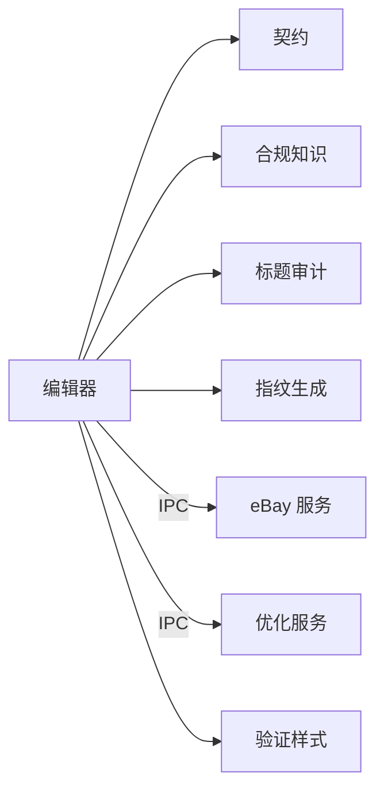

# 验证系统

<cite>
**本文引用的文件**   
- [EbayLocalListingEditor.tsx](file://src/renderer/EbayLocalListingEditor.tsx)
- [ebay-local-listing-validation.css](file://src/renderer/ebay-local-listing-validation.css)
- [App.tsx](file://src/renderer/App.tsx)
- [main.tsx](file://src/renderer/main.tsx)
- [EbayService.ts](file://src/main/services/EbayService.ts)
- [EbayOptimizationService.ts](file://src/main/services/EbayOptimizationService.ts)
- [contracts.ts](file://src/shared/contracts.ts)
- [ebayComplianceKnowledge.ts](file://src/shared/ebayComplianceKnowledge.ts)
- [ebayTitleAudit.ts](file://src/shared/ebayTitleAudit.ts)
- [complianceFingerprint.ts](file://src/shared/complianceFingerprint.ts)
</cite>

## 目录
1. [简介](#简介)
2. [项目结构](#项目结构)
3. [核心组件](#核心组件)
4. [架构总览](#架构总览)
5. [详细组件分析](#详细组件分析)
6. [依赖分析](#依赖分析)
7. [性能考虑](#性能考虑)
8. [故障排查指南](#故障排查指南)
9. [结论](#结论)
10. [附录](#附录)

## 简介
本技术文档围绕 eBay 本地商品编辑器的“验证系统”展开，聚焦商品信息完整性检查、格式校验与业务规则校验机制。文档覆盖必填字段验证、数据类型检查、长度限制、实时验证、异步验证与批量验证的实现方式；并说明自定义验证规则、错误处理与用户友好提示策略，以及验证性能优化与缓存策略。目标是帮助开发者与维护者快速理解、扩展和优化该验证子系统。

## 项目结构
本项目采用 Electron 多进程架构：主进程负责服务与数据访问，渲染进程负责 UI 与交互，共享层提供契约与领域知识。与验证系统直接相关的代码主要分布在渲染层的编辑器页面、样式与共享领域的合规知识与契约定义中。

图表来源
- [App.tsx](file://src/renderer/App.tsx)
- [EbayLocalListingEditor.tsx](file://src/renderer/EbayLocalListingEditor.tsx)
- [ebay-local-listing-validation.css](file://src/renderer/ebay-local-listing-validation.css)
- [main.tsx](file://src/renderer/main.tsx)
- [EbayService.ts](file://src/main/services/EbayService.ts)
- [EbayOptimizationService.ts](file://src/main/services/EbayOptimizationService.ts)
- [contracts.ts](file://src/shared/contracts.ts)
- [ebayComplianceKnowledge.ts](file://src/shared/ebayComplianceKnowledge.ts)
- [ebayTitleAudit.ts](file://src/shared/ebayTitleAudit.ts)
- [complianceFingerprint.ts](file://src/shared/complianceFingerprint.ts)

章节来源
- [EbayLocalListingEditor.tsx](file://src/renderer/EbayLocalListingEditor.tsx)
- [ebay-local-listing-validation.css](file://src/renderer/ebay-local-listing-validation.css)
- [App.tsx](file://src/renderer/App.tsx)
- [main.tsx](file://src/renderer/main.tsx)
- [EbayService.ts](file://src/main/services/EbayService.ts)
- [EbayOptimizationService.ts](file://src/main/services/EbayOptimizationService.ts)
- [contracts.ts](file://src/shared/contracts.ts)
- [ebayComplianceKnowledge.ts](file://src/shared/ebayComplianceKnowledge.ts)
- [ebayTitleAudit.ts](file://src/shared/ebayTitleAudit.ts)
- [complianceFingerprint.ts](file://src/shared/complianceFingerprint.ts)

## 核心组件
- 编辑器与验证入口：渲染进程的 eBay 本地商品编辑器负责收集表单输入、触发验证流程、展示错误提示与状态。
- 共享契约与规则：共享层提供商品数据结构契约、合规知识库、标题审计与指纹生成等能力，为前端验证提供权威依据。
- 主进程服务：主进程中的 eBay 相关服务用于与外部系统或后端交互（如图片合规、优化建议），可被编辑器在异步验证阶段调用。

章节来源
- [EbayLocalListingEditor.tsx](file://src/renderer/EbayLocalListingEditor.tsx)
- [contracts.ts](file://src/shared/contracts.ts)
- [ebayComplianceKnowledge.ts](file://src/shared/ebayComplianceKnowledge.ts)
- [ebayTitleAudit.ts](file://src/shared/ebayTitleAudit.ts)
- [complianceFingerprint.ts](file://src/shared/complianceFingerprint.ts)
- [EbayService.ts](file://src/main/services/EbayService.ts)
- [EbayOptimizationService.ts](file://src/main/services/EbayOptimizationService.ts)

## 架构总览
验证系统采用“前端即时校验 + 共享规则驱动 + 可选异步校验”的分层架构。前端负责高频的必填、类型与长度校验，共享层提供领域规则与审计能力，主进程服务承担需要跨进程或外部资源的异步校验任务。

图表来源
- [EbayLocalListingEditor.tsx](file://src/renderer/EbayLocalListingEditor.tsx)
- [contracts.ts](file://src/shared/contracts.ts)
- [ebayComplianceKnowledge.ts](file://src/shared/ebayComplianceKnowledge.ts)
- [EbayService.ts](file://src/main/services/EbayService.ts)
- [EbayOptimizationService.ts](file://src/main/services/EbayOptimizationService.ts)

## 详细组件分析

### 编辑器与实时验证
- 职责：监听用户输入，执行必填字段检查、数据类型检查与长度限制；根据共享规则生成错误消息；将验证状态同步到 UI。
- 关键点：
  - 实时验证：在输入事件上触发轻量级校验，避免阻塞用户操作。
  - 错误聚合：维护一个错误映射，按字段维度组织错误信息，便于定位与提示。
  - 状态管理：对每个字段维护“是否已触碰”“是否通过”等状态，减少不必要的重渲染。

图表来源
- [EbayLocalListingEditor.tsx](file://src/renderer/EbayLocalListingEditor.tsx)
- [contracts.ts](file://src/shared/contracts.ts)
- [ebayComplianceKnowledge.ts](file://src/shared/ebayComplianceKnowledge.ts)

章节来源
- [EbayLocalListingEditor.tsx](file://src/renderer/EbayLocalListingEditor.tsx)
- [ebay-local-listing-validation.css](file://src/renderer/ebay-local-listing-validation.css)

### 共享契约与规则
- 契约定义：集中声明商品数据的字段、类型、默认值与约束（如最大长度、枚举值）。
- 合规知识：提供 eBay 平台特定的合规规则集合，供前端与主进程共同使用。
- 标题审计：针对标题进行语义与格式审计，辅助前端与后端的一致性校验。
- 指纹生成：基于关键商品属性生成稳定性指纹，用于版本对比与一致性检测。

图表来源
- [contracts.ts](file://src/shared/contracts.ts)
- [ebayComplianceKnowledge.ts](file://src/shared/ebayComplianceKnowledge.ts)
- [ebayTitleAudit.ts](file://src/shared/ebayTitleAudit.ts)
- [complianceFingerprint.ts](file://src/shared/complianceFingerprint.ts)

章节来源
- [contracts.ts](file://src/shared/contracts.ts)
- [ebayComplianceKnowledge.ts](file://src/shared/ebayComplianceKnowledge.ts)
- [ebayTitleAudit.ts](file://src/shared/ebayTitleAudit.ts)
- [complianceFingerprint.ts](file://src/shared/complianceFingerprint.ts)

### 异步验证与批量验证
- 异步验证：当某些校验需要调用主进程服务或外部资源时（如图片合规、优化建议），编辑器发起异步请求并在完成后合并结果。
- 批量验证：支持对多个字段或整单数据进行一次性校验，适用于提交前最终检查或导入场景。
- 错误合并：异步结果与实时校验结果统一归并，保证 UI 一致性与用户体验。

图表来源
- [EbayLocalListingEditor.tsx](file://src/renderer/EbayLocalListingEditor.tsx)
- [EbayService.ts](file://src/main/services/EbayService.ts)
- [EbayOptimizationService.ts](file://src/main/services/EbayOptimizationService.ts)

章节来源
- [EbayLocalListingEditor.tsx](file://src/renderer/EbayLocalListingEditor.tsx)
- [EbayService.ts](file://src/main/services/EbayService.ts)
- [EbayOptimizationService.ts](file://src/main/services/EbayOptimizationService.ts)

### 自定义验证规则
- 设计原则：以共享契约与合规知识为基础，允许在编辑器层注册自定义规则，实现类目或活动特定的校验逻辑。
- 扩展点：
  - 规则注册表：集中管理规则名称、优先级与执行顺序。
  - 规则上下文：注入当前商品数据、用户权限与类目信息。
  - 结果标准化：统一输出错误码、消息与修复建议。

图表来源
- [EbayLocalListingEditor.tsx](file://src/renderer/EbayLocalListingEditor.tsx)
- [contracts.ts](file://src/shared/contracts.ts)
- [ebayComplianceKnowledge.ts](file://src/shared/ebayComplianceKnowledge.ts)

章节来源
- [EbayLocalListingEditor.tsx](file://src/renderer/EbayLocalListingEditor.tsx)
- [contracts.ts](file://src/shared/contracts.ts)
- [ebayComplianceKnowledge.ts](file://src/shared/ebayComplianceKnowledge.ts)

### 错误处理与用户友好提示
- 错误分类：必填错误、类型错误、长度错误、业务规则错误、异步校验错误。
- 提示策略：
  - 即时反馈：在输入失焦或输入停止后显示具体错误原因。
  - 引导修复：提供可点击的修复建议或跳转至相关设置。
  - 汇总视图：在提交前展示错误摘要，帮助用户快速定位问题。
- 国际化与可配置：错误消息支持多语言与模板化替换，便于运营调整。

章节来源
- [EbayLocalListingEditor.tsx](file://src/renderer/EbayLocalListingEditor.tsx)
- [ebay-local-listing-validation.css](file://src/renderer/ebay-local-listing-validation.css)

## 依赖分析
- 耦合关系：
  - 编辑器依赖共享契约与合规知识，确保规则一致性与可维护性。
  - 编辑器通过 IPC 调用主进程服务，避免阻塞 UI 线程。
  - 样式文件仅关注 UI 表现，不引入业务逻辑。
- 外部依赖：
  - 主进程服务可能依赖网络 I/O 或第三方 API，需做好超时与重试策略。
  - 合规知识库应支持热更新，保障规则时效性。

图表来源
- [EbayLocalListingEditor.tsx](file://src/renderer/EbayLocalListingEditor.tsx)
- [contracts.ts](file://src/shared/contracts.ts)
- [ebayComplianceKnowledge.ts](file://src/shared/ebayComplianceKnowledge.ts)
- [ebayTitleAudit.ts](file://src/shared/ebayTitleAudit.ts)
- [complianceFingerprint.ts](file://src/shared/complianceFingerprint.ts)
- [EbayService.ts](file://src/main/services/EbayService.ts)
- [EbayOptimizationService.ts](file://src/main/services/EbayOptimizationService.ts)
- [ebay-local-listing-validation.css](file://src/renderer/ebay-local-listing-validation.css)

章节来源
- [EbayLocalListingEditor.tsx](file://src/renderer/EbayLocalListingEditor.tsx)
- [contracts.ts](file://src/shared/contracts.ts)
- [ebayComplianceKnowledge.ts](file://src/shared/ebayComplianceKnowledge.ts)
- [ebayTitleAudit.ts](file://src/shared/ebayTitleAudit.ts)
- [complianceFingerprint.ts](file://src/shared/complianceFingerprint.ts)
- [EbayService.ts](file://src/main/services/EbayService.ts)
- [EbayOptimizationService.ts](file://src/main/services/EbayOptimizationService.ts)
- [ebay-local-listing-validation.css](file://src/renderer/ebay-local-listing-validation.css)

## 性能考虑
- 实时验证优化：
  - 防抖与节流：对频繁输入事件进行去抖，降低校验频率。
  - 增量校验：仅对变更字段重新计算，避免全量重算。
  - 懒加载规则：按需加载类目或活动相关规则，减少初始开销。
- 异步验证优化：
  - 并发控制：限制并行请求数，避免主进程过载。
  - 超时与重试：合理设置超时时间，失败自动重试并降级。
  - 结果缓存：对相同输入组合的结果进行短期缓存，提升重复校验性能。
- 渲染优化：
  - 局部更新：仅更新受影响字段的状态与提示，避免整页重绘。
  - 样式分离：将验证相关样式独立管理，减少 CSS 体积。

[本节为通用性能指导，不直接分析具体文件]

## 故障排查指南
- 常见问题定位：
  - 必填错误未消失：检查字段“已触碰”状态与失焦事件绑定。
  - 类型错误误报：核对契约定义与实际输入类型转换逻辑。
  - 长度限制异常：确认输入编码与计数方式（字节/字符）一致性。
  - 异步校验无响应：检查 IPC 通道、主进程服务可用性与超时配置。
- 调试建议：
  - 启用验证日志：记录每次校验的输入、规则与结果。
  - 隔离规则：逐步禁用自定义规则定位冲突。
  - 模拟数据：构造边界用例验证鲁棒性。

章节来源
- [EbayLocalListingEditor.tsx](file://src/renderer/EbayLocalListingEditor.tsx)
- [contracts.ts](file://src/shared/contracts.ts)
- [ebayComplianceKnowledge.ts](file://src/shared/ebayComplianceKnowledge.ts)

## 结论
本验证系统以共享契约与合规知识为核心，结合实时与异步校验，实现了完整、可扩展且高性能的商品信息校验体系。通过清晰的职责划分与模块化设计，既保证了用户体验，又提升了可维护性与扩展性。建议在后续迭代中持续完善规则库、优化性能与增强错误提示的可操作性。

[本节为总结性内容，不直接分析具体文件]

## 附录
- 术语表：
  - 实时验证：用户输入过程中触发的轻量级校验。
  - 异步验证：需要跨进程或外部资源的校验任务。
  - 批量验证：对多条数据或整单的一次性校验。
  - 合规知识：平台规则与政策的结构化表达。
- 最佳实践：
  - 优先在前端完成基础校验，减少无效请求。
  - 规则与 UI 解耦，便于独立演进。
  - 错误消息清晰、可操作，提升用户自助修复效率。

[本节为补充信息，不直接分析具体文件]