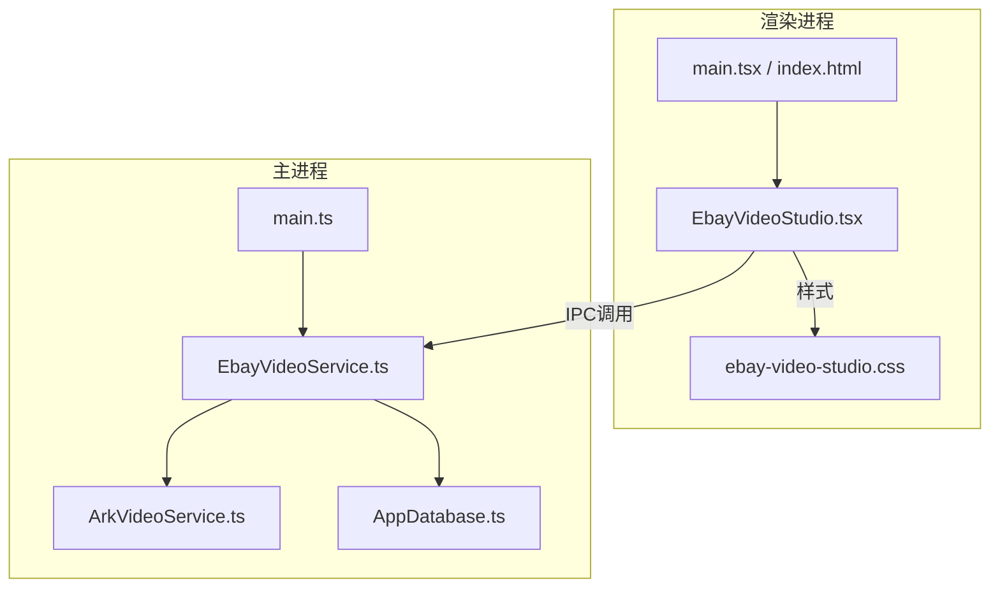
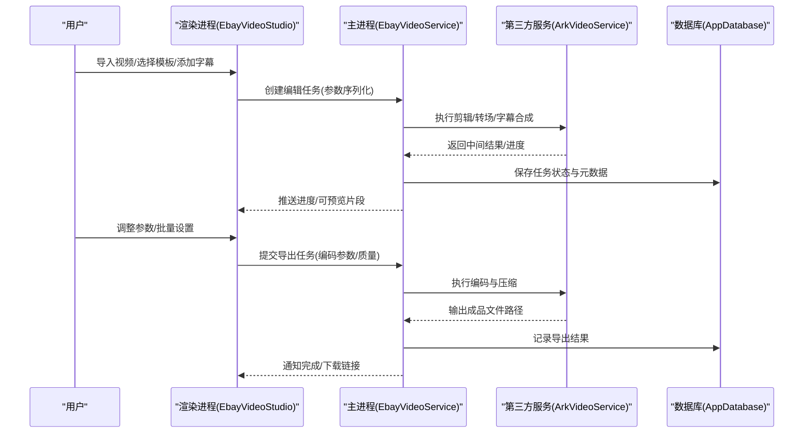
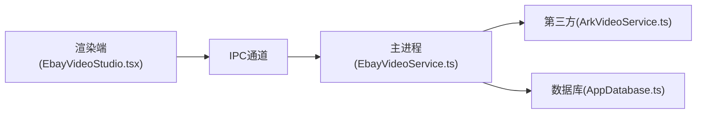

# Ebay视频工作室

<cite>
**本文引用的文件**   
- [EbayVideoStudio.tsx](file://src/renderer/EbayVideoStudio.tsx)
- [ebay-video-studio.css](file://src/renderer/ebay-video-studio.css)
- [EbayVideoService.ts](file://src/main/services/EbayVideoService.ts)
- [ArkVideoService.ts](file://src/main/services/ArkVideoService.ts)
- [AppDatabase.ts](file://src/main/database/AppDatabase.ts)
- [main.ts](file://src/main/main.ts)
- [index.html](file://src/renderer/index.html)
- [main.tsx](file://src/renderer/main.tsx)
- [package.json](file://package.json)
</cite>

## 目录
1. [简介](#简介)
2. [项目结构](#项目结构)
3. [核心组件](#核心组件)
4. [架构总览](#架构总览)
5. [详细组件分析](#详细组件分析)
6. [依赖关系分析](#依赖关系分析)
7. [性能与内存管理](#性能与内存管理)
8. [使用指南](#使用指南)
9. [故障排除](#故障排除)
10. [结论](#结论)

## 简介
本技术文档面向Ebay视频工作室组件，聚焦于视频编辑能力（剪辑、转场、字幕）、格式转换与压缩优化、质量控制机制、模板系统与预设效果、自定义样式、预览与导出设置以及批量处理流程。同时涵盖视频编码参数配置、性能优化与内存管理策略，并提供完整的使用指南与故障排除方案，帮助开发者与用户高效使用该功能模块。

## 项目结构
Ebay视频工作室采用Electron架构，前端渲染进程负责UI与交互，主进程提供服务桥接与数据库访问。关键文件包括：
- 渲染层：EbayVideoStudio.tsx（视频工作室界面与交互逻辑）、ebay-video-studio.css（样式）
- 主进程服务：EbayVideoService.ts（Ebay视频服务）、ArkVideoService.ts（第三方视频能力桥接）
- 数据层：AppDatabase.ts（应用数据库封装）
- 入口与路由：main.ts（主进程入口）、main.tsx（渲染入口）、index.html（页面容器）
- 工程配置：package.json（依赖与脚本）

图表来源
- [EbayVideoStudio.tsx](file://src/renderer/EbayVideoStudio.tsx)
- [ebay-video-studio.css](file://src/renderer/ebay-video-studio.css)
- [EbayVideoService.ts](file://src/main/services/EbayVideoService.ts)
- [ArkVideoService.ts](file://src/main/services/ArkVideoService.ts)
- [AppDatabase.ts](file://src/main/database/AppDatabase.ts)
- [main.ts](file://src/main/main.ts)
- [main.tsx](file://src/renderer/main.tsx)
- [index.html](file://src/renderer/index.html)

章节来源
- [EbayVideoStudio.tsx](file://src/renderer/EbayVideoStudio.tsx)
- [ebay-video-studio.css](file://src/renderer/ebay-video-studio.css)
- [EbayVideoService.ts](file://src/main/services/EbayVideoService.ts)
- [ArkVideoService.ts](file://src/main/services/ArkVideoService.ts)
- [AppDatabase.ts](file://src/main/database/AppDatabase.ts)
- [main.ts](file://src/main/main.ts)
- [main.tsx](file://src/renderer/main.tsx)
- [index.html](file://src/renderer/index.html)
- [package.json](file://package.json)

## 核心组件
- 渲染端视频工作室组件：提供视频素材导入、时间轴编辑、转场与字幕编辑、预览播放、导出设置与批量任务管理。
- 主进程视频服务：协调视频处理管线，对接第三方视频能力（如Ark），并持久化任务状态与结果。
- 数据库服务：存储模板、预设、任务元数据与导出产物索引。
- 样式系统：为视频工作室提供统一的视觉风格与响应式布局。

章节来源
- [EbayVideoStudio.tsx](file://src/renderer/EbayVideoStudio.tsx)
- [EbayVideoService.ts](file://src/main/services/EbayVideoService.ts)
- [ArkVideoService.ts](file://src/main/services/ArkVideoService.ts)
- [AppDatabase.ts](file://src/main/database/AppDatabase.ts)
- [ebay-video-studio.css](file://src/renderer/ebay-video-studio.css)

## 架构总览
整体采用“渲染进程—主进程服务—外部能力”的分层架构。渲染端通过IPC与主进程通信，主进程统一调度视频处理任务，必要时调用第三方服务完成编解码与特效合成，最终将结果落盘或返回给渲染端进行展示。

图表来源
- [EbayVideoStudio.tsx](file://src/renderer/EbayVideoStudio.tsx)
- [EbayVideoService.ts](file://src/main/services/EbayVideoService.ts)
- [ArkVideoService.ts](file://src/main/services/ArkVideoService.ts)
- [AppDatabase.ts](file://src/main/database/AppDatabase.ts)

## 详细组件分析

### 渲染端：EbayVideoStudio.tsx
- 职责：承载视频工作室的UI与交互，包括素材库、时间轴、转场面板、字幕编辑器、预览播放器、导出设置与批量任务队列。
- 关键流程：
  - 素材导入与校验：支持常见视频格式，自动检测分辨率与时长，生成缩略图。
  - 时间轴编辑：拖拽片段、裁剪入出点、拼接顺序管理。
  - 转场与字幕：选择转场类型（淡入淡出、滑动等），添加多轨道字幕（SRT/ASS）。
  - 预览与回放：基于本地媒体元素实现低延迟预览，支持缩放与帧步进。
  - 导出设置：选择编码格式（H.264/H.265）、码率、分辨率、帧率、音频采样率与比特率。
  - 批量处理：按模板与预设批量生成多个视频，支持并发控制与失败重试。
- 错误处理：捕获导入失败、转场不可用、字幕解析异常、导出失败等场景，提示用户修正。

章节来源
- [EbayVideoStudio.tsx](file://src/renderer/EbayVideoStudio.tsx)

### 主进程：EbayVideoService.ts
- 职责：作为视频处理的核心编排器，接收渲染端任务，调度第三方服务，管理任务生命周期与状态持久化。
- 关键流程：
  - 任务解析与校验：检查输入素材有效性、转场兼容性、字幕编码。
  - 管线编排：按步骤执行剪辑、转场、字幕叠加、编码与压缩。
  - 进度上报：向渲染端推送阶段进度与预估剩余时间。
  - 结果落盘：生成临时文件与最终成品，清理中间产物。
- 错误处理：对第三方服务异常、磁盘空间不足、编码失败等进行降级与重试。

章节来源
- [EbayVideoService.ts](file://src/main/services/EbayVideoService.ts)

### 第三方能力：ArkVideoService.ts
- 职责：封装第三方视频处理能力（如FFmpeg/硬件加速后端），提供剪辑、转场、字幕合成、编码与压缩接口。
- 关键接口：
  - 剪辑与拼接：指定入出点、拼接顺序、去黑边。
  - 转场效果：支持多种过渡算法与持续时间。
  - 字幕叠加：支持多语言、样式映射与定位。
  - 编码与压缩：H.264/H.265、码率控制、质量档位、尺寸缩放。
- 错误处理：兼容不同平台与驱动，捕获编码器不可用、资源不足等异常。

章节来源
- [ArkVideoService.ts](file://src/main/services/ArkVideoService.ts)

### 数据层：AppDatabase.ts
- 职责：维护模板、预设、任务元数据与导出产物索引，支持查询与更新。
- 关键表项：
  - 模板：名称、描述、默认转场、默认字幕样式、适用分辨率。
  - 预设：编码参数、质量档位、输出格式、压缩级别。
  - 任务：状态、进度、输入/输出路径、错误信息。
  - 产物：文件路径、哈希、大小、创建时间。
- 事务与一致性：保证任务状态与产物记录的原子性。

章节来源
- [AppDatabase.ts](file://src/main/database/AppDatabase.ts)

### 入口与页面：main.ts、main.tsx、index.html
- main.ts：初始化Electron主进程，注册IPC通道，启动服务。
- main.tsx：渲染进程入口，挂载React根组件。
- index.html：页面容器与基础样式注入。

章节来源
- [main.ts](file://src/main/main.ts)
- [main.tsx](file://src/renderer/main.tsx)
- [index.html](file://src/renderer/index.html)

## 依赖关系分析
- 渲染端依赖样式与React生态，通过IPC与主进程通信。
- 主进程依赖数据库与第三方视频服务，承担任务编排与状态管理。
- 第三方服务可能依赖系统级编码器或硬件加速库。

图表来源
- [EbayVideoStudio.tsx](file://src/renderer/EbayVideoStudio.tsx)
- [EbayVideoService.ts](file://src/main/services/EbayVideoService.ts)
- [ArkVideoService.ts](file://src/main/services/ArkVideoService.ts)
- [AppDatabase.ts](file://src/main/database/AppDatabase.ts)

章节来源
- [EbayVideoStudio.tsx](file://src/renderer/EbayVideoStudio.tsx)
- [EbayVideoService.ts](file://src/main/services/EbayVideoService.ts)
- [ArkVideoService.ts](file://src/main/services/ArkVideoService.ts)
- [AppDatabase.ts](file://src/main/database/AppDatabase.ts)

## 性能与内存管理
- 预览优化：
  - 使用低分辨率缩略图与按需加载，避免全量解码。
  - 时间轴懒渲染，仅绘制可视区域的关键帧。
- 编码与压缩：
  - 根据目标平台选择合适编码器（H.264通用、H.265高压缩）。
  - 动态码率控制（CBR/VBR/CQP），平衡画质与体积。
  - 并行分块编码与GPU加速（若可用）。
- 内存管理：
  - 流式处理大文件，避免一次性载入内存。
  - 及时释放中间缓冲与临时文件，限制并发任务数。
- 资源监控：
  - 监控CPU/GPU占用与内存峰值，触发降级策略（降低分辨率或关闭特效）。

[本节为通用指导，不直接分析具体文件]

## 使用指南

### 视频剪辑
- 导入素材：支持MP4、MOV、AVI等常见格式，自动检测分辨率与时长。
- 时间轴操作：拖拽片段、裁剪入出点、删除与复制片段。
- 拼接与排序：调整片段顺序，设置衔接点。

章节来源
- [EbayVideoStudio.tsx](file://src/renderer/EbayVideoStudio.tsx)

### 转场效果
- 可选转场：淡入淡出、滑动、缩放等。
- 参数调节：持续时间、方向、透明度曲线。
- 批量应用：对选中片段统一应用相同转场。

章节来源
- [EbayVideoStudio.tsx](file://src/renderer/EbayVideoStudio.tsx)
- [ArkVideoService.ts](file://src/main/services/ArkVideoService.ts)

### 字幕添加
- 字幕格式：SRT/ASS，支持多语言轨道。
- 样式设置：字体、字号、颜色、描边、阴影、位置。
- 同步与校对：逐帧校对，自动对齐时间轴。

章节来源
- [EbayVideoStudio.tsx](file://src/renderer/EbayVideoStudio.tsx)
- [ArkVideoService.ts](file://src/main/services/ArkVideoService.ts)

### 视频模板系统与预设效果
- 模板：包含默认片段顺序、转场、字幕样式与输出参数。
- 预设：编码参数、质量档位、压缩级别、输出格式。
- 自定义样式：字体、配色、Logo水印、边框与背景。

章节来源
- [EbayVideoStudio.tsx](file://src/renderer/EbayVideoStudio.tsx)
- [AppDatabase.ts](file://src/main/database/AppDatabase.ts)

### 预览与导出设置
- 预览：实时回放、缩放、帧步进、音画同步。
- 导出：选择编码器、分辨率、帧率、码率、音频采样率与比特率。
- 批量导出：按模板与预设批量生成，支持并发与失败重试。

章节来源
- [EbayVideoStudio.tsx](file://src/renderer/EbayVideoStudio.tsx)
- [EbayVideoService.ts](file://src/main/services/EbayVideoService.ts)

### 批量处理流程
- 任务队列：按优先级与资源可用性调度。
- 进度跟踪：阶段进度、剩余时间、错误详情。
- 结果管理：产物索引、下载链接、失败重试。

章节来源
- [EbayVideoService.ts](file://src/main/services/EbayVideoService.ts)
- [AppDatabase.ts](file://src/main/database/AppDatabase.ts)

## 故障排除

### 常见问题
- 导入失败：检查文件格式与损坏情况，尝试重新导出或转换。
- 转场无效：确认片段长度与转场持续时间匹配，避免重叠冲突。
- 字幕错位：校对时间轴与帧率，确保编码一致。
- 导出失败：检查磁盘空间、编码器可用性与权限。

章节来源
- [EbayVideoStudio.tsx](file://src/renderer/EbayVideoStudio.tsx)
- [EbayVideoService.ts](file://src/main/services/EbayVideoService.ts)

### 调试建议
- 启用日志：查看IPC调用、任务状态与错误堆栈。
- 资源监控：观察CPU/GPU与内存使用，识别瓶颈。
- 逐步验证：先单片段测试，再逐步增加转场与字幕。

章节来源
- [EbayVideoService.ts](file://src/main/services/EbayVideoService.ts)
- [AppDatabase.ts](file://src/main/database/AppDatabase.ts)

## 结论
Ebay视频工作室通过清晰的渲染—主进程—第三方能力分层架构，实现了完整的视频编辑与导出流程。结合模板与预设系统，用户可快速生成高质量视频；通过性能优化与内存管理策略，保障大规模批量处理的稳定性。遵循使用指南与故障排除方案，可显著提升效率与体验。