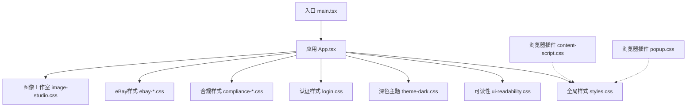
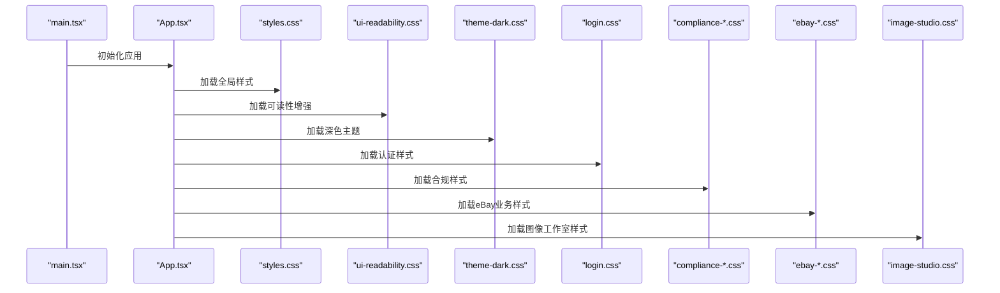

# UI组件库与样式系统

<cite>
**本文引用的文件**   
- [package.json](file://package.json)
- [vite.config.ts](file://vite.config.ts)
- [src/renderer/main.tsx](file://src/renderer/main.tsx)
- [src/renderer/App.tsx](file://src/renderer/App.tsx)
- [src/renderer/styles.css](file://src/renderer/styles.css)
- [src/renderer/ui-readability.css](file://src/renderer/ui-readability.css)
- [src/renderer/theme-dark.css](file://src/renderer/theme-dark.css)
- [src/renderer/login.css](file://src/renderer/login.css)
- [src/renderer/compliance-gate.css](file://src/renderer/compliance-gate.css)
- [src/renderer/compliance-phase3.css](file://src/renderer/compliance-phase3.css)
- [src/renderer/compliance-stage8.css](file://src/renderer/compliance-stage8.css)
- [src/renderer/compliance-v2-review.css](file://src/renderer/compliance-v2-review.css)
- [src/renderer/ebay-acceptance-readable.css](file://src/renderer/ebay-acceptance-readable.css)
- [src/renderer/ebay-collection.css](file://src/renderer/ebay-collection.css)
- [src/renderer/ebay-local-listing-pricing.css](file://src/renderer/ebay-local-listing-pricing.css)
- [src/renderer/ebay-local-listing-validation.css](file://src/renderer/ebay-local-listing-validation.css)
- [src/renderer/ebay-video-studio.css](file://src/renderer/ebay-video-studio.css)
- [src/renderer/image-studio.css](file://src/renderer/image-studio.css)
- [browser-extension/content-script.css](file://browser-extension/content-script.css)
- [browser-extension/popup.css](file://browser-extension/popup.css)
</cite>

## 更新摘要
**所做更改**   
- 更新了全局样式清理部分，反映CSS架构优化工作（移除未使用的.brand和.brand-mark类规则）
- 增强了主题系统与品牌样式的管理说明
- 更新了样式维护最佳实践内容
- 强化了登录页面专用样式的设计规范

## 目录
1. [简介](#简介)
2. [项目结构](#项目结构)
3. [核心组件](#核心组件)
4. [架构总览](#架构总览)
5. [详细组件分析](#详细组件分析)
6. [依赖分析](#依赖分析)
7. [性能考虑](#性能考虑)
8. [故障排查指南](#故障排查指南)
9. [结论](#结论)
10. [附录](#附录)

## 简介
本文件为砚都跨境项目的UI组件库与样式系统提供系统化文档，覆盖CSS架构设计、样式组织规范、主题系统与变量管理、响应式与移动端适配、跨浏览器兼容策略、可复用组件设计原则与命名约定、无障碍访问（a11y）、国际化（i18n）适配、样式测试策略以及使用示例与设计规范。目标是帮助开发者快速理解并高效扩展该项目的样式体系与组件库。

## 项目结构
本项目采用Electron + Vite的前端工程化方案，样式资源集中在渲染进程与浏览器插件两个子系统中：
- 渲染进程样式位于 src/renderer，包含全局样式、业务模块样式与可读性增强样式。
- 浏览器插件样式位于 browser-extension，包含内容脚本与弹出窗口的样式。

```mermaid
graph TB
subgraph "渲染进程"
R_main["main.tsx"]
R_app["App.tsx"]
R_styles["styles.css"]
R_readability["ui-readability.css"]
R_theme["theme-dark.css"]
R_login["login.css"]
R_compliance_gate["compliance-gate.css"]
R_compliance_phase3["compliance-phase3.css"]
R_compliance_stage8["compliance-stage8.css"]
R_compliance_v2["compliance-v2-review.css"]
R_ebay_accept["ebay-acceptance-readable.css"]
R_ebay_coll["ebay-collection.css"]
R_ebay_local_price["ebay-local-listing-pricing.css"]
R_ebay_local_val["ebay-local-listing-validation.css"]
R_ebay_video["ebay-video-studio.css"]
R_image_studio["image-studio.css"]
end
subgraph "浏览器插件"
B_content["content-script.css"]
B_popup["popup.css"]
end
R_main --> R_app
R_main --> R_styles
R_app --> R_readability
R_app --> R_theme
R_app --> R_login
R_app --> R_compliance_gate
R_app --> R_compliance_phase3
R_app --> R_compliance_stage8
R_app --> R_compliance_v2
R_app --> R_ebay_accept
R_app --> R_ebay_coll
R_app --> R_ebay_local_price
R_app --> R_ebay_local_val
R_app --> R_ebay_video
R_app --> R_image_studio
B_content -.-> R_styles
B_popup -.-> R_styles
```

图表来源
- [src/renderer/main.tsx](file://src/renderer/main.tsx)
- [src/renderer/App.tsx](file://src/renderer/App.tsx)
- [src/renderer/styles.css](file://src/renderer/styles.css)
- [src/renderer/ui-readability.css](file://src/renderer/ui-readability.css)
- [src/renderer/theme-dark.css](file://src/renderer/theme-dark.css)
- [src/renderer/login.css](file://src/renderer/login.css)
- [browser-extension/content-script.css](file://browser-extension/content-script.css)
- [browser-extension/popup.css](file://browser-extension/popup.css)

章节来源
- [package.json](file://package.json)
- [vite.config.ts](file://vite.config.ts)
- [src/renderer/main.tsx](file://src/renderer/main.tsx)
- [src/renderer/App.tsx](file://src/renderer/App.tsx)

## 核心组件
基于仓库中的样式文件，可将UI组件库划分为以下核心样式域：
- 全局基础样式与主题变量：styles.css
- 可读性与无障碍增强：ui-readability.css
- 深色主题支持：theme-dark.css
- 认证与登录界面：login.css
- 合规审查相关样式：compliance-gate.css、compliance-phase3.css、compliance-stage8.css、compliance-v2-review.css
- eBay业务模块样式：ebay-acceptance-readable.css、ebay-collection.css、ebay-local-listing-pricing.css、ebay-local-listing-validation.css、ebay-video-studio.css
- 图像工作室样式：image-studio.css
- 浏览器插件样式：content-script.css、popup.css

这些样式域通过入口文件按需加载，形成"全局基础 + 业务模块"的模块化组合。

章节来源
- [src/renderer/styles.css](file://src/renderer/styles.css)
- [src/renderer/ui-readability.css](file://src/renderer/ui-readability.css)
- [src/renderer/theme-dark.css](file://src/renderer/theme-dark.css)
- [src/renderer/login.css](file://src/renderer/login.css)
- [src/renderer/compliance-gate.css](file://src/renderer/compliance-gate.css)
- [src/renderer/compliance-phase3.css](file://src/renderer/compliance-phase3.css)
- [src/renderer/compliance-stage8.css](file://src/renderer/compliance-stage8.css)
- [src/renderer/compliance-v2-review.css](file://src/renderer/compliance-v2-review.css)
- [src/renderer/ebay-acceptance-readable.css](file://src/renderer/ebay-acceptance-readable.css)
- [src/renderer/ebay-collection.css](file://src/renderer/ebay-collection.css)
- [src/renderer/ebay-local-listing-pricing.css](file://src/renderer/ebay-local-listing-pricing.css)
- [src/renderer/ebay-local-listing-validation.css](file://src/renderer/ebay-local-listing-validation.css)
- [src/renderer/ebay-video-studio.css](file://src/renderer/ebay-video-studio.css)
- [src/renderer/image-studio.css](file://src/renderer/image-studio.css)
- [browser-extension/content-script.css](file://browser-extension/content-script.css)
- [browser-extension/popup.css](file://browser-extension/popup.css)

## 架构总览
整体样式架构遵循"分层+分域"的组织方式：
- 基础层：全局变量、重置、排版、颜色、间距等基础样式。
- 主题层：主题变量、暗色模式、品牌色、语义色等。
- 组件层：可复用UI组件样式（按钮、表单、卡片、表格、弹窗等）。
- 业务层：eBay相关页面与功能模块的样式。
- 增强层：可读性、无障碍、打印与导出优化。
- 插件层：浏览器插件的内容脚本与弹出窗口样式。

图表来源
- [src/renderer/main.tsx](file://src/renderer/main.tsx)
- [src/renderer/App.tsx](file://src/renderer/App.tsx)
- [src/renderer/styles.css](file://src/renderer/styles.css)
- [src/renderer/ui-readability.css](file://src/renderer/ui-readability.css)
- [src/renderer/theme-dark.css](file://src/renderer/theme-dark.css)
- [src/renderer/login.css](file://src/renderer/login.css)
- [src/renderer/compliance-gate.css](file://src/renderer/compliance-gate.css)
- [src/renderer/ebay-collection.css](file://src/renderer/ebay-collection.css)
- [browser-extension/content-script.css](file://browser-extension/content-script.css)
- [browser-extension/popup.css](file://browser-extension/popup.css)

## 详细组件分析

### 全局样式与主题系统
- 目标：统一视觉语言，集中管理颜色、字体、间距、阴影、圆角等设计令牌。
- **最新更新**：最近进行了CSS架构优化，移除了未使用的`.brand`和`.brand-mark`类规则，保持了代码库的整洁性和可维护性。
- 建议实现：
  - 使用CSS自定义属性定义主题变量（如颜色、字号、行高、间距、断点）。
  - 提供明/暗主题切换能力，通过根节点类名或数据属性切换变量值。
  - 将基础重置与排版规则置于全局样式中，确保一致性。
- 最佳实践：
  - 变量命名遵循语义化（如 --color-primary、--spacing-md、--font-size-base）。
  - 避免在组件内硬编码具体数值，优先引用变量。
  - 对关键断点进行集中管理，便于响应式调整。
  - 定期清理未使用的CSS规则，保持代码库精简。

章节来源
- [src/renderer/styles.css](file://src/renderer/styles.css)

### 可读性与无障碍增强
- 目标：提升文本可读性、对比度与键盘导航体验，满足WCAG要求。
- 建议实现：
  - 设置合适的行高、字重、字符间距与段落间距。
  - 提供焦点可见样式与键盘操作反馈。
  - 为屏幕阅读器提供语义化标签与ARIA属性。
- 最佳实践：
  - 使用语义HTML元素（button、nav、main、section等）。
  - 避免仅用颜色传递信息，结合图标与文字说明。
  - 提供跳过导航链接与清晰的标题层级。

章节来源
- [src/renderer/ui-readability.css](file://src/renderer/ui-readability.css)

### 深色主题系统
- 目标：提供完整的深色主题支持，确保在不同光照环境下的一致用户体验。
- **特色实现**：采用[data-theme="dark"]选择器前缀，确保主题切换不影响默认浅色主题。
- 建议实现：
  - 使用CSS变量进行主题切换，避免重复样式定义。
  - 针对特定组件提供精细的主题覆盖。
  - 提供低配设备降级开关，关闭磨砂与发光效果。
- 最佳实践：
  - 所有深色主题规则必须限定在[data-theme="dark"]前缀内。
  - 保持与浅色主题的视觉层次一致性。
  - 注意图片背景处理，确保商品图在深色模式下仍清晰可见。

章节来源
- [src/renderer/theme-dark.css](file://src/renderer/theme-dark.css)

### 认证与登录界面样式
- 目标：为登录、注册和强制改密页面提供独立的样式系统，避免污染主界面样式。
- **特色实现**：使用`auth-`前缀的所有类名，确保样式隔离。
- 涉及文件：login.css
- 建议实现：
  - 使用独立的品牌标识样式（`.auth-brand`），包含品牌标志和文字信息。
  - 提供统一的表单样式和交互反馈。
  - 支持服务器地址选择和密码可见性切换。
  - 集成版本信息和更新状态显示。
- 最佳实践：
  - 所有认证相关样式使用`auth-`前缀，避免命名冲突。
  - 保持与主应用品牌风格的一致性。
  - 提供完整的错误处理和用户反馈机制。

章节来源
- [src/renderer/login.css](file://src/renderer/login.css)

### 合规审查样式域
- 目标：为合规检查流程提供一致的界面与状态展示。
- 涉及文件：
  - compliance-gate.css
  - compliance-phase3.css
  - compliance-stage8.css
  - compliance-v2-review.css
- 建议实现：
  - 使用统一的步骤指示器、状态徽章与错误提示样式。
  - 针对不同阶段提供差异化布局与信息密度。
  - 保持与全局主题一致的颜色与交互反馈。

章节来源
- [src/renderer/compliance-gate.css](file://src/renderer/compliance-gate.css)
- [src/renderer/compliance-phase3.css](file://src/renderer/compliance-phase3.css)
- [src/renderer/compliance-stage8.css](file://src/renderer/compliance-stage8.css)
- [src/renderer/compliance-v2-review.css](file://src/renderer/compliance-v2-review.css)

### eBay业务模块样式
- 目标：为eBay相关功能提供专用样式，保证业务场景下的可用性与一致性。
- 涉及文件：
  - ebay-acceptance-readable.css
  - ebay-collection.css
  - ebay-local-listing-pricing.css
  - ebay-local-listing-validation.css
  - ebay-video-studio.css
- 建议实现：
  - 列表与表格样式需支持排序、筛选与分页。
  - 表单校验反馈清晰，错误定位准确。
  - 视频工作室提供播放器控件与编辑面板的统一样式。

章节来源
- [src/renderer/ebay-acceptance-readable.css](file://src/renderer/ebay-acceptance-readable.css)
- [src/renderer/ebay-collection.css](file://src/renderer/ebay-collection.css)
- [src/renderer/ebay-local-listing-pricing.css](file://src/renderer/ebay-local-listing-pricing.css)
- [src/renderer/ebay-local-listing-validation.css](file://src/renderer/ebay-local-listing-validation.css)
- [src/renderer/ebay-video-studio.css](file://src/renderer/ebay-video-studio.css)

### 图像工作室样式
- 目标：为图像处理与编辑功能提供直观的操作界面。
- 涉及文件：image-studio.css
- **最新更新**：image-studio.css经历了重大重构，包含109行新增代码和181行删除代码，表明图像工作室界面进行了显著的UI/UX改进。

**更新后的实现建议**：
- 画布区域自适应缩放与拖拽：优化了图像显示区域的响应式行为和交互体验。
- 工具栏与图层面板布局：重新设计了工具栏的布局和图层管理界面，提升了操作效率。
- 预览与导出流程：改进了预览模式和导出功能的用户界面，提供更直观的反馈。
- 性能优化：针对大量图像处理场景进行了样式层面的性能优化。
- 响应式设计：增强了移动端和平板设备上的图像编辑体验。

**最佳实践**：
- 使用CSS Grid和Flexbox实现灵活的画布布局。
- 实现虚拟滚动以处理大尺寸图像的流畅浏览。
- 优化Canvas绘制性能，减少重绘和重排。
- 提供丰富的快捷键支持和手势操作。

章节来源
- [src/renderer/image-studio.css](file://src/renderer/image-studio.css)

### 浏览器插件样式
- 目标：为浏览器插件的内容脚本与弹出窗口提供独立且一致的样式。
- 涉及文件：
  - content-script.css
  - popup.css
- 建议实现：
  - 内容脚本样式隔离，避免与宿主页面冲突。
  - 弹出窗口尺寸自适应，信息层次清晰。
  - 与主应用主题保持一致的品牌与交互风格。

章节来源
- [browser-extension/content-script.css](file://browser-extension/content-script.css)
- [browser-extension/popup.css](file://browser-extension/popup.css)

## 依赖分析
样式依赖关系由入口文件控制加载顺序与范围，确保基础样式先于业务样式加载，避免样式覆盖问题。

图表来源
- [src/renderer/main.tsx](file://src/renderer/main.tsx)
- [src/renderer/App.tsx](file://src/renderer/App.tsx)
- [src/renderer/styles.css](file://src/renderer/styles.css)
- [src/renderer/ui-readability.css](file://src/renderer/ui-readability.css)
- [src/renderer/theme-dark.css](file://src/renderer/theme-dark.css)
- [src/renderer/login.css](file://src/renderer/login.css)
- [src/renderer/compliance-gate.css](file://src/renderer/compliance-gate.css)
- [src/renderer/ebay-collection.css](file://src/renderer/ebay-collection.css)
- [src/renderer/image-studio.css](file://src/renderer/image-studio.css)

章节来源
- [src/renderer/main.tsx](file://src/renderer/main.tsx)
- [src/renderer/App.tsx](file://src/renderer/App.tsx)

## 性能考虑
- 样式拆分与按需加载：将全局、组件与业务样式分离，减少首屏体积。
- CSS变量与主题切换：通过变量切换避免重复样式计算。
- 选择器优化：避免深层嵌套与复杂选择器，提升渲染性能。
- 媒体查询与断点：集中管理断点，减少重复代码。
- 插件样式隔离：内容脚本样式尽量局部作用域，避免全局污染。
- **图像工作室性能优化**：针对图像编辑场景的特殊优化，包括Canvas绘制优化、内存管理和渲染性能调优。
- **CSS清理优化**：定期清理未使用的CSS规则，减少样式表体积，提升加载性能。

[本节为通用指导，不直接分析具体文件]

## 故障排查指南
- 样式覆盖问题：检查加载顺序，确保基础样式先于业务样式加载。
- 主题切换失效：确认根节点类名或数据属性是否正确切换。
- 插件样式冲突：检查内容脚本样式是否被宿主页面覆盖，必要时增加作用域限定。
- 可读性问题：核对对比度、字体大小与行高是否符合无障碍标准。
- 响应式异常：检查媒体查询断点与容器宽度限制。
- **图像工作室相关问题**：检查Canvas性能、内存泄漏和图像加载问题。
- **认证样式问题**：检查auth-前缀样式是否正确应用，避免与全局样式冲突。
- **主题兼容性问题**：验证深色主题下各组件的视觉效果和可访问性。

章节来源
- [src/renderer/styles.css](file://src/renderer/styles.css)
- [src/renderer/ui-readability.css](file://src/renderer/ui-readability.css)
- [src/renderer/theme-dark.css](file://src/renderer/theme-dark.css)
- [src/renderer/login.css](file://src/renderer/login.css)
- [browser-extension/content-script.css](file://browser-extension/content-script.css)
- [browser-extension/popup.css](file://browser-extension/popup.css)

## 结论
本样式系统以分层与分域为核心，结合主题变量与模块化加载，实现了可扩展、易维护的UI组件库基础。通过可读性与无障碍增强、响应式设计与插件样式隔离，保障了多端与多环境的用户体验。最近的CSS架构优化工作进一步提升了代码质量和可维护性，移除了未使用的样式规则，保持了代码库的精简和高效。图像工作室样式的重大更新和深色主题的完善实施，显著改善了用户的视觉体验和操作效率。建议在后续迭代中持续完善组件库文档与测试策略，进一步提升开发效率与质量。

[本节为总结性内容，不直接分析具体文件]

## 附录

### 样式变量管理建议
- 变量分类：颜色、字体、间距、阴影、圆角、断点、动画时长等。
- 命名规范：语义化前缀（如 --color-、--space-、--radius-）。
- 主题切换：通过根节点类名或数据属性切换变量值。
- 版本管理：在构建产物中保留变量映射，便于调试与回溯。
- **清理策略**：定期审计和清理未使用的CSS规则和类名，保持代码库整洁。

[本节为通用指导，不直接分析具体文件]

### 响应式设计策略
- 移动优先：从移动端布局出发，逐步扩展到平板与桌面。
- 断点管理：集中定义断点，避免碎片化。
- 弹性布局：使用Flexbox与Grid，提高布局灵活性。
- 图片与媒体：根据视口与设备像素比进行适配。

[本节为通用指导，不直接分析具体文件]

### 跨浏览器兼容性处理
- 特性检测：使用现代CSS时提供降级方案。
- 前缀与Polyfill：按需添加厂商前缀与必要Polyfill。
- 插件环境：注意Electron与浏览器内核差异，针对性适配。

[本节为通用指导，不直接分析具体文件]

### 可复用组件设计原则
- 单一职责：每个组件聚焦一个功能。
- 配置化：通过属性与变量控制外观与行为。
- 可组合：组件之间松耦合，易于拼装。
- 可测试：提供单元测试与视觉回归测试用例。

[本节为通用指导，不直接分析具体文件]

### 命名约定与最佳实践
- 类名前缀：按模块或组件划分前缀，避免冲突（如 auth-、ebay-、compliance-）。
- BEM方法：块-元素-修饰符，提升可读性。
- 语义化：类名反映用途而非样式细节。
- 注释规范：关键样式添加说明，便于协作与维护。
- **样式隔离**：使用模块化的命名空间，避免全局样式污染。

[本节为通用指导，不直接分析具体文件]

### 国际化（i18n）适配
- 文本外置：所有用户可见文本通过i18n键值管理。
- 布局适配：考虑不同语言长度变化对布局的影响。
- 日期与数字：根据区域设置格式化显示。

[本节为通用指导，不直接分析具体文件]

### 样式测试策略
- 单元与快照：对组件样式输出进行快照测试。
- 视觉回归：使用截图对比工具检测样式变更。
- 无障碍测试：自动化扫描与人工复核结合。
- **主题测试**：验证浅色和深色主题下的视觉效果一致性。

[本节为通用指导，不直接分析具体文件]

### 组件使用示例与设计规范
- 按钮：提供默认、次要、危险等变体，支持禁用与加载状态。
- 表单：统一输入框、下拉、校验提示与错误状态。
- 列表与表格：支持排序、筛选、分页与空态展示。
- 弹窗与抽屉：统一遮罩、关闭方式与键盘交互。
- **认证组件**：提供统一的登录、注册和账户管理界面样式。

[本节为通用指导，不直接分析具体文件]