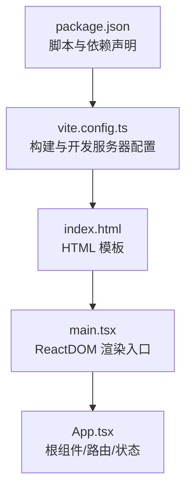
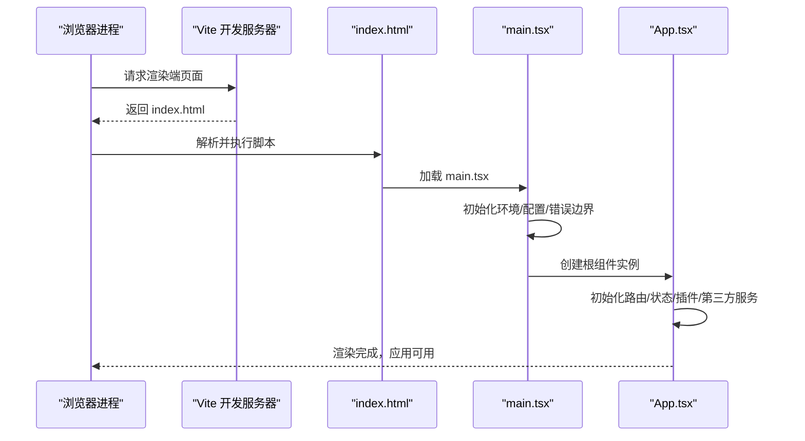
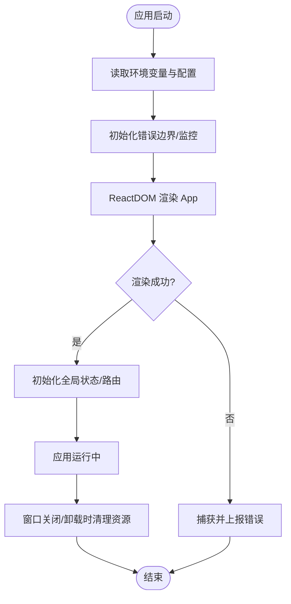
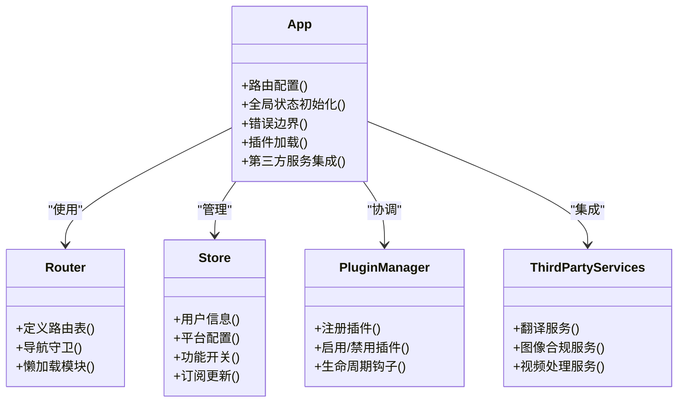
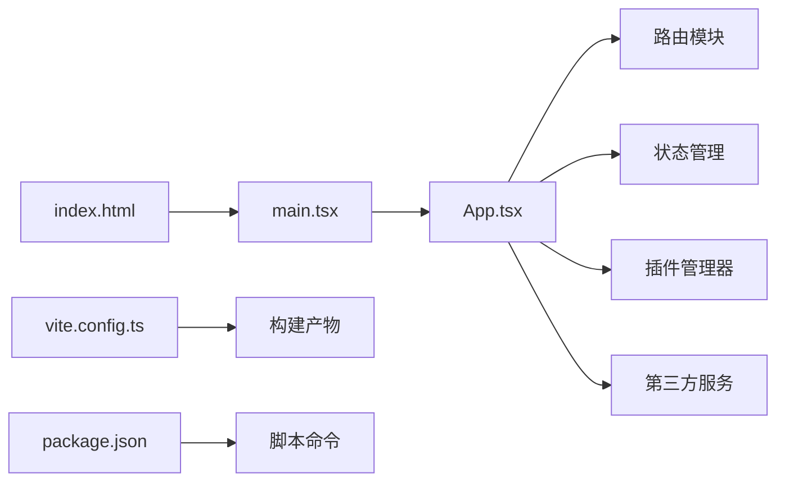

# 应用入口与初始化

<cite>
**本文引用的文件**   
- [src/renderer/main.tsx](file://src/renderer/main.tsx)
- [src/renderer/App.tsx](file://src/renderer/App.tsx)
- [src/renderer/index.html](file://src/renderer/index.html)
- [vite.config.ts](file://vite.config.ts)
- [package.json](file://package.json)
- [tsconfig.json](file://tsconfig.json)
</cite>

## 目录
1. [简介](#简介)
2. [项目结构](#项目结构)
3. [核心组件](#核心组件)
4. [架构总览](#架构总览)
5. [详细组件分析](#详细组件分析)
6. [依赖分析](#依赖分析)
7. [性能考虑](#性能考虑)
8. [故障排查指南](#故障排查指南)
9. [结论](#结论)
10. [附录](#附录)

## 简介
本文件聚焦于砚都跨境应用的 React 渲染端入口与初始化流程，围绕 src/renderer/main.tsx 的 ReactDOM 渲染配置、src/renderer/App.tsx 的根结构设计、全局状态管理初始化进行系统化说明。文档同时覆盖应用生命周期、错误边界、性能优化策略、路由配置、插件加载机制、第三方服务集成、启动参数与环境变量处理、以及调试模式设置等关键主题，帮助读者快速理解并高效维护该应用的启动链路。

## 项目结构
渲染端（renderer）是 Electron 应用中承载 React UI 的部分，其入口由 vite.config.ts 指定 HTML 模板，main.tsx 负责创建 React 根节点并挂载到 DOM；App.tsx 作为根组件组织页面布局、路由与全局状态。

图表来源
- [src/renderer/index.html:1-200](file://src/renderer/index.html#L1-L200)
- [src/renderer/main.tsx:1-200](file://src/renderer/main.tsx#L1-L200)
- [src/renderer/App.tsx:1-200](file://src/renderer/App.tsx#L1-L200)
- [vite.config.ts:1-200](file://vite.config.ts#L1-L200)
- [package.json:1-200](file://package.json#L1-L200)

章节来源
- [src/renderer/index.html:1-200](file://src/renderer/index.html#L1-L200)
- [src/renderer/main.tsx:1-200](file://src/renderer/main.tsx#L1-L200)
- [src/renderer/App.tsx:1-200](file://src/renderer/App.tsx#L1-L200)
- [vite.config.ts:1-200](file://vite.config.ts#L1-L200)
- [package.json:1-200](file://package.json#L1-L200)

## 核心组件
- main.tsx：React 渲染入口，负责创建根容器、挂载 App 组件、处理开发/生产环境差异、错误捕获与性能监控埋点。
- App.tsx：根组件，组织路由、全局状态（如用户信息、平台配置、功能开关）、错误边界与日志上报。
- index.html：提供挂载节点与基础样式、元信息。
- vite.config.ts：定义开发服务器、代理、环境变量注入、构建产物与插件链。
- package.json：定义脚本命令、依赖版本、打包目标与运行参数。

章节来源
- [src/renderer/main.tsx:1-200](file://src/renderer/main.tsx#L1-L200)
- [src/renderer/App.tsx:1-200](file://src/renderer/App.tsx#L1-L200)
- [src/renderer/index.html:1-200](file://src/renderer/index.html#L1-L200)
- [vite.config.ts:1-200](file://vite.config.ts#L1-L200)
- [package.json:1-200](file://package.json#L1-L200)

## 架构总览
下图展示从浏览器进程启动到 React 应用就绪的关键路径，包括 HTML 模板、Vite 开发服务器、ReactDOM 渲染与根组件初始化。

图表来源
- [src/renderer/index.html:1-200](file://src/renderer/index.html#L1-L200)
- [src/renderer/main.tsx:1-200](file://src/renderer/main.tsx#L1-L200)
- [src/renderer/App.tsx:1-200](file://src/renderer/App.tsx#L1-L200)

## 详细组件分析

### main.tsx 渲染入口与生命周期
- 职责
  - 选择挂载节点并调用 ReactDOM 渲染方法，将 App 组件挂载到 DOM。
  - 根据环境变量切换开发/生产行为（如严格模式、错误边界、性能监控）。
  - 注册全局错误捕获（未捕获异常、Promise 拒绝），上报日志或降级处理。
  - 在应用卸载时清理定时器、事件监听与资源引用。
- 生命周期关键点
  - 启动阶段：读取环境变量、初始化配置、准备错误边界与监控。
  - 挂载阶段：渲染根组件，建立路由与状态上下文。
  - 更新阶段：响应状态变化，按需懒加载模块。
  - 卸载阶段：释放资源，避免内存泄漏。

图表来源
- [src/renderer/main.tsx:1-200](file://src/renderer/main.tsx#L1-L200)

章节来源
- [src/renderer/main.tsx:1-200](file://src/renderer/main.tsx#L1-L200)

### App.tsx 根结构与全局状态
- 职责
  - 作为根组件，组织页面布局、路由表与导航守卫。
  - 初始化全局状态（用户信息、平台能力、功能开关、国际化等）。
  - 集成错误边界，捕获子树渲染异常并展示友好提示。
  - 加载插件与第三方服务（如翻译、图像合规、视频处理等），按能力动态启用。
- 设计要点
  - 路由分层：首页、工作台、工具集、设置页等模块划分清晰。
  - 状态集中：使用统一的状态容器（如 Context/Store）管理跨模块数据。
  - 错误隔离：为高风险模块包裹错误边界，避免单点崩溃影响整体。
  - 可插拔：通过插件接口扩展功能，支持运行时启停。

图表来源
- [src/renderer/App.tsx:1-200](file://src/renderer/App.tsx#L1-L200)

章节来源
- [src/renderer/App.tsx:1-200](file://src/renderer/App.tsx#L1-L200)

### index.html 模板与挂载点
- 作用
  - 提供 
 等挂载节点。
  - 引入基础样式与元信息（标题、字符集、视口等）。
  - 可选注入全局变量或调试脚本。
- 注意事项
  - 确保挂载节点唯一且存在。
  - 避免在模板中引入重型脚本，保持首屏加载速度。

章节来源
- [src/renderer/index.html:1-200](file://src/renderer/index.html#L1-L200)

### vite.config.ts 构建与开发配置
- 作用
  - 配置开发服务器端口、热重载、代理规则。
  - 注入环境变量到前端（以特定前缀区分）。
  - 定义构建产物输出目录、代码分割与压缩策略。
  - 集成插件（如 TypeScript、CSS 处理、图片优化等）。
- 环境变量
  - 通过 process.env 访问，建议在前端仅暴露必要字段。
  - 敏感信息不应进入构建产物。

章节来源
- [vite.config.ts:1-200](file://vite.config.ts#L1-L200)

### package.json 脚本与依赖
- 作用
  - 定义开发、构建、预览等脚本命令。
  - 声明运行时与开发期依赖版本。
  - 配置 Electron 主进程与渲染进程入口。
- 启动参数
  - 可通过命令行传入 NODE_ENV、端口、调试标志等。
  - 建议在环境变量文件中集中管理。

章节来源
- [package.json:1-200](file://package.json#L1-L200)

## 依赖分析
渲染端依赖关系如下：main.tsx 依赖 App.tsx，App.tsx 依赖路由、状态管理与插件/服务模块；vite.config.ts 驱动构建与开发体验；index.html 提供挂载点。

图表来源
- [src/renderer/main.tsx:1-200](file://src/renderer/main.tsx#L1-L200)
- [src/renderer/App.tsx:1-200](file://src/renderer/App.tsx#L1-L200)
- [src/renderer/index.html:1-200](file://src/renderer/index.html#L1-L200)
- [vite.config.ts:1-200](file://vite.config.ts#L1-L200)
- [package.json:1-200](file://package.json#L1-L200)

章节来源
- [src/renderer/main.tsx:1-200](file://src/renderer/main.tsx#L1-L200)
- [src/renderer/App.tsx:1-200](file://src/renderer/App.tsx#L1-L200)
- [src/renderer/index.html:1-200](file://src/renderer/index.html#L1-L200)
- [vite.config.ts:1-200](file://vite.config.ts#L1-L200)
- [package.json:1-200](file://package.json#L1-L200)

## 性能考虑
- 首屏优化
  - 代码分割：按路由或功能模块拆分包，减少初始体积。
  - 资源预取：对关键资源进行预加载或懒加载。
  - 静态资源缓存：合理设置缓存策略与版本号。
- 运行时优化
  - 避免重渲染：合理使用 memo/useMemo/useCallback，减少不必要的更新。
  - 列表虚拟化：大数据量列表采用虚拟滚动。
  - 网络请求合并与去抖：降低频繁请求带来的开销。
- 监控与诊断
  - 性能埋点：记录关键指标（FCP、LCP、TTFB、JS 执行耗时）。
  - 错误上报：捕获未处理异常与 Promise 拒绝，附带上下文信息。
  - 内存泄漏检测：定期检查定时器、事件监听与闭包引用。

[本节为通用指导，不直接分析具体文件]

## 故障排查指南
- 常见问题
  - 挂载失败：检查 index.html 中的挂载节点是否存在与 ID 是否匹配。
  - 路由空白：确认路由表配置与懒加载模块是否正确引入。
  - 状态未生效：检查状态初始化顺序与订阅更新逻辑。
  - 插件未加载：验证插件注册与启用条件。
  - 第三方服务不可用：检查 API 密钥、网络连通性与限流策略。
- 定位手段
  - 控制台日志：开启详细日志级别，过滤关键模块输出。
  - 错误边界：查看错误边界捕获的错误信息与堆栈。
  - 网络面板：检查请求状态码、响应体与跨域问题。
  - 性能面板：分析长任务、重排重绘与内存占用。
- 恢复策略
  - 降级功能：在关键服务失败时回退到本地或离线模式。
  - 重试机制：对网络请求实现指数退避重试。
  - 用户提示：给出明确错误提示与操作指引。

章节来源
- [src/renderer/main.tsx:1-200](file://src/renderer/main.tsx#L1-L200)
- [src/renderer/App.tsx:1-200](file://src/renderer/App.tsx#L1-L200)

## 结论
通过对渲染端入口与初始化流程的系统化梳理，明确了 main.tsx 的渲染职责、App.tsx 的根结构与状态管理、以及构建与运行环境的配置要点。结合错误边界、性能优化与调试手段，可有效提升应用的稳定性与可维护性。建议在实际项目中完善环境变量管理、插件接口规范与服务容错机制，以支撑复杂业务场景下的稳定运行。

[本节为总结性内容，不直接分析具体文件]

## 附录
- 启动参数与环境变量
  - 常用参数：NODE_ENV、端口号、调试标志、功能开关等。
  - 建议将环境变量集中在 .env 文件中，并按环境区分。
- 调试模式设置
  - 开发模式：启用热重载、源码映射、详细日志。
  - 生产模式：关闭调试输出、启用压缩与混淆。
- 第三方服务集成清单
  - 翻译服务、图像合规、视频处理等服务的接入方式、鉴权与限流策略。

[本节为补充信息，不直接分析具体文件]