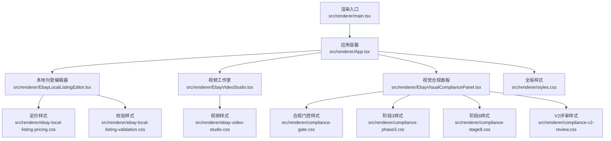
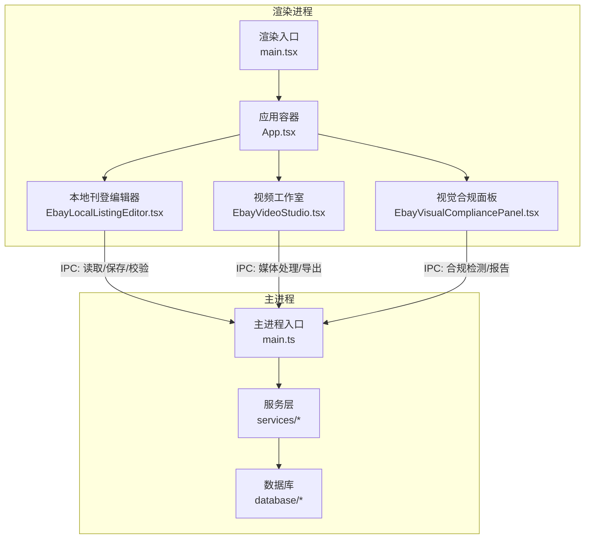
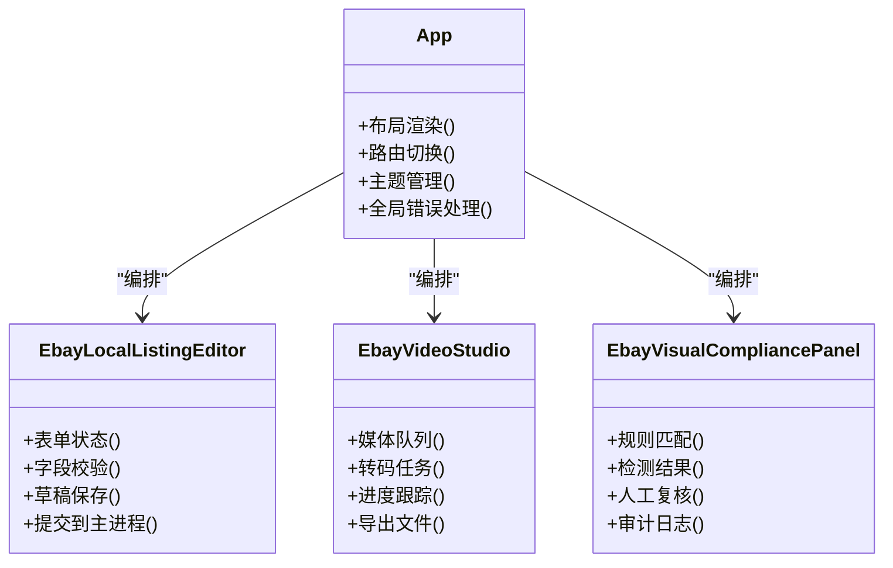
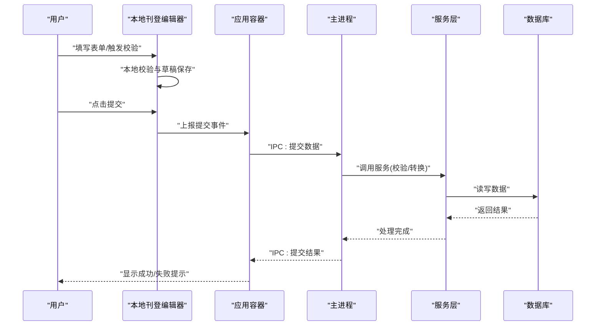
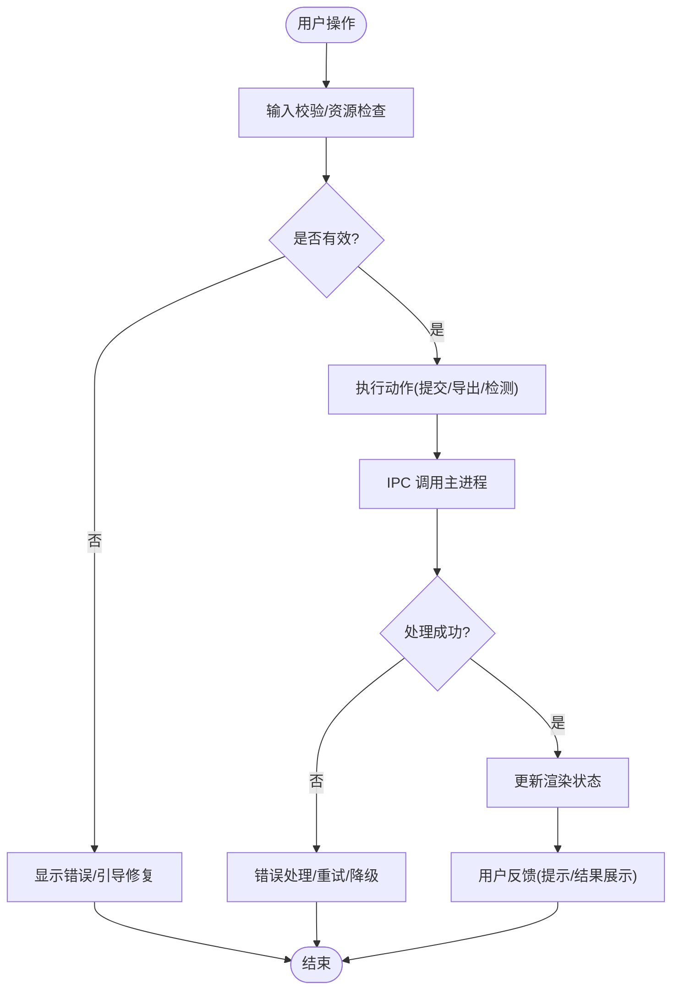
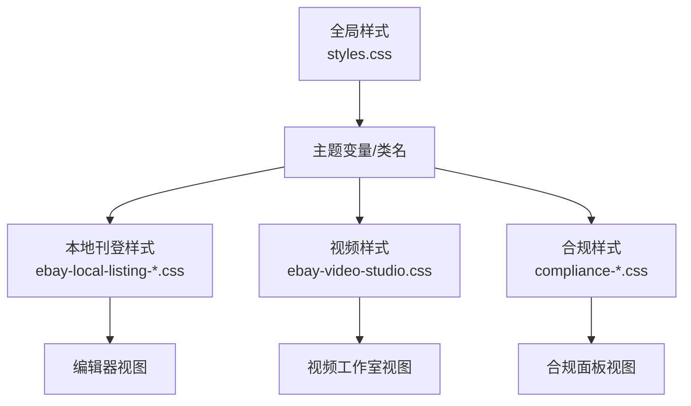
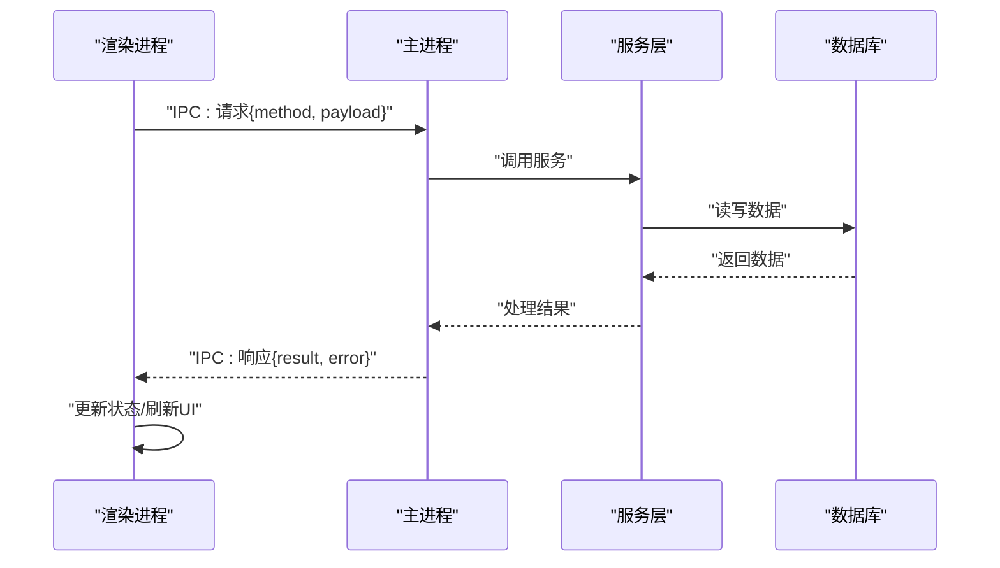
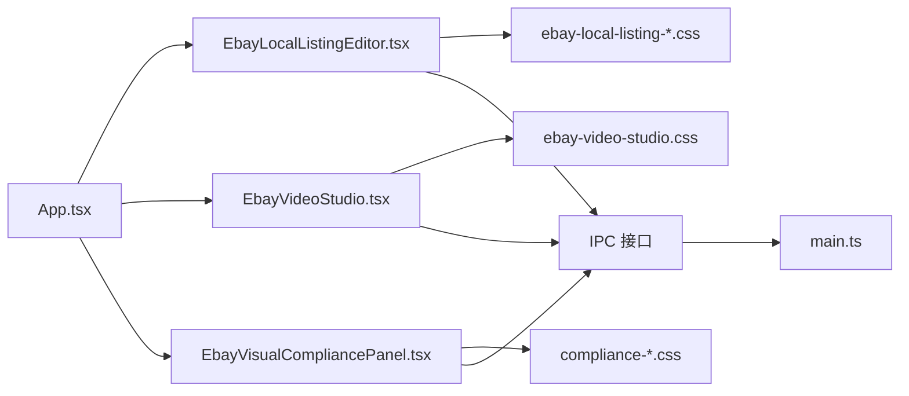

# 渲染进程架构

<cite>
**本文引用的文件**   
- [renderer/main.tsx](file://src/renderer/main.tsx)
- [renderer/App.tsx](file://src/renderer/App.tsx)
- [renderer/EbayLocalListingEditor.tsx](file://src/renderer/EbayLocalListingEditor.tsx)
- [renderer/EbayVideoStudio.tsx](file://src/renderer/EbayVideoStudio.tsx)
- [renderer/EbayVisualCompliancePanel.tsx](file://src/renderer/EbayVisualCompliancePanel.tsx)
- [renderer/styles.css](file://src/renderer/styles.css)
- [renderer/ebay-video-studio.css](file://src/renderer/ebay-video-studio.css)
- [renderer/ebay-local-listing-pricing.css](file://src/renderer/ebay-local-listing-pricing.css)
- [renderer/ebay-local-listing-validation.css](file://src/renderer/ebay-local-listing-validation.css)
- [renderer/compliance-gate.css](file://src/renderer/compliance-gate.css)
- [renderer/compliance-phase3.css](file://src/renderer/compliance-phase3.css)
- [renderer/compliance-stage8.css](file://src/renderer/compliance-stage8.css)
- [renderer/compliance-v2-review.css](file://src/renderer/compliance-v2-review.css)
- [renderer/ebay-acceptance-readable.css](file://src/renderer/ebay-acceptance-readable.css)
- [renderer/ebay-collection.css](file://src/renderer/ebay-collection.css)
- [renderer/image-studio.css](file://src/renderer/image-studio.css)
- [renderer/ui-readability.css](file://src/renderer/ui-readability.css)
- [main/main.ts](file://src/main/main.ts)
- [shared/contracts.ts](file://src/shared/contracts.ts)
</cite>

## 目录
1. [简介](#简介)
2. [项目结构](#项目结构)
3. [核心组件](#核心组件)
4. [架构总览](#架构总览)
5. [详细组件分析](#详细组件分析)
6. [依赖关系分析](#依赖关系分析)
7. [性能考量](#性能考量)
8. [故障排查指南](#故障排查指南)
9. [结论](#结论)
10. [附录](#附录)

## 简介
本文件为砚都跨境项目的渲染进程提供系统化、可落地的架构文档。重点覆盖：
- React 应用的组件层次结构与路由/挂载方式
- 状态管理模式与数据流设计（组件内状态、跨组件通信、主从进程通信）
- 三大业务组件的职责边界与交互关系：EbayLocalListingEditor、EbayVideoStudio、EbayVisualCompliancePanel
- UI 组件的状态管理、事件处理与用户交互逻辑
- 样式组织、主题定制与响应式实现策略
- 渲染进程与主进程的通信模式与数据同步策略

## 项目结构
渲染进程位于 src/renderer，采用基于 React 的单页应用组织方式。入口文件负责初始化 React 根节点与全局样式；App 组件作为页面级容器，承载各功能模块的视图与导航；具体业务以独立 TSX 组件呈现，并通过 CSS 模块化或按功能域拆分样式文件进行组织。

**图表来源** 
- [renderer/main.tsx](file://src/renderer/main.tsx)
- [renderer/App.tsx](file://src/renderer/App.tsx)
- [renderer/EbayLocalListingEditor.tsx](file://src/renderer/EbayLocalListingEditor.tsx)
- [renderer/EbayVideoStudio.tsx](file://src/renderer/EbayVideoStudio.tsx)
- [renderer/EbayVisualCompliancePanel.tsx](file://src/renderer/EbayVisualCompliancePanel.tsx)
- [renderer/styles.css](file://src/renderer/styles.css)
- [renderer/ebay-local-listing-pricing.css](file://src/renderer/ebay-local-listing-pricing.css)
- [renderer/ebay-local-listing-validation.css](file://src/renderer/ebay-local-listing-validation.css)
- [renderer/ebay-video-studio.css](file://src/renderer/ebay-video-studio.css)
- [renderer/compliance-gate.css](file://src/renderer/compliance-gate.css)
- [renderer/compliance-phase3.css](file://src/renderer/compliance-phase3.css)
- [renderer/compliance-stage8.css](file://src/renderer/compliance-stage8.css)
- [renderer/compliance-v2-review.css](file://src/renderer/compliance-v2-review.css)

**章节来源**
- [renderer/main.tsx](file://src/renderer/main.tsx)
- [renderer/App.tsx](file://src/renderer/App.tsx)

## 核心组件
- 渲染入口 main.tsx：创建 React 根节点、挂载 App 组件、注入全局样式与基础运行时配置。
- 应用容器 App.tsx：定义页面级布局、路由/标签切换、全局上下文（如主题、语言、权限）与跨模块共享状态。
- 本地刊登编辑器 EbayLocalListingEditor.tsx：负责 eBay 本地刊登信息的采集、编辑、校验与提交，包含价格、属性、类目等表单与校验流程。
- 视频工作室 EbayVideoStudio.tsx：提供视频素材上传、预览、剪辑与导出能力，集成媒体处理管线与进度反馈。
- 视觉合规面板 EbayVisualCompliancePanel.tsx：对图片/视频内容进行合规检测、规则匹配与结果展示，支持多阶段审核与回滚。

上述组件通过 App 容器进行编排，彼此之间通过回调、事件总线或轻量状态对象进行协作，避免深层耦合。

**章节来源**
- [renderer/App.tsx](file://src/renderer/App.tsx)
- [renderer/EbayLocalListingEditor.tsx](file://src/renderer/EbayLocalListingEditor.tsx)
- [renderer/EbayVideoStudio.tsx](file://src/renderer/EbayVideoStudio.tsx)
- [renderer/EbayVisualCompliancePanel.tsx](file://src/renderer/EbayVisualCompliancePanel.tsx)

## 架构总览
渲染进程采用“容器 + 业务组件”的分层模式。容器负责布局与跨组件协调，业务组件聚焦单一职责。UI 状态主要保存在组件内部，必要时通过回调向父级提升；跨进程数据通过 IPC 通道与主进程交互，保证渲染态与持久化/系统能力的解耦。

**图表来源** 
- [renderer/main.tsx](file://src/renderer/main.tsx)
- [renderer/App.tsx](file://src/renderer/App.tsx)
- [renderer/EbayLocalListingEditor.tsx](file://src/renderer/EbayLocalListingEditor.tsx)
- [renderer/EbayVideoStudio.tsx](file://src/renderer/EbayVideoStudio.tsx)
- [renderer/EbayVisualCompliancePanel.tsx](file://src/renderer/EbayVisualCompliancePanel.tsx)
- [main/main.ts](file://src/main/main.ts)

## 详细组件分析

### 组件层次与职责
- 容器 App.tsx：维护页面布局、标签页/路由切换、全局主题与国际化开关；聚合各业务组件的生命周期钩子，统一错误边界与加载态。
- 本地刊登编辑器：表单驱动，字段校验、草稿自动保存、批量导入/导出、与主进程的数据同步。
- 视频工作室：媒体管线（上传→转码→预览→导出），进度条与失败重试，缓存与断点续传。
- 视觉合规面板：规则引擎调用、检测结果可视化、人工复核与审计日志。

**图表来源** 
- [renderer/App.tsx](file://src/renderer/App.tsx)
- [renderer/EbayLocalListingEditor.tsx](file://src/renderer/EbayLocalListingEditor.tsx)
- [renderer/EbayVideoStudio.tsx](file://src/renderer/EbayVideoStudio.tsx)
- [renderer/EbayVisualCompliancePanel.tsx](file://src/renderer/EbayVisualCompliancePanel.tsx)

**章节来源**
- [renderer/App.tsx](file://src/renderer/App.tsx)
- [renderer/EbayLocalListingEditor.tsx](file://src/renderer/EbayLocalListingEditor.tsx)
- [renderer/EbayVideoStudio.tsx](file://src/renderer/EbayVideoStudio.tsx)
- [renderer/EbayVisualCompliancePanel.tsx](file://src/renderer/EbayVisualCompliancePanel.tsx)

### 数据流与状态管理
- 组件内状态：使用 React 状态管理表单值、校验结果、加载态与错误信息。
- 状态提升：将关键操作（如提交、导出、合规判定）的结果提升到 App 容器，用于全局提示与审计。
- 跨进程数据流：通过 IPC 发送请求并接收响应，渲染进程仅持有短期态，长期态由主进程持久化。

**图表来源** 
- [renderer/EbayLocalListingEditor.tsx](file://src/renderer/EbayLocalListingEditor.tsx)
- [renderer/App.tsx](file://src/renderer/App.tsx)
- [main/main.ts](file://src/main/main.ts)

**章节来源**
- [renderer/EbayLocalListingEditor.tsx](file://src/renderer/EbayLocalListingEditor.tsx)
- [renderer/App.tsx](file://src/renderer/App.tsx)
- [main/main.ts](file://src/main/main.ts)

### 事件处理与用户交互
- 表单交互：输入变更即时校验，错误高亮，禁用无效提交按钮。
- 媒体操作：拖拽上传、预览播放、进度更新、失败重试与取消。
- 合规审核：规则命中标记、差异对比、一键修正建议、人工确认。

**图表来源** 
- [renderer/EbayLocalListingEditor.tsx](file://src/renderer/EbayLocalListingEditor.tsx)
- [renderer/EbayVideoStudio.tsx](file://src/renderer/EbayVideoStudio.tsx)
- [renderer/EbayVisualCompliancePanel.tsx](file://src/renderer/EbayVisualCompliancePanel.tsx)

**章节来源**
- [renderer/EbayLocalListingEditor.tsx](file://src/renderer/EbayLocalListingEditor.tsx)
- [renderer/EbayVideoStudio.tsx](file://src/renderer/EbayVideoStudio.tsx)
- [renderer/EbayVisualCompliancePanel.tsx](file://src/renderer/EbayVisualCompliancePanel.tsx)

### 样式组织、主题定制与响应式设计
- 样式组织：按功能域拆分 CSS 文件，便于维护与按需加载。例如视频工作室、本地刊登、合规面板各自拥有专属样式。
- 主题定制：通过全局样式变量与类名约定，在 App 容器中切换主题（明/暗、品牌色）。
- 响应式：使用媒体查询与弹性布局，适配不同屏幕尺寸与设备类型。

**图表来源** 
- [renderer/styles.css](file://src/renderer/styles.css)
- [renderer/ebay-local-listing-pricing.css](file://src/renderer/ebay-local-listing-pricing.css)
- [renderer/ebay-local-listing-validation.css](file://src/renderer/ebay-local-listing-validation.css)
- [renderer/ebay-video-studio.css](file://src/renderer/ebay-video-studio.css)
- [renderer/compliance-gate.css](file://src/renderer/compliance-gate.css)
- [renderer/compliance-phase3.css](file://src/renderer/compliance-phase3.css)
- [renderer/compliance-stage8.css](file://src/renderer/compliance-stage8.css)
- [renderer/compliance-v2-review.css](file://src/renderer/compliance-v2-review.css)

**章节来源**
- [renderer/styles.css](file://src/renderer/styles.css)
- [renderer/ebay-local-listing-pricing.css](file://src/renderer/ebay-local-listing-pricing.css)
- [renderer/ebay-local-listing-validation.css](file://src/renderer/ebay-local-listing-validation.css)
- [renderer/ebay-video-studio.css](file://src/renderer/ebay-video-studio.css)
- [renderer/compliance-gate.css](file://src/renderer/compliance-gate.css)
- [renderer/compliance-phase3.css](file://src/renderer/compliance-phase3.css)
- [renderer/compliance-stage8.css](file://src/renderer/compliance-stage8.css)
- [renderer/compliance-v2-review.css](file://src/renderer/compliance-v2-review.css)

### 渲染进程与主进程通信与数据同步
- 通信模式：通过 IPC 通道发送结构化消息，包含方法名、参数与回调标识；主进程返回结果或错误码。
- 数据同步：渲染进程保持短期态（草稿、预览、中间结果），主进程负责持久化与跨会话一致性；关键操作需幂等与重试机制。
- 契约规范：使用 shared/contracts 定义消息结构，确保前后端一致。

**图表来源** 
- [main/main.ts](file://src/main/main.ts)
- [shared/contracts.ts](file://src/shared/contracts.ts)

**章节来源**
- [main/main.ts](file://src/main/main.ts)
- [shared/contracts.ts](file://src/shared/contracts.ts)

## 依赖关系分析
- 组件间依赖：App 容器依赖三个业务组件；业务组件之间不直接耦合，通过回调或事件总线间接通信。
- 样式依赖：全局样式提供主题变量，业务样式继承并扩展；避免样式冲突，采用命名空间或作用域隔离。
- 进程依赖：渲染进程依赖主进程提供的 IPC 接口；主进程依赖服务层与数据库。

**图表来源** 
- [renderer/App.tsx](file://src/renderer/App.tsx)
- [renderer/EbayLocalListingEditor.tsx](file://src/renderer/EbayLocalListingEditor.tsx)
- [renderer/EbayVideoStudio.tsx](file://src/renderer/EbayVideoStudio.tsx)
- [renderer/EbayVisualCompliancePanel.tsx](file://src/renderer/EbayVisualCompliancePanel.tsx)
- [renderer/ebay-local-listing-pricing.css](file://src/renderer/ebay-local-listing-pricing.css)
- [renderer/ebay-local-listing-validation.css](file://src/renderer/ebay-local-listing-validation.css)
- [renderer/ebay-video-studio.css](file://src/renderer/ebay-video-studio.css)
- [renderer/compliance-gate.css](file://src/renderer/compliance-gate.css)
- [renderer/compliance-phase3.css](file://src/renderer/compliance-phase3.css)
- [renderer/compliance-stage8.css](file://src/renderer/compliance-stage8.css)
- [renderer/compliance-v2-review.css](file://src/renderer/compliance-v2-review.css)
- [main/main.ts](file://src/main/main.ts)

**章节来源**
- [renderer/App.tsx](file://src/renderer/App.tsx)
- [renderer/EbayLocalListingEditor.tsx](file://src/renderer/EbayLocalListingEditor.tsx)
- [renderer/EbayVideoStudio.tsx](file://src/renderer/EbayVideoStudio.tsx)
- [renderer/EbayVisualCompliancePanel.tsx](file://src/renderer/EbayVisualCompliancePanel.tsx)
- [main/main.ts](file://src/main/main.ts)

## 性能考量
- 渲染优化：避免不必要的重渲染，合理使用 memo/useMemo/useCallback；大列表虚拟化。
- 媒体处理：分片上传、后台转码、懒加载预览；失败重试与断点续传。
- IPC 通信：批量消息合并、去抖节流、超时与降级策略。
- 样式加载：按需引入样式，减少首屏体积；主题切换无刷新。

[本节为通用指导，无需引用具体文件]

## 故障排查指南
- 常见错误：
  - 表单校验失败：检查字段约束与异步校验逻辑，查看控制台错误与网络请求。
  - 媒体处理失败：确认文件格式与大小限制，检查转码服务状态与磁盘空间。
  - 合规检测异常：核对规则版本与模型可用性，查看审计日志与重试次数。
- 调试手段：
  - 启用开发日志与埋点，记录关键步骤与耗时。
  - 使用浏览器开发者工具监控 IPC 消息与响应时间。
  - 对主进程服务层增加健康检查与告警。

**章节来源**
- [renderer/EbayLocalListingEditor.tsx](file://src/renderer/EbayLocalListingEditor.tsx)
- [renderer/EbayVideoStudio.tsx](file://src/renderer/EbayVideoStudio.tsx)
- [renderer/EbayVisualCompliancePanel.tsx](file://src/renderer/EbayVisualCompliancePanel.tsx)
- [main/main.ts](file://src/main/main.ts)

## 结论
本架构以清晰的组件分层与明确的职责边界为基础，结合稳健的 IPC 通信与数据同步策略，支撑了 eBay 本地刊登、视频工作室与视觉合规三大核心场景。通过模块化样式与主题机制，实现了良好的可维护性与可扩展性。后续可在性能优化、错误恢复与可观测性方面持续改进。

[本节为总结，无需引用具体文件]

## 附录
- 术语表：
  - 渲染进程：运行前端代码的进程，负责 UI 渲染与用户交互。
  - 主进程：运行后端逻辑的进程，负责系统能力、持久化与服务调用。
  - IPC：进程间通信机制，用于渲染进程与主进程交换数据。
- 参考文件：
  - 渲染入口与应用容器：[renderer/main.tsx](file://src/renderer/main.tsx)、[renderer/App.tsx](file://src/renderer/App.tsx)
  - 业务组件：[renderer/EbayLocalListingEditor.tsx](file://src/renderer/EbayLocalListingEditor.tsx)、[renderer/EbayVideoStudio.tsx](file://src/renderer/EbayVideoStudio.tsx)、[renderer/EbayVisualCompliancePanel.tsx](file://src/renderer/EbayVisualCompliancePanel.tsx)
  - 样式文件：见“样式组织、主题定制与响应式设计”部分所列
  - 主进程入口与契约：[main/main.ts](file://src/main/main.ts)、[shared/contracts.ts](file://src/shared/contracts.ts)