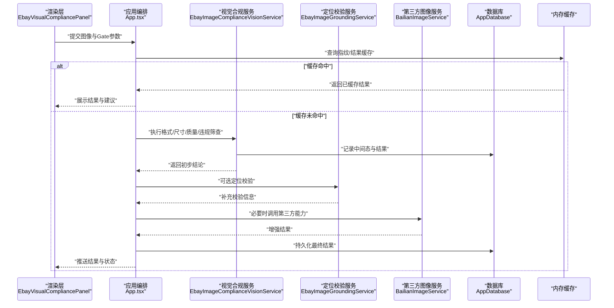
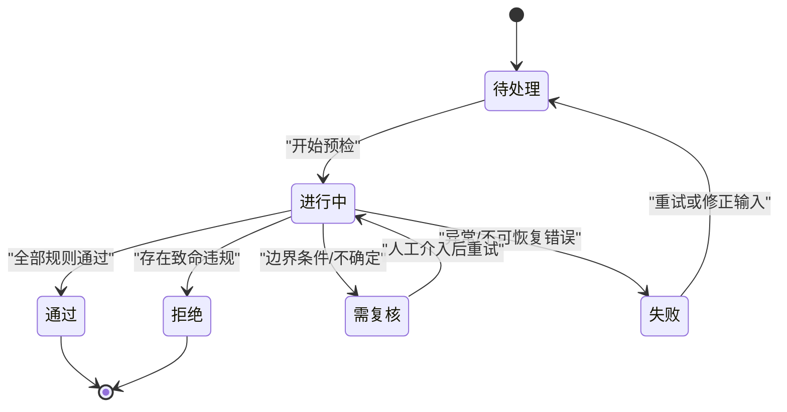
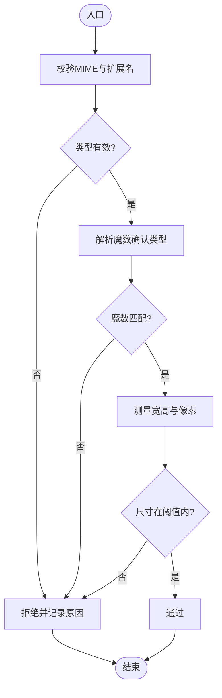
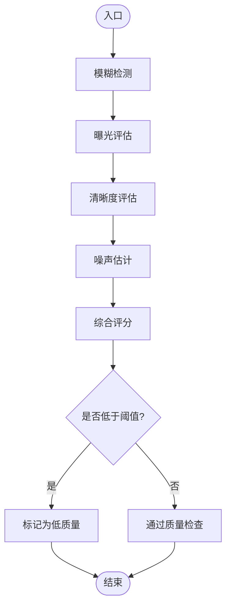
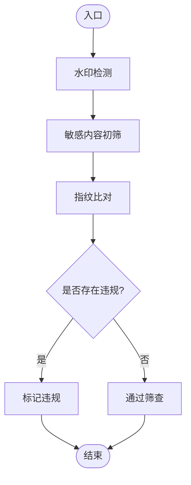
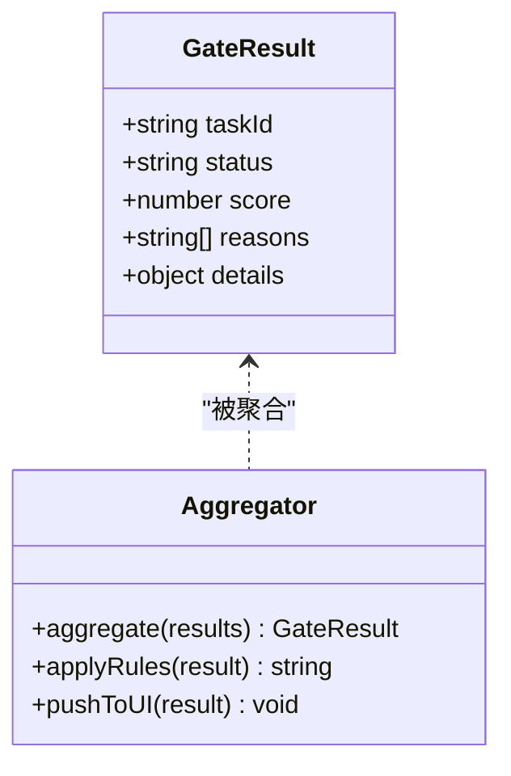
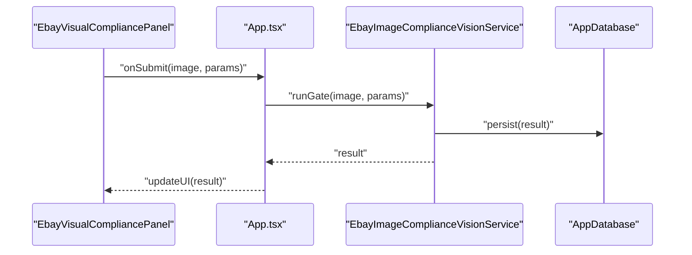
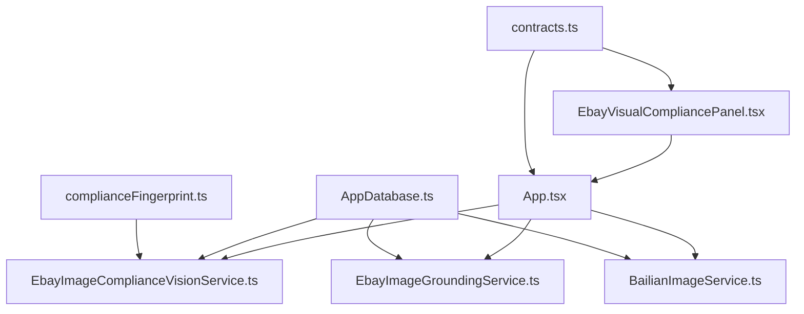

# 合规检查Gate阶段

<cite>
**本文引用的文件**   
- [src/renderer/App.tsx](file://src/renderer/App.tsx)
- [src/renderer/EbayVisualCompliancePanel.tsx](file://src/renderer/EbayVisualCompliancePanel.tsx)
- [src/main/services/EbayImageComplianceVisionService.ts](file://src/main/services/EbayImageComplianceVisionService.ts)
- [src/main/services/EbayImageGroundingService.ts](file://src/main/services/EbayImageGroundingService.ts)
- [src/main/services/BailianImageService.ts](file://src/main/services/BailianImageService.ts)
- [src/shared/contracts.ts](file://src/shared/contracts.ts)
- [src/shared/complianceFingerprint.ts](file://src/shared/complianceFingerprint.ts)
- [src/main/database/AppDatabase.ts](file://src/main/database/AppDatabase.ts)
- [src/renderer/compliance-gate.css](file://src/renderer/compliance-gate.css)
</cite>

## 目录
1. [引言](#引言)
2. [项目结构](#项目结构)
3. [核心组件](#核心组件)
4. [架构总览](#架构总览)
5. [详细组件分析](#详细组件分析)
6. [依赖关系分析](#依赖关系分析)
7. [性能考虑](#性能考虑)
8. [故障排除指南](#故障排除指南)
9. [结论](#结论)
10. [附录](#附录)

## 引言
本技术文档聚焦于“合规检查Gate阶段”的设计与实现。Gate阶段作为第一道防线，负责在图像进入后续深度处理之前进行快速、低成本的预检，包括：
- 图像格式验证（MIME类型、扩展名、魔数）
- 尺寸检测（最小/最大宽高、像素上限）
- 基础质量评估（清晰度、过曝/欠曝、模糊、噪声）
- 快速违规筛查（水印、敏感内容、重复图指纹）

Gate阶段的判断规则、阈值配置与过滤机制将在此文档中系统化说明，并给出与主面板的集成方式、检查结果的数据结构与状态管理策略。同时提供性能优化、缓存机制与错误处理方案，以及具体配置示例和故障排除指南。

## 项目结构
Gate阶段涉及渲染层（UI交互）、主进程服务（图像处理与合规判定）、共享契约（数据结构定义）与数据库（持久化）。关键文件组织如下：
- 渲染层：EbayVisualCompliancePanel.tsx 负责Gate阶段UI展示与用户交互；App.tsx 编排整体流程与状态。
- 主进程服务：EbayImageComplianceVisionService.ts、EbayImageGroundingService.ts、BailianImageService.ts 分别承担视觉合规、定位校验与第三方图像能力调用。
- 共享契约：contracts.ts 定义Gate结果、任务状态等数据结构；complianceFingerprint.ts 提供指纹计算用于去重与快速筛查。
- 数据库：AppDatabase.ts 负责Gate结果与中间态的持久化。
- 样式：compliance-gate.css 为Gate阶段UI提供样式支持。

```mermaid
graph TB
UI["渲染层<br/>EbayVisualCompliancePanel.tsx"] --> App["应用编排<br/>App.tsx"]
App --> Vision["视觉合规服务<br/>EbayImageComplianceVisionService.ts"]
App --> Grounding["定位校验服务<br/>EbayImageGroundingService.ts"]
App --> Bailian["第三方图像服务<br/>BailianImageService.ts"]
Vision --> DB["数据库<br/>AppDatabase.ts"]
Grounding --> DB
Bailian --> DB
UI <- --> Contracts["共享契约<br/>contracts.ts"]
UI <- --> Fingerprint["指纹工具<br/>complianceFingerprint.ts"]
```

图表来源
- [src/renderer/EbayVisualCompliancePanel.tsx](file://src/renderer/EbayVisualCompliancePanel.tsx)
- [src/renderer/App.tsx](file://src/renderer/App.tsx)
- [src/main/services/EbayImageComplianceVisionService.ts](file://src/main/services/EbayImageComplianceVisionService.ts)
- [src/main/services/EbayImageGroundingService.ts](file://src/main/services/EbayImageGroundingService.ts)
- [src/main/services/BailianImageService.ts](file://src/main/services/BailianImageService.ts)
- [src/main/database/AppDatabase.ts](file://src/main/database/AppDatabase.ts)
- [src/shared/contracts.ts](file://src/shared/contracts.ts)
- [src/shared/complianceFingerprint.ts](file://src/shared/complianceFingerprint.ts)

章节来源
- [src/renderer/EbayVisualCompliancePanel.tsx](file://src/renderer/EbayVisualCompliancePanel.tsx)
- [src/renderer/App.tsx](file://src/renderer/App.tsx)
- [src/main/services/EbayImageComplianceVisionService.ts](file://src/main/services/EbayImageComplianceVisionService.ts)
- [src/main/services/EbayImageGroundingService.ts](file://src/main/services/EbayImageGroundingService.ts)
- [src/main/services/BailianImageService.ts](file://src/main/services/BailianImageService.ts)
- [src/main/database/AppDatabase.ts](file://src/main/database/AppDatabase.ts)
- [src/shared/contracts.ts](file://src/shared/contracts.ts)
- [src/shared/complianceFingerprint.ts](file://src/shared/complianceFingerprint.ts)

## 核心组件
Gate阶段的核心由以下组件构成：
- Gate任务管理器：负责接收图像输入、调度预检流水线、汇总结果与状态流转。
- 图像格式与尺寸校验器：校验MIME类型、扩展名、魔数，检测宽高与像素上限。
- 基础质量评估器：基于轻量模型或统计特征评估清晰度、曝光、模糊与噪声。
- 快速违规筛查器：水印检测、敏感内容初筛、重复图指纹比对。
- 结果聚合与决策器：根据规则与阈值输出Gate通过/拒绝/需复核结论。
- 缓存与持久化：命中缓存直接返回；未命中则写入数据库并更新索引。
- 主面板集成：向EbayVisualCompliancePanel推送实时进度、结果与可操作建议。

章节来源
- [src/renderer/EbayVisualCompliancePanel.tsx](file://src/renderer/EbayVisualCompliancePanel.tsx)
- [src/main/services/EbayImageComplianceVisionService.ts](file://src/main/services/EbayImageComplianceVisionService.ts)
- [src/main/services/EbayImageGroundingService.ts](file://src/main/services/EbayImageGroundingService.ts)
- [src/main/services/BailianImageService.ts](file://src/main/services/BailianImageService.ts)
- [src/shared/contracts.ts](file://src/shared/contracts.ts)
- [src/shared/complianceFingerprint.ts](file://src/shared/complianceFingerprint.ts)
- [src/main/database/AppDatabase.ts](file://src/main/database/AppDatabase.ts)

## 架构总览
Gate阶段的处理流程从渲染层发起，经主进程服务完成多步预检，最终将结果回传至UI。以下为关键序列图：



图表来源
- [src/renderer/EbayVisualCompliancePanel.tsx](file://src/renderer/EbayVisualCompliancePanel.tsx)
- [src/renderer/App.tsx](file://src/renderer/App.tsx)
- [src/main/services/EbayImageComplianceVisionService.ts](file://src/main/services/EbayImageComplianceVisionService.ts)
- [src/main/services/EbayImageGroundingService.ts](file://src/main/services/EbayImageGroundingService.ts)
- [src/main/services/BailianImageService.ts](file://src/main/services/BailianImageService.ts)
- [src/main/database/AppDatabase.ts](file://src/main/database/AppDatabase.ts)

## 详细组件分析

### Gate任务管理与状态机
Gate阶段的状态机驱动任务生命周期，确保结果一致性与可追踪性。典型状态包括：待处理、进行中、通过、拒绝、需复核、失败。状态转换遵循严格的规则与事件触发。



图表来源
- [src/renderer/App.tsx](file://src/renderer/App.tsx)
- [src/shared/contracts.ts](file://src/shared/contracts.ts)

章节来源
- [src/renderer/App.tsx](file://src/renderer/App.tsx)
- [src/shared/contracts.ts](file://src/shared/contracts.ts)

### 图像格式与尺寸校验器
职责：
- 校验MIME类型与扩展名一致性，拒绝非法格式。
- 解析魔数以确认真实类型。
- 检测宽高范围与像素上限，避免过大或过小图像进入后续流程。



图表来源
- [src/main/services/EbayImageComplianceVisionService.ts](file://src/main/services/EbayImageComplianceVisionService.ts)
- [src/shared/contracts.ts](file://src/shared/contracts.ts)

章节来源
- [src/main/services/EbayImageComplianceVisionService.ts](file://src/main/services/EbayImageComplianceVisionService.ts)
- [src/shared/contracts.ts](file://src/shared/contracts.ts)

### 基础质量评估器
职责：
- 清晰度评估（边缘强度、频域能量分布）
- 曝光评估（直方图均值/方差）
- 模糊检测（拉普拉斯方差）
- 噪声估计（局部方差）



图表来源
- [src/main/services/EbayImageComplianceVisionService.ts](file://src/main/services/EbayImageComplianceVisionService.ts)
- [src/shared/contracts.ts](file://src/shared/contracts.ts)

章节来源
- [src/main/services/EbayImageComplianceVisionService.ts](file://src/main/services/EbayImageComplianceVisionService.ts)
- [src/shared/contracts.ts](file://src/shared/contracts.ts)

### 快速违规筛查器
职责：
- 水印检测（纹理/对比度异常区域）
- 敏感内容初筛（颜色/文本特征）
- 重复图指纹比对（感知哈希）



图表来源
- [src/main/services/EbayImageComplianceVisionService.ts](file://src/main/services/EbayImageComplianceVisionService.ts)
- [src/shared/complianceFingerprint.ts](file://src/shared/complianceFingerprint.ts)
- [src/shared/contracts.ts](file://src/shared/contracts.ts)

章节来源
- [src/main/services/EbayImageComplianceVisionService.ts](file://src/main/services/EbayImageComplianceVisionService.ts)
- [src/shared/complianceFingerprint.ts](file://src/shared/complianceFingerprint.ts)
- [src/shared/contracts.ts](file://src/shared/contracts.ts)

### 结果聚合与决策器
职责：
- 汇总各子模块结果，依据规则与阈值生成Gate结论。
- 输出结构化结果，包含通过/拒绝/需复核及原因明细。
- 与主面板交互，推送状态与可操作建议。



图表来源
- [src/shared/contracts.ts](file://src/shared/contracts.ts)
- [src/renderer/App.tsx](file://src/renderer/App.tsx)

章节来源
- [src/shared/contracts.ts](file://src/shared/contracts.ts)
- [src/renderer/App.tsx](file://src/renderer/App.tsx)

### 主面板集成与数据流
EbayVisualCompliancePanel负责：
- 接收用户提交的图像与Gate参数
- 显示实时进度与结果
- 提供操作按钮（重试、跳过、人工复核）

数据流：
- 渲染层 -> 应用编排 -> 主进程服务 -> 数据库/缓存 -> 渲染层



图表来源
- [src/renderer/EbayVisualCompliancePanel.tsx](file://src/renderer/EbayVisualCompliancePanel.tsx)
- [src/renderer/App.tsx](file://src/renderer/App.tsx)
- [src/main/services/EbayImageComplianceVisionService.ts](file://src/main/services/EbayImageComplianceVisionService.ts)
- [src/main/database/AppDatabase.ts](file://src/main/database/AppDatabase.ts)

章节来源
- [src/renderer/EbayVisualCompliancePanel.tsx](file://src/renderer/EbayVisualCompliancePanel.tsx)
- [src/renderer/App.tsx](file://src/renderer/App.tsx)
- [src/main/services/EbayImageComplianceVisionService.ts](file://src/main/services/EbayImageComplianceVisionService.ts)
- [src/main/database/AppDatabase.ts](file://src/main/database/AppDatabase.ts)

## 依赖关系分析
Gate阶段依赖多个服务与共享契约，形成清晰的耦合与协作关系。



图表来源
- [src/shared/contracts.ts](file://src/shared/contracts.ts)
- [src/shared/complianceFingerprint.ts](file://src/shared/complianceFingerprint.ts)
- [src/renderer/EbayVisualCompliancePanel.tsx](file://src/renderer/EbayVisualCompliancePanel.tsx)
- [src/renderer/App.tsx](file://src/renderer/App.tsx)
- [src/main/services/EbayImageComplianceVisionService.ts](file://src/main/services/EbayImageComplianceVisionService.ts)
- [src/main/services/EbayImageGroundingService.ts](file://src/main/services/EbayImageGroundingService.ts)
- [src/main/services/BailianImageService.ts](file://src/main/services/BailianImageService.ts)
- [src/main/database/AppDatabase.ts](file://src/main/database/AppDatabase.ts)

章节来源
- [src/shared/contracts.ts](file://src/shared/contracts.ts)
- [src/shared/complianceFingerprint.ts](file://src/shared/complianceFingerprint.ts)
- [src/renderer/EbayVisualCompliancePanel.tsx](file://src/renderer/EbayVisualCompliancePanel.tsx)
- [src/renderer/App.tsx](file://src/renderer/App.tsx)
- [src/main/services/EbayImageComplianceVisionService.ts](file://src/main/services/EbayImageComplianceVisionService.ts)
- [src/main/services/EbayImageGroundingService.ts](file://src/main/services/EbayImageGroundingService.ts)
- [src/main/services/BailianImageService.ts](file://src/main/services/EbayImageGroundingService.ts)
- [src/main/database/AppDatabase.ts](file://src/main/database/AppDatabase.ts)

## 性能考虑
- 缓存机制：对相同指纹的图像直接返回缓存结果，减少重复计算。
- 并行处理：格式/尺寸/质量/违规筛查可并行执行，缩短端到端延迟。
- 增量更新：仅对变更的子模块结果进行增量聚合。
- 资源限制：限制并发任务数与内存占用，防止过载。
- 异步I/O：数据库与第三方服务调用采用异步非阻塞模式。

[本节为通用指导，不直接分析具体文件]

## 故障排除指南
常见问题与排查步骤：
- 图像格式不被识别：检查MIME类型与扩展名一致性，确认魔数解析成功。
- 尺寸超限：调整阈值或预处理缩放策略。
- 质量评分过低：检查清晰度与曝光算法参数，必要时引入更鲁棒的特征。
- 误判违规：审查水印与敏感内容检测阈值，增加样本校准。
- 缓存未命中：确认指纹计算稳定性与键生成逻辑。
- 数据库写入失败：检查连接与事务，确保幂等写入。

章节来源
- [src/main/services/EbayImageComplianceVisionService.ts](file://src/main/services/EbayImageComplianceVisionService.ts)
- [src/main/database/AppDatabase.ts](file://src/main/database/AppDatabase.ts)
- [src/shared/complianceFingerprint.ts](file://src/shared/complianceFingerprint.ts)

## 结论
Gate阶段通过轻量、快速的预检机制为后续深度处理提供可靠的第一道防线。其规则明确、阈值可配置、结果结构化，并与主面板无缝集成。通过缓存、并行与异步I/O等优化策略，系统在保证准确性的同时提升吞吐与响应速度。持续校准阈值与样本可进一步提升鲁棒性。

[本节为总结，不直接分析具体文件]

## 附录
- 配置示例（字段说明）：
  - 图像格式白名单：允许的类型列表
  - 尺寸阈值：最小/最大宽高与像素上限
  - 质量阈值：清晰度、曝光、模糊、噪声的阈值
  - 违规阈值：水印、敏感内容、重复图的判定阈值
  - 缓存策略：TTL、容量上限、失效策略
  - 并发限制：最大并行任务数
- 数据结构（Gate结果）：
  - 任务ID、状态、评分、原因列表、详情对象
- 状态管理：
  - 待处理、进行中、通过、拒绝、需复核、失败
- 主面板集成：
  - 实时进度、结果展示、操作按钮

[本节为概念性附录，不直接分析具体文件]