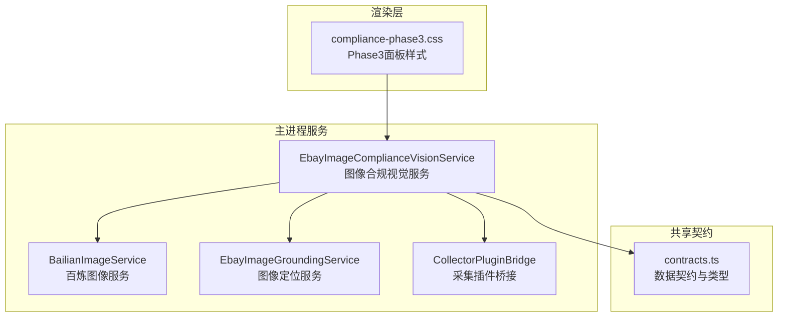
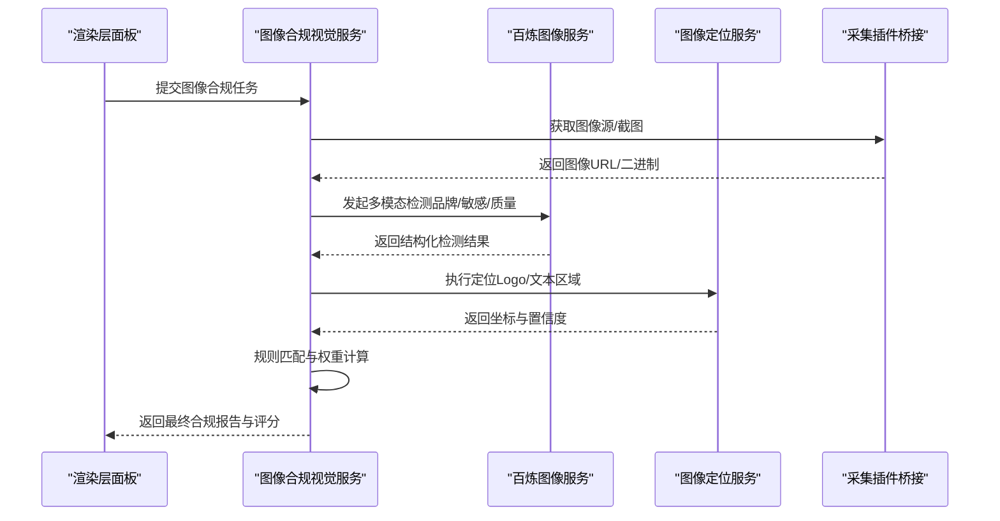
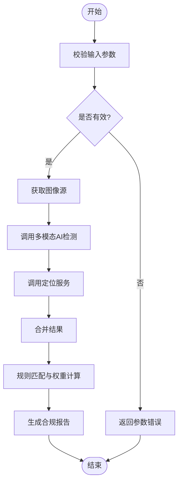
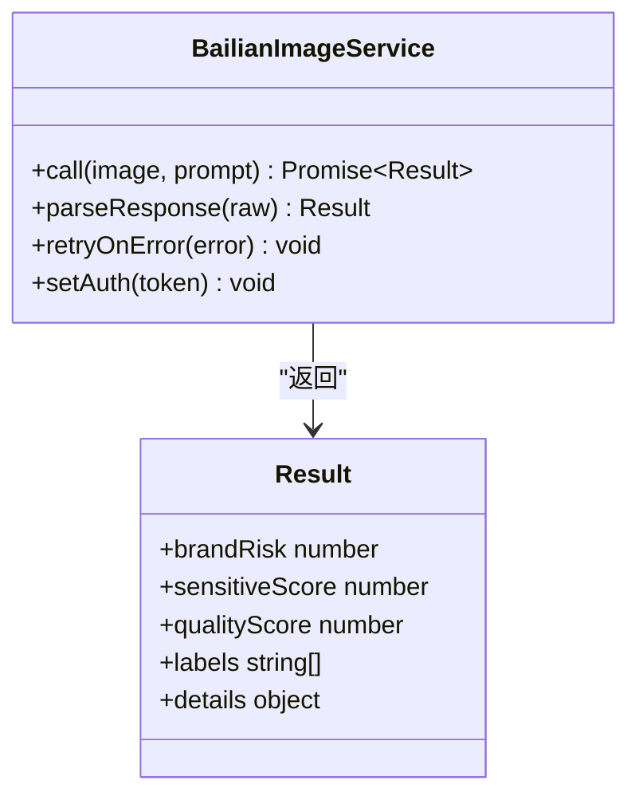
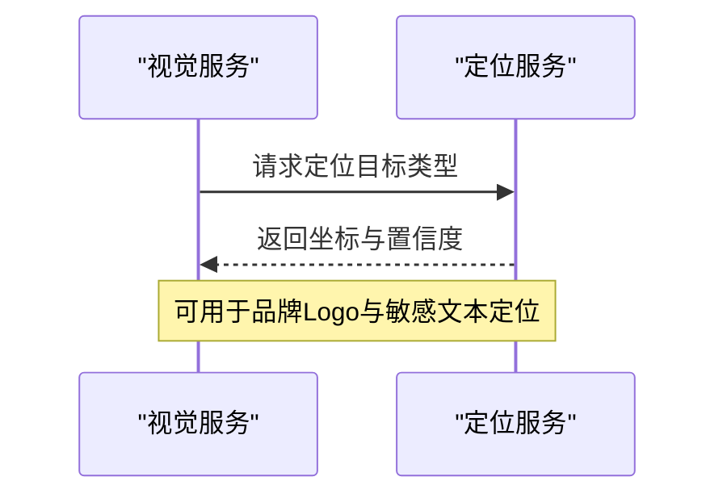
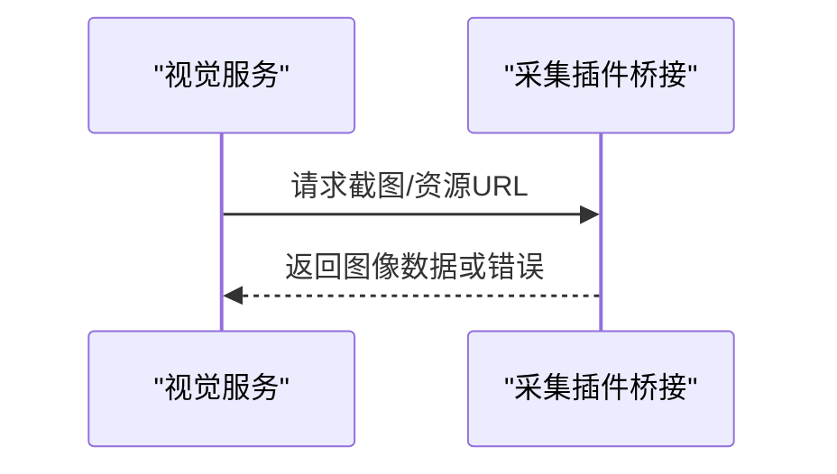
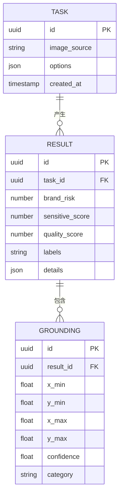
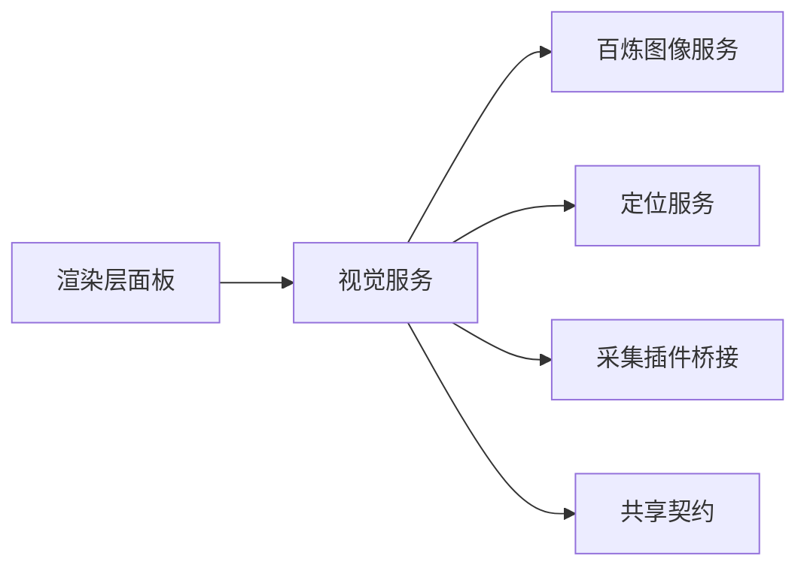

# 合规检查Phase3阶段

<cite>
**本文引用的文件**   
- [src/main/services/BailianImageService.ts](file://src/main/services/BailianImageService.ts)
- [src/main/services/EbayImageComplianceVisionService.ts](file://src/main/services/EbayImageComplianceVisionService.ts)
- [src/main/services/EbayImageGroundingService.ts](file://src/main/services/EbayImageGroundingService.ts)
- [src/renderer/compliance-phase3.css](file://src/renderer/compliance-phase3.css)
- [src/shared/contracts.ts](file://src/shared/contracts.ts)
- [src/main/services/CollectorPluginBridge.ts](file://src/main/services/CollectorPluginBridge.ts)
- [package.json](file://package.json)
</cite>

## 目录
1. [简介](#简介)
2. [项目结构](#项目结构)
3. [核心组件](#核心组件)
4. [架构总览](#架构总览)
5. [详细组件分析](#详细组件分析)
6. [依赖关系分析](#依赖关系分析)
7. [性能考量](#性能考量)
8. [故障排查指南](#故障排查指南)
9. [结论](#结论)
10. [附录：API参考与集成示例](#附录api参考与集成示例)

## 简介
本技术文档聚焦于“合规检查Phase3阶段”的图像深度分析与AI能力集成，覆盖以下关键主题：
- AI驱动的视觉内容检测、品牌侵权识别、敏感内容过滤与质量评分算法
- 多模态AI服务（百炼图像服务）的集成方式、API调用流程与结果解析逻辑
- 自定义检测规则添加方法、权重配置与规则优先级管理
- 批量处理支持、异步任务管理与进度反馈机制
- 完整的API参考与集成示例，便于前端面板与后端服务协同工作

Phase3在整体合规流水线中承担“图像级深度审查”的职责，通过调用多模态大模型与平台视觉能力，对商品图片进行品牌、敏感内容与质量的多维度评估，并输出结构化结果供上层决策使用。

## 项目结构
Phase3相关代码主要分布在以下位置：
- 主进程服务层：图像合规视觉服务、百炼图像服务、图像定位服务、采集插件桥接等
- 渲染层UI：Phase3合规面板样式与交互入口
- 共享契约：前后端数据结构定义与类型约束
- 工程配置：依赖与脚本入口

图表来源
- [src/main/services/EbayImageComplianceVisionService.ts](file://src/main/services/EbayImageComplianceVisionService.ts)
- [src/main/services/BailianImageService.ts](file://src/main/services/BailianImageService.ts)
- [src/main/services/EbayImageGroundingService.ts](file://src/main/services/EbayImageGroundingService.ts)
- [src/main/services/CollectorPluginBridge.ts](file://src/main/services/CollectorPluginBridge.ts)
- [src/renderer/compliance-phase3.css](file://src/renderer/compliance-phase3.css)
- [src/shared/contracts.ts](file://src/shared/contracts.ts)

章节来源
- [src/main/services/EbayImageComplianceVisionService.ts](file://src/main/services/EbayImageComplianceVisionService.ts)
- [src/main/services/BailianImageService.ts](file://src/main/services/BailianImageService.ts)
- [src/main/services/EbayImageGroundingService.ts](file://src/main/services/EbayImageGroundingService.ts)
- [src/main/services/CollectorPluginBridge.ts](file://src/main/services/CollectorPluginBridge.ts)
- [src/renderer/compliance-phase3.css](file://src/renderer/compliance-phase3.css)
- [src/shared/contracts.ts](file://src/shared/contracts.ts)
- [package.json](file://package.json)

## 核心组件
- 图像合规视觉服务（EbayImageComplianceVisionService）
  - 职责：编排图像合规检测流程，协调多模态AI与定位服务，汇总并标准化检测结果
  - 关键点：输入校验、并发控制、结果聚合、错误降级、审计日志
- 百炼图像服务（BailianImageService）
  - 职责：封装多模态大模型的图像理解能力（品牌、敏感内容、质量评分等）
  - 关键点：请求构造、鉴权、重试与超时、响应解析、指标上报
- 图像定位服务（EbayImageGroundingService）
  - 职责：基于 grounding 能力定位图中关键元素（如Logo、文字区域），辅助品牌与违规判定
  - 关键点：坐标映射、置信度阈值、可视化标注
- 采集插件桥接（CollectorPluginBridge）
  - 职责：与浏览器采集插件通信，获取页面截图或资源URL，统一接入合规流程
  - 关键点：消息协议、错误回传、超时处理
- 共享契约（contracts.ts）
  - 职责：定义图像合规任务、检测结果、评分与标签的数据结构
  - 关键点：字段约束、枚举值、扩展点预留

章节来源
- [src/main/services/EbayImageComplianceVisionService.ts](file://src/main/services/EbayImageComplianceVisionService.ts)
- [src/main/services/BailianImageService.ts](file://src/main/services/BailianImageService.ts)
- [src/main/services/EbayImageGroundingService.ts](file://src/main/services/EbayImageGroundingService.ts)
- [src/main/services/CollectorPluginBridge.ts](file://src/main/services/CollectorPluginBridge.ts)
- [src/shared/contracts.ts](file://src/shared/contracts.ts)

## 架构总览
Phase3采用“服务编排 + 多模态AI + 定位增强”的分层架构。视觉服务作为编排者，统一调度百炼图像服务与定位服务，结合采集插件桥接完成端到端的图像合规检测。

图表来源
- [src/main/services/EbayImageComplianceVisionService.ts](file://src/main/services/EbayImageComplianceVisionService.ts)
- [src/main/services/BailianImageService.ts](file://src/main/services/BailianImageService.ts)
- [src/main/services/EbayImageGroundingService.ts](file://src/main/services/EbayImageGroundingService.ts)
- [src/main/services/CollectorPluginBridge.ts](file://src/main/services/CollectorPluginBridge.ts)

## 详细组件分析

### 图像合规视觉服务（EbayImageComplianceVisionService）
- 功能要点
  - 输入校验：图像格式、大小、分辨率限制
  - 并发控制：限制并行请求数，避免下游服务过载
  - 结果聚合：合并多模态与定位结果，应用规则引擎生成最终结论
  - 错误降级：当某项服务不可用时，回退到部分结果并标记风险等级
- 关键流程
  - 任务接收与分发
  - 调用百炼图像服务进行品牌、敏感内容与质量评分
  - 调用定位服务进行关键元素定位
  - 规则匹配与权重加权，输出结构化报告

图表来源
- [src/main/services/EbayImageComplianceVisionService.ts](file://src/main/services/EbayImageComplianceVisionService.ts)

章节来源
- [src/main/services/EbayImageComplianceVisionService.ts](file://src/main/services/EbayImageComplianceVisionService.ts)

### 百炼图像服务（BailianImageService）
- 功能要点
  - 封装多模态大模型接口，支持品牌侵权识别、敏感内容过滤、质量评分
  - 请求构造：按约定格式组织图像与提示词
  - 鉴权与重试：支持令牌刷新、指数退避重试
  - 响应解析：将模型输出转换为内部标准结构
- 关键流程
  - 构建请求体与头部
  - 发送HTTP请求并处理异常
  - 解析JSON响应为领域对象
  - 记录指标与日志

图表来源
- [src/main/services/BailianImageService.ts](file://src/main/services/BailianImageService.ts)

章节来源
- [src/main/services/BailianImageService.ts](file://src/main/services/BailianImageService.ts)

### 图像定位服务（EbayImageGroundingService）
- 功能要点
  - 基于grounding能力定位Logo、文字区域等关键元素
  - 输出坐标框与置信度，用于后续规则判断
  - 支持阈值过滤与可视化标注
- 关键流程
  - 接收图像与查询目标
  - 调用定位模型
  - 解析坐标与置信度
  - 返回结构化标注结果

图表来源
- [src/main/services/EbayImageGroundingService.ts](file://src/main/services/EbayImageGroundingService.ts)

章节来源
- [src/main/services/EbayImageGroundingService.ts](file://src/main/services/EbayImageGroundingService.ts)

### 采集插件桥接（CollectorPluginBridge）
- 功能要点
  - 与浏览器采集插件通信，获取页面截图或资源URL
  - 统一错误回传与超时处理
  - 提供稳定的图像源获取接口
- 关键流程
  - 发送采集指令
  - 等待插件响应
  - 返回图像数据或错误信息

图表来源
- [src/main/services/CollectorPluginBridge.ts](file://src/main/services/CollectorPluginBridge.ts)

章节来源
- [src/main/services/CollectorPluginBridge.ts](file://src/main/services/CollectorPluginBridge.ts)

### 共享契约（contracts.ts）
- 功能要点
  - 定义图像合规任务、检测结果、评分与标签的数据结构
  - 明确字段类型、枚举值与扩展点
- 关键结构
  - 任务对象：包含图像源、任务ID、选项等
  - 检测结果：包含品牌风险、敏感分数、质量分数、标签列表与详情
  - 定位结果：包含坐标框、置信度、类别

图表来源
- [src/shared/contracts.ts](file://src/shared/contracts.ts)

章节来源
- [src/shared/contracts.ts](file://src/shared/contracts.ts)

## 依赖关系分析
Phase3各组件之间的依赖关系如下：
- 视觉服务依赖百炼图像服务与定位服务
- 视觉服务依赖采集插件桥接以获取图像源
- 所有服务遵循共享契约定义的数据结构
- 渲染层通过样式与交互入口驱动视觉服务

图表来源
- [src/main/services/EbayImageComplianceVisionService.ts](file://src/main/services/EbayImageComplianceVisionService.ts)
- [src/main/services/BailianImageService.ts](file://src/main/services/BailianImageService.ts)
- [src/main/services/EbayImageGroundingService.ts](file://src/main/services/EbayImageGroundingService.ts)
- [src/main/services/CollectorPluginBridge.ts](file://src/main/services/CollectorPluginBridge.ts)
- [src/shared/contracts.ts](file://src/shared/contracts.ts)

章节来源
- [src/main/services/EbayImageComplianceVisionService.ts](file://src/main/services/EbayImageComplianceVisionService.ts)
- [src/main/services/BailianImageService.ts](file://src/main/services/BailianImageService.ts)
- [src/main/services/EbayImageGroundingService.ts](file://src/main/services/EbayImageGroundingService.ts)
- [src/main/services/CollectorPluginBridge.ts](file://src/main/services/CollectorPluginBridge.ts)
- [src/shared/contracts.ts](file://src/shared/contracts.ts)

## 性能考量
- 并发控制：限制并行请求数量，避免下游服务过载
- 缓存策略：对重复图像或相似特征进行缓存，减少重复调用
- 超时与重试：设置合理的超时时间与指数退避重试
- 批处理：支持批量图像提交，降低网络开销与模型调用成本
- 资源裁剪：按需缩放与压缩图像，提升传输与处理效率

[本节为通用性能建议，不直接分析具体文件]

## 故障排查指南
- 常见错误
  - 图像源无效：检查URL可达性与格式
  - 鉴权失败：确认令牌有效性与权限范围
  - 模型超时：调整超时时间或增加重试次数
  - 定位结果为空：检查阈值与目标类别配置
- 诊断步骤
  - 查看服务日志与指标
  - 验证请求结构与响应格式
  - 逐步隔离问题模块（视觉服务、百炼服务、定位服务、桥接）
  - 使用最小化用例复现问题

章节来源
- [src/main/services/BailianImageService.ts](file://src/main/services/BailianImageService.ts)
- [src/main/services/EbayImageGroundingService.ts](file://src/main/services/EbayImageGroundingService.ts)
- [src/main/services/CollectorPluginBridge.ts](file://src/main/services/CollectorPluginBridge.ts)

## 结论
Phase3通过视觉服务编排多模态AI与定位能力，实现了品牌侵权识别、敏感内容过滤与质量评分的综合检测。其分层架构与清晰的数据契约使得系统具备良好的可扩展性与可维护性。建议在后续迭代中加强批处理与缓存策略，以提升吞吐与稳定性。

[本节为总结性内容，不直接分析具体文件]

## 附录：API参考与集成示例

### API参考
- 提交图像合规任务
  - 输入：图像源、任务选项（品牌、敏感、质量开关）、批次ID
  - 输出：任务ID、状态、进度回调
- 获取检测结果
  - 输入：任务ID
  - 输出：品牌风险、敏感分数、质量分数、标签列表、定位结果
- 进度查询
  - 输入：任务ID
  - 输出：当前阶段、已完成比例、预计剩余时间

章节来源
- [src/shared/contracts.ts](file://src/shared/contracts.ts)
- [src/main/services/EbayImageComplianceVisionService.ts](file://src/main/services/EbayImageComplianceVisionService.ts)

### 集成示例
- 前端面板调用
  - 从UI触发任务提交，监听进度回调，展示检测结果与可视化标注
- 后端服务编排
  - 视觉服务协调百炼与定位服务，聚合结果并应用规则引擎
- 插件桥接
  - 通过采集插件获取页面截图或资源URL，确保图像源稳定

章节来源
- [src/renderer/compliance-phase3.css](file://src/renderer/compliance-phase3.css)
- [src/main/services/EbayImageComplianceVisionService.ts](file://src/main/services/EbayImageComplianceVisionService.ts)
- [src/main/services/BailianImageService.ts](file://src/main/services/BailianImageService.ts)
- [src/main/services/EbayImageGroundingService.ts](file://src/main/services/EbayImageGroundingService.ts)
- [src/main/services/CollectorPluginBridge.ts](file://src/main/services/CollectorPluginBridge.ts)