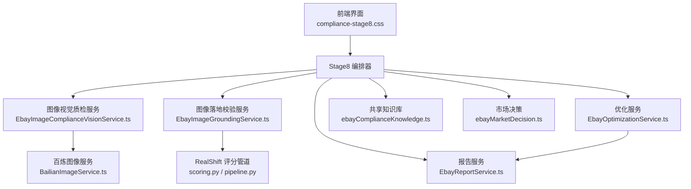
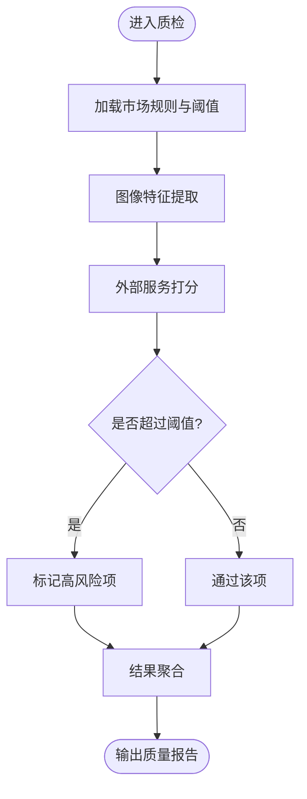
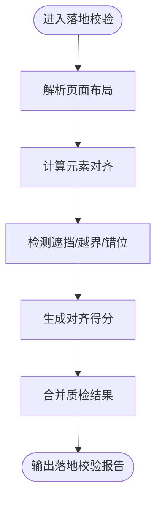
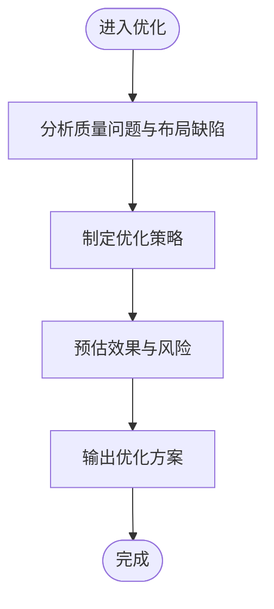
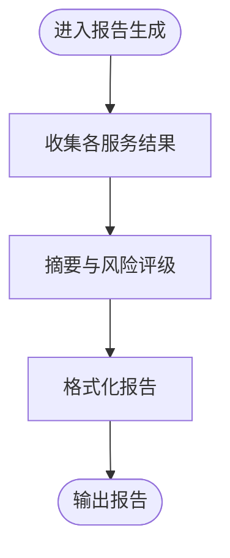
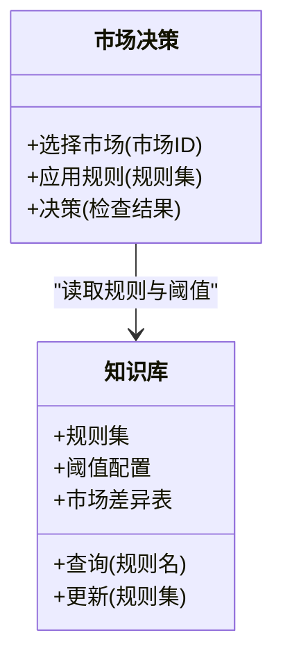
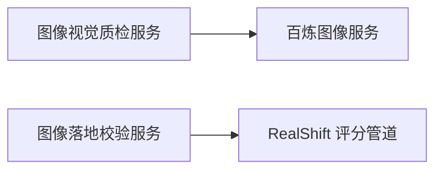
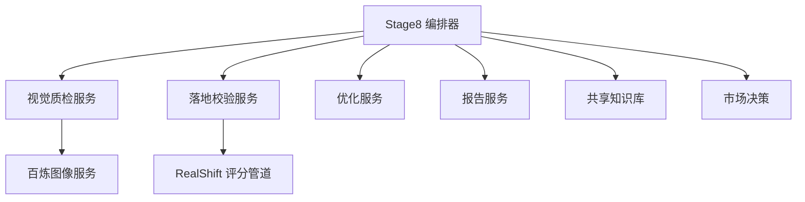

# 合规检查Stage8阶段

<cite>
**本文引用的文件**   
- [src/renderer/compliance-stage8.css](file://src/renderer/compliance-stage8.css)
- [src/shared/ebayComplianceKnowledge.ts](file://src/shared/ebayComplianceKnowledge.ts)
- [src/shared/ebayMarketDecision.ts](file://src/shared/ebayMarketDecision.ts)
- [src/main/services/EbayImageComplianceVisionService.ts](file://src/main/services/EbayImageComplianceVisionService.ts)
- [src/main/services/EbayImageGroundingService.ts](file://src/main/services/EbayImageGroundingService.ts)
- [src/main/services/EbayOptimizationService.ts](file://src/main/services/EbayOptimizationService.ts)
- [src/main/services/EbayReportService.ts](file://src/main/services/EbayReportService.ts)
- [src/main/services/BailianImageService.ts](file://src/main/services/BailianImageService.ts)
- [src/main/services/RealShiftService.ts](file://src/main/services/RealShiftService.ts)
- [tools/realshift/scoring.py](file://tools/realshift/scoring.py)
- [tools/realshift/pipeline.py](file://tools/realshift/pipeline.py)
</cite>

## 目录
1. [简介](#简介)
2. [项目结构](#项目结构)
3. [核心组件](#核心组件)
4. [架构总览](#架构总览)
5. [详细组件分析](#详细组件分析)
6. [依赖关系分析](#依赖关系分析)
7. [性能考量](#性能考量)
8. [故障排查指南](#故障排查指南)
9. [结论](#结论)
10. [附录](#附录)

## 简介
本技术文档聚焦于合规检查的Stage8阶段，阐述其高级合规性验证能力，包括多维度图像质量检测、市场特定规则检查与最终合规性决策。文档覆盖复杂业务规则的实现逻辑、条件判断与结果聚合算法，说明与其他检查阶段的协作关系、数据传递与状态同步机制，并给出性能监控、日志记录与调试工具的使用建议，以及规则扩展指南和最佳实践。

## 项目结构
Stage8涉及前端展示样式、共享知识库与市场决策、主进程服务（图像质检、落地校验、优化、报告）以及外部评分管道。整体组织以“服务层”为核心，通过共享知识约束市场规则，由前端提供可视化与交互入口。



图表来源
- [src/renderer/compliance-stage8.css](file://src/renderer/compliance-stage8.css)
- [src/shared/ebayComplianceKnowledge.ts](file://src/shared/ebayComplianceKnowledge.ts)
- [src/shared/ebayMarketDecision.ts](file://src/shared/ebayMarketDecision.ts)
- [src/main/services/EbayImageComplianceVisionService.ts](file://src/main/services/EbayImageComplianceVisionService.ts)
- [src/main/services/EbayImageGroundingService.ts](file://src/main/services/EbayImageGroundingService.ts)
- [src/main/services/EbayOptimizationService.ts](file://src/main/services/EbayOptimizationService.ts)
- [src/main/services/EbayReportService.ts](file://src/main/services/EbayReportService.ts)
- [src/main/services/BailianImageService.ts](file://src/main/services/BailianImageService.ts)
- [tools/realshift/scoring.py](file://tools/realshift/scoring.py)
- [tools/realshift/pipeline.py](file://tools/realshift/pipeline.py)

章节来源
- [src/renderer/compliance-stage8.css](file://src/renderer/compliance-stage8.css)
- [src/shared/ebayComplianceKnowledge.ts](file://src/shared/ebayComplianceKnowledge.ts)
- [src/shared/ebayMarketDecision.ts](file://src/shared/ebayMarketDecision.ts)
- [src/main/services/EbayImageComplianceVisionService.ts](file://src/main/services/EbayImageComplianceVisionService.ts)
- [src/main/services/EbayImageGroundingService.ts](file://src/main/services/EbayImageGroundingService.ts)
- [src/main/services/EbayOptimizationService.ts](file://src/main/services/EbayOptimizationService.ts)
- [src/main/services/EbayReportService.ts](file://src/main/services/EbayReportService.ts)
- [src/main/services/BailianImageService.ts](file://src/main/services/BailianImageService.ts)
- [tools/realshift/scoring.py](file://tools/realshift/scoring.py)
- [tools/realshift/pipeline.py](file://tools/realshift/pipeline.py)

## 核心组件
- 图像视觉质检服务：负责多维度图像质量评估（清晰度、构图、背景、水印等），调用外部图像服务进行打分与标注。
- 图像落地校验服务：将商品图与页面元素进行空间对齐与语义一致性校验，确保关键信息在目标区域可见且不被遮挡。
- 优化服务：基于质检与落地校验结果生成可执行的优化建议与自动修复策略。
- 报告服务：汇总各维度检查结果，输出结构化报告，供前端展示与归档。
- 共享知识库与市场决策：提供平台规则、市场差异与阈值配置，驱动最终合规性决策。
- 外部评分管道：通过Python脚本对图像进行深度评分，作为质量判定的重要依据。

章节来源
- [src/main/services/EbayImageComplianceVisionService.ts](file://src/main/services/EbayImageComplianceVisionService.ts)
- [src/main/services/EbayImageGroundingService.ts](file://src/main/services/EbayImageGroundingService.ts)
- [src/main/services/EbayOptimizationService.ts](file://src/main/services/EbayOptimizationService.ts)
- [src/main/services/EbayReportService.ts](file://src/main/services/EbayReportService.ts)
- [src/shared/ebayComplianceKnowledge.ts](file://src/shared/ebayComplianceKnowledge.ts)
- [src/shared/ebayMarketDecision.ts](file://src/shared/ebayMarketDecision.ts)
- [tools/realshift/scoring.py](file://tools/realshift/scoring.py)
- [tools/realshift/pipeline.py](file://tools/realshift/pipeline.py)

## 架构总览
Stage8采用“多服务并行+规则聚合”的架构模式。前端触发后，编排器协调多个服务并行执行，收集结果后按市场规则进行加权聚合，形成最终合规性决策。

```mermaid
sequenceDiagram
participant UI as "前端界面"
participant S8 as "Stage8 编排器"
participant Vision as "图像视觉质检服务"
participant Grounding as "图像落地校验服务"
participant Opt as "优化服务"
participant Rep as "报告服务"
participant KB as "共享知识库"
participant MK as "市场决策"
participant BL as "百炼图像服务"
participant RS as "RealShift 评分管道"
UI->>S8 : "提交待检商品图与上下文"
S8->>KB : "加载市场规则与阈值"
S8->>MK : "解析市场差异化策略"
S8->>Vision : "启动图像质量多维检测"
S8->>Grounding : "启动落地校验"
Vision-->>S8 : "质量分数与问题清单"
Grounding-->>S8 : "对齐与遮挡检测结果"
S8->>Opt : "生成优化建议与修复策略"
Opt-->>S8 : "优化方案与预期收益"
S8->>Rep : "汇总报告"
Rep-->>UI : "结构化报告与决策"
Note over Vision,BL : "外部图像服务调用"
Note over Grounding,RS : "外部评分管道调用"
```

图表来源
- [src/main/services/EbayImageComplianceVisionService.ts](file://src/main/services/EbayImageComplianceVisionService.ts)
- [src/main/services/EbayImageGroundingService.ts](file://src/main/services/EbayImageGroundingService.ts)
- [src/main/services/EbayOptimizationService.ts](file://src/main/services/EbayOptimizationService.ts)
- [src/main/services/EbayReportService.ts](file://src/main/services/EbayReportService.ts)
- [src/shared/ebayComplianceKnowledge.ts](file://src/shared/ebayComplianceKnowledge.ts)
- [src/shared/ebayMarketDecision.ts](file://src/shared/ebayMarketDecision.ts)
- [src/main/services/BailianImageService.ts](file://src/main/services/BailianImageService.ts)
- [tools/realshift/scoring.py](file://tools/realshift/scoring.py)
- [tools/realshift/pipeline.py](file://tools/realshift/pipeline.py)

## 详细组件分析

### 图像视觉质检服务
职责与流程：
- 接收商品图与元数据，提取关键维度（清晰度、对比度、背景复杂度、水印/Logo、比例裁剪）。
- 调用外部图像服务进行打分与标注，返回结构化质量指标。
- 结合市场规则进行阈值判定，标记高风险项。



图表来源
- [src/main/services/EbayImageComplianceVisionService.ts](file://src/main/services/EbayImageComplianceVisionService.ts)
- [src/main/services/BailianImageService.ts](file://src/main/services/BailianImageService.ts)
- [src/shared/ebayComplianceKnowledge.ts](file://src/shared/ebayComplianceKnowledge.ts)

章节来源
- [src/main/services/EbayImageComplianceVisionService.ts](file://src/main/services/EbayImageComplianceVisionService.ts)
- [src/main/services/BailianImageService.ts](file://src/main/services/BailianImageService.ts)
- [src/shared/ebayComplianceKnowledge.ts](file://src/shared/ebayComplianceKnowledge.ts)

### 图像落地校验服务
职责与流程：
- 根据页面布局与商品图位置，计算关键元素的空间关系。
- 检测遮挡、越界、错位等问题，输出对齐得分与问题定位。
- 与质检结果联动，识别因布局导致的显示风险。



图表来源
- [src/main/services/EbayImageGroundingService.ts](file://src/main/services/EbayImageGroundingService.ts)
- [tools/realshift/scoring.py](file://tools/realshift/scoring.py)
- [tools/realshift/pipeline.py](file://tools/realshift/pipeline.py)

章节来源
- [src/main/services/EbayImageGroundingService.ts](file://src/main/services/EbayImageGroundingService.ts)
- [tools/realshift/scoring.py](file://tools/realshift/scoring.py)
- [tools/realshift/pipeline.py](file://tools/realshift/pipeline.py)

### 优化服务
职责与流程：
- 综合质检与落地校验结果，生成优化建议（如裁剪、重排、替换素材）。
- 预估优化后的质量提升幅度，辅助决策优先级。
- 输出可执行的修复策略与回滚方案。



图表来源
- [src/main/services/EbayOptimizationService.ts](file://src/main/services/EbayOptimizationService.ts)

章节来源
- [src/main/services/EbayOptimizationService.ts](file://src/main/services/EbayOptimizationService.ts)

### 报告服务
职责与流程：
- 汇总各维度检查结果，生成结构化报告。
- 包含问题清单、风险等级、优化建议与最终合规性结论。
- 支持导出与归档，便于后续审计与复盘。



图表来源
- [src/main/services/EbayReportService.ts](file://src/main/services/EbayReportService.ts)

章节来源
- [src/main/services/EbayReportService.ts](file://src/main/services/EbayReportService.ts)

### 共享知识库与市场决策
职责与流程：
- 知识库维护平台规则、字段约束、图片规范与市场差异。
- 市场决策模块根据目标市场选择适用规则与阈值，驱动最终决策。
- 为各服务提供统一的规则查询与版本管理。



图表来源
- [src/shared/ebayComplianceKnowledge.ts](file://src/shared/ebayComplianceKnowledge.ts)
- [src/shared/ebayMarketDecision.ts](file://src/shared/ebayMarketDecision.ts)

章节来源
- [src/shared/ebayComplianceKnowledge.ts](file://src/shared/ebayComplianceKnowledge.ts)
- [src/shared/ebayMarketDecision.ts](file://src/shared/ebayMarketDecision.ts)

### 外部服务集成
- 百炼图像服务：提供图像质量打分与标注能力，支撑视觉质检。
- RealShift评分管道：通过Python脚本进行深度评分，增强质量判定的准确性。



图表来源
- [src/main/services/BailianImageService.ts](file://src/main/services/BailianImageService.ts)
- [tools/realshift/scoring.py](file://tools/realshift/scoring.py)
- [tools/realshift/pipeline.py](file://tools/realshift/pipeline.py)

章节来源
- [src/main/services/BailianImageService.ts](file://src/main/services/BailianImageService.ts)
- [tools/realshift/scoring.py](file://tools/realshift/scoring.py)
- [tools/realshift/pipeline.py](file://tools/realshift/pipeline.py)

## 依赖关系分析
Stage8内部服务之间松耦合，通过统一的数据契约与事件总线进行通信；对外部服务采用适配器模式封装，降低耦合度。



图表来源
- [src/main/services/EbayImageComplianceVisionService.ts](file://src/main/services/EbayImageComplianceVisionService.ts)
- [src/main/services/EbayImageGroundingService.ts](file://src/main/services/EbayImageGroundingService.ts)
- [src/main/services/EbayOptimizationService.ts](file://src/main/services/EbayOptimizationService.ts)
- [src/main/services/EbayReportService.ts](file://src/main/services/EbayReportService.ts)
- [src/main/services/BailianImageService.ts](file://src/main/services/BailianImageService.ts)
- [tools/realshift/scoring.py](file://tools/realshift/scoring.py)
- [tools/realshift/pipeline.py](file://tools/realshift/pipeline.py)
- [src/shared/ebayComplianceKnowledge.ts](file://src/shared/ebayComplianceKnowledge.ts)
- [src/shared/ebayMarketDecision.ts](file://src/shared/ebayMarketDecision.ts)

章节来源
- [src/main/services/EbayImageComplianceVisionService.ts](file://src/main/services/EbayImageComplianceVisionService.ts)
- [src/main/services/EbayImageGroundingService.ts](file://src/main/services/EbayImageGroundingService.ts)
- [src/main/services/EbayOptimizationService.ts](file://src/main/services/EbayOptimizationService.ts)
- [src/main/services/EbayReportService.ts](file://src/main/services/EbayReportService.ts)
- [src/main/services/BailianImageService.ts](file://src/main/services/BailianImageService.ts)
- [tools/realshift/scoring.py](file://tools/realshift/scoring.py)
- [tools/realshift/pipeline.py](file://tools/realshift/pipeline.py)
- [src/shared/ebayComplianceKnowledge.ts](file://src/shared/ebayComplianceKnowledge.ts)
- [src/shared/ebayMarketDecision.ts](file://src/shared/ebayMarketDecision.ts)

## 性能考量
- 并行执行：视觉质检与落地校验应并发执行，减少端到端延迟。
- 缓存策略：对重复商品图或相似样本启用结果缓存，避免重复调用外部服务。
- 超时与重试：为外部服务调用设置合理超时与指数退避重试。
- 资源限制：控制并发上限与内存占用，防止OOM。
- 批处理：批量提交商品图，提高吞吐率。
- 监控与告警：采集关键指标（QPS、延迟、错误率、外部服务可用性），异常时告警。

[本节为通用指导，不直接分析具体文件]

## 故障排查指南
- 外部服务不可用：检查网络连通性与鉴权配置，查看服务健康状态与限流情况。
- 评分异常：核对输入图像格式与尺寸，确认阈值配置与市场规则版本。
- 落地校验失败：检查页面布局解析与坐标映射逻辑，确认元素层级与可见性。
- 报告不一致：核对各服务输出契约与聚合算法，确保字段映射正确。
- 日志与调试：开启详细日志，捕获请求/响应与中间状态，定位问题根因。

章节来源
- [src/main/services/EbayImageComplianceVisionService.ts](file://src/main/services/EbayImageComplianceVisionService.ts)
- [src/main/services/EbayImageGroundingService.ts](file://src/main/services/EbayImageGroundingService.ts)
- [src/main/services/EbayReportService.ts](file://src/main/services/EbayReportService.ts)
- [src/shared/ebayComplianceKnowledge.ts](file://src/shared/ebayComplianceKnowledge.ts)
- [src/shared/ebayMarketDecision.ts](file://src/shared/ebayMarketDecision.ts)

## 结论
Stage8通过多维度图像质量检测、市场特定规则检查与结果聚合算法，形成稳健的最终合规性决策。其模块化设计与外部服务适配提升了可扩展性与稳定性。配合完善的监控、日志与调试手段，可有效保障生产环境的可靠性与可维护性。

[本节为总结性内容，不直接分析具体文件]

## 附录
- 规则扩展指南：
  - 在共享知识库中新增规则条目与阈值，明确适用范围与市场差异。
  - 在服务中增加规则匹配与权重配置，确保与现有聚合逻辑兼容。
  - 通过A/B测试验证新规则效果，逐步灰度上线。
- 最佳实践：
  - 保持输入数据标准化，减少边界情况带来的不确定性。
  - 对外部服务调用进行幂等设计，避免重复处理。
  - 定期回顾规则与阈值，结合业务反馈持续优化。
  - 强化错误恢复与降级策略，保证核心链路可用。

[本节为通用指导，不直接分析具体文件]