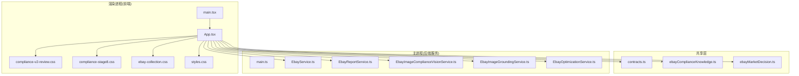
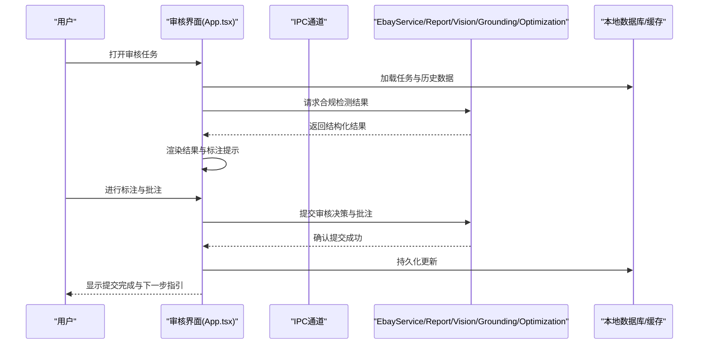
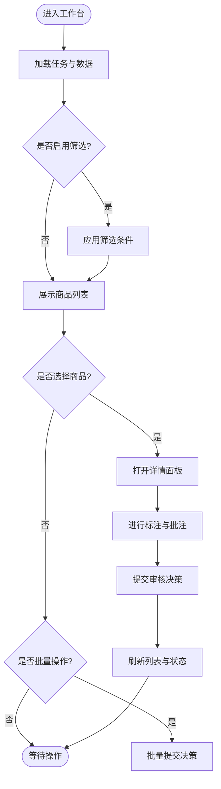
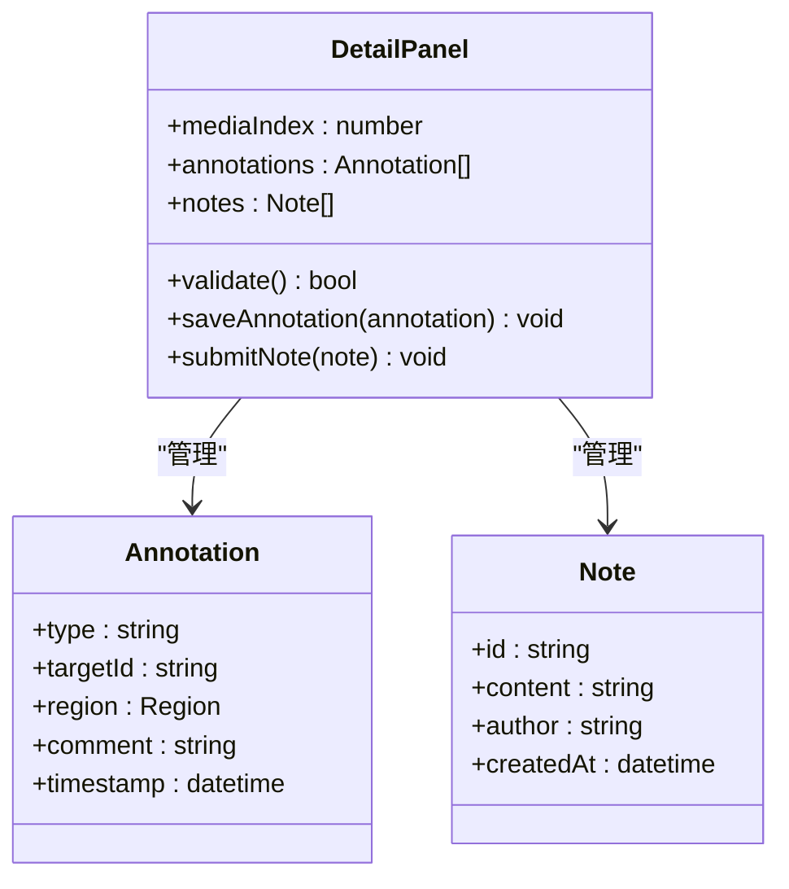
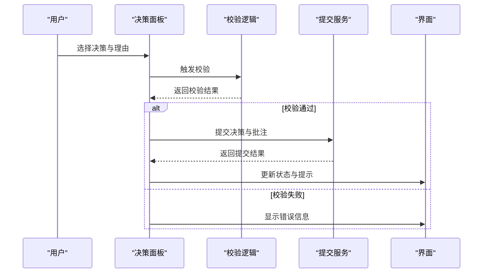
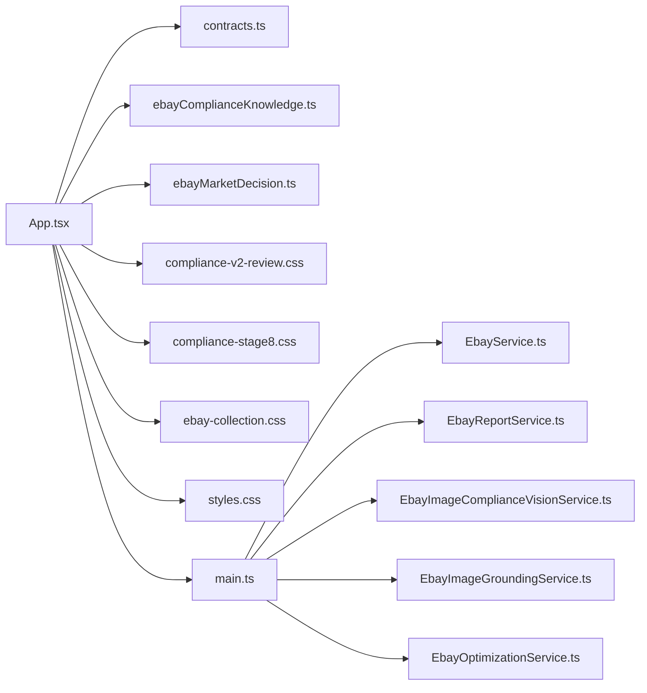

# 合规检查V2审核界面

<cite>
**本文引用的文件**   
- [renderer/App.tsx](file://src/renderer/App.tsx)
- [renderer/main.tsx](file://src/renderer/main.tsx)
- [renderer/compliance-v2-review.css](file://src/renderer/compliance-v2-review.css)
- [renderer/compliance-stage8.css](file://src/renderer/compliance-stage8.css)
- [renderer/ebay-collection.css](file://src/renderer/ebay-collection.css)
- [renderer/styles.css](file://src/renderer/styles.css)
- [src/shared/contracts.ts](file://src/shared/contracts.ts)
- [src/shared/ebayComplianceKnowledge.ts](file://src/shared/ebayComplianceKnowledge.ts)
- [src/shared/ebayMarketDecision.ts](file://src/shared/ebayMarketDecision.ts)
- [src/main/services/EbayService.ts](file://src/main/services/EbayService.ts)
- [src/main/services/EbayReportService.ts](file://src/main/services/EbayReportService.ts)
- [src/main/services/EbayImageComplianceVisionService.ts](file://src/main/services/EbayImageComplianceVisionService.ts)
- [src/main/services/EbayImageGroundingService.ts](file://src/main/services/EbayImageGroundingService.ts)
- [src/main/services/EbayOptimizationService.ts](file://src/main/services/EbayOptimizationService.ts)
- [src/main/main.ts](file://src/main/main.ts)
</cite>

## 目录
1. [简介](#简介)
2. [项目结构](#项目结构)
3. [核心组件](#核心组件)
4. [架构总览](#架构总览)
5. [详细组件分析](#详细组件分析)
6. [依赖关系分析](#依赖关系分析)
7. [性能考量](#性能考量)
8. [故障排查指南](#故障排查指南)
9. [结论](#结论)
10. [附录](#附录)

## 简介
本文件为“合规检查V2审核界面”的完整用户界面文档，面向产品、设计与研发人员。内容涵盖V2版本的审核工作流、交互设计、用户体验优化、组件结构与状态管理、结果可视化与标注批注能力、与后端服务的通信协议、数据同步与实时协作支持、界面定制与主题、无障碍访问，以及UI组件使用指南与样式覆盖方法。目标是帮助读者快速理解并高效使用该审核界面，并在需要时进行扩展与定制。

## 项目结构
本项目采用Electron架构，前端渲染进程位于src/renderer，主进程服务位于src/main，共享类型与领域知识位于src/shared。V2审核界面主要基于React（tsx）构建，样式通过CSS模块化组织，关键样式文件包括compliance-v2-review.css等。

图表来源
- [renderer/main.tsx](file://src/renderer/main.tsx)
- [renderer/App.tsx](file://src/renderer/App.tsx)
- [renderer/compliance-v2-review.css](file://src/renderer/compliance-v2-review.css)
- [renderer/compliance-stage8.css](file://src/renderer/compliance-stage8.css)
- [renderer/ebay-collection.css](file://src/renderer/ebay-collection.css)
- [renderer/styles.css](file://src/renderer/styles.css)
- [src/shared/contracts.ts](file://src/shared/contracts.ts)
- [src/shared/ebayComplianceKnowledge.ts](file://src/shared/ebayComplianceKnowledge.ts)
- [src/shared/ebayMarketDecision.ts](file://src/shared/ebayMarketDecision.ts)
- [src/main/main.ts](file://src/main/main.ts)
- [src/main/services/EbayService.ts](file://src/main/services/EbayService.ts)
- [src/main/services/EbayReportService.ts](file://src/main/services/EbayReportService.ts)
- [src/main/services/EbayImageComplianceVisionService.ts](file://src/main/services/EbayImageComplianceVisionService.ts)
- [src/main/services/EbayImageGroundingService.ts](file://src/main/services/EbayImageGroundingService.ts)
- [src/main/services/EbayOptimizationService.ts](file://src/main/services/EbayOptimizationService.ts)

章节来源
- [renderer/main.tsx](file://src/renderer/main.tsx)
- [renderer/App.tsx](file://src/renderer/App.tsx)
- [renderer/compliance-v2-review.css](file://src/renderer/compliance-v2-review.css)
- [src/shared/contracts.ts](file://src/shared/contracts.ts)

## 核心组件
- 审核工作台：承载商品列表、筛选、分页、批量操作与进度反馈。
- 详情面板：展示商品标题、图片、视频、描述、合规检测结果与风险点。
- 标注工具：图像区域标注、文本高亮、规则命中定位、批注记录。
- 决策面板：通过/拒绝/需人工复核、理由选择、备注输入、提交与撤销。
- 报告与导出：生成审核报告、导出CSV/PDF、版本对比与审计追踪。
- 设置与主题：主题切换、布局选项、字体大小、键盘快捷键、无障碍开关。

这些组件在渲染进程中由React驱动，状态集中在应用级或页面级状态管理器中，并通过IPC与主进程服务通信，调用合规检测、报告生成与优化建议等服务。

章节来源
- [renderer/App.tsx](file://src/renderer/App.tsx)
- [renderer/compliance-v2-review.css](file://src/renderer/compliance-v2-review.css)
- [src/shared/contracts.ts](file://src/shared/contracts.ts)

## 架构总览
V2审核界面采用分层架构：
- 表现层（Renderer）：React组件与样式，负责用户交互与界面呈现。
- 共享层（Shared）：契约定义、领域知识与市场决策规则，确保前后端一致。
- 服务层（Main）：封装对外部系统（如视觉检测、图像定位、报告生成、优化建议）的调用，提供稳定的API接口。

图表来源
- [renderer/App.tsx](file://src/renderer/App.tsx)
- [src/main/services/EbayService.ts](file://src/main/services/EbayService.ts)
- [src/main/services/EbayReportService.ts](file://src/main/services/EbayReportService.ts)
- [src/main/services/EbayImageComplianceVisionService.ts](file://src/main/services/EbayImageComplianceVisionService.ts)
- [src/main/services/EbayImageGroundingService.ts](file://src/main/services/EbayImageGroundingService.ts)
- [src/main/services/EbayOptimizationService.ts](file://src/main/services/EbayOptimizationService.ts)

## 详细组件分析

### 审核工作台组件
- 功能要点：商品列表展示、多条件筛选、分页与排序、批量选择、批量提交、进度条与错误重试。
- 状态管理：当前页码、筛选条件、选中项集合、批量操作状态、错误信息。
- 交互流程：选择商品→查看详情→执行标注→提交决策→刷新列表。
- 可访问性：键盘导航、焦点管理、屏幕阅读器标签、对比度与缩放支持。

章节来源
- [renderer/App.tsx](file://src/renderer/App.tsx)
- [renderer/compliance-v2-review.css](file://src/renderer/compliance-v2-review.css)

### 详情面板与标注工具
- 功能要点：图文视频预览、合规规则命中高亮、图像区域标注、文本批注、版本对比。
- 状态管理：当前媒体索引、标注集合、批注草稿、校验状态。
- 交互流程：选择媒体→定位规则命中→添加标注→保存批注→关联决策。
- 性能优化：懒加载媒体、增量更新标注、防抖输入、虚拟滚动长列表。

图表来源
- [renderer/App.tsx](file://src/renderer/App.tsx)
- [renderer/compliance-v2-review.css](file://src/renderer/compliance-v2-review.css)

章节来源
- [renderer/App.tsx](file://src/renderer/App.tsx)
- [renderer/compliance-v2-review.css](file://src/renderer/compliance-v2-review.css)

### 决策面板与提交流程
- 功能要点：决策选项（通过/拒绝/需复核）、理由分类、备注输入、强制字段校验、提交与撤销。
- 状态管理：决策值、理由、备注、校验错误、提交状态。
- 交互流程：填写决策→校验→提交→反馈→刷新。
- 可访问性：表单语义化、错误提示、键盘快捷提交。

图表来源
- [renderer/App.tsx](file://src/renderer/App.tsx)
- [src/shared/contracts.ts](file://src/shared/contracts.ts)

章节来源
- [renderer/App.tsx](file://src/renderer/App.tsx)
- [src/shared/contracts.ts](file://src/shared/contracts.ts)

### 报告与导出
- 功能要点：生成审核报告、导出CSV/PDF、版本对比、审计追踪。
- 状态管理：报告模板、导出格式、进度与错误。
- 交互流程：选择范围→生成报告→下载/分享→归档。

章节来源
- [src/main/services/EbayReportService.ts](file://src/main/services/EbayReportService.ts)
- [renderer/compliance-v2-review.css](file://src/renderer/compliance-v2-review.css)

### 设置与主题
- 功能要点：主题切换（明/暗/高对比）、布局选项、字体大小、快捷键配置、无障碍开关。
- 状态管理：主题变量、布局参数、用户偏好。
- 交互流程：打开设置→修改选项→保存→即时生效。

章节来源
- [renderer/compliance-v2-review.css](file://src/renderer/compliance-v2-review.css)
- [renderer/styles.css](file://src/renderer/styles.css)

## 依赖关系分析
- 组件耦合：审核工作台与详情面板通过共享状态与事件通信；标注工具与决策面板共享批注与决策数据。
- 外部依赖：主进程服务提供合规检测、报告生成、优化建议等能力；共享契约确保数据结构一致性。
- 潜在循环依赖：避免组件直接依赖主进程服务，应通过IPC统一入口；共享层仅暴露类型与常量，不引入运行时副作用。

图表来源
- [renderer/App.tsx](file://src/renderer/App.tsx)
- [src/shared/contracts.ts](file://src/shared/contracts.ts)
- [src/shared/ebayComplianceKnowledge.ts](file://src/shared/ebayComplianceKnowledge.ts)
- [src/shared/ebayMarketDecision.ts](file://src/shared/ebayMarketDecision.ts)
- [src/main/main.ts](file://src/main/main.ts)
- [src/main/services/EbayService.ts](file://src/main/services/EbayService.ts)
- [src/main/services/EbayReportService.ts](file://src/main/services/EbayReportService.ts)
- [src/main/services/EbayImageComplianceVisionService.ts](file://src/main/services/EbayImageComplianceVisionService.ts)
- [src/main/services/EbayImageGroundingService.ts](file://src/main/services/EbayImageGroundingService.ts)
- [src/main/services/EbayOptimizationService.ts](file://src/main/services/EbayOptimizationService.ts)

章节来源
- [renderer/App.tsx](file://src/renderer/App.tsx)
- [src/main/main.ts](file://src/main/main.ts)

## 性能考量
- 渲染性能：使用虚拟列表与懒加载减少DOM压力；对大图与视频进行缩略图与按需加载。
- 状态更新：局部状态与全局状态分离，避免不必要的重渲染；使用不可变数据与增量更新。
- 网络与服务：请求合并与去重；失败重试与超时控制；离线缓存与断点续传。
- 标注与批注：增量保存与防抖输入；大对象分片存储与压缩。

[本节为通用指导，不直接分析具体文件]

## 故障排查指南
- 常见问题：
  - 数据加载失败：检查IPC通道与主进程服务状态；查看错误日志与重试策略。
  - 标注丢失：确认本地缓存与持久化逻辑；检查并发写入冲突。
  - 主题失效：验证CSS变量注入与动态类名切换；清理浏览器缓存。
  - 无障碍问题：核对ARIA属性与键盘导航；使用辅助技术测试。
- 调试建议：
  - 启用开发模式日志与性能分析；使用浏览器开发者工具监控网络与内存。
  - 隔离问题组件，逐步缩小范围；复现最小用例以便定位。

章节来源
- [renderer/compliance-v2-review.css](file://src/renderer/compliance-v2-review.css)
- [src/main/main.ts](file://src/main/main.ts)

## 结论
V2审核界面以清晰的组件分层、稳健的状态管理与完善的标注批注能力，提供了高效的合规审核体验。通过与主进程服务的稳定通信与共享契约的一致性保障，系统在可扩展性与可维护性上具备良好基础。建议在后续迭代中持续优化性能与可访问性，完善主题与定制能力，提升团队协作效率。

[本节为总结，不直接分析具体文件]

## 附录
- 术语表：
  - 合规检测：依据规则对商品内容进行自动化审查。
  - 标注：对图像或文本进行区域标记与说明。
  - 批注：附加评论与建议，用于协作与审计。
- 最佳实践：
  - 保持状态单一来源，避免重复数据。
  - 使用语义化HTML与ARIA提升可访问性。
  - 对敏感数据进行脱敏与加密传输。
  - 编写单元测试与端到端测试，确保稳定性。

[本节为补充信息，不直接分析具体文件]