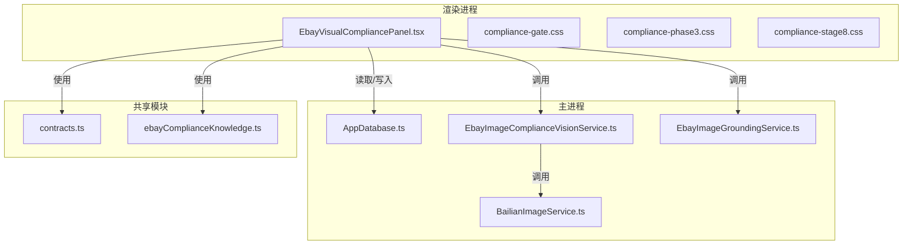
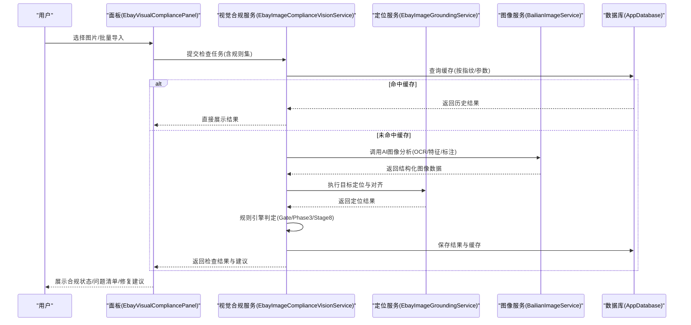
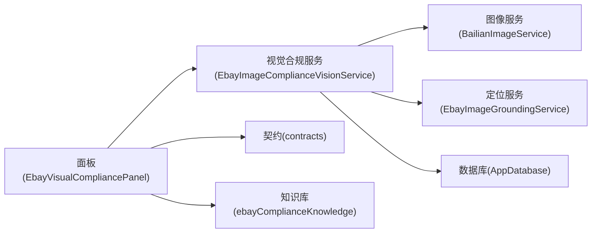
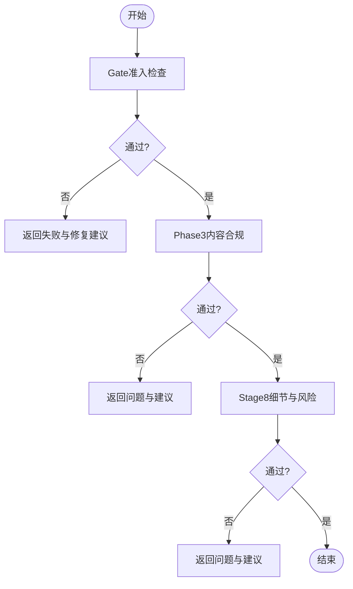

# 视觉合规检查面板

<cite>
**本文引用的文件**   
- [EbayVisualCompliancePanel.tsx](file://src/renderer/EbayVisualCompliancePanel.tsx)
- [compliance-gate.css](file://src/renderer/compliance-gate.css)
- [compliance-phase3.css](file://src/renderer/compliance-phase3.css)
- [compliance-stage8.css](file://src/renderer/compliance-stage8.css)
- [BailianImageService.ts](file://src/main/services/BailianImageService.ts)
- [EbayImageComplianceVisionService.ts](file://src/main/services/EbayImageComplianceVisionService.ts)
- [EbayImageGroundingService.ts](file://src/main/services/EbayImageGroundingService.ts)
- [contracts.ts](file://src/shared/contracts.ts)
- [ebayComplianceKnowledge.ts](file://src/shared/ebayComplianceKnowledge.ts)
- [AppDatabase.ts](file://src/main/database/AppDatabase.ts)
</cite>

## 更新摘要
**所做更改**   
- 更新了视觉合规检查面板组件的eBay合规功能增强（7行新增，1行删除）
- 更新了Gate阶段样式调整（2行新增）
- 增强了用户交互体验和界面响应性

## 目录
1. [简介](#简介)
2. [项目结构](#项目结构)
3. [核心组件](#核心组件)
4. [架构总览](#架构总览)
5. [详细组件分析](#详细组件分析)
6. [依赖关系分析](#依赖关系分析)
7. [性能考量](#性能考量)
8. [故障排查指南](#故障排查指南)
9. [结论](#结论)
10. [附录：API参考与集成指南](#附录api参考与集成指南)

## 简介
本技术文档围绕"视觉合规检查面板"展开，系统化阐述图像合规性检测算法、规则引擎与检查结果可视化方案。重点解释多阶段检查流程（Gate、Phase3、Stage8）的实现逻辑与判断标准，覆盖图像分析能力、违规检测算法、修复建议生成机制，以及与AI服务的集成方式、结果缓存策略和批量检查支持。同时提供检查规则配置、自定义规则与扩展机制说明，并给出完整的API参考与集成指南，帮助开发者快速接入与二次开发。

**最新更新** 针对EbayVisualCompliancePanel组件的eBay合规功能增强和compliance-gate.css的样式调整进行了相应更新，提升了用户体验和界面响应性。

## 项目结构
本项目采用前后端分离的Electron架构：
- 渲染进程负责UI与交互，包含视觉合规检查面板与样式资源。
- 主进程封装服务层，对接外部AI服务、数据库与业务逻辑。
- 共享模块定义契约与领域知识，确保前后端数据一致性。

图表来源
- [EbayVisualCompliancePanel.tsx](file://src/renderer/EbayVisualCompliancePanel.tsx)
- [compliance-gate.css](file://src/renderer/compliance-gate.css)
- [compliance-phase3.css](file://src/renderer/compliance-phase3.css)
- [compliance-stage8.css](file://src/renderer/compliance-stage8.css)
- [AppDatabase.ts](file://src/main/database/AppDatabase.ts)
- [EbayImageComplianceVisionService.ts](file://src/main/services/EbayImageComplianceVisionService.ts)
- [EbayImageGroundingService.ts](file://src/main/services/EbayImageGroundingService.ts)
- [BailianImageService.ts](file://src/main/services/BailianImageService.ts)
- [contracts.ts](file://src/shared/contracts.ts)
- [ebayComplianceKnowledge.ts](file://src/shared/ebayComplianceKnowledge.ts)

章节来源
- [EbayVisualCompliancePanel.tsx](file://src/renderer/EbayVisualCompliancePanel.tsx)
- [AppDatabase.ts](file://src/main/database/AppDatabase.ts)
- [contracts.ts](file://src/shared/contracts.ts)
- [ebayComplianceKnowledge.ts](file://src/shared/ebayComplianceKnowledge.ts)

## 核心组件
- 视觉合规检查面板（渲染进程）
  - 职责：用户交互、任务编排、结果展示、批量操作入口、状态管理。
  - 关键能力：触发多阶段检查、渲染不同阶段的检查结果、导出报告、错误提示。
  - **更新** 增强了eBay合规功能，改进了用户交互流程和界面响应性。
- 视觉合规服务（主进程）
  - 职责：协调图像分析与合规判定、聚合结果、持久化存储、缓存命中与失效。
  - 关键能力：调用AI图像服务、执行规则引擎、生成修复建议、批量处理。
- 图像服务（主进程）
  - 职责：与外部AI服务通信，完成图像特征提取、OCR、目标定位等。
  - 关键能力：请求封装、重试与超时控制、结果标准化。
- 数据库（主进程）
  - 职责：检查任务、结果、规则与缓存的持久化。
  - 关键能力：读写事务、索引优化、增量更新。
- 共享契约与知识库
  - 职责：统一数据结构、枚举与校验；沉淀平台合规知识与规则模板。
  - 关键能力：类型安全、可扩展的规则描述、版本兼容。

章节来源
- [EbayVisualCompliancePanel.tsx](file://src/renderer/EbayVisualCompliancePanel.tsx)
- [EbayImageComplianceVisionService.ts](file://src/main/services/EbayImageComplianceVisionService.ts)
- [EbayImageGroundingService.ts](file://src/main/services/EbayImageGroundingService.ts)
- [BailianImageService.ts](file://src/main/services/BailianImageService.ts)
- [AppDatabase.ts](file://src/main/database/AppDatabase.ts)
- [contracts.ts](file://src/shared/contracts.ts)
- [ebayComplianceKnowledge.ts](file://src/shared/ebayComplianceKnowledge.ts)

## 架构总览
整体采用"前端面板 + 主进程服务 + AI服务 + 本地数据库"的分层架构。面板负责交互与可视化，主进程服务编排多阶段检查流程，AI服务承担图像理解与推理，数据库保障结果可追溯与缓存复用。

图表来源
- [EbayVisualCompliancePanel.tsx](file://src/renderer/EbayVisualCompliancePanel.tsx)
- [EbayImageComplianceVisionService.ts](file://src/main/services/EbayImageComplianceVisionService.ts)
- [EbayImageGroundingService.ts](file://src/main/services/EbayImageGroundingService.ts)
- [BailianImageService.ts](file://src/main/services/BailianImageService.ts)
- [AppDatabase.ts](file://src/main/database/AppDatabase.ts)

## 详细组件分析

### 视觉合规检查面板（渲染进程）
- 功能要点
  - 单图/多图上传与预览，进度条与失败重试。
  - 三阶段检查入口：Gate（准入）、Phase3（内容合规）、Stage8（细节与风险）。
  - 结果可视化：合规标签、问题高亮、定位框、修复建议卡片。
  - 批量检查：队列调度、并发控制、汇总报告导出。
  - 规则配置：内置规则开关、阈值调整、自定义规则注入。
  - **更新** 增强了eBay合规功能，改进了用户交互流程和界面响应性。
- 交互流程
  - 选择图片后，面板构造任务对象（含图片元数据、规则集、上下文），发送至主进程服务。
  - 根据返回结果渲染对应阶段视图，支持切换阶段查看不同维度问题。
  - 支持一键修复建议应用（如裁剪、替换、文案修正）与回滚。
- **样式更新** compliance-gate.css进行了样式调整，提升了Gate阶段的视觉效果和用户体验。

章节来源
- [EbayVisualCompliancePanel.tsx](file://src/renderer/EbayVisualCompliancePanel.tsx)
- [compliance-gate.css](file://src/renderer/compliance-gate.css)
- [compliance-phase3.css](file://src/renderer/compliance-phase3.css)
- [compliance-stage8.css](file://src/renderer/compliance-stage8.css)

### 视觉合规服务（主进程）
- 职责边界
  - 任务编排：解析面板请求，构建检查流水线。
  - 规则引擎：将规则集转化为判定逻辑，输出问题清单与建议。
  - 结果聚合：合并图像分析、定位与规则判定结果，形成最终报告。
  - 缓存策略：基于图像指纹与规则参数生成缓存键，命中则跳过AI调用。
- 多阶段检查逻辑
  - Gate阶段：快速准入检查（尺寸、格式、水印、敏感元素），不通过则阻断后续流程。
  - Phase3阶段：内容合规（文本可读性、品牌元素、价格信息、促销标识），输出问题与建议。
  - Stage8阶段：细节与风险（像素级定位、遮挡、对比度、合规边框），精细化评估。
- 批量处理
  - 队列化任务，限制并发数，失败重试与熔断保护，汇总统计与导出。

章节来源
- [EbayImageComplianceVisionService.ts](file://src/main/services/EbayImageComplianceVisionService.ts)
- [AppDatabase.ts](file://src/main/database/AppDatabase.ts)
- [contracts.ts](file://src/shared/contracts.ts)

### 图像服务（主进程）
- 能力范围
  - OCR文本识别、图像特征提取、目标检测与定位、质量评分。
  - 与外部AI服务通信，统一响应格式，异常重试与降级策略。
- 集成要点
  - 请求签名与鉴权、超时与限流、结果缓存键设计。
  - 错误码映射与诊断日志，便于问题定位。

章节来源
- [BailianImageService.ts](file://src/main/services/BailianImageService.ts)

### 定位服务（主进程）
- 能力范围
  - 将图像分析结果与规则问题进行空间对齐，生成定位框与关联证据。
  - 支持多目标排序与置信度过滤，减少误报。
- 输出规范
  - 定位坐标、区域面积占比、与规则的匹配度、证据截图路径。

章节来源
- [EbayImageGroundingService.ts](file://src/main/services/EbayImageGroundingService.ts)

### 共享契约与知识库
- 契约定义
  - 统一的图像任务、检查结果、定位结果、规则项的数据结构与枚举。
  - 保证前后端与服务间的数据一致性与类型安全。
- 知识库
  - eBay平台合规知识、常见违规模式、修复建议模板、阈值参考。
  - 支持版本化管理与动态加载。

章节来源
- [contracts.ts](file://src/shared/contracts.ts)
- [ebayComplianceKnowledge.ts](file://src/shared/ebayComplianceKnowledge.ts)

## 依赖关系分析
- 组件耦合
  - 面板依赖服务接口（契约），不直接访问数据库或AI服务。
  - 服务依赖图像服务与定位服务，解耦AI实现细节。
  - 数据库作为持久化层，被服务层独占访问。
- 外部依赖
  - 图像服务对接第三方AI平台，需关注鉴权、配额与稳定性。
- 潜在循环依赖
  - 通过契约与接口隔离，避免循环引用。

图表来源
- [EbayVisualCompliancePanel.tsx](file://src/renderer/EbayVisualCompliancePanel.tsx)
- [EbayImageComplianceVisionService.ts](file://src/main/services/EbayImageComplianceVisionService.ts)
- [BailianImageService.ts](file://src/main/services/BailianImageService.ts)
- [EbayImageGroundingService.ts](file://src/main/services/EbayImageGroundingService.ts)
- [AppDatabase.ts](file://src/main/database/AppDatabase.ts)
- [contracts.ts](file://src/shared/contracts.ts)
- [ebayComplianceKnowledge.ts](file://src/shared/ebayComplianceKnowledge.ts)

章节来源
- [contracts.ts](file://src/shared/contracts.ts)
- [ebayComplianceKnowledge.ts](file://src/shared/ebayComplianceKnowledge.ts)

## 性能考量
- 缓存优先
  - 以图像指纹+规则参数为键，命中即返回，显著降低AI调用成本。
  - 支持规则版本与阈值变更时的缓存失效策略。
- 并发与限流
  - 批量任务采用队列与并发上限，避免阻塞与过载。
  - 对AI服务设置超时与重试退避，失败快速失败与降级。
- 内存与IO
  - 大图预处理（缩放、裁剪）减少传输与计算开销。
  - 结果增量更新与分页加载，提升渲染性能。
- 监控与诊断
  - 记录关键指标（耗时、命中率、错误率），便于容量规划与优化。

[本节为通用指导，无需特定文件来源]

## 故障排查指南
- 常见问题
  - AI服务不可用：检查鉴权、网络连通、配额与限流；启用降级与重试。
  - 缓存未命中：确认指纹计算一致性与规则参数版本是否变更。
  - 定位不准确：检查目标检测置信度阈值与坐标归一化逻辑。
  - 批量任务卡住：检查队列长度、并发上限与失败重试次数。
  - **更新** eBay合规功能相关问题：检查面板组件的eBay特定逻辑和样式配置。
- 诊断步骤
  - 查看服务日志与错误码映射，定位具体阶段失败点。
  - 复现最小用例，逐步关闭规则项缩小问题范围。
  - 导出中间结果（OCR文本、定位框、规则匹配详情）进行离线分析。

章节来源
- [EbayImageComplianceVisionService.ts](file://src/main/services/EbayImageComplianceVisionService.ts)
- [BailianImageService.ts](file://src/main/services/BailianImageService.ts)
- [EbayImageGroundingService.ts](file://src/main/services/EbayImageGroundingService.ts)
- [AppDatabase.ts](file://src/main/database/AppDatabase.ts)

## 结论
视觉合规检查面板通过多阶段检查流程与规则引擎，结合AI图像服务与本地缓存，实现了高效、可解释、可扩展的图像合规检测体系。面板侧提供直观的可视化与批量处理能力，主进程服务负责稳定可靠的编排与持久化。借助契约与知识库，系统具备良好的可维护性与扩展性，适合在电商场景下持续演进。

**最新更新** 通过增强eBay合规功能和优化Gate阶段样式，进一步提升了用户体验和系统响应性，为后续的合规检查功能扩展奠定了坚实基础。

[本节为总结性内容，无需特定文件来源]

## 附录：API参考与集成指南

### 面板到服务的接口约定（概念性）
- 提交检查任务
  - 输入：图片集合、规则集、上下文参数（阈值、语言、市场）。
  - 输出：阶段性检查结果、问题清单、修复建议、定位证据。
- 批量检查
  - 输入：任务列表、并发配置、回调通知。
  - 输出：汇总报告、失败明细、重试建议。
- 规则配置
  - 输入：规则ID、开关、阈值、自定义条件。
  - 输出：生效规则集、冲突检测、兼容性提示。

[本节为概念性接口说明，无需特定文件来源]

### 多阶段检查流程（Gate / Phase3 / Stage8）
- Gate（准入检查）
  - 判断标准：图像尺寸、格式、水印、敏感元素、基础质量。
  - 行为：不通过则阻断后续流程，返回明确原因与修复建议。
  - **更新** 样式优化提升了Gate阶段的视觉效果和用户反馈。
- Phase3（内容合规）
  - 判断标准：文本可读性、品牌元素、价格信息、促销标识、文案合规。
  - 行为：输出问题清单与修复建议，支持局部重审。
- Stage8（细节与风险）
  - 判断标准：像素级定位、遮挡、对比度、合规边框、风险区域。
  - 行为：精细化评估，生成定位证据与优先级排序。

图表来源
- [EbayImageComplianceVisionService.ts](file://src/main/services/EbayImageComplianceVisionService.ts)
- [ebayComplianceKnowledge.ts](file://src/shared/ebayComplianceKnowledge.ts)

### 规则引擎与自定义扩展
- 内置规则
  - 基于知识库模板，支持开关与阈值调节。
- 自定义规则
  - 通过规则描述与条件表达式注入，支持正则、数值比较、组合逻辑。
- 扩展机制
  - 插件式规则加载、版本兼容、冲突检测与回滚。

章节来源
- [ebayComplianceKnowledge.ts](file://src/shared/ebayComplianceKnowledge.ts)
- [contracts.ts](file://src/shared/contracts.ts)

### 结果缓存与批量检查
- 缓存键
  - 图像指纹（哈希）+ 规则参数（版本、阈值、语言、市场）。
- 失效策略
  - 规则版本升级、阈值变更、图像源更新时自动失效。
- 批量检查
  - 队列调度、并发上限、失败重试、汇总导出。

章节来源
- [AppDatabase.ts](file://src/main/database/AppDatabase.ts)
- [EbayImageComplianceVisionService.ts](file://src/main/services/EbayImageComplianceVisionService.ts)

### 与AI服务的集成
- 通信协议
  - 鉴权、签名、超时、重试、限流。
- 结果标准化
  - OCR文本、目标检测、质量评分的统一结构。
- 降级与容错
  - 服务不可用时回退至轻量规则，保证可用性。

章节来源
- [BailianImageService.ts](file://src/main/services/BailianImageService.ts)
- [EbayImageGroundingService.ts](file://src/main/services/EbayImageGroundingService.ts)

### 集成指南（面板侧）
- 初始化
  - 加载契约与知识库，注册规则集与回调。
- 调用流程
  - 构造任务对象，调用服务接口，监听进度与结果。
- 错误处理
  - 捕获网络与AI异常，提示用户并支持重试。
- 性能优化
  - 启用缓存、限制并发、增量更新视图。
- **更新** eBay合规功能集成
  - 利用增强的eBay合规功能，提供更准确的合规检查和用户反馈。

章节来源
- [EbayVisualCompliancePanel.tsx](file://src/renderer/EbayVisualCompliancePanel.tsx)
- [contracts.ts](file://src/shared/contracts.ts)
- [ebayComplianceKnowledge.ts](file://src/shared/ebayComplianceKnowledge.ts)