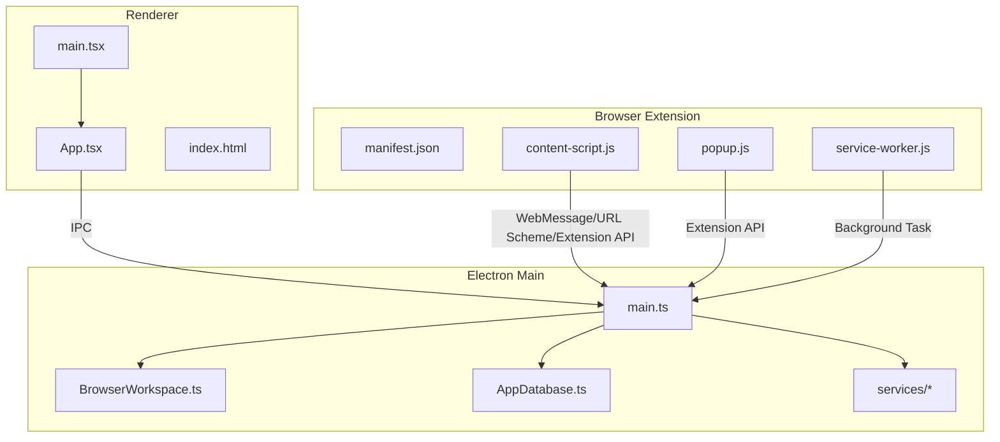
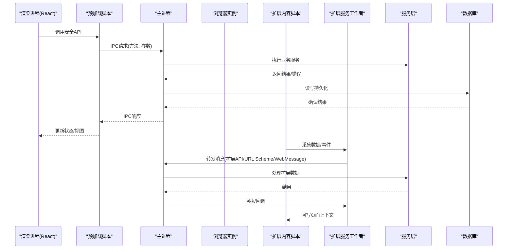
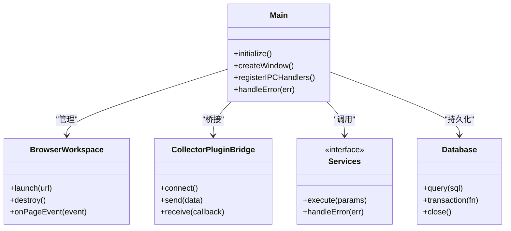
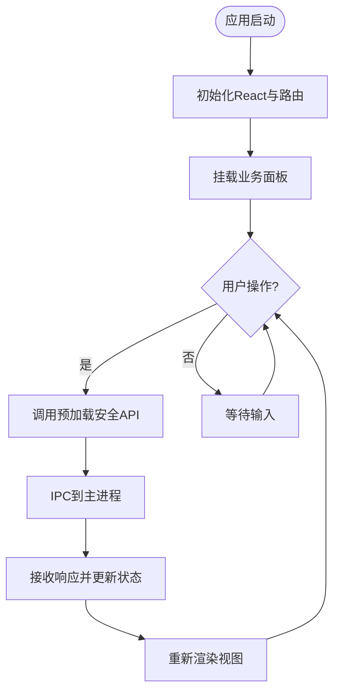
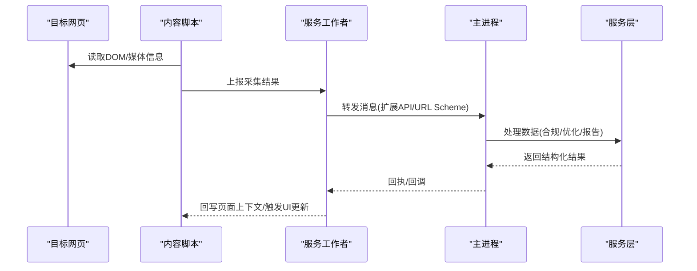
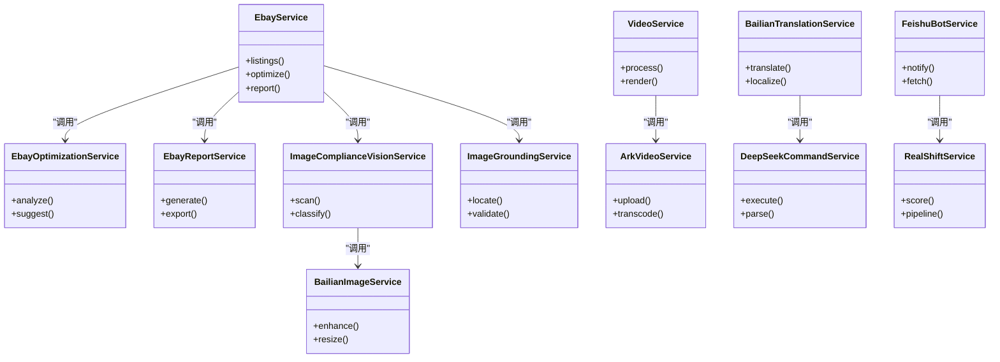
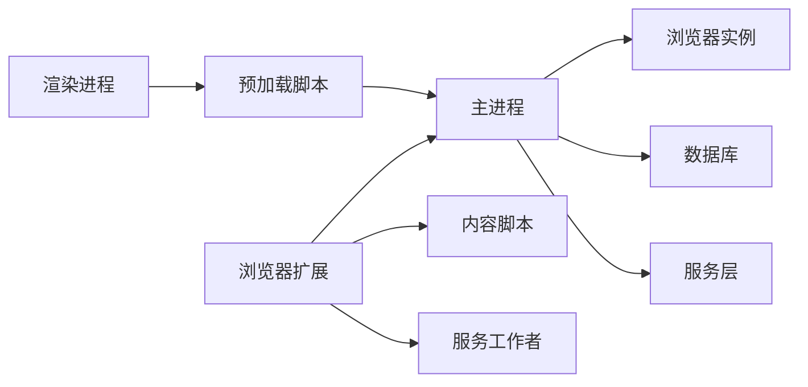

# 系统架构

<cite>
**本文引用的文件**   
- [package.json](file://package.json)
- [vite.config.ts](file://vite.config.ts)
- [tsconfig.main.json](file://tsconfig.main.json)
- [src/main/main.ts](file://src/main/main.ts)
- [src/main/browser/BrowserWorkspace.ts](file://src/main/browser/BrowserWorkspace.ts)
- [src/main/database/AppDatabase.ts](file://src/main/database/AppDatabase.ts)
- [src/main/services/CollectorPluginBridge.ts](file://src/main/services/CollectorPluginBridge.ts)
- [src/main/services/EbayService.ts](file://src/main/services/EbayService.ts)
- [src/main/services/EbayOptimizationService.ts](file://src/main/services/EbayOptimizationService.ts)
- [src/main/services/EbayReportService.ts](file://src/main/services/EbayReportService.ts)
- [src/main/services/EbayImageComplianceVisionService.ts](file://src/main/services/EbayImage合规视觉服务.ts)
- [src/main/services/EbayImageGroundingService.ts](file://src/main/services/EbayImage定位服务.ts)
- [src/main/services/EbayVideoService.ts](file://src/main/services/Ebay视频服务.ts)
- [src/main/services/ArkVideoService.ts](file://src/main/services/ArkVideoService.ts)
- [src/main/services/BailianImageService.ts](file://src/main/services/Bailian图片服务.ts)
- [src/main/services/BailianTranslationService.ts](file://src/main/services/Bailian翻译服务.ts)
- [src/main/services/DeepSeekCommandService.ts](file://src/main/services/DeepSeek命令服务.ts)
- [src/main/services/FeishuBotService.ts](file://src/main/services/飞书机器人服务.ts)
- [src/main/services/RealShiftService.ts](file://src/main/services/RealShift服务.ts)
- [src/renderer/main.tsx](file://src/renderer/main.tsx)
- [src/renderer/App.tsx](file://src/renderer/App.tsx)
- [src/renderer/index.html](file://src/renderer/index.html)
- [browser-extension/manifest.json](file://browser-extension/manifest.json)
- [browser-extension/content-script.js](file://browser-extension/content-script.js)
- [browser-extension/popup.js](file://browser-extension/popup.js)
- [browser-extension/service-worker.js](file://browser-extension/service-worker.js)
</cite>

## 目录
1. [简介](#简介)
2. [项目结构](#项目结构)
3. [核心组件](#核心组件)
4. [架构总览](#架构总览)
5. [详细组件分析](#详细组件分析)
6. [依赖关系分析](#依赖关系分析)
7. [性能考虑](#性能考虑)
8. [故障排查指南](#故障排查指南)
9. [结论](#结论)
10. [附录](#附录)

## 简介
本架构文档面向“砚都跨境”Electron应用，围绕三层架构（main进程、preload脚本、renderer进程）与浏览器扩展的集成进行系统化说明。重点涵盖：
- 各层职责划分与设计模式
- IPC通信机制与数据流
- 事件传递与状态管理策略
- 安全、性能与可扩展性设计

该文档旨在帮助开发者快速理解整体架构，并为后续迭代提供清晰的演进路径。

## 项目结构
仓库采用多入口、分层组织的方式：
- main进程：负责窗口管理、浏览器实例生命周期、数据库访问、外部服务桥接与插件桥接等
- renderer进程：基于React/Vite构建的前端界面，承载业务面板与交互逻辑
- browser-extension：Chrome扩展，包含内容脚本、弹窗与服务工作者，用于网页侧数据采集与与主应用协同
- shared：跨层共享的类型与契约定义

图表来源
- [src/main/main.ts](file://src/main/main.ts)
- [src/main/browser/BrowserWorkspace.ts](file://src/main/browser/BrowserWorkspace.ts)
- [src/main/database/AppDatabase.ts](file://src/main/database/AppDatabase.ts)
- [src/main/services/CollectorPluginBridge.ts](file://src/main/services/CollectorPluginBridge.ts)
- [src/renderer/main.tsx](file://src/renderer/main.tsx)
- [src/renderer/App.tsx](file://src/renderer/App.tsx)
- [src/renderer/index.html](file://src/renderer/index.html)
- [browser-extension/manifest.json](file://browser-extension/manifest.json)
- [browser-extension/content-script.js](file://browser-extension/content-script.js)
- [browser-extension/popup.js](file://browser-extension/popup.js)
- [browser-extension/service-worker.js](file://browser-extension/service-worker.js)

章节来源
- [package.json](file://package.json)
- [vite.config.ts](file://vite.config.ts)
- [tsconfig.main.json](file://tsconfig.main.json)

## 核心组件
- main进程
  - 窗口与浏览器实例管理：统一创建、销毁与生命周期控制
  - 数据库访问：集中化持久化操作封装
  - 服务桥接：对外部AI/图像/视频/翻译等服务进行调用与结果聚合
  - 插件桥接：与采集插件或扩展能力对接
- renderer进程
  - React应用入口与页面路由
  - 业务面板（如Ebay相关编辑、视频工作室、合规面板等）
  - 通过预加载脚本暴露的安全API与main进程通信
- 浏览器扩展
  - 内容脚本：注入目标网页，采集DOM/媒体信息
  - 弹窗：用户交互入口
  - 服务工作者：后台任务调度与消息转发

章节来源
- [src/main/main.ts](file://src/main/main.ts)
- [src/main/browser/BrowserWorkspace.ts](file://src/main/browser/BrowserWorkspace.ts)
- [src/main/database/AppDatabase.ts](file://src/main/database/AppDatabase.ts)
- [src/main/services/CollectorPluginBridge.ts](file://src/main/services/CollectorPluginBridge.ts)
- [src/renderer/main.tsx](file://src/renderer/main.tsx)
- [src/renderer/App.tsx](file://src/renderer/App.tsx)
- [browser-extension/manifest.json](file://browser-extension/manifest.json)
- [browser-extension/content-script.js](file://browser-extension/content-script.js)
- [browser-extension/popup.js](file://browser-extension/popup.js)
- [browser-extension/service-worker.js](file://browser-extension/service-worker.js)

## 架构总览
Electron三层架构与扩展集成的总体交互如下：
- renderer通过预加载脚本暴露的API调用main进程的IPC通道
- main进程协调浏览器实例、数据库与各服务模块
- 浏览器扩展通过内容脚本捕获网页上下文，经由服务工作者中转，最终与main进程建立可靠的消息通道

图表来源
- [src/main/main.ts](file://src/main/main.ts)
- [src/main/browser/BrowserWorkspace.ts](file://src/main/browser/BrowserWorkspace.ts)
- [src/main/services/CollectorPluginBridge.ts](file://src/main/services/CollectorPluginBridge.ts)
- [src/renderer/main.tsx](file://src/renderer/main.tsx)
- [browser-extension/content-script.js](file://browser-extension/content-script.js)
- [browser-extension/service-worker.js](file://browser-extension/service-worker.js)

## 详细组件分析

### 主进程（main）
- 职责
  - 应用启动、窗口与浏览器实例生命周期管理
  - 注册并处理IPC通道，确保类型安全与权限校验
  - 编排服务层调用与数据库访问
  - 与浏览器扩展/插件桥接，统一消息格式与错误码
- 关键设计点
  - 单例化的工作区管理器，避免重复创建浏览器实例
  - 服务层按领域拆分（Ebay、图像、视频、翻译、命令、飞书、RealShift等），便于独立测试与扩展
  - 数据库访问集中化，提供事务与重试策略

图表来源
- [src/main/main.ts](file://src/main/main.ts)
- [src/main/browser/BrowserWorkspace.ts](file://src/main/browser/BrowserWorkspace.ts)
- [src/main/services/CollectorPluginBridge.ts](file://src/main/services/CollectorPluginBridge.ts)
- [src/main/database/AppDatabase.ts](file://src/main/database/AppDatabase.ts)

章节来源
- [src/main/main.ts](file://src/main/main.ts)
- [src/main/browser/BrowserWorkspace.ts](file://src/main/browser/BrowserWorkspace.ts)
- [src/main/database/AppDatabase.ts](file://src/main/database/AppDatabase.ts)
- [src/main/services/CollectorPluginBridge.ts](file://src/main/services/CollectorPluginBridge.ts)

### 渲染进程（renderer）
- 职责
  - React应用初始化与路由
  - 业务面板实现（Ebay本地列表编辑器、视频工作室、合规面板等）
  - 通过预加载脚本暴露的安全API与主进程通信
- 关键设计点
  - 将UI状态与业务状态分离，使用轻量状态管理（如Context/Store）
  - 对长耗时操作进行分片与进度反馈
  - 错误边界与用户提示，保证体验稳定

图表来源
- [src/renderer/main.tsx](file://src/renderer/main.tsx)
- [src/renderer/App.tsx](file://src/renderer/App.tsx)
- [src/renderer/index.html](file://src/renderer/index.html)

章节来源
- [src/renderer/main.tsx](file://src/renderer/main.tsx)
- [src/renderer/App.tsx](file://src/renderer/App.tsx)
- [src/renderer/index.html](file://src/renderer/index.html)

### 浏览器扩展（extension）
- 职责
  - 内容脚本：注入目标页面，采集DOM/媒体元数据
  - 弹窗：用户选择与配置
  - 服务工作者：后台任务调度、消息转发与缓存
- 关键设计点
  - 最小权限原则，按需声明权限
  - 与主应用通过扩展API或URL Scheme建立可靠通道
  - 错误重试与超时保护，避免阻塞页面

图表来源
- [browser-extension/content-script.js](file://browser-extension/content-script.js)
- [browser-extension/popup.js](file://browser-extension/popup.js)
- [browser-extension/service-worker.js](file://browser-extension/service-worker.js)
- [browser-extension/manifest.json](file://browser-extension/manifest.json)

章节来源
- [browser-extension/manifest.json](file://browser-extension/manifest.json)
- [browser-extension/content-script.js](file://browser-extension/content-script.js)
- [browser-extension/popup.js](file://browser-extension/popup.js)
- [browser-extension/service-worker.js](file://browser-extension/service-worker.js)

### 服务层（services）
- 职责
  - 对外部AI/图像/视频/翻译/命令/飞书/RealShift等服务进行封装与调用
  - 统一错误处理、重试与日志记录
  - 为main进程提供稳定的接口
- 关键设计点
  - 按领域拆分服务，单一职责
  - 可插拔式接入新服务，保持扩展性
  - 与数据库解耦，仅关注业务编排

图表来源
- [src/main/services/EbayService.ts](file://src/main/services/EbayService.ts)
- [src/main/services/EbayOptimizationService.ts](file://src/main/services/EbayOptimizationService.ts)
- [src/main/services/EbayReportService.ts](file://src/main/services/EbayReportService.ts)
- [src/main/services/EbayImageComplianceVisionService.ts](file://src/main/services/EbayImage合规视觉服务.ts)
- [src/main/services/EbayImageGroundingService.ts](file://src/main/services/EbayImage定位服务.ts)
- [src/main/services/EbayVideoService.ts](file://src/main/services/Ebay视频服务.ts)
- [src/main/services/ArkVideoService.ts](file://src/main/services/ArkVideoService.ts)
- [src/main/services/BailianImageService.ts](file://src/main/services/Bailian图片服务.ts)
- [src/main/services/BailianTranslationService.ts](file://src/main/services/Bailian翻译服务.ts)
- [src/main/services/DeepSeekCommandService.ts](file://src/main/services/DeepSeek命令服务.ts)
- [src/main/services/FeishuBotService.ts](file://src/main/services/飞书机器人服务.ts)
- [src/main/services/RealShiftService.ts](file://src/main/services/RealShift服务.ts)

章节来源
- [src/main/services/EbayService.ts](file://src/main/services/EbayService.ts)
- [src/main/services/EbayOptimizationService.ts](file://src/main/services/EbayOptimizationService.ts)
- [src/main/services/EbayReportService.ts](file://src/main/services/EbayReportService.ts)
- [src/main/services/EbayImageComplianceVisionService.ts](file://src/main/services/EbayImage合规视觉服务.ts)
- [src/main/services/EbayImageGroundingService.ts](file://src/main/services/EbayImage定位服务.ts)
- [src/main/services/EbayVideoService.ts](file://src/main/services/Ebay视频服务.ts)
- [src/main/services/ArkVideoService.ts](file://src/main/services/ArkVideoService.ts)
- [src/main/services/BailianImageService.ts](file://src/main/services/Bailian图片服务.ts)
- [src/main/services/BailianTranslationService.ts](file://src/main/services/Bailian翻译服务.ts)
- [src/main/services/DeepSeekCommandService.ts](file://src/main/services/DeepSeek命令服务.ts)
- [src/main/services/FeishuBotService.ts](file://src/main/services/飞书机器人服务.ts)
- [src/main/services/RealShiftService.ts](file://src/main/services/RealShift服务.ts)

## 依赖关系分析
- main进程依赖
  - BrowserWorkspace：浏览器实例管理
  - AppDatabase：数据持久化
  - services/*：外部服务编排
  - CollectorPluginBridge：扩展/插件桥接
- renderer依赖
  - React/Vite构建产物
  - 预加载脚本暴露的安全API
- extension依赖
  - manifest权限声明
  - content-script与service-worker之间的消息通道
  - 与主应用的集成方式（扩展API/URL Scheme/WebMessage）

图表来源
- [src/main/main.ts](file://src/main/main.ts)
- [src/main/browser/BrowserWorkspace.ts](file://src/main/browser/BrowserWorkspace.ts)
- [src/main/database/AppDatabase.ts](file://src/main/database/AppDatabase.ts)
- [src/main/services/CollectorPluginBridge.ts](file://src/main/services/CollectorPluginBridge.ts)
- [src/renderer/main.tsx](file://src/renderer/main.tsx)
- [browser-extension/manifest.json](file://browser-extension/manifest.json)
- [browser-extension/content-script.js](file://browser-extension/content-script.js)
- [browser-extension/service-worker.js](file://browser-extension/service-worker.js)

章节来源
- [src/main/main.ts](file://src/main/main.ts)
- [src/main/browser/BrowserWorkspace.ts](file://src/main/browser/BrowserWorkspace.ts)
- [src/main/database/AppDatabase.ts](file://src/main/database/AppDatabase.ts)
- [src/main/services/CollectorPluginBridge.ts](file://src/main/services/CollectorPluginBridge.ts)
- [src/renderer/main.tsx](file://src/renderer/main.tsx)
- [browser-extension/manifest.json](file://browser-extension/manifest.json)
- [browser-extension/content-script.js](file://browser-extension/content-script.js)
- [browser-extension/service-worker.js](file://browser-extension/service-worker.js)

## 性能考虑
- IPC通信
  - 批量消息与节流，减少频繁往返
  - 异步任务与进度回调，避免阻塞UI
- 浏览器实例
  - 复用实例与资源池，降低启动开销
  - 按需加载页面与懒加载资源
- 服务层
  - 并发控制与限流，防止下游服务过载
  - 缓存热点数据，减少重复计算
- 渲染进程
  - 组件级代码分割与按需加载
  - 虚拟滚动与分页，提升大数据展示性能
- 扩展
  - 内容脚本最小化注入范围
  - 服务工作者后台任务去重与合并

[本节为通用指导，不直接分析具体文件]

## 故障排查指南
- IPC异常
  - 检查通道注册与权限声明
  - 核对参数类型与序列化
- 浏览器实例崩溃
  - 查看内存占用与资源泄漏
  - 增加崩溃日志与堆栈收集
- 服务调用失败
  - 检查网络与鉴权
  - 启用重试与降级策略
- 扩展消息丢失
  - 校验消息格式与超时设置
  - 在服务工作者中增加队列与重试

章节来源
- [src/main/main.ts](file://src/main/main.ts)
- [src/main/browser/BrowserWorkspace.ts](file://src/main/browser/BrowserWorkspace.ts)
- [src/main/services/CollectorPluginBridge.ts](file://src/main/services/CollectorPluginBridge.ts)
- [browser-extension/service-worker.js](file://browser-extension/service-worker.js)

## 结论
本项目采用清晰的三层架构与扩展集成方案，通过主进程统一编排、渲染进程专注UI、扩展负责网页侧采集，形成高内聚、低耦合的系统。服务层按领域拆分，具备良好的可扩展性与可维护性。在安全、性能与稳定性方面，建议持续强化权限控制、错误恢复与监控告警，以支撑复杂跨境业务的长期演进。

[本节为总结，不直接分析具体文件]

## 附录
- 构建与配置
  - Vite配置：前端构建与开发服务器
  - TypeScript配置：主进程与渲染进程编译选项
- 共享契约
  - 跨层数据结构与接口定义，确保类型一致

章节来源
- [vite.config.ts](file://vite.config.ts)
- [tsconfig.main.json](file://tsconfig.main.json)
- [package.json](file://package.json)