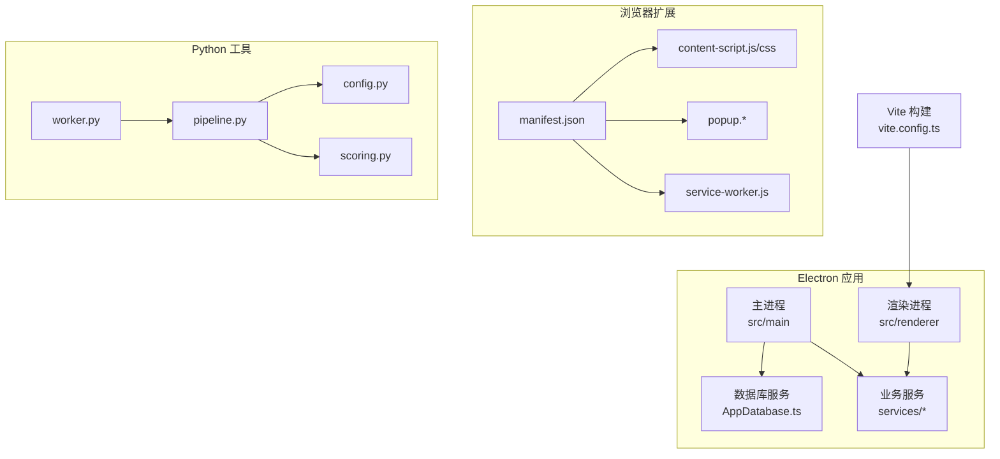
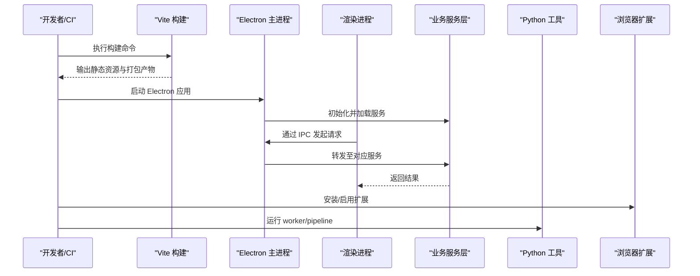
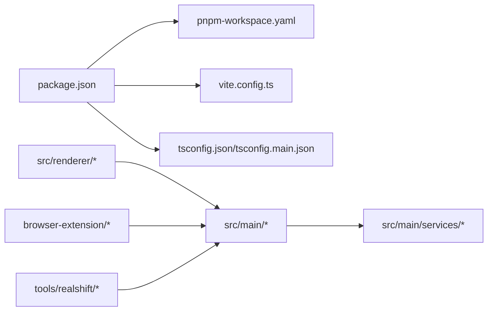

# 部署指南

<cite>
**本文引用的文件**   
- [package.json](file://package.json)
- [vite.config.ts](file://vite.config.ts)
- [tsconfig.json](file://tsconfig.json)
- [tsconfig.main.json](file://tsconfig.main.json)
- [pnpm-workspace.yaml](file://pnpm-workspace.yaml)
- [src/main/main.ts](file://src/main/main.ts)
- [src/main/browser/BrowserWorkspace.ts](file://src/main/browser/BrowserWorkspace.ts)
- [src/main/database/AppDatabase.ts](file://src/main/database/AppDatabase.ts)
- [src/main/services/ArkVideoService.ts](file://src/main/services/ArkVideoService.ts)
- [src/main/services/BailianImageService.ts](file://src/main/services/BailianImageService.ts)
- [src/main/services/BailianTranslationService.ts](file://src/main/services/BailianTranslationService.ts)
- [src/main/services/CollectorPluginBridge.ts](file://src/main/services/CollectorPluginBridge.ts)
- [src/main/services/DeepSeekCommandService.ts](file://src/main/services/DeepSeekCommandService.ts)
- [src/main/services/EbayImageComplianceVisionService.ts](file://src/main/services/EbayImageComplianceVisionService.ts)
- [src/main/services/EbayImageGroundingService.ts](file://src/main/services/EbayImageGroundingService.ts)
- [src/main/services/EbayOptimizationService.ts](file://src/main/services/EbayOptimizationService.ts)
- [src/main/services/EbayReportService.ts](file://src/main/services/EbayReportService.ts)
- [src/main/services/EbayService.ts](file://src/main/services/EbayService.ts)
- [src/main/services/EbayVideoService.ts](file://src/main/services/EbayVideoService.ts)
- [src/main/services/FeishuBotService.ts](file://src/main/services/FeishuBotService.ts)
- [src/main/services/RealShiftService.ts](file://src/main/services/RealShiftService.ts)
- [src/renderer/main.tsx](file://src/renderer/main.tsx)
- [src/renderer/App.tsx](file://src/renderer/App.tsx)
- [src/renderer/index.html](file://src/renderer/index.html)
- [browser-extension/manifest.json](file://browser-extension/manifest.json)
- [tools/realshift/worker.py](file://tools/realshift/worker.py)
- [tools/realshift/realshift/pipeline.py](file://tools/realshift/realshift/pipeline.py)
- [tools/realshift/realshift/config.py](file://tools/realshift/realshift/config.py)
- [tools/realshift/realshift/scoring.py](file://tools/realshift/realshift/scoring.py)
</cite>

## 目录
1. [简介](#简介)
2. [项目结构](#项目结构)
3. [核心组件](#核心组件)
4. [架构总览](#架构总览)
5. [详细组件分析](#详细组件分析)
6. [依赖分析](#依赖分析)
7. [性能考虑](#性能考虑)
8. [故障排查指南](#故障排查指南)
9. [结论](#结论)
10. [附录](#附录)

## 简介
本指南面向生产环境，提供砚都跨境项目的完整部署说明。内容涵盖构建配置、打包流程、分发策略、环境变量与依赖管理、安全加固、跨平台差异（Windows/macOS/Linux）、CI/CD流水线设计，以及监控日志、错误追踪与性能优化最佳实践。读者可据此在本地或服务器完成从源码到稳定运行的全链路交付。

## 项目结构
本项目采用多入口架构：
- Electron 主进程与渲染进程：位于 src/main 与 src/renderer
- 浏览器扩展：位于 browser-extension
- Python 工具链：位于 tools/realshift
- 构建与类型配置：vite.config.ts、tsconfig*.json、package.json、pnpm-workspace.yaml

图表来源
- [src/main/main.ts](file://src/main/main.ts)
- [src/renderer/main.tsx](file://src/renderer/main.tsx)
- [src/main/database/AppDatabase.ts](file://src/main/database/AppDatabase.ts)
- [src/main/services/*.ts](file://src/main/services/ArkVideoService.ts)
- [browser-extension/manifest.json](file://browser-extension/manifest.json)
- [tools/realshift/worker.py](file://tools/realshift/worker.py)
- [tools/realshift/realshift/pipeline.py](file://tools/realshift/realshift/pipeline.py)
- [tools/realshift/realshift/config.py](file://tools/realshift/realshift/config.py)
- [tools/realshift/realshift/scoring.py](file://tools/realshift/realshift/scoring.py)

章节来源
- [package.json](file://package.json)
- [vite.config.ts](file://vite.config.ts)
- [tsconfig.json](file://tsconfig.json)
- [tsconfig.main.json](file://tsconfig.main.json)
- [pnpm-workspace.yaml](file://pnpm-workspace.yaml)

## 核心组件
- 主进程（Electron）：负责窗口生命周期、IPC 桥接、外部服务调用与资源调度。
- 渲染进程（React + Vite）：用户界面与交互逻辑，通过 IPC 与主进程通信。
- 数据库服务：封装本地数据访问，供主/渲染进程使用。
- 业务服务层：对接第三方能力（图像、视频、翻译、Ebay、飞书等）。
- 浏览器扩展：为网页注入脚本、弹窗与后台任务。
- Python 工具：数据处理与评分管道，由 worker 驱动。

章节来源
- [src/main/main.ts](file://src/main/main.ts)
- [src/renderer/main.tsx](file://src/renderer/main.tsx)
- [src/main/database/AppDatabase.ts](file://src/main/database/AppDatabase.ts)
- [src/main/services/ArkVideoService.ts](file://src/main/services/ArkVideoService.ts)
- [src/main/services/BailianImageService.ts](file://src/main/services/BailianImageService.ts)
- [src/main/services/BailianTranslationService.ts](file://src/main/services/BailianTranslationService.ts)
- [src/main/services/CollectorPluginBridge.ts](file://src/main/services/CollectorPluginBridge.ts)
- [src/main/services/DeepSeekCommandService.ts](file://src/main/services/DeepSeekCommandService.ts)
- [src/main/services/EbayImageComplianceVisionService.ts](file://src/main/services/EbayImageComplianceVisionService.ts)
- [src/main/services/EbayImageGroundingService.ts](file://src/main/services/EbayImageGroundingService.ts)
- [src/main/services/EbayOptimizationService.ts](file://src/main/services/EbayOptimizationService.ts)
- [src/main/services/EbayReportService.ts](file://src/main/services/EbayReportService.ts)
- [src/main/services/EbayService.ts](file://src/main/services/EbayService.ts)
- [src/main/services/EbayVideoService.ts](file://src/main/services/EbayVideoService.ts)
- [src/main/services/FeishuBotService.ts](file://src/main/services/FeishuBotService.ts)
- [src/main/services/RealShiftService.ts](file://src/main/services/RealShiftService.ts)

## 架构总览
下图展示生产环境的关键交互：构建产物、主/渲染进程、外部服务与 Python 工具之间的调用关系。

图表来源
- [vite.config.ts](file://vite.config.ts)
- [src/main/main.ts](file://src/main/main.ts)
- [src/renderer/main.tsx](file://src/renderer/main.tsx)
- [src/main/services/*.ts](file://src/main/services/ArkVideoService.ts)
- [tools/realshift/worker.py](file://tools/realshift/worker.py)
- [browser-extension/manifest.json](file://browser-extension/manifest.json)

## 详细组件分析

### 构建与打包（Vite + Electron）
- 构建目标：生成渲染端静态资源与主进程可执行包。
- 关键配置：
  - 入口与输出路径、模块解析、插件与压缩策略
  - 环境变量注入与运行时区分（开发/生产）
  - 资源处理与缓存策略
- 打包产物：
  - 渲染端静态资源（HTML/CSS/JS）
  - Electron 安装包（按平台分发包）
- 建议：
  - 生产构建开启代码分割与 Tree-shaking
  - 使用 Source Map 的受限发布策略（仅内部可用）
  - 锁定依赖版本，确保可重复构建

章节来源
- [vite.config.ts](file://vite.config.ts)
- [package.json](file://package.json)
- [tsconfig.json](file://tsconfig.json)
- [tsconfig.main.json](file://tsconfig.main.json)

### 主进程与服务层
- 职责划分：
  - 主进程：窗口管理、系统级能力、IPC 路由、进程间通信
  - 服务层：对外部 API 的封装、重试与超时控制、鉴权与签名
- 典型服务：
  - 图像/视频处理、翻译、Ebay 相关、飞书机器人、DeepSeek 指令、RealShift 服务等
- 健壮性建议：
  - 统一错误码与异常上报
  - 敏感信息通过环境变量注入，避免硬编码
  - 网络请求增加熔断与退避策略

章节来源
- [src/main/main.ts](file://src/main/main.ts)
- [src/main/services/ArkVideoService.ts](file://src/main/services/ArkVideoService.ts)
- [src/main/services/BailianImageService.ts](file://src/main/services/BailianImageService.ts)
- [src/main/services/BailianTranslationService.ts](file://src/main/services/BailianTranslationService.ts)
- [src/main/services/CollectorPluginBridge.ts](file://src/main/services/CollectorPluginBridge.ts)
- [src/main/services/DeepSeekCommandService.ts](file://src/main/services/DeepSeekCommandService.ts)
- [src/main/services/EbayImageComplianceVisionService.ts](file://src/main/services/EbayImageComplianceVisionService.ts)
- [src/main/services/EbayImageGroundingService.ts](file://src/main/services/EbayImageGroundingService.ts)
- [src/main/services/EbayOptimizationService.ts](file://src/main/services/EbayOptimizationService.ts)
- [src/main/services/EbayReportService.ts](file://src/main/services/EbayReportService.ts)
- [src/main/services/EbayService.ts](file://src/main/services/EbayService.ts)
- [src/main/services/EbayVideoService.ts](file://src/main/services/EbayVideoService.ts)
- [src/main/services/FeishuBotService.ts](file://src/main/services/FeishuBotService.ts)
- [src/main/services/RealShiftService.ts](file://src/main/services/RealShiftService.ts)

### 渲染进程（React）
- 职责：页面渲染、用户交互、状态管理与 IPC 调用
- 构建：由 Vite 驱动，支持热更新与按需加载
- 安全：避免直接访问 Node 能力，通过 IPC 白名单限制

章节来源
- [src/renderer/main.tsx](file://src/renderer/main.tsx)
- [src/renderer/App.tsx](file://src/renderer/App.tsx)
- [src/renderer/index.html](file://src/renderer/index.html)

### 浏览器扩展
- 清单：定义权限、背景脚本、内容脚本与弹窗
- 行为：注入页面、拦截请求、与主应用协同工作
- 发布：按平台商店规范打包与签名

章节来源
- [browser-extension/manifest.json](file://browser-extension/manifest.json)

### Python 工具链（RealShift）
- 组件：worker、pipeline、config、scoring
- 用途：数据处理、评分与批量任务
- 部署：独立进程或容器化运行，通过消息队列或 HTTP 与主应用交互

章节来源
- [tools/realshift/worker.py](file://tools/realshift/worker.py)
- [tools/realshift/realshift/pipeline.py](file://tools/realshift/realshift/pipeline.py)
- [tools/realshift/realshift/config.py](file://tools/realshift/realshift/config.py)
- [tools/realshift/realshift/scoring.py](file://tools/realshift/realshift/scoring.py)

## 依赖分析
- 前端依赖：由 pnpm 管理，workspace 模式便于多包协作
- 构建依赖：Vite、TypeScript、Electron 相关插件
- 运行时依赖：Node.js 运行时、系统库（平台相关）
- Python 依赖：requirements 或虚拟环境隔离

图表来源
- [package.json](file://package.json)
- [pnpm-workspace.yaml](file://pnpm-workspace.yaml)
- [vite.config.ts](file://vite.config.ts)
- [tsconfig.json](file://tsconfig.json)
- [tsconfig.main.json](file://tsconfig.main.json)
- [src/main/main.ts](file://src/main/main.ts)
- [src/renderer/main.tsx](file://src/renderer/main.tsx)
- [browser-extension/manifest.json](file://browser-extension/manifest.json)
- [tools/realshift/worker.py](file://tools/realshift/worker.py)

章节来源
- [package.json](file://package.json)
- [pnpm-workspace.yaml](file://pnpm-workspace.yaml)

## 性能考虑
- 构建优化
  - 启用代码分割与懒加载，减少首屏体积
  - 合理配置缓存与增量构建
- 运行时优化
  - 主进程与渲染进程职责分离，避免阻塞 UI
  - 网络请求合并与去抖，失败重试与超时控制
  - 图片/视频等资源按需加载与压缩
- Python 工具
  - 批处理与并行化，I/O 密集型任务异步化
  - 内存与 CPU 监控，必要时水平扩展

[本节为通用指导，不直接分析具体文件]

## 故障排查指南
- 常见问题定位
  - 构建失败：检查依赖锁定、Node 版本与平台工具链
  - 运行时崩溃：查看主进程日志与未捕获异常
  - 网络错误：核对鉴权参数、代理与证书配置
- 日志与监控
  - 主进程与渲染进程分别输出结构化日志
  - 集中收集与告警（如 ELK、Sentry）
- 调试技巧
  - 启用 Source Map 与调试端口
  - 使用浏览器 DevTools 与 Electron DevTools

章节来源
- [src/main/main.ts](file://src/main/main.ts)
- [src/renderer/main.tsx](file://src/renderer/main.tsx)

## 结论
通过清晰的构建与打包流程、严格的环境变量与依赖管理、完善的安全加固与跨平台适配，以及完善的监控与排障体系，砚都跨境项目可在生产环境中稳定运行。建议结合 CI/CD 实现自动化构建、测试与发布，持续改进质量与效率。

[本节为总结性内容，不直接分析具体文件]

## 附录

### 环境变量与安全加固
- 环境变量
  - 将密钥、令牌、API 地址等通过环境变量注入
  - 区分开发与生产环境，避免泄露
- 安全加固
  - 最小权限原则：仅授予必要系统权限
  - 输入校验与输出过滤，防止注入攻击
  - 传输加密与证书校验
  - 依赖漏洞扫描与定期更新

[本节为通用指导，不直接分析具体文件]

### 跨平台部署差异（Windows / macOS / Linux）
- Windows
  - 需要 Visual C++ 运行库与平台工具
  - 安装包签名与代码签名要求
- macOS
  - 需 Apple 开发者账号进行签名与公证
  - 沙盒与权限提示策略
- Linux
  - 依赖系统库（如 GTK、X11/Wayland）
  - 包格式（deb/rpm/appimage）与仓库发布

[本节为通用指导，不直接分析具体文件]

### CI/CD 流水线建议
- 阶段
  - 拉取代码与依赖安装
  - 类型检查与单元测试
  - 构建与打包（多平台）
  - 安全扫描与制品归档
  - 自动发布与回滚策略
- 缓存与并行
  - 依赖缓存与构建缓存
  - 多平台并行构建缩短时间

[本节为通用指导，不直接分析具体文件]

### 监控日志与错误追踪
- 日志规范
  - 统一格式、级别与上下文字段
  - 敏感信息脱敏
- 错误追踪
  - 接入错误上报平台，聚合与告警
  - 建立问题闭环与复盘机制

[本节为通用指导，不直接分析具体文件]

### 性能优化最佳实践
- 前端
  - 首屏优化（预加载、关键 CSS、图片优化）
  - 路由与组件懒加载
- 后端/服务
  - 连接池与缓存
  - 限流与降级
- Python 工具
  - 任务拆分与并发控制
  - I/O 与计算分离

[本节为通用指导，不直接分析具体文件]