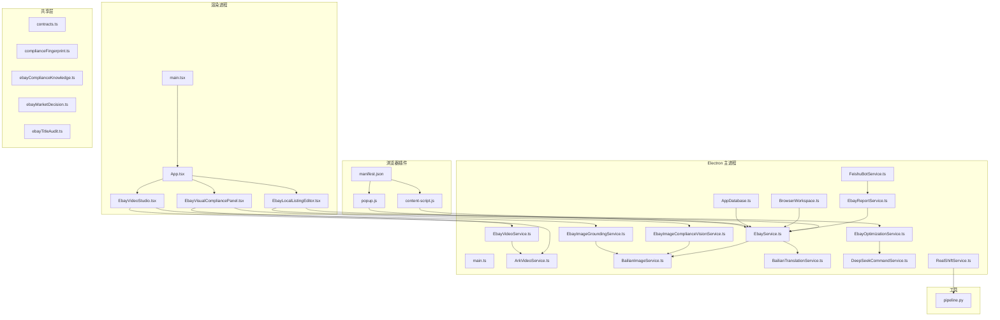
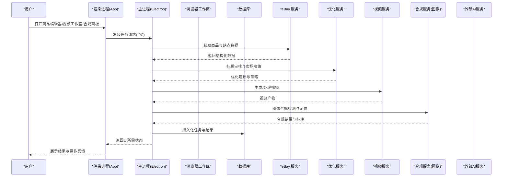
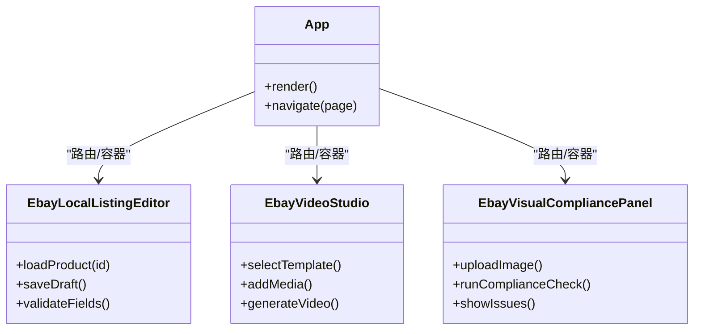
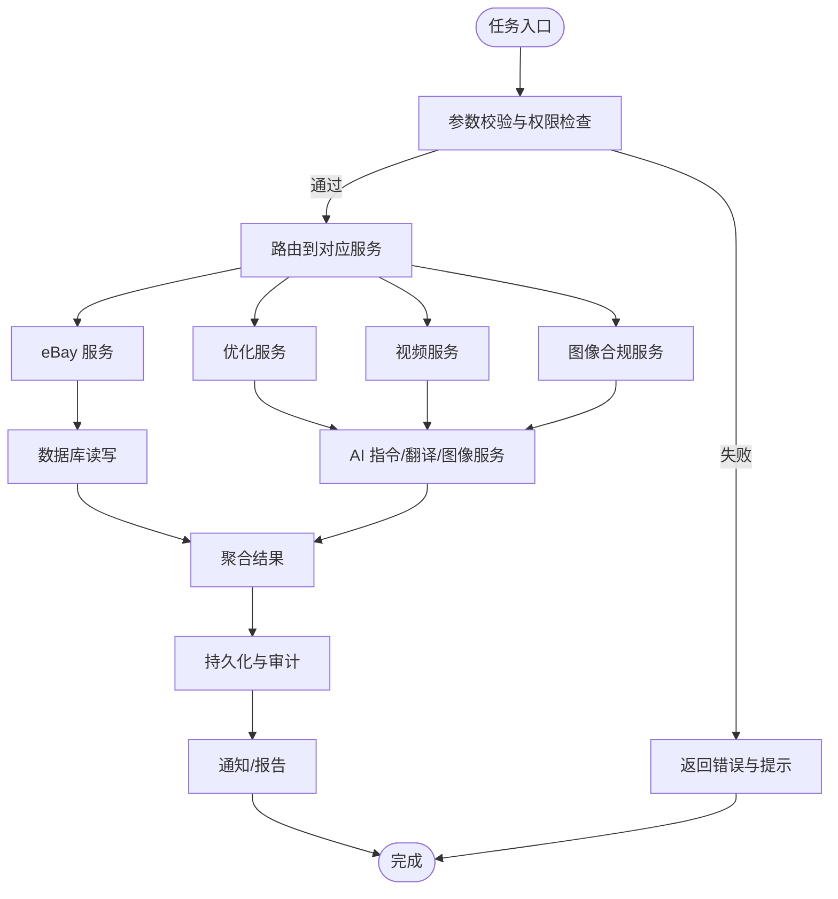
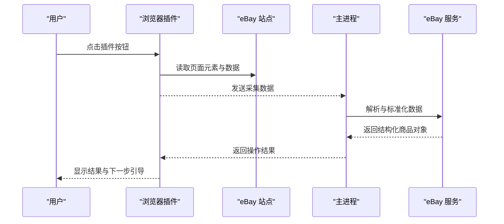
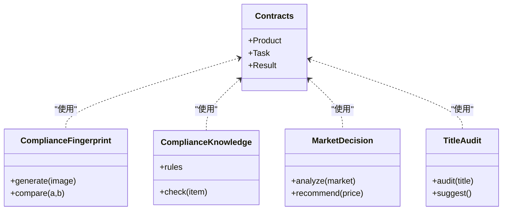
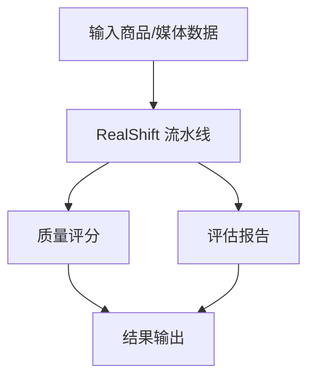
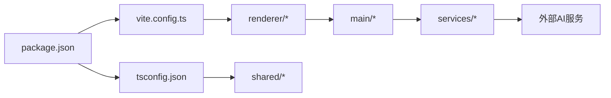

# 项目概览

<cite>
**本文引用的文件**   
- [package.json](file://package.json)
- [vite.config.ts](file://vite.config.ts)
- [tsconfig.json](file://tsconfig.json)
- [src/main/main.ts](file://src/main/main.ts)
- [src/main/browser/BrowserWorkspace.ts](file://src/main/browser/BrowserWorkspace.ts)
- [src/main/database/AppDatabase.ts](file://src/main/database/AppDatabase.ts)
- [src/main/services/EbayService.ts](file://src/main/services/EbayService.ts)
- [src/main/services/EbayOptimizationService.ts](file://src/main/services/EbayOptimizationService.ts)
- [src/main/services/EbayVideoService.ts](file://src/main/services/EbayVideoService.ts)
- [src/main/services/EbayImageComplianceVisionService.ts](file://src/main/services/EbayImageComplianceVisionService.ts)
- [src/main/services/EbayImageGroundingService.ts](file://src/main/services/EbayImageGroundingService.ts)
- [src/main/services/ArkVideoService.ts](file://src/main/services/ArkVideoService.ts)
- [src/main/services/BailianImageService.ts](file://src/main/services/BailianImageService.ts)
- [src/main/services/BailianTranslationService.ts](file://src/main/services/BailianTranslationService.ts)
- [src/main/services/DeepSeekCommandService.ts](file://src/main/services/DeepSeekCommandService.ts)
- [src/main/services/EbayReportService.ts](file://src/main/services/EbayReportService.ts)
- [src/main/services/FeishuBotService.ts](file://src/main/services/FeishuBotService.ts)
- [src/main/services/RealShiftService.ts](file://src/main/services/RealShiftService.ts)
- [src/renderer/App.tsx](file://src/renderer/App.tsx)
- [src/renderer/main.tsx](file://src/renderer/main.tsx)
- [src/renderer/EbayLocalListingEditor.tsx](file://src/renderer/EbayLocalListingEditor.tsx)
- [src/renderer/EbayVideoStudio.tsx](file://src/renderer/EbayVideoStudio.tsx)
- [src/renderer/EbayVisualCompliancePanel.tsx](file://src/renderer/EbayVisualCompliancePanel.tsx)
- [src/shared/contracts.ts](file://src/shared/contracts.ts)
- [src/shared/complianceFingerprint.ts](file://src/shared/complianceFingerprint.ts)
- [src/shared/ebayComplianceKnowledge.ts](file://src/shared/ebayComplianceKnowledge.ts)
- [src/shared/ebayMarketDecision.ts](file://src/shared/ebayMarketDecision.ts)
- [src/shared/ebayTitleAudit.ts](file://src/shared/ebayTitleAudit.ts)
- [browser-extension/manifest.json](file://browser-extension/manifest.json)
- [browser-extension/content-script.js](file://browser-extension/content-script.js)
- [browser-extension/popup.js](file://browser-extension/popup.js)
- [tools/realshift/tools/realshift/pipeline.py](file://tools/realshift/tools/realshift/pipeline.py)
</cite>

## 目录
1. [简介](#简介)
2. [项目结构](#项目结构)
3. [核心组件](#核心组件)
4. [架构总览](#架构总览)
5. [详细组件分析](#详细组件分析)
6. [依赖关系分析](#依赖关系分析)
7. [性能考量](#性能考量)
8. [故障排查指南](#故障排查指南)
9. [结论](#结论)
10. [附录](#附录)

## 简介
本项目“砚都跨境”是一个面向跨境电商（重点为 eBay）的 AI 驱动桌面工具集，采用 Electron + React + TypeScript 技术栈构建。系统围绕商品优化、视频制作、合规检查与报告等核心能力，提供本地化的工作流编排与可视化操作界面，并通过浏览器插件与外部服务集成，实现从数据采集到上架优化的全链路支持。

主要目标：
- 提升 eBay 商品标题、图片与视频的合规性与转化率
- 通过 AI 能力自动化生成和优化内容
- 提供可复用的服务层与数据模型，支撑多场景扩展
- 以桌面应用形态统一体验，降低跨平台使用门槛

目标用户：
- 跨境电商运营人员、选品与内容编辑团队
- 中小卖家与品牌方，追求高效合规与增长
- 技术与产品团队，需要可扩展的服务编排与二次开发

## 项目结构
项目采用分层与按功能域组织相结合的结构：
- main：Electron 主进程，负责窗口管理、数据库、浏览器工作区、服务桥接与外部系统集成
- renderer：React 渲染进程，提供 UI 页面与交互逻辑
- shared：跨进程共享的类型契约、合规知识与决策规则
- browser-extension：eBay 站点浏览器插件，用于采集与增强页面信息
- tools：辅助工具与脚本（如 RealShift 评分流水线）

图表来源
- [src/main/main.ts:1-200](file://src/main/main.ts#L1-L200)
- [src/main/browser/BrowserWorkspace.ts:1-200](file://src/main/browser/BrowserWorkspace.ts#L1-L200)
- [src/main/database/AppDatabase.ts:1-200](file://src/main/database/AppDatabase.ts#L1-L200)
- [src/main/services/EbayService.ts:1-200](file://src/main/services/EbayService.ts#L1-L200)
- [src/main/services/EbayOptimizationService.ts:1-200](file://src/main/services/EbayOptimizationService.ts#L1-L200)
- [src/main/services/EbayVideoService.ts:1-200](file://src/main/services/EbayVideoService.ts#L1-L200)
- [src/main/services/EbayImageComplianceVisionService.ts:1-200](file://src/main/services/EbayImageComplianceVisionService.ts#L1-L200)
- [src/main/services/EbayImageGroundingService.ts:1-200](file://src/main/services/EbayImageGroundingService.ts#L1-L200)
- [src/main/services/ArkVideoService.ts:1-200](file://src/main/services/ArkVideoService.ts#L1-L200)
- [src/main/services/BailianImageService.ts:1-200](file://src/main/services/BailianImageService.ts#L1-L200)
- [src/main/services/BailianTranslationService.ts:1-200](file://src/main/services/BailianTranslationService.ts#L1-L200)
- [src/main/services/DeepSeekCommandService.ts:1-200](file://src/main/services/DeepSeekCommandService.ts#L1-L200)
- [src/main/services/EbayReportService.ts:1-200](file://src/main/services/EbayReportService.ts#L1-L200)
- [src/main/services/FeishuBotService.ts:1-200](file://src/main/services/FeishuBotService.ts#L1-L200)
- [src/main/services/RealShiftService.ts:1-200](file://src/main/services/RealShiftService.ts#L1-L200)
- [src/renderer/main.tsx:1-200](file://src/renderer/main.tsx#L1-L200)
- [src/renderer/App.tsx:1-200](file://src/renderer/App.tsx#L1-L200)
- [src/renderer/EbayLocalListingEditor.tsx:1-200](file://src/renderer/EbayLocalListingEditor.tsx#L1-L200)
- [src/renderer/EbayVideoStudio.tsx:1-200](file://src/renderer/EbayVideoStudio.tsx#L1-L200)
- [src/renderer/EbayVisualCompliancePanel.tsx:1-200](file://src/renderer/EbayVisualCompliancePanel.tsx#L1-L200)
- [src/shared/contracts.ts:1-200](file://src/shared/contracts.ts#L1-L200)
- [src/shared/complianceFingerprint.ts:1-200](file://src/shared/complianceFingerprint.ts#L1-L200)
- [src/shared/ebayComplianceKnowledge.ts:1-200](file://src/shared/ebayComplianceKnowledge.ts#L1-L200)
- [src/shared/ebayMarketDecision.ts:1-200](file://src/shared/ebayMarketDecision.ts#L1-L200)
- [src/shared/ebayTitleAudit.ts:1-200](file://src/shared/ebayTitleAudit.ts#L1-L200)
- [browser-extension/manifest.json:1-200](file://browser-extension/manifest.json#L1-L200)
- [browser-extension/content-script.js:1-200](file://browser-extension/content-script.js#L1-L200)
- [browser-extension/popup.js:1-200](file://browser-extension/popup.js#L1-L200)
- [tools/realshift/tools/realshift/pipeline.py:1-200](file://tools/realshift/tools/realshift/pipeline.py#L1-L200)

章节来源
- [package.json:1-200](file://package.json#L1-L200)
- [vite.config.ts:1-200](file://vite.config.ts#L1-L200)
- [tsconfig.json:1-200](file://tsconfig.json#L1-L200)

## 核心组件
- 主进程入口与窗口管理：负责 Electron 主进程初始化、渲染进程生命周期管理与 IPC 通道配置
- 浏览器工作区：封装 Chromium 实例或远程浏览器控制，提供页面级任务执行环境
- 数据库：本地持久化存储，承载商品、任务、结果与审计日志
- 服务层：
  - eBay 基础服务：商品查询、列表编辑、报告导出
  - 优化服务：标题审核、市场决策、AI 指令调用
  - 视频服务：视频生成与处理
  - 图像合规：视觉检测与定位、图像服务调用
  - 翻译与图像服务：第三方 AI 能力接入
  - 飞书机器人：消息通知与协作
  - RealShift：评分与质量评估流水线
- 渲染端页面：
  - 本地商品列表编辑器
  - 视频工作室
  - 可视化合规面板
- 共享层：类型契约、合规指纹、知识库、市场决策与标题审核规则

章节来源
- [src/main/main.ts:1-200](file://src/main/main.ts#L1-L200)
- [src/main/browser/BrowserWorkspace.ts:1-200](file://src/main/browser/BrowserWorkspace.ts#L1-L200)
- [src/main/database/AppDatabase.ts:1-200](file://src/main/database/AppDatabase.ts#L1-L200)
- [src/main/services/EbayService.ts:1-200](file://src/main/services/EbayService.ts#L1-L200)
- [src/main/services/EbayOptimizationService.ts:1-200](file://src/main/services/EbayOptimizationService.ts#L1-L200)
- [src/main/services/EbayVideoService.ts:1-200](file://src/main/services/EbayVideoService.ts#L1-L200)
- [src/main/services/EbayImageComplianceVisionService.ts:1-200](file://src/main/services/EbayImageComplianceVisionService.ts#L1-L200)
- [src/main/services/EbayImageGroundingService.ts:1-200](file://src/main/services/EbayImageGroundingService.ts#L1-L200)
- [src/main/services/ArkVideoService.ts:1-200](file://src/main/services/ArkVideoService.ts#L1-L200)
- [src/main/services/BailianImageService.ts:1-200](file://src/main/services/BailianImageService.ts#L1-L200)
- [src/main/services/BailianTranslationService.ts:1-200](file://src/main/services/BailianTranslationService.ts#L1-L200)
- [src/main/services/DeepSeekCommandService.ts:1-200](file://src/main/services/DeepSeekCommandService.ts#L1-L200)
- [src/main/services/EbayReportService.ts:1-200](file://src/main/services/EbayReportService.ts#L1-L200)
- [src/main/services/FeishuBotService.ts:1-200](file://src/main/services/FeishuBotService.ts#L1-L200)
- [src/main/services/RealShiftService.ts:1-200](file://src/main/services/RealShiftService.ts#L1-L200)
- [src/renderer/App.tsx:1-200](file://src/renderer/App.tsx#L1-L200)
- [src/renderer/EbayLocalListingEditor.tsx:1-200](file://src/renderer/EbayLocalListingEditor.tsx#L1-L200)
- [src/renderer/EbayVideoStudio.tsx:1-200](file://src/renderer/EbayVideoStudio.tsx#L1-L200)
- [src/renderer/EbayVisualCompliancePanel.tsx:1-200](file://src/renderer/EbayVisualCompliancePanel.ts#L1-L200)
- [src/shared/contracts.ts:1-200](file://src/shared/contracts.ts#L1-L200)
- [src/shared/complianceFingerprint.ts:1-200](file://src/shared/complianceFingerprint.ts#L1-L200)
- [src/shared/ebayComplianceKnowledge.ts:1-200](file://src/shared/ebayComplianceKnowledge.ts#L1-L200)
- [src/shared/ebayMarketDecision.ts:1-200](file://src/shared/ebayMarketDecision.ts#L1-L200)
- [src/shared/ebayTitleAudit.ts:1-200](file://src/shared/ebayTitleAudit.ts#L1-L200)

## 架构总览
系统采用“主进程 + 渲染进程 + 浏览器插件 + 外部服务”的分层架构：
- 主进程作为中枢，协调浏览器工作区、数据库与各业务服务
- 渲染进程提供交互式 UI，将用户意图转化为服务调用
- 浏览器插件在 eBay 站点侧采集与增强数据，回传至主进程
- 外部 AI 服务（图像、翻译、视频、大模型）通过服务层统一接入

图表来源
- [src/main/main.ts:1-200](file://src/main/main.ts#L1-L200)
- [src/main/browser/BrowserWorkspace.ts:1-200](file://src/main/browser/BrowserWorkspace.ts#L1-L200)
- [src/main/database/AppDatabase.ts:1-200](file://src/main/database/AppDatabase.ts#L1-L200)
- [src/main/services/EbayService.ts:1-200](file://src/main/services/EbayService.ts#L1-L200)
- [src/main/services/EbayOptimizationService.ts:1-200](file://src/main/services/EbayOptimizationService.ts#L1-L200)
- [src/main/services/EbayVideoService.ts:1-200](file://src/main/services/EbayVideoService.ts#L1-L200)
- [src/main/services/EbayImageComplianceVisionService.ts:1-200](file://src/main/services/EbayImageComplianceVisionService.ts#L1-L200)
- [src/main/services/EbayImageGroundingService.ts:1-200](file://src/main/services/EbayImageGroundingService.ts#L1-L200)

## 详细组件分析

### 渲染进程与页面
- 应用入口与路由：渲染进程初始化 React 应用，挂载根组件与页面路由
- 本地商品列表编辑器：提供商品标题、描述、价格与属性的编辑与校验
- 视频工作室：编排视频素材、模板与生成参数，输出成品视频
- 可视化合规面板：上传或选择商品图片，进行合规检测与问题标注

图表来源
- [src/renderer/App.tsx:1-200](file://src/renderer/App.tsx#L1-L200)
- [src/renderer/EbayLocalListingEditor.tsx:1-200](file://src/renderer/EbayLocalListingEditor.tsx#L1-L200)
- [src/renderer/EbayVideoStudio.tsx:1-200](file://src/renderer/EbayVideoStudio.tsx#L1-L200)
- [src/renderer/EbayVisualCompliancePanel.tsx:1-200](file://src/renderer/EbayVisualCompliancePanel.ts#L1-L200)

章节来源
- [src/renderer/main.tsx:1-200](file://src/renderer/main.tsx#L1-L200)
- [src/renderer/App.tsx:1-200](file://src/renderer/App.tsx#L1-L200)
- [src/renderer/EbayLocalListingEditor.tsx:1-200](file://src/renderer/EbayLocalListingEditor.tsx#L1-L200)
- [src/renderer/EbayVideoStudio.tsx:1-200](file://src/renderer/EbayVideoStudio.tsx#L1-L200)
- [src/renderer/EbayVisualCompliancePanel.tsx:1-200](file://src/renderer/EbayVisualCompliancePanel.ts#L1-L200)

### 主进程与服务层
- 主进程：初始化 Electron 环境、注册 IPC、管理窗口与插件通信
- 浏览器工作区：封装浏览器实例，执行页面级任务（登录、抓取、交互）
- 数据库：提供商品、任务、结果与审计数据的增删改查
- 服务层：
  - eBay 服务：站点数据访问与列表编辑
  - 优化服务：标题审核、市场决策、AI 指令编排
  - 视频服务：视频生成与后处理
  - 图像合规：视觉检测、定位与标注
  - 翻译与图像服务：对接第三方 AI 能力
  - 报告与通知：导出报告、飞书消息推送
  - RealShift：质量评分与流水线执行

图表来源
- [src/main/main.ts:1-200](file://src/main/main.ts#L1-L200)
- [src/main/browser/BrowserWorkspace.ts:1-200](file://src/main/browser/BrowserWorkspace.ts#L1-L200)
- [src/main/database/AppDatabase.ts:1-200](file://src/main/database/AppDatabase.ts#L1-L200)
- [src/main/services/EbayService.ts:1-200](file://src/main/services/EbayService.ts#L1-L200)
- [src/main/services/EbayOptimizationService.ts:1-200](file://src/main/services/EbayOptimizationService.ts#L1-L200)
- [src/main/services/EbayVideoService.ts:1-200](file://src/main/services/EbayVideoService.ts#L1-L200)
- [src/main/services/EbayImageComplianceVisionService.ts:1-200](file://src/main/services/EbayImageComplianceVisionService.ts#L1-L200)
- [src/main/services/EbayImageGroundingService.ts:1-200](file://src/main/services/EbayImageGroundingService.ts#L1-L200)
- [src/main/services/BailianImageService.ts:1-200](file://src/main/services/BailianImageService.ts#L1-L200)
- [src/main/services/BailianTranslationService.ts:1-200](file://src/main/services/BailianTranslationService.ts#L1-L200)
- [src/main/services/DeepSeekCommandService.ts:1-200](file://src/main/services/DeepSeekCommandService.ts#L1-L200)
- [src/main/services/EbayReportService.ts:1-200](file://src/main/services/EbayReportService.ts#L1-L200)
- [src/main/services/FeishuBotService.ts:1-200](file://src/main/services/FeishuBotService.ts#L1-L200)
- [src/main/services/RealShiftService.ts:1-200](file://src/main/services/RealShiftService.ts#L1-L200)

章节来源
- [src/main/main.ts:1-200](file://src/main/main.ts#L1-L200)
- [src/main/browser/BrowserWorkspace.ts:1-200](file://src/main/browser/BrowserWorkspace.ts#L1-L200)
- [src/main/database/AppDatabase.ts:1-200](file://src/main/database/AppDatabase.ts#L1-L200)
- [src/main/services/EbayService.ts:1-200](file://src/main/services/EbayService.ts#L1-L200)
- [src/main/services/EbayOptimizationService.ts:1-200](file://src/main/services/EbayOptimizationService.ts#L1-L200)
- [src/main/services/EbayVideoService.ts:1-200](file://src/main/services/EbayVideoService.ts#L1-L200)
- [src/main/services/EbayImageComplianceVisionService.ts:1-200](file://src/main/services/EbayImageComplianceVisionService.ts#L1-L200)
- [src/main/services/EbayImageGroundingService.ts:1-200](file://src/main/services/EbayImageGroundingService.ts#L1-L200)
- [src/main/services/ArkVideoService.ts:1-200](file://src/main/services/ArkVideoService.ts#L1-L200)
- [src/main/services/BailianImageService.ts:1-200](file://src/main/services/BailianImageService.ts#L1-L200)
- [src/main/services/BailianTranslationService.ts:1-200](file://src/main/services/BailianTranslationService.ts#L1-L200)
- [src/main/services/DeepSeekCommandService.ts:1-200](file://src/main/services/DeepSeekCommandService.ts#L1-L200)
- [src/main/services/EbayReportService.ts:1-200](file://src/main/services/EbayReportService.ts#L1-L200)
- [src/main/services/FeishuBotService.ts:1-200](file://src/main/services/FeishuBotService.ts#L1-L200)
- [src/main/services/RealShiftService.ts:1-200](file://src/main/services/RealShiftService.ts#L1-L200)

### 浏览器插件与站点集成
- manifest：定义插件权限、内容与弹出页脚本
- content-script：注入 eBay 页面，采集商品信息并增强上下文
- popup：提供轻量操作入口，触发主进程任务

图表来源
- [browser-extension/manifest.json:1-200](file://browser-extension/manifest.json#L1-L200)
- [browser-extension/content-script.js:1-200](file://browser-extension/content-script.js#L1-L200)
- [browser-extension/popup.js:1-200](file://browser-extension/popup.js#L1-L200)
- [src/main/services/EbayService.ts:1-200](file://src/main/services/EbayService.ts#L1-L200)

章节来源
- [browser-extension/manifest.json:1-200](file://browser-extension/manifest.json#L1-L200)
- [browser-extension/content-script.js:1-200](file://browser-extension/content-script.js#L1-L200)
- [browser-extension/popup.js:1-200](file://browser-extension/popup.js#L1-L200)

### 共享层与规则引擎
- contracts：跨进程共享的数据结构与接口契约
- complianceFingerprint：合规指纹生成与比对
- ebayComplianceKnowledge：eBay 合规知识库与规则
- ebayMarketDecision：市场决策与定价策略
- ebayTitleAudit：标题审核规则与优化建议

图表来源
- [src/shared/contracts.ts:1-200](file://src/shared/contracts.ts#L1-L200)
- [src/shared/complianceFingerprint.ts:1-200](file://src/shared/complianceFingerprint.ts#L1-L200)
- [src/shared/ebayComplianceKnowledge.ts:1-200](file://src/shared/ebayComplianceKnowledge.ts#L1-L200)
- [src/shared/ebayMarketDecision.ts:1-200](file://src/shared/ebayMarketDecision.ts#L1-L200)
- [src/shared/ebayTitleAudit.ts:1-200](file://src/shared/ebayTitleAudit.ts#L1-L200)

章节来源
- [src/shared/contracts.ts:1-200](file://src/shared/contracts.ts#L1-L200)
- [src/shared/complianceFingerprint.ts:1-200](file://src/shared/complianceFingerprint.ts#L1-L200)
- [src/shared/ebayComplianceKnowledge.ts:1-200](file://src/shared/ebayComplianceKnowledge.ts#L1-L200)
- [src/shared/ebayMarketDecision.ts:1-200](file://src/shared/ebayMarketDecision.ts#L1-L200)
- [src/shared/ebayTitleAudit.ts:1-200](file://src/shared/ebayTitleAudit.ts#L1-L200)

### 工具与外部流水线
- RealShift：Python 实现的评分与质量评估流水线，供主进程服务调用

图表来源
- [tools/realshift/tools/realshift/pipeline.py:1-200](file://tools/realshift/tools/realshift/pipeline.py#L1-L200)
- [src/main/services/RealShiftService.ts:1-200](file://src/main/services/RealShiftService.ts#L1-L200)

章节来源
- [tools/realshift/tools/realshift/pipeline.py:1-200](file://tools/realshift/tools/realshift/pipeline.py#L1-L200)
- [src/main/services/RealShiftService.ts:1-200](file://src/main/services/RealShiftService.ts#L1-L200)

## 依赖关系分析
- 构建与工程配置：
  - package.json：声明依赖、脚本与打包配置
  - vite.config.ts：前端构建与代理设置
  - tsconfig.json：TypeScript 编译选项
- 运行时依赖：
  - Electron：桌面应用框架
  - React：UI 框架
  - TypeScript：类型系统与开发体验
  - 外部 AI 服务：图像、翻译、视频与大模型 API

图表来源
- [package.json:1-200](file://package.json#L1-L200)
- [vite.config.ts:1-200](file://vite.config.ts#L1-L200)
- [tsconfig.json:1-200](file://tsconfig.json#L1-L200)

章节来源
- [package.json:1-200](file://package.json#L1-L200)
- [vite.config.ts:1-200](file://vite.config.ts#L1-L200)
- [tsconfig.json:1-200](file://tsconfig.json#L1-L200)

## 性能考量
- 异步与并发：服务层对 I/O 密集任务（网络请求、AI 调用、视频处理）采用异步与队列机制，避免阻塞主线程
- 缓存与复用：图像与翻译结果可缓存，减少重复计算与 API 调用
- 资源管理：浏览器工作区按需启动与回收，控制内存占用
- 数据处理：共享层数据结构尽量扁平化，减少序列化开销
- 构建优化：Vite 按需打包与代码分割，缩短冷启动时间

[本节为通用指导，不直接分析具体文件]

## 故障排查指南
- 常见问题定位：
  - 浏览器插件无法注入：检查 manifest 权限与站点匹配规则
  - 主进程与渲染进程通信失败：确认 IPC 通道注册与事件名一致
  - 外部 AI 服务超时：检查网络与密钥配置，增加重试与降级策略
  - 合规检测结果异常：核对知识库规则与指纹算法
- 调试建议：
  - 启用 Electron 开发者工具查看渲染进程日志
  - 在主进程打印关键服务调用与返回数据
  - 使用浏览器插件控制台验证页面数据采集

章节来源
- [browser-extension/manifest.json:1-200](file://browser-extension/manifest.json#L1-L200)
- [browser-extension/content-script.js:1-200](file://browser-extension/content-script.js#L1-L200)
- [browser-extension/popup.js:1-200](file://browser-extension/popup.js#L1-L200)
- [src/main/main.ts:1-200](file://src/main/main.ts#L1-L200)
- [src/main/services/EbayService.ts:1-200](file://src/main/services/EbayService.ts#L1-L200)
- [src/main/services/EbayImageComplianceVisionService.ts:1-200](file://src/main/services/EbayImageComplianceVisionService.ts#L1-L200)
- [src/shared/ebayComplianceKnowledge.ts:1-200](file://src/shared/ebayComplianceKnowledge.ts#L1-L200)

## 结论
砚都跨境以 Electron + React + TypeScript 为基础，构建了面向 eBay 的 AI 驱动电商工具集。通过清晰的主进程/渲染进程分层、可插拔的服务层与浏览器插件集成，实现了商品优化、视频制作与合规检查的一体化工作流。系统在可扩展性、用户体验与合规性方面具备良好基础，适合跨境电商团队快速落地与持续迭代。

[本节为总结性内容，不直接分析具体文件]

## 附录
- 术语说明：
  - 主进程：Electron 应用的后台进程，负责系统级操作与资源管理
  - 渲染进程：运行 React 界面的前台进程，负责用户交互
  - 浏览器插件：注入 eBay 站点的扩展，用于数据采集与增强
  - 服务层：封装业务逻辑与外部服务调用的模块集合
- 版本与发布：
  - 使用 pnpm 管理依赖与工作区
  - 通过 Vite 构建前端，Electron 打包桌面应用

[本节为补充信息，不直接分析具体文件]